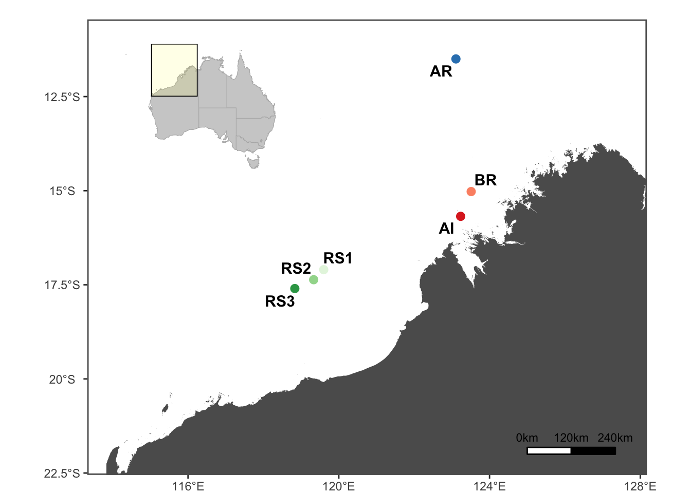

Sample information
================

### Sampling sites

Samples were collected from three locations in Kimberley region, we
labeled them inshore, north offshore, and soutch offshore as their
origin geographic habitat. Sample sizes are 30 from inshore, 20 from
north offshore, and 25 from south offshore. The exact locations are
shown in the map below.

Map showing sampling sites in Kimberley region: Sampling location in the
Kimberley region, Western Australia. N=25 at offshore south (green
dots), N=30 at inshore (red dots), and N=20 at offshore north (blue
dots).

### Sequencing and data processing

Raw data was sequenced and demultiplexed by California Institute for
Quantitative Bioscience qb3 sequencing centre. In total, we obtained
911,977Mbp sequencing data of 75 samples as fastq files. We had 25, 30,
and 20 samples sequenced from offshore south, inshore, and offshore
north, respectively. A detailed inforamtion of the raw data are in
[S-table1](https://github.com/bakeronit/acropora_digitifera_wgs/blob/master/hpc/tables/S-table1.txt).

We applied [GATK4 best
practices](https://gatk.broadinstitute.org/hc/en-us/sections/360007226651-Best-Practices-Workflows)
for germline short variant discovery workflow using a reproducible and
scalable pipeline written with
[snakemake](https://github.com/bakeronit/snakemake-gatk4-non-model).

| Sample ID     | Location       | Mapping rate (%) | Mean mapping depth (X) | Genome coverage (%) |
|:--------------|:---------------|-----------------:|-----------------------:|--------------------:|
| AI\_1\_001    | Inshore        |          97.6670 |              18.767037 |            79.90865 |
| AI\_1\_008    | Inshore        |          97.5663 |              18.005929 |            80.63667 |
| AI\_1\_021    | Inshore        |          96.8774 |              37.408790 |            81.76728 |
| AI\_1\_022    | Inshore        |          97.1598 |              46.137165 |            82.77188 |
| AI\_1\_023    | Inshore        |          96.9446 |              19.128358 |            80.04476 |
| AI\_1\_025    | Inshore        |          95.2865 |              15.668055 |            79.01263 |
| AI\_2\_036    | Inshore        |          97.1875 |              21.288786 |            80.74803 |
| AI\_2\_041    | Inshore        |          97.3920 |              20.741440 |            78.88700 |
| AI\_2\_043    | Inshore        |          97.3700 |              24.126531 |            80.15771 |
| AI\_2\_136    | Inshore        |          97.2602 |              18.113422 |            78.66080 |
| AI\_2\_151    | Inshore        |          97.2920 |              23.868113 |            80.06716 |
| AI\_3\_047    | Inshore        |          97.1889 |              22.945807 |            80.73957 |
| AI\_3\_060    | Inshore        |          97.2106 |              27.933526 |            81.02576 |
| AI\_3\_063    | Inshore        |          96.9327 |              30.816544 |            81.58648 |
| AI\_3\_071    | Inshore        |          96.5805 |              18.063423 |            80.21551 |
| AR\_125\_374  | North Offshore |          96.2671 |              19.114326 |            80.62103 |
| AR\_125\_377  | North Offshore |          96.0844 |              18.483311 |            79.62480 |
| AR\_125\_385  | North Offshore |          96.5558 |              15.236707 |            80.06581 |
| AR\_125\_388  | North Offshore |          95.6461 |              25.334181 |            80.79124 |
| AR\_125\_392  | North Offshore |          96.7675 |              18.255773 |            80.25345 |
| AR\_128\_316  | North Offshore |          97.2345 |              10.609246 |            77.99757 |
| AR\_128\_318  | North Offshore |          97.4510 |              17.165764 |            81.12785 |
| AR\_128\_326  | North Offshore |          97.0968 |              18.338210 |            80.68386 |
| AR\_128\_328  | North Offshore |          97.0342 |              14.094782 |            78.77346 |
| AR\_128\_336  | North Offshore |          97.5705 |              18.149650 |            80.61123 |
| AR\_132\_154  | North Offshore |          97.7245 |              18.603950 |            80.81611 |
| AR\_132\_162  | North Offshore |          96.7145 |              17.248979 |            80.72761 |
| AR\_132\_170  | North Offshore |          96.2782 |              17.384088 |            80.98140 |
| AR\_132\_173  | North Offshore |          94.5964 |              16.708212 |            79.97423 |
| AR\_132\_178  | North Offshore |          97.2215 |              17.912628 |            79.69592 |
| AR\_133\_341  | North Offshore |          97.4625 |              19.138851 |            80.30004 |
| AR\_133\_343  | North Offshore |          96.7202 |              18.103890 |            79.68526 |
| AR\_133\_346  | North Offshore |          97.1972 |              17.834644 |            80.60629 |
| AR\_133\_354  | North Offshore |          94.5335 |              10.808067 |            77.72408 |
| AR\_133\_357  | North Offshore |          96.6271 |              19.709395 |            80.96677 |
| BR\_4\_077    | Inshore        |          96.5332 |              12.637533 |            78.84721 |
| BR\_4\_078    | Inshore        |          96.8139 |              14.837530 |            79.06365 |
| BR\_4\_081    | Inshore        |          97.0307 |              14.944312 |            78.88322 |
| BR\_4\_082    | Inshore        |          96.3477 |              16.997906 |            79.23306 |
| BR\_4\_087    | Inshore        |          96.5735 |              19.245551 |            79.53166 |
| BR\_4\_088    | Inshore        |          96.4051 |              11.264454 |            77.78714 |
| BR\_4\_091    | Inshore        |          96.0758 |              50.772276 |            82.47860 |
| BR\_4\_100    | Inshore        |          96.6591 |              16.847131 |            78.93905 |
| BR\_5\_112    | Inshore        |          95.7586 |              21.113459 |            79.59467 |
| BR\_5\_114    | Inshore        |          96.3534 |              31.152646 |            81.46212 |
| BR\_5\_121    | Inshore        |          97.8185 |              15.956472 |            79.47596 |
| BR\_5\_123    | Inshore        |          96.0590 |              15.107586 |            78.30701 |
| BR\_5\_124    | Inshore        |          96.9857 |              14.422176 |            78.33935 |
| BR\_5\_129    | Inshore        |          97.0632 |              15.844296 |            78.37352 |
| BR\_5\_133    | Inshore        |          96.6321 |              29.721228 |            81.54055 |
| RS1\_2\_417   | South Offshore |          97.6006 |              18.011018 |            80.39919 |
| RS1\_2\_422   | South Offshore |          94.5774 |              10.702747 |            77.46733 |
| RS1\_M11\_820 | South Offshore |          95.8864 |              17.723679 |            79.39771 |
| RS1\_M11\_840 | South Offshore |          97.8422 |              10.271225 |            77.54022 |
| RS1\_M12\_808 | South Offshore |          97.3633 |              17.885207 |            79.35851 |
| RS1\_M12\_817 | South Offshore |          97.6437 |              15.657466 |            78.60756 |
| RS1\_S\_314   | South Offshore |          95.5671 |              20.778862 |            80.47854 |
| RS1\_S\_321   | South Offshore |          97.5365 |              14.537167 |            78.73255 |
| RS2\_2\_256   | South Offshore |          97.6359 |              17.009786 |            79.97507 |
| RS2\_C11\_769 | South Offshore |          97.4031 |              19.080128 |            80.95296 |
| RS2\_C11\_784 | South Offshore |          97.5892 |              34.729218 |            81.95152 |
| RS2\_C13\_704 | South Offshore |          94.6454 |              18.113346 |            80.08855 |
| RS2\_C13\_706 | South Offshore |          97.5623 |              28.235592 |            81.32329 |
| RS2\_C13\_721 | South Offshore |          97.5496 |              30.457152 |            81.38908 |
| RS2\_C20\_283 | South Offshore |          97.6171 |              13.909271 |            77.71487 |
| RS2\_S\_734   | South Offshore |          97.0893 |              20.068060 |            79.84422 |
| RS2\_S\_737   | South Offshore |          96.7284 |              18.134850 |            80.26239 |
| RS3\_1\_184   | South Offshore |          97.1275 |              17.435551 |            80.32015 |
| RS3\_1\_185   | South Offshore |          97.2257 |              15.329198 |            79.54294 |
| RS3\_1\_191   | South Offshore |          97.6529 |              18.938273 |            79.88599 |
| RS3\_1\_207   | South Offshore |          96.4095 |              18.944451 |            80.55368 |
| RS3\_S\_215   | South Offshore |          96.9705 |              15.813856 |            79.36472 |
| RS3\_S\_232   | South Offshore |          95.7579 |              17.828818 |            80.11380 |
| RS3\_S\_246   | South Offshore |          92.4953 |              14.257731 |            78.43161 |
| RS3\_S\_250   | South Offshore |          96.9054 |               8.038645 |            75.33880 |

Summary of mapping results
