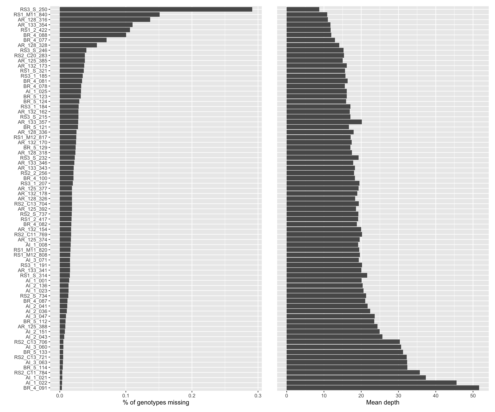
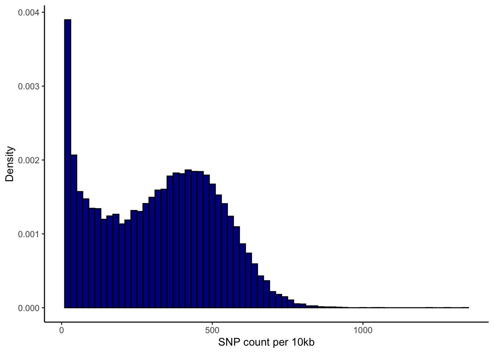

Variant calling and quality control
================

According to GATK4 best practices, `HaplotypeCaller` was used to call
SNPs and indels for every sample. Then `genomicsDBImport` and
`GenotypeGVCFs`were used to do joint-calling for all samples of every
scaffold. We excluded InDels in final callset.

### General filtering

Next, we applied serveral filtering steps:

1.Remove sites located within 5bp of any InDels.

``` bash
bcftools filter -g 5 --threads 20 -O z -o Adigi.indel5bp.vcf.gz Adigi.gatk_raw.vcf.gz
```

**SNPs left: 33,617,435**

2.A generic hard filtering recommended by
[gatk](https://gatk.broadinstitute.org/hc/en-us/articles/360035890471-Hard-filtering-germline-short-variants)
(`QD<10, QUAL<30, SOR>3, FS>60, MQ<40, MQRankSUM<-12.5, ReadPosRankSum<-8`).
In addition, only biallelic SNPs were included from here.

**SNPs left: 20,040,500**

3.Sites located in simple repeat regions identified by
`mdust v2006.10.17` were removed.

``` bash
mdust reference.fa -c |cut -f1,3,4 > genome.mdust.bed

vcftools --gzvcf Adigi.indel5bp_snp_hardfilter_passed_biallelic.vcf.gz \
  --exclude-bed genome.mdust.bed \
  --recode --recode-INFO-all --stdout | \
  bgzip > Adigi.indel5bp_snp_hardfilter_passed_biallelic_mdust.vcf.gz
```

**SNPs left: 19,981,271**

4.Check for the presence of clones, siblings, or other close familial
relationship among the sequenced individuals based on pairwise kinship
coefficient estimated by vcftools `--relatedness2` (Manichaikul et
al.,)\[<https://academic.oup.com/bioinformatics/article/26/22/2867/228512>\].

``` bash
vcftools --gzvcf Adigi.indel5bp_snp_hardfilter_passed_biallelic_mdust.vcf.gz --relatedness2 --out indel5bp_snp_hardfilter_passed_biallelic_mdust
```

There was no sample been removed because of familial relationships.
(First-degree relatives are \~0.25, and 2nd-degree \~0.125, and 3rd
degree 0.0625.)

5.We filtered call sets by site mean depth, missing genotypes, etc.
Sites with more than 10% missingness and a mean depth less than 10X or
greater than two standard deviations of the mean depth in samples.

``` bash
vcftools --gzvcf Adigi.indel5bp_snp_hardfilter_passed_biallelic_mdust.vcf.gz \
    --max-missing 0.9 --minQ 30 --min-meanDP 10 --max-meanDP 33 \
    --minDP 3 --minGQ 20 \
    --remove-filtered-geno-all \
    --recode --recode-INFO-all \
    --stdout | bgzip > Adigi.v2.DPg90gdp3gq30.vcf.gz
```

**SNPs left: 11,731,102**

1.  We remove SNPs with Inbreding Coefficient &lt; -0.05. According to
    [gatk](https://gatk.broadinstitute.org/hc/en-us/articles/360035531992-Inbreeding-Coefficient)
    `InbreedingCoeff` can be used as a proxy for poor mapping.

**SNPs left: 9,772,006**

1.  The monomorphic sites (SNPs that are non-reference in all samples)
    was removed since they contain no information in the following
    analysis, this account for 115,452 sites in the dataset.

``` bash
bcftools filter -e 'AC=0 || AC==AN' --threads 20 Adigi.v2.DPg90gdp3gq30.Fis0.05_pass.vcf.gz |bgzip > Adigi.v2.filtered.vcf.gz
```

**Eventually, we obtained 9,656,554 SNPs**

We then checked how many genotypes were missing in each sample.



**Figure:** The statistics of average coverage depth and percentage of
missing genotypes in all samples.



**Figure:** SNP distribution for all samples, the stardard normal
distribution and the real distribution are shown in the red line and
blue vertical bars, respectively.

### Note

The samples with low coverage depth contain more missing genotypes, this
makes sense because we filtered genotypes with very few reads covered.
There was no sample with very high missingness, although sample
`RS3_S_250` had almost 30% genotype missingness. We decided to keep it
in population structure analysis but to remove it from phasing
(haplotype-based) analyses.

## Prepare data for population structure analysis

We perform further filtering steps for \[population genetic analysis\].

1.To avoid potential errors from sequencing, we only included sites with
minor allele count greater than or equal to two.

2.Sites with hardy-Weinberg equilibrium p-value &lt; 1e-4.

3.To minimize the effect of SNPs in high likage disequilibrium (LD)
region, we filtered out SNPs based on pairwise LD using PLINK v1.9 with
the parameter ‘–indep-pairwise 50 10 0.1’.

## SNPs data for Sequentially Markovian Coalescent (SMC) analyses

We only used variations from scaffolds with a length greater than the
N50 in \[demography analyses\], moreover, phased data in MSMC analysis.
Specifically, we used:

-   three individuals from each location in **PSMC analysis**.
-   eight haplotypes from each reef in **MSMC**.
-   All samples (unphased) from each location in **SMC++**.
