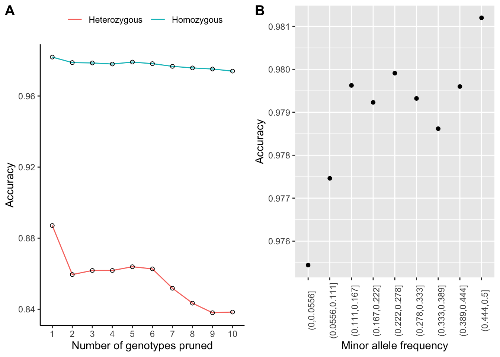

Resolving haplotypes
================

We used SHAPEIT2 to phase SNPs across the genome. Firstly, we removed
one sample with more than 20% missing genotypes, leaving 74 samples.
Next, an input file was prepared for each scaffold with three columns
including sample id, the path to bamfile for this sample, and scaffold
id. `extractPIRs` was then used to extract phase informative reads from
BAM files.

``` bash
extractPIRs --bam ${scaffold}.bamlist \
      --vcf ${scaffold}.vcf.gz \
      --out ${scaffold}.PIRsList \
      --base-quality 20 \
      --read-quality 20
```

The read aware model `assemble` was then used to phase the genotype data

``` bash
shapeit -assemble \
  --input-vcf  ${scaffold}.vcf.gz \
  --input-pir  ${scaffold}.PIRsList \
  -O ${scaffold}
  --force
  --thread 2

shapeit -convert \
  --input-haps ${scaffold} \
  --output-vcf ${scaffold}_phased.vcf
```

Eventually, vcf files of all scaffolds were concatenated together.

``` bash
bcftools concat -Oz -o Adigi.v2.indv74_phased.vcf.gz $(ls *_phased.vcf)
```

We obtained **7,747,949** phased SNP sites in 74 samples.

### Imputation check

To get an idea of the performance of the imputation step, we did a
“masked analysis” with the fully genotyped dataset. We used the script
[prune_vcf.py](scripts/prune_vcf.py) to prune genotypes randomly at
sites with high quality non-imputed genotype calls and do phasing again.
After phasing, we compared the imputed genotypes and real genotypes then
computed the accuracy using the script
[compare_vcf.py](scripts/compare_vcf.py).



**Figure 1:** Summary of imputation accuracy based on concordance of
imputed and original values for high quality genotypes. (A) Shows the
relationship between imputation accuracy and missingness (number of
pruned genotypes) for homozygous and heterozygous calls. (B) Shows the
relationship between overall accuracy and minor allele frequency.
