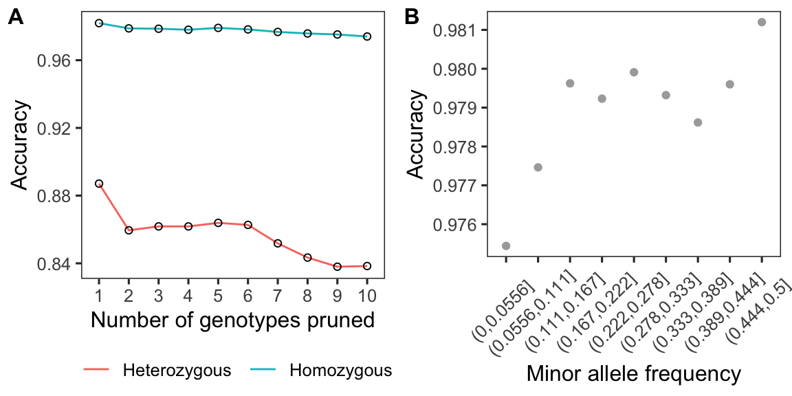

Resolving haplotypes
================

We used SHAPEIT2 to do phasing for SNPs across the genome. Firstly, we
removed samples with more than 20% missing in genotypes. So we left 74
samples. Next, a bam file contains three columns including sample id,
the path to bamfile for this sample, and scaffold id was created for
each scaffold. `extractPIRs` was then used to extract phase informative
reads from BAM files.

``` bash
extractPIRs --bam ${scaffold}.bamlist \
      --vcf ${scaffold}.vcf.gz \
      --out ${scaffold}.PIRsList \
      --base-quality 20 \
      --read-quality 20
```

Read aware model `assemble` was used to phase the genotype data

``` bash
shapeit -assemble \
  --input-vcf  ${scaffold}.vcf.gz \
  --input-pir  ${scaffold}.PIRsList \
  -O ${scaffold}
  --force
  --thread 2

shapeit -convert \
  --input-haps ${scaffold} \
  --output-vcf ${scaffold}_phased.vcf
```

Eventually, vcf files of all scaffolds were concatenated together.

``` bash
bcftools concat -Oz -o Adigi.v2.indv74_phased.vcf.gz $(ls *_phased.vcf)
```

We obtained **7,747,949** phased SNP sites in 74 samples.

### Imputation check

To get an idea of the performance of the imputation step, we did a
“masked analysis” with fully genotyped dataset.We used script
[prune\_vcf.py](scripts/prune_vcf.py) to prune genotypes randomly and do
phasing again. After phasing, we compared the imputed genotypes and real
genotypes then computed the accuracy using script
[compare\_vcf.py](scripts/compare_vcf.py).



**Figure:** The imputation accuary at homo/heterozygous sites


**Figure:** The imputation accuary summarised by MAF.
