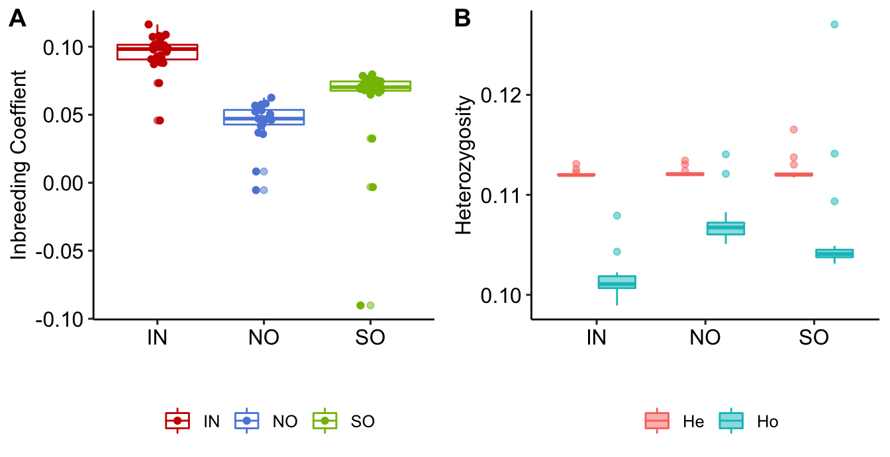
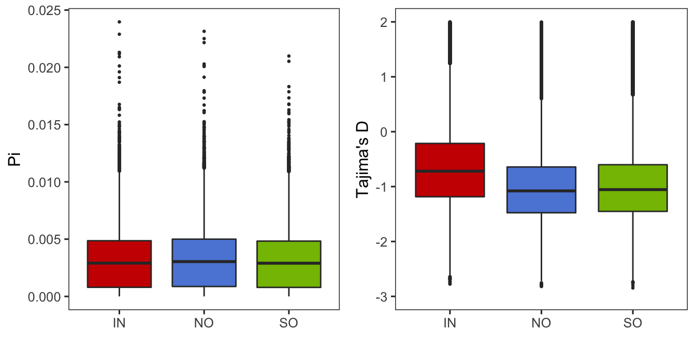
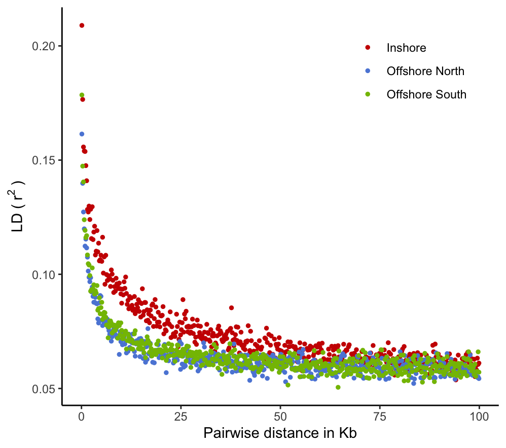

Population genetic statistics
================

### Observed and expected heterozygosity

We used plink2 to calculate heterozygosity per sample using the command;

``` bash
plink2 --vcf Adigi.v2.filtered.vcf.gz --allow-extra-chr --het
```

As part of this calculation PLINK provides the observed and expected
heterozygosity (Ho,He) as well as the inbreeding coefficient F which is
calculated as




**Figure 1:** Summary of heterozygosity and inbreeding coefficients in
each of the populations. Note that the Inbreeding coefficient (A)
captures deviations from expectation (ie between He and Ho) (B).

### Pairwise Fst values

Genome-wide pairwise Fst values were calculated between inshore,
offshore north, and offshore south using vcftools. Here we calculated in
a per SNP manner and get the average value and standard deviation of
each pair.

``` bash
vcftools --gzvcf Adigi.v2.filtered.vcf.gz \
--weir-fst-pop {pop1} \
--weir-fst-pop {pop2} \
--out {pop1}_{pop2}_per_snp_fst
```

The pairwide average Fst values among three *A.digitifera*.

|                    | Sample size | Inshore  | North Offshore | South Offshore |
|--------------------|:-----------:|:--------:|:--------------:|:--------------:|
| **Inshore**        |     29      |    \-    |    0.055933    |    0.058331    |
| **North Offshore** |     20      | 0.022377 |       \-       |    0.035717    |
| **South Offshore** |     25      | 0.023734 |    0.006928    |       \-       |

**\*Note:** Mean Fst values are presented in the bottom left and
standard deviations are shown in the top right of the matrix.

### Nucleotide diversity and Tajima’s D in sliding windows

Next, we computed some standard population genomic statistics in sliding
windows (10kb window with 2k sliding window). For the Fst calculation,
only bi-allelic variant sites are needed, whereas for nucleotide
diversity (pi) and Tajima’s D, the monomorphic sites are also used. To
get a good estimate of missing genotyped sites in each window, we used
`bedtools` to extract sites with called genotypes.

**Calculate the number of effective sites in each window**

``` bash
#1. create genome bed file
bioawk -c fastx '{print $name"\t1\t"length($seq)}' \
 reference.fa > reference.bed
 
#2 create windows of 10k size
bedtools makewindows -b reference.bed -w 9999 -s 2000 > windows_10k.bed

#3. calculate the percentage of missing sites in every window
bedtools  genomecov -ibam {sample}.bam -d | \
 awk '{if($3<3)print$0}' | \
 awk '{print $1"\t"$2"\t"$2}' |\
 bedtools merge |\
 bedtools intersect -a windows_10k.bed -b - -wao | \
 cut -f1,2,3,7 |\
 awk '{sum[$1"\t"$2"\t"$3]+=$4}END{for(i in sum)print i"\t"sum[i]/10000}' |\
 sort -k1,1 -k2,2n -k3,3n > {pop}.windows.missing.txt
```

**Nucleotide diversity
**

vcftools was then used to calculate the nucleotide diversity in each
population. Next, windows containing greater than 30% uncalled sites
were discarded.

``` bash
vcftools --gzvcf Adigi.v2.filtered.vcf.gz --keep {pop} \
 --window-pi 10000 --window-pi-step 2000 --out {pop}
 
awk '{if ($4<0.3) print $0}' {pop}.windows.missing.txt |\
 cut -f1,2,3 | grep -Fwf - {pop}.windowed.pi > {pop}.filtered_windowed.pi
```

**Tajima’s D**

Similarly, we used `vk tajima` in
[VCF-kit](https://vcf-kit.readthedocs.io/en/latest/) to calculate the
genome-wide Tajima’s D.

``` bash
bcftools view -S {pop} Adigi.v2.filtered.vcf.gz |\
 vk tajima 10000 2000 - |\
 sed '1d' |\
 awk '{print $1"\t"$2+1"\t"$3"\t"$6}' > {pop}_1based.td
 
awk '{if($4<0.3)print $0}' {pop}.window.missing.txt |\
cut -f1,2,3 |\
grep -Fwf - {pop}_1based.td > {pop}.filtered_windowed.td
```



**Figure: 2** The left boxplot shows the values of

and the right plot displays the Tajima’s D values in three populations.

### Linkage disequilibrium decay distribution

We used plink to calculated the
 of every pairs
of SNPs in inshore, offshore north, offshore south. Because of unequal
sample sizes in three populations, we randomly sample down to 20
individuals in inshore and offshore south.

``` bash
shuf -n 20 {pop}.txt |awk '{print $0"\t"$0}' > {pop}_subset.txt

plink --vcf Adigi.v2.filtered.vcf.gz \
  --allow-no-sex --allow-extra-chr --double-id \
  --ld-window 999999 --ld-window-kb 100 --ld-window-r2 0 \
  --out {pop} --thin 0.01 --r2 \
  --keep {pop}_subset.txt
```



**Figure: 3** The plot depicts the interval distance against the LD
 value. Red,
blue, green dots represent values calculated based on inshore, offshore
North, offshore South.

### Number of privately fixed SNPs

Here our objective was to count SNPs with a very high allele frequency
(fixed or nearly fixed) in one population, but absent in both other
populations. For this we first used PLINK to create separate allele
frequency summaries for each population as follows;

``` bash
plink2 --vcf Adigi.v2.filtered.vcf.gz --allow-extra-chr --freq 'cols=chrom,pos,ref,alt,altfreq'  --pheno populations.txt --loop-cats 'site' 
```

where the file `populations.txt` has a format like;

``` bash
#IID  site
AI_1_001_S102_L004 IN
AI_1_008_merged IN
AI_1_021_S97_L004 IN
```

This generates an `afreq` file for each population with the allele
frequencies at each SNP. We used `paste` to combine these three files
and then an awk script [priv.awk](data/hpc/private_alleles/priv.awk).

``` bash
paste plink2.IN.afreq plink2.NO.afreq plink2.SO.afreq | awk '{print $1,$2,$4,$5,$6,$12,$18}' | awk -v mv=1.0 -f priv.awk > 1.0.priv
paste plink2.IN.afreq plink2.NO.afreq plink2.SO.afreq | awk '{print $1,$2,$4,$5,$6,$12,$18}' | awk -v mv=0.9 -f priv.awk > 0.9.priv
```

Note that the awk script accepts an argument `mv` that determines the
threshold allele frequency for “fixation”. The script always requires
that the allele be absent (freq=0) in the other populations.

When the threshold is set at complete fixation just a single SNP is
identified at `BLFC01000154.1 282919` which is fixed in Inshore and
absent elsewhere. This SNP is surrounded by other SNPs with very high
(but not quite fixed) frequencies and is located within a gene
`adig_s0150.g24` that has a blast hit to Peroxidasin and is on one of
our identified putative selective sweeps. See
[17.dating\_the\_selection](17.dating_the_selection.md) for the
estimated age of this sweep.

If the threshold is set lower to 0.9 far more SNPs (95) are identified
but all are in the inshore population and all are concentrated in just
four loci. Two of these fall within putative sweeps and two fall just
outside them within 50kb. A full list of these loci is available as the
file [0.9.priv](data/hpc/private_alleles/0.9.priv)

### Number of unique SNPs in populations

We counted the number of SNPs specific to each population. These are
variants that only exist in one population and are homozygous in other
samples.

``` bash
bcftools view -S ^{pop}.txt Adigi.v2.filtered.vcf.gz | bcftools filter -i 'AC=0 || AC=AN'
```

| Population     | Sample size | SNP count |
|----------------|-------------|-----------|
| Inshore        | 29          | 1,235,530 |
| Offshore North | 20          | 1,425,395 |
| Offshore South | 25          | 1,511,531 |
| Total          | 74          | 9,656,554 |
