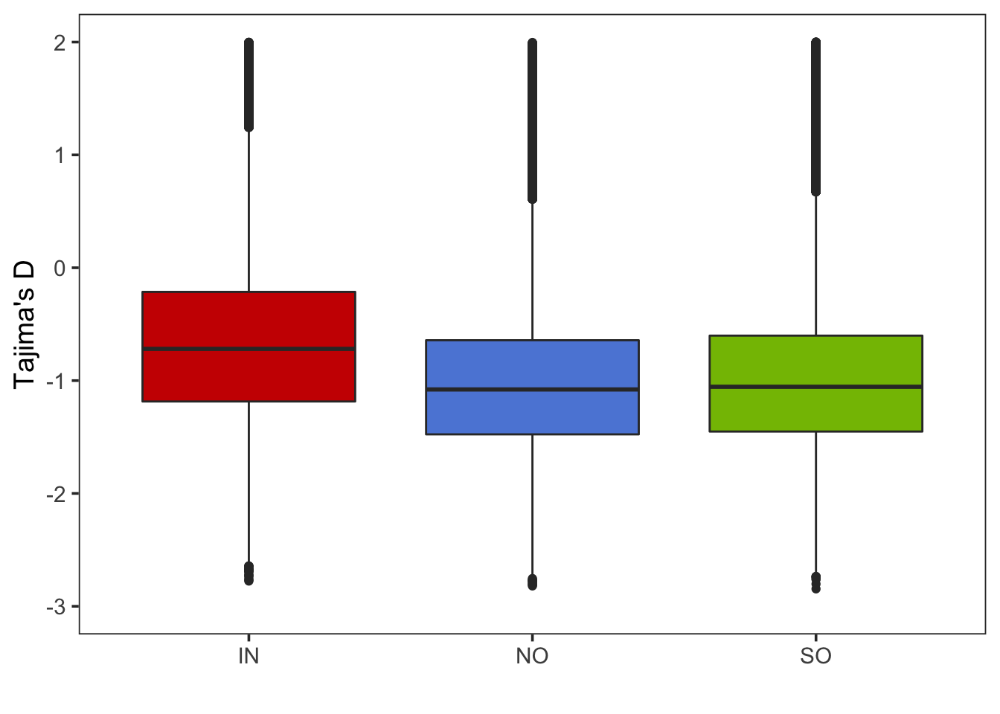

Population genetic statistics
================

### Number of unique SNPs in populations

We counted the number of SNPs specific to each population. These are
variants that are only exist in one population and are homozygous in
other samples.

``` bash
bcftools view -S ^{pop}.txt Adigi.v2.filtered.vcf.gz | bcftools filter -i 'AC=0 || AC=AN'
```

| Population     | Sample size | SNP count |
|----------------|-------------|-----------|
| Inshore        | 30          | 1,289,789 |
| Offshore North | 20          | 1,424,388 |
| Offshore South | 25          | 1,510,524 |
| Total          | 75          | 9,656,554 |

### Pairwise Fst values

Genome-wide pairwise Fst values were calculated between inshore,
offshore north, and offshore south using vcftools. Here we calculated in
a per SNP manner and get the average value and standard deviation of
each pair.

``` bash
vcftools --gzvcf Adigi.v2.filtered.vcf.gz \
--weir-fst-pop {pop1} \
--weir-fst-pop {pop2} \
--out {pop1}_{pop2}_per_snp_fst
```

The pairwide average Fst values among three *A.digitifera*.

|                    | Sample size | Inshore | Offshore North | Offshore South |
|--------------------|:-----------:|:-------:|:--------------:|:--------------:|
| **Inshore**        |     30      |   \-    |     0.054      |     0.056      |
| **Offshore North** |     20      |  0.211  |       \-       |     0.036      |
| **Offshore South** |     25      |  0.222  |     0.007      |       \-       |

**\*Note:** Mean Fst values are presented in the bottom left and
standard deviations are shown in the top right of the matrix.

### Nucleotide diversity and Tajima’s D in sliding windows

Next, we computed some standard population genomic statistics in sliding
windows (10kb window with 2k sliding window). For the Fst calculation,
only bi-allelic variant sites are needed, whereas for nucleotide
diversity (pi) and Tajima’s D, the monomorphic sites are also used. To
get a good estimate of missing genotyped sites in each window, we used
`bedtools` to extract sites with called genotypes.

**Calculate the number of effective sites in each window**

``` bash
#1. create genome bed file
bioawk -c fastx '{print $name"\t1\t"length($seq)}' \
 reference.fa > reference.bed
 
#2 create windows of 10k size
bedtools makewindows -b reference.bed -w 9999 -s 2000 > windows_10k.bed

#3. calculate the percentage of missing sites in every window
bedtools  genomecov -ibam {sample}.bam -d | \
 awk '{if($3<3)print$0}' | \
 awk '{print $1"\t"$2"\t"$2}' |\
 bedtools merge |\
 bedtools intersect -a windows_10k.bed -b - -wao | \
 cut -f1,2,3,7 |\
 awk '{sum[$1"\t"$2"\t"$3]+=$4}END{for(i in sum)print i"\t"sum[i]/10000}' |\
 sort -k1,1 -k2,2n -k3,3n > {pop}.windows.missing.txt
```

**Nucleotide diversity *θ*<sub>*π*</sub>**

vcftools was then used to calculate the nucleotide diversity in each
population. Next, windows containing greater than 30% uncalled sites
were discarded.

``` bash
vcftools --gzvcf Adigi.v2.filtered.vcf.gz --keep {pop} \
 --window-pi 10000 --window-pi-step 2000 --out {pop}
 
awk '{if ($4<0.3) print $0}' {pop}.windows.missing.txt |\
 cut -f1,2,3 | grep -Fwf - {pop}.windowed.pi > {pop}.filtered_windowed.pi
```

**Tajima’s D**

Similarly, we used `vk tajima` in
[VCF-kit](https://vcf-kit.readthedocs.io/en/latest/) to calculate the
genome-wide tajima’D.

``` bash
bcftools view -S {pop} Adigi.v2.filtered.vcf.gz |\
 vk tajima 10000 2000 - |\
 sed '1d' |\
 awk '{print $1"\t"$2+1"\t"$3"\t"$6}' > {pop}_1based.td
 
awk '{if($4<0.3)print $0}' {pop}.window.missing.txt |\
cut -f1,2,3 |\
grep -Fwf - {pop}_1based.td > {pop}.filtered_windowed.td
```



**Figure:** The left boxplot shows the values of *θ*<sub>*π*</sub> and
the right plot displays the Tajima’s D values in three populations.

### Linkage disequilibrium decay distribution

We used plink to calculated the *r*<sup>2</sup> of every pairs of SNPs
in inshore, offshore north, offshore south. Because of unequal sample
sizes in three populations, we randomly sample down to 20 individuals in
inshore and offshore south.

``` bash
shuf -n 20 {pop}.txt |awk '{print $0"\t"$0}' > {pop}_subset.txt

plink --vcf Adigi.v2.filtered.vcf.gz \
  --allow-no-sex --allow-extra-chr --double-id \
  --ld-window 999999 --ld-window-kb 100 --ld-window-r2 0 \
  --out {pop} --thin 0.01 --r2 \
  --keep {pop}_subset.txt
```

**Figure:** The plot depicts the interval distance against the LD
*r*<sup>2</sup> value. Red, blue, green dots represent values calculated
based on inshore, offshore North, offshore South.
