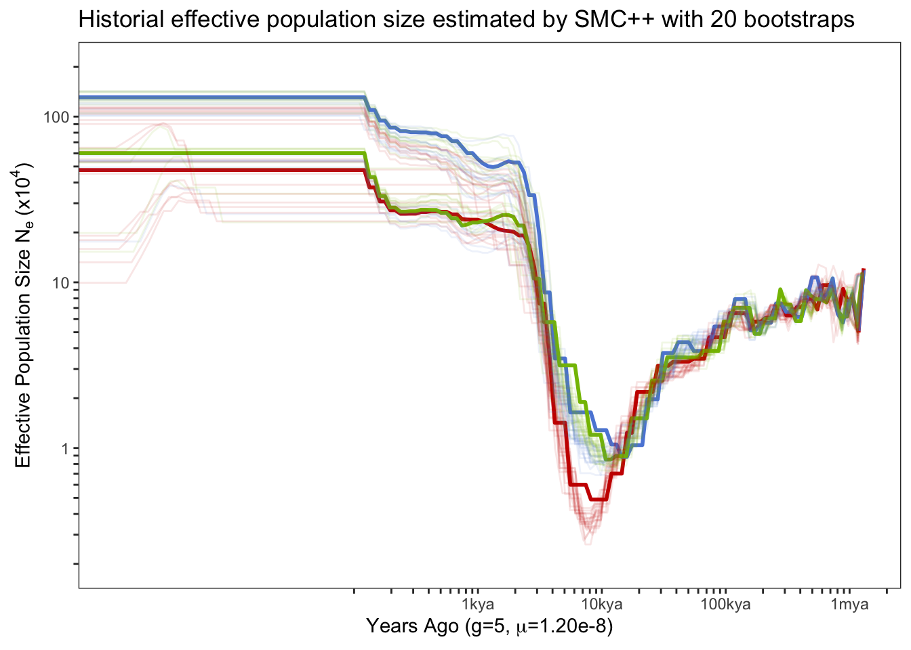

Demographic history - Sequentially Markov Cross-colalescence analysis
================

-   [Mutation rate](#mutation-rate)
-   [SMC++ analysis](#smc-analysis)
    -   [The separation time between
        populations.](#the-separation-time-between-populations)
    -   [Bootstrap results](#bootstrap-results)

For both SMC++ and MSMC, we used SNPs from scaffolds with a length
greater than 1Mbp which account for approximately 75% of genome size
(N75=983,972, first 142 scaffolds).

## Mutation rate

The per generation mutation rate of *A.digitifera* estimated based on a
divergence time of 15.5 Millions years is 2.89e-8 in (Mao, Economo, and
Satoh 2018). However, the divergence time in (Shinzato et al. 2020) is
25-50 million years which give us a much smaller per generation mutation
rate of 1.2e-8.

``` bash
#(79427941/(79427942+363368171)/(2 × 15.5)) x 5 × 10−6 = 2.89 × 10−8
#calibrate divergence time to 37.5
(79427941/(79427942+363368171)/(2 × 37.5)) x 5 × 10−6 = 1.20 x 10-8
```

## SMC++ analysis

We used all 75 samples in smc++ analysis. Firstly, a single vcf was
extracted for every scaffold and indexed.

``` bash
bcftools view -r {chr} -Oz -o {chr}.vcf.gz Adigi.v2.filtered.vcf.gz 
tabix {chr}.vcf.gz
```

To distinguish invariant positions with missing data, we mask genome
regions a) with low or super high coverage across all samples (less than
three reads covered or greater than 3000) b) We generated the genome
mask files created using Heng Li’s SNPable tools and extracted the
ambigous positions (c==“0” or c==“1”).

``` bash
samtools depth -r {chr} -aa -f bamfiles.txt | \
awk '{sum=0; for(i=3; i<=NF; i++) {sum+=$i}; print $1"\t"$2"\t"sum }' | \
awk '{if($3<3 || $3>3000) print $1"\t"$2"\t"$2}' | \
bedtools merge -i stdin | bgzip > {chr}.low_masked.bed.gz

zcat {chr}.low_masked.bed.gz Adigi_{chr}.mask.bed.gz | bedtools sort | bedtools merge |bgzip > {chr}.masked.bed.gz
```

Mask files of all scaffolds were concatenated together and we keep
blocks with a length greater than 2kb. Next, vcf files were converted
into a smc format file using `vcf2smc` in which we send a vcf file of
one scaffold and specify a list samples in the population.

``` bash
smc++ vcf2smc --mask all.masked.bed.gz {chr}.vcf.gz {pop}.{chr}.smc.gz {chr} POP:{sampleid},..
```

smc++ `estimate` mode was run to fit population size history to data for
each population.

``` bash
smc++ estimate --cores 30 -o estimate --base {pop} --spline cubic \
 --timepoints 20 200000 --em-iterations 50 --thinning 3000 --knots 10 1.2e-8 {pop}.*.smc.gz
```

<div class="figure" style="text-align: center">


<p class="caption">
The effective population size estimate using SMC++ approach. The red,
blue, and green lines represent the results of inshore, offshore north,
and offshore south respectively.
</p>

</div>

### The separation time between populations.

The smc++ can estimate joint demography and speculate the splitting time
between pair of populations. First, we create a joint frequency spectrum
for every pair of populations using `vcf2smc`.

``` bash
smc++ vcf2smc {chr}.vcf.gz {pop1}_{pop2}.smc.gz {chr} POP1:{sampleid},..  POP2:{sampleid},..
```

Next,we ran smc++ `split` with same parameters we used in `estimate`.

``` bash
smc++ split -o split --base {pop1}_{pop2} \
--timepoints 20 200000 --em-iterations 50 --thinning 3000 \
{pop1}.final.json {pop2}.final.json {pop1}_{pop2}.smc.gz
```


**Figure:** Three figures above show the joint demography between any
two population (IN: inshore, NO:northoffshore, SO:southoffshore) and the
estimated spliting time (blue vertical line).

### Bootstrap results

We perform 20 bootstrap in SMC++



<div id="refs" class="references csl-bib-body hanging-indent">

<div id="ref-Mao2018" class="csl-entry">

Mao, Yafei, Evan P Economo, and Noriyuki Satoh. 2018. “<span
class="nocase">The Roles of Introgression and Climate Change in the Rise
to Dominance of Acropora Corals</span>.” *Current Biology* 28 (21):
3373–3382.e5. <https://doi.org/10.1016/j.cub.2018.08.061>.

</div>

<div id="ref-Shinzato2020" class="csl-entry">

Shinzato, Chuya, Konstantin Khalturin, Jun Inoue, Yuna Zayasu, Miyuki
Kanda, Mayumi Kawamitsu, Yuki Yoshioka, Hiroshi Yamashita, Go Suzuki,
and Noriyuki Satoh. 2020. “<span class="nocase">Eighteen Coral Genomes
Reveal the Evolutionary Origin of Acropora Strategies to Accommodate
Environmental Changes</span>.” *Molecular Biology and Evolution* 38 (1):
16–30. <https://doi.org/10.1093/molbev/msaa216>.

</div>

</div>
