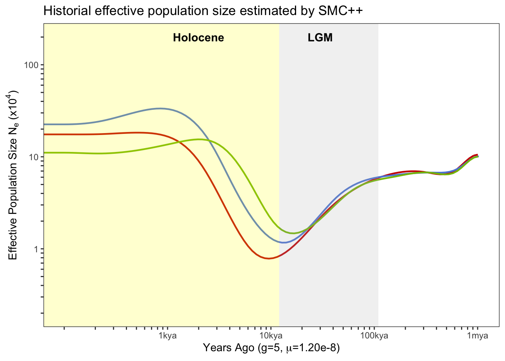

Demographic history - Sequentially Markov Cross-colalescence analysis
================

-   [Mutation rate calibration](#mutation-rate-calibration)
-   [SMC++ analysis](#smc-analysis)
    -   [The separation time between
        populations.](#the-separation-time-between-populations.)
-   [MSMC analysis](#msmc-analysis)

We used SNPs from scaffolds with a length greater than 1Mbp which
account for approximately 75% of genome size (N75=983,972, first 142
scaffolds).

## Mutation rate calibration

The mutation rate of *A.digitifera* was 2.89e-8 in Mao et al 2018 which
was estimated with a divergence time of 15.5 Million years. We
recalculated the mutation rate with the updated divergence time in
Shizato et al.,2020(25-50 million years) and the results of sequence
divergence in Mao et al (2018). This gave us a smaller estimated
mutation rate of 1.2e-8.

``` bash
# (79427941/(79427942+363368171)/(2 × 15.5)) x 5 × 10−6 = 2.89 × 10−8
# calibrate divergence time to 37.5
(79427941/(79427942+363368171)/(2 × 37.5)) x 5 × 10−6 = 1.20 x 10-8
```

## SMC++ analysis

We used all 75 samples in smc++ analysis. Firstly, a single vcf was
extracted for every scaffold and indexed.

``` bash
bcftools view -r {chr} -Oz -o {chr}.vcf.gz Adigi.v2.filtered.vcf.gz 
tabix {chr}.vcf.gz
```

Next, vcf files were converted into a smc format file using `vcf2smc` in
which we send a vcf file of one scaffold and specify a list samples in
the population.

``` bash
smc++ vcf2smc {chr}.vcf.gz {pop}.{chr}.smc.gz {chr} POP:{sampleid},..
```

smc++ `estimate` model was run to fit population size history to data
for each population.

``` bash
smc++ estimate --cores 30 -o estimate --base {pop} \
 --timepoints 200 200000 --em-iterations 50 --thinning 2000 --knots 40 1.2e-8 {pop}.*.smc.gz
```



**Figure:** The effective population size estimate using SMC++ approach.
The red, blue, and green lines represent the results of inshore,
offshore north, and offshore south respectively.

### The separation time between populations.

The smc++ can estimate joint demography and speculate the spliting time
between pair of populations. First, we create a joint frequency spectrum
for every pair of populations using `vcf2smc`.

``` bash
smc++ vcf2smc {chr}.vcf.gz {pop1}_{pop2}.smc.gz {chr} POP1:{sampleid},..  POP2:{sampleid},..
```

Next,we ran smc++ `split` with same parameters we used in `estimate`.

``` bash
smc++ split -o split --base {pop1}_{pop2} \
--timepoints 200 200000 --em-iterations 50 --thinning 2000 \
{pop1}.final.json {pop2}.final.json {pop1}_{pop2}.smc.gz
```


**Figure:** Three figures above show the joint demography between any
two population (IN: inshore, NO:northoffshore, SO:southoffshore) and the
estimated spliting time (blue vertical line).

## MSMC analysis

For MSMC analysis, we restricted this analysis to high coverage (\~20X)
samples and used the maximum number of haplotypes (eight haplotypes) per
population. To obtain more accurate phase information, all samples were
used in initial variant calling using `bcftools` and conducting read
aware phasing using `SHAPEIT2`.

``` bash
bcftools mpileup -q 30 -Q 30 -C 50 -Oz -r $scaffold -f $reference.fa $(cat bamfile.txt | tr '\n' ' ') | \
bcftools call -c -V indels | bcftools view -M 2 -Oz > all.${scaffold}.vcf.gz

extractPIRs --bam ${scaffold}.bamlist --vcf all.${scaffold}.vcf.gz \
  --out ${scaffold}.PIRsList --base-quality 20 --read-quality 20

shapeit -assemble --input-vcf all.${scaffold}.vcf.gz --input-pir ${scaffold}.PIRsList -O $scaffold

shapeit -convert --input-haps $scaffold --output-vcf ${scaffold}.phased.vcf.gz

bcftools merge --force-samples all.${scaffold}.vcf.gz ${scaffold}.phased.vcf.gz |
awk 'BEGIN {{OFS="\t"}}
        $0 ~/^##/ {{print $0}}
$0 ~/^#CHROM/ {{for(i=1;i<84;i++) printf "%s"OFS, $i; print $84}}
$0 !~/^#/ {{ for(x=10;x<=84;x++) $x=$(x+75); for(j=1;j<84;j++) printf "%s"OFS, $j; print $84 }}' | \
bcftools view -Oz > final.${scaffold}.vcf.gz
```

For every sample, bamCaller.py was used to generate VCF file and mask
file in bed format. `generate_multihetsep.py` was used to generate
multihetsep files for every scaffold using all samples. A mappability
mask file of the Acropora digitifera reference genome was generated
following Heng Li’s
[SNPable](http://lh3lh3.users.sourceforge.net/snpable.shtml).

``` bash
$mean_cov=$(samtools depth -r $scaffold ${sample}.bam|awk '{sum += $3} END {print sum/NR}')

bcftools view -s $sample final.${scaffold}.vcf.gz |\
bamCaller.py $mean_cov ${sample}_${scaffold}_mask.bed.gz |gzip -c > ${sample}_${scaffold}.vcf.gz

generate_multihetsep.py --chr $scaffold --mask ${sample}_${scaffold}_mask.bed.gz \ 
--mask mappability/Adigi_${scaffold}.mask.bed.gz ${sample}_${scaffold}.vcf.gz > multihetsep_${scaffold}.txt
```

MSMC2 was firstly run for haplotypes from each population separately and
calculate the cross-coalescence rate for each pair of two populations.To
conduct bootstrap estimation, script multihetsep\_bootstrap.py from
msmc-tools was used to generate 100 sets of fragmented and resampled
scaffolds by taking 20 random chunks per scaffold of size 500kb and
assembling them into 20 “chromosomes”. Next, we conducted 100 bootstrap
estimates for each population with 100 bootstrap data sets using the
same options as before.

``` bash
msmc2 -t 12 -s -I 0,1,2,3,4,5,6,7 -o inshore_8hap multihetsep_*.txt
msmc2 -t 12 -s -I 8,9,10,11,12,13,14,15 -o northoffshore_8hap multihetsep_*.txt
msmc2 -t 12 -s -I 16,17,18,19,20,21,22,23 -o southoffshore_8hap multihetsep_*.txt

multihetsep_bootstrap.py -n 100 -s 500000 —chunks_per_chromosome 20 \
 -nr_chromosomes 20 bootstrap *.multihetsep_*.txt

msmc2 -t 12 -s -I 0,1,2,3,4,5,6,7 -o bootstrap_results/inshore bootstrap_${n}/*.txt
msmc2 -t 12 -s -I 8,9,10,11,12,13,14,15 -o bootstrap_results/northoffshore bootstrap_${n}/*.txt
msmc2 -t 12 -s -I 16,17,18,19,20,21,22,23 -o bootstrap_results/southoffshore bootstrap_${n}/*.txt
```
