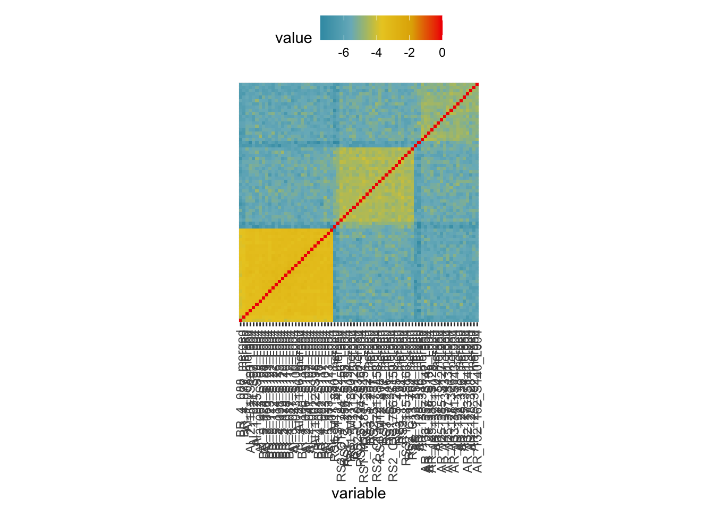

IBD segments in haplotype data
================

Any two samples in a population can be traced back to their most recent
common ancestor by sharing identity-by-descent haplotypes. Although we
don’t have a chromosome-level reference genome, the version two of
A.digitifera display significant improvement in N50 size, thus it is
worth investigating the haplotype sharing patterns in population.

### Infer identity-by-descent segemnts

We used `refined-ibd`
[v17Jan20](https://faculty.washington.edu/browning/refined-ibd.html) to
detect IBD segments in phased genotype data. The map file was generated
as in [selection analysis](06.selection_analysis.md).

``` bash
java -jar refined-ibd.17Jan20.102.jar nthreads=10 \
gt=Adigi.v2.indv74_phased.vcf.gz map=map.txt chrom={scaffold} \
length=0.15 trim=0.015 window=4 out={scaffold}
```

Next, we use `merge-ibd-segments` to remove any breaks and short gaps in
IBD segments.

``` bash
zcat {scaffold}.ibd.gz | java -jar merge-ibd-segments.17Jan20.102.jar \
{scaffold}.vcf map.txt 0.01 2 > {scaffold}.merged.ibd
```

### Calculate the relatedness

The pairwise relatedness can be calculated using a python script
[relatedness\_v1.py](http://faculty.washington.edu/sguy/ibd_relatedness.html)
in which the relatedness was calculated as the proportion of shared
haplotype length divided by the total chromosome length\*2.

``` bash
cat *.merged.ibd | python2 relatedness_v1.py map.txt 0 > Adigi_ind74.ibd_relatedness.txt
```



**Figure:** A heatmap shows the pairwise relatedness based on shared
haplotypes. A darker color means a higher relatedness.
