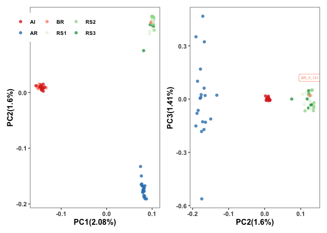
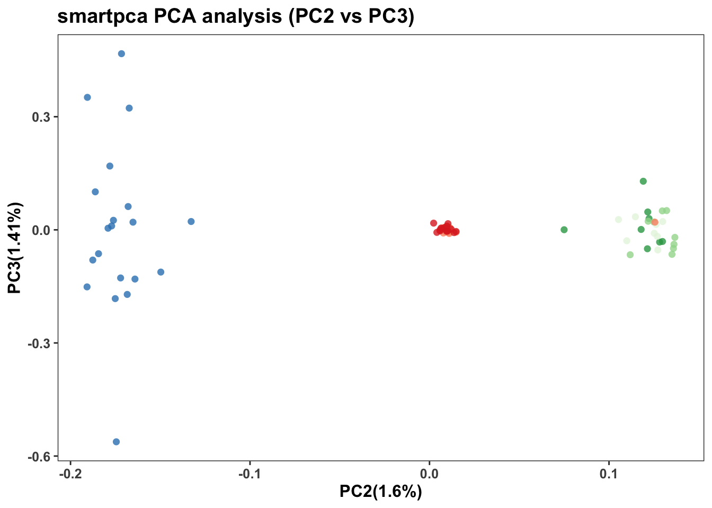
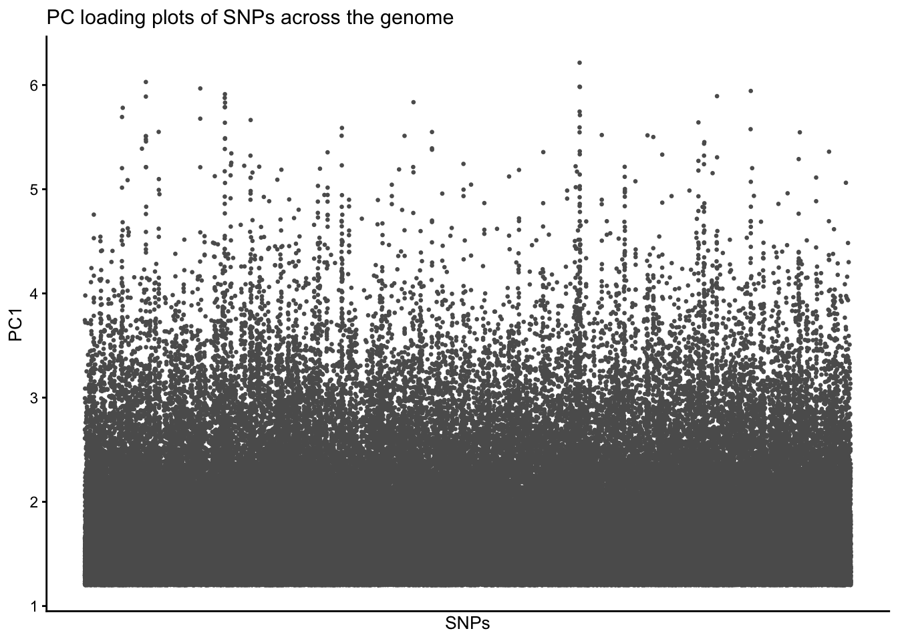
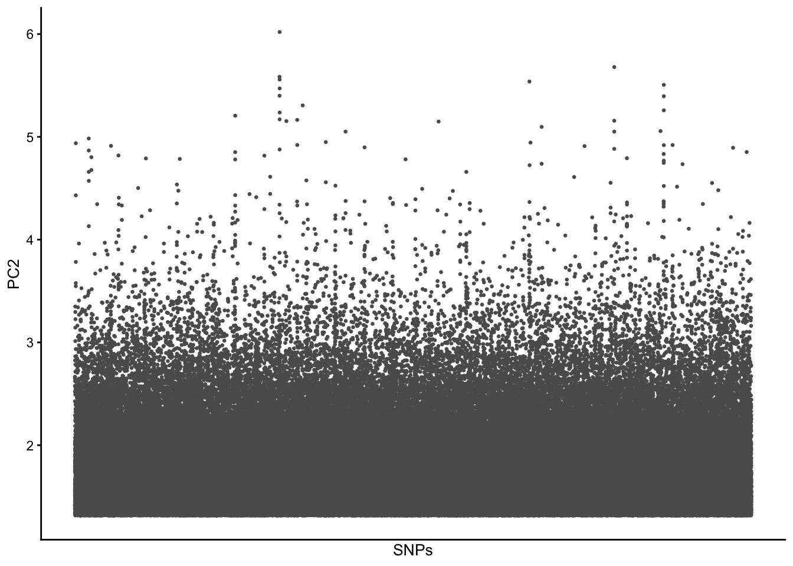
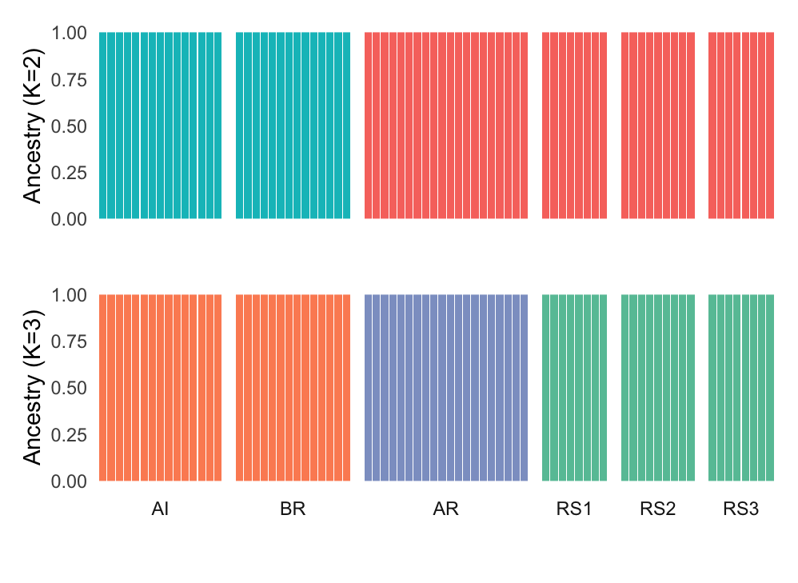
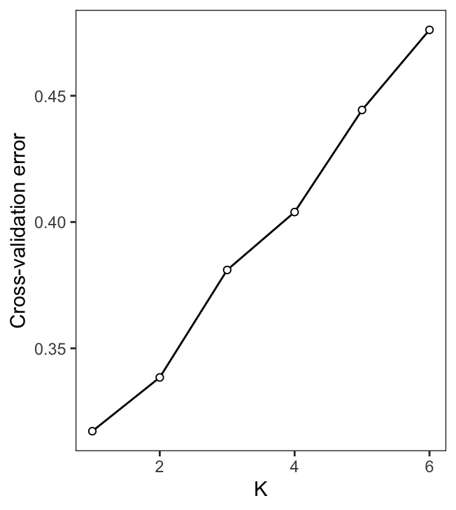

Population Structure analyses
================

Starting with a fully filtered VCF, we then preformed linkage pruning
and prepare data for PCA, ADMIXTURE analysis.

### LD pruning

Because plink will only take common chromosome id like in human, we
first created a map file for *Acropora digitifera*.

``` bash
bcftools view -H Adigi.DPg90gdp3gq30.vcf.gz | \
  cut -f 1| uniq | \
  awk '{print $0"\t"$0 }' > Adigi.DPg90gdp3gq30.chrom-map.txt
```

Next, we coverted our vcf file to plink format which included sites with
a minor allele count greater than or equal to two and excluded sites
with a p-value for exact test for Hardy-Weinberg Equilibrium below 1e-4.
Eventually, we prune SNPs in highly LD regions.

``` bash
plink --vcf Adigi.v2.filtered.vcf.gz --out Adigitifera \
  --allow-extra-chr --make-bed --set-missing-var-ids @:# \
  --double-id --geno 0.1 --mac 2 --hwe 0.0001

plink --bfile Adigitifera --indep-pairwise 50 10 0.1 --out Adigitifera \
    --allow-extra-chr --set-missing-var-ids @:#
    
plink --bfile Adigitifera --extract Adigitifera.prune.in \
    --recode12 --allow-extra-chr --out Adigitifera_ldpruned
```

We then start with our PCA analysis and Admixture analysis with
**919,129** SNPs.

### Principal Component Analysis

**Is there genetic structure in Kimberley corals?**

`smartpca` has a design flaw that it won’t work with chromosome id other
than small numbers (1-22,X,Y). So we used an [in-house
script](scripts/fix_mapfile_for_smartpca.py) to fix the map file and run
smartpca with default parameters.

<div class="figure">


<p class="caption">
Two plots depict the first vs second principal components (PC1 vs PC2)
and PC2 vs PC3, which stratified by sample site location (red-like dots:
Inshore, green-like dots from south offshore, blue dots: north
offshore).
</p>

</div>

Corals from different regions were well separated as inshore, offshore
north, and offshore south, expect on sample from Beagle reef was
clustered with offshore south. In the right plot, inshore samples were
tightly congregated compared to two offshore groups. Therefore, our
samples from six locations form three clusters which corresponding to
three geographic regions we called inshore, offshore north, and offshore
south.

### PC loadings

To make sure this PCA clustering was represented by the SNPs across the
genome instead of regional variation, we inspect the PC laoding for the
first two principle components.


The SNPs the high PC loading seems to be spreading the genome, thus our
data reveals a genomic population structure instead of a local
population structure.

### Admixture analysis

**Is there any mixture in samples?**

Using the unlinked SNPs in plink format we created before, we run
`ADMIXTURE` with default parameters and 10-fold cross-validation. The
postulated number of ancestral population K was set from 1 to 6 and get
results on cross-validation error across values of K.

> `ADMIXTURE` will need genotypes coded as 0,1,2 (instead of A,T,G,C).

``` bash
for K in {1..6}
do
  admixture --cv=10 Adigitifera_ldpruned.ped $K | tee log.${K}.out
  awk -v K=$K '$1=="CV"{print K, $4}' log.${K}.out >> CV.txt
done
```

The cross-validation error suggests the lowest cross-validation error is
with K=1 which is a common situation when population differentiation is
subtle. We then check results for K=2,3.




