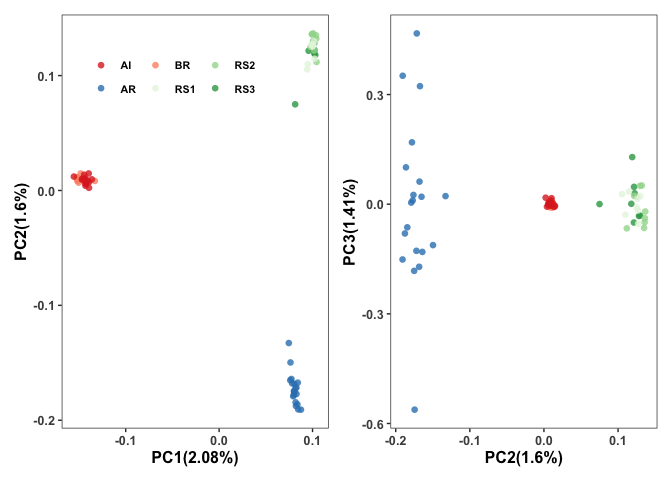
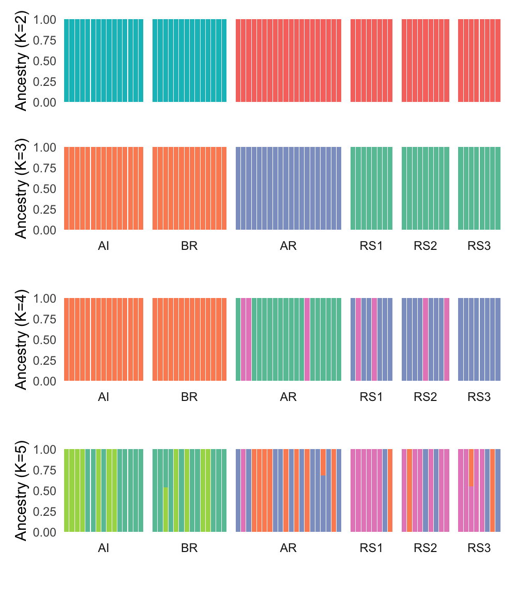

Population Structure
================

## Data preparation for population structure analysis

In addition to filters already outlined in
[02.quality\_control](02.quality_control.md), we performed further
filtering steps for population structure analysis (PCA, ADMIXTURE) as
follows;

1.To avoid potential errors from sequencing, we only included sites with
minor allele count greater than or equal to two.

2.Sites in violation of Hardy-Weinberg equilibrium were removed at
p-value &lt; 1e-4.

3.To minimize the effect of SNPs in high likage disequilibrium (LD)
region, we filtered out SNPs based on pairwise LD using PLINK v1.9 with
the parameter ‘–indep-pairwise 50 10 0.1’.

### LD pruning

Because plink will only take common chromosome ids like in human, we
first created a map file for *Acropora digitifera*. Note that the common
workaround of using the flag `--allow-extra-chr` does not work in this
instance because downstream analyses (ADMIXTURE) require numeric
scaffold ids.

``` bash
bcftools view -H Adigi.DPg90gdp3gq30.vcf.gz | \
  cut -f 1| uniq | \
  awk '{print $0"\t"$0 }' > Adigi.DPg90gdp3gq30.chrom-map.txt
```

Next, we converted our vcf file to plink format which included sites
with a minor allele count greater than or equal to two and excluded
sites with a p-value for exact test for Hardy-Weinberg Equilibrium below
1e-4. Additionally, we pruned SNPs in highly linked regions.

``` bash
plink --vcf Adigi.v2.filtered.vcf.gz --out Adigitifera \
  --allow-extra-chr --make-bed --set-missing-var-ids @:# \
  --double-id --geno 0.1 --mac 2 --hwe 0.0001

plink --bfile Adigitifera --indep-pairwise 50 10 0.1 --out Adigitifera \
    --allow-extra-chr --set-missing-var-ids @:#
    
plink --bfile Adigitifera --extract Adigitifera.prune.in \
    --recode12 --allow-extra-chr --out Adigitifera_ldpruned
```

This left a total of **919,129** SNPs for PCA and Admixture analysis

### Principal Component Analysis

We used `smartpca` from the Eigensoft suite for this task.

`smartpca` has a design flaw that it won’t work with chromosome ids
other than small numbers (1-22,X,Y). So we used an [in-house
script](scripts/fix_mapfile_for_smartpca.py) to fix the map file and run
smartpca with default parameters.

<!-- -->

**Figure 1:** Plots depict the first vs second principal components (PC1
vs PC2) and PC2 vs PC3, stratified by sample site location (red-like
dots: Inshore, green-like dots from south offshore, blue dots: north
offshore).

Corals from different regions were well separated as inshore, north
offshore, and south offshore, except one sample from Beagle reef was
clustered with south offshore. In the right plot, inshore samples were
tightly congregated compared to two offshore groups. Therefore, our
samples from six locations form three clusters which correspond to three
geographic regions we called inshore,north offshore, and south offshore.

This analysis revealed that one sample from Beagle Reef (inshore),
`BR_5_121` had offshore ancestry despite being collected from inshore.
This sample is the sample that we later identified as being mislabelled
(see [here](18.radseq_check.md)). We excluded this sample from
subsequent analyses of demography and selection.

### PC loadings

To check whether population structure evident in the PCA was driven by a
small number of genomic regions (eg such as inversions) we inspected the
PC loading for the first two principle components.


At a high level this seems to suggest that population structure reflects
variation across the entire genome rather and is not dominated by a
small number of strongly differentiated regions.

### Admixture analysis

Using the unlinked SNPs in plink format, we ran `ADMIXTURE` with default
parameters and 10-fold cross-validation. The postulated number of
ancestral population K was set from 1 to 6 and results of the
cross-validation error were inspected across this range of values of K.

> `ADMIXTURE` will need genotypes coded as 0,1,2 (instead of A,T,G,C).

``` bash
for K in {1..6}
do
  admixture --cv=10 Adigitifera_ldpruned.ped $K | tee log.${K}.out
  awk -v K=$K '$1=="CV"{print K, $4}' log.${K}.out >> CV.txt
done
```

The cross-validation error suggests the lowest cross-validation error is
with K=1 which is a common situation when population differentiation is
subtle. Since our PCA results clearly pointed toward at least K=3 we
then checked admixture proportions for K=2 and 3.




