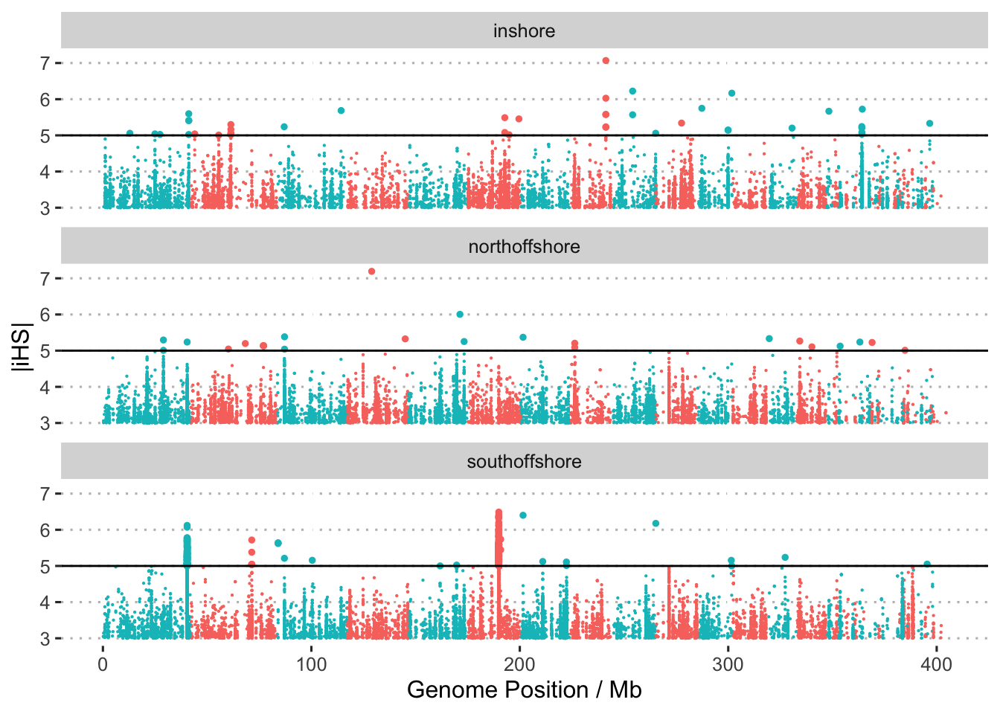
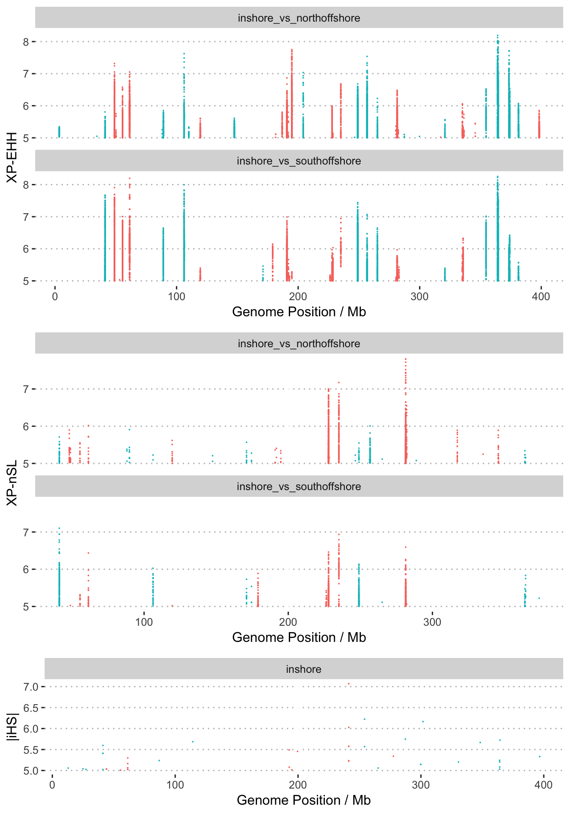
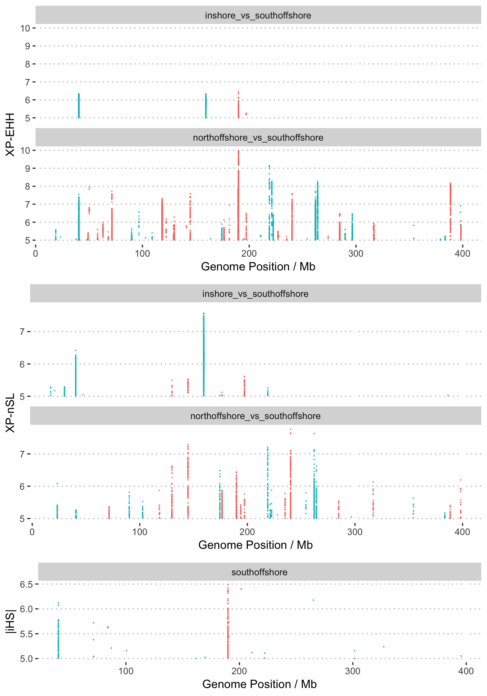
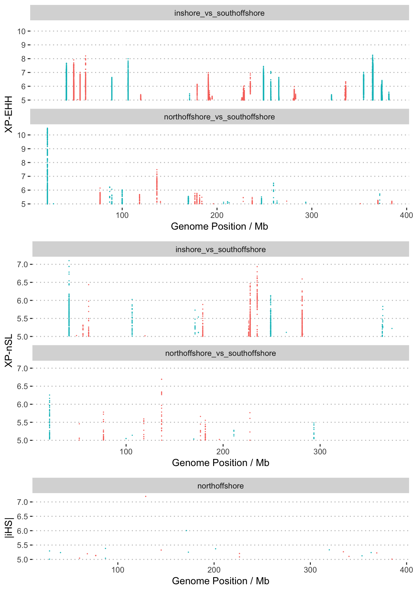

Selection analysis using haplotype information
================

We applied iHS, XP-nSL, and XP-EHH scan on scaffolds with more than 10
phased SNPs (464 scaffolds).The newer version of selscan can use
physical distance instead of genetic distance in scan.

We applied extended haplotype homozygosity (EHH) based methods to detect
the genomic regions under recent positive selection. The tool
[selscan](https://github.com/szpiech/selscan) was used to implement iHS
scan for each population, XPnSL, XPEHH scans both between every pair of
populations and between inshore and offshore. The VCF files which were
phased by SHAPEIT were used in selscan run

We extracted samples from each location from phased VCF file as
follows:

``` bash
bcftools view -S {pop} -r {chr} Adigi.v2.filtered.vcf.gz |bgzip > {pop}.{chr}.vcf.gz
```

Next, the iHS test was applied to every population separately.

``` bash
selscan --ihs --vcf {pop}.{chr}.vcf.gz --pmap \
  --threads 10 --out ihs_out/{pop}/{chr}
```

XP-EHH scan was conducted in inshore population using both offshore
south and north samples as reference group.

``` bash
selscan --xpehh --vcf inshore.{chr}.vcf.gz \
--vcf-ref {pop}.{chr}.vcf.gz --pmap \
--threads 10 --out xpehh_out/{chr}
```

XP-nSL scan was conducted in inshore population using both offshore
south and north samples as reference group.

``` bash
selscan --xpnsl --vcf inshore.{chr}.vcf.gz \
--vcf-ref {pop}.{chr}.vcf.gz \
--threads 10 --out xpnsl_out/{chr}
```

The unstandardised iHS values were normalized in allele frequency bins
(50 bins) across the genome whereas for `XP-EHH` and `XP-nSL`
normalisation was performed without this binning. The resulting value in
all cases is a z-score. It represents the number of standard deviations
from the mean (in frequency bins for iHS). In addition, the number of
extreme values was calculated within windows of fixed size, 50kb across
the
genome.

``` bash
norm --ihs --files ihs_out/*.out --bins 50 --bp-win --min-snps 10 --winsize 50000
norm --xpehh --files xpehh_out/*.out --bins 50 --bp-win --min-snps 10 --winsize 50000
norm --xpnsl --files xpnsl_out/*.out --bins 50 --bp-win --min-snps 10 --winsize 50000
```

Scores for all EHH based scans can be calculated across the genome using
the pseudo-chromosome level coordinates.

``` bash
cat ihs_out/{pop}/*.norm |cut -f1,2,7 > {pop}.ihs.50bins.norm
python translate_coords.py {pop}.ihs.50bins.norm ragtag.scaffolds.agp > {pop}.ihs.50bins.norm.ragtag.txt 
```

### iHS scores



**Figure 1: Manhattan plot of standardised |iHS| across the genome in
three populations. Extreme values (|iHS|\>5) are highlighted**

For iHS scan, we calculated the fraction of SNPs with extreme |iHS|
value in each divided 50Kb genomic window, excluding regions with fewer
than 10 SNPs. We did the same iHS scan for inshore and offshore
populations and used offshore samples as reference population in XP-EHH
and XP-nSL scan.

## XP-EHH and XP-nSL statistics

Although the iHS statistic is sensitive to recent positive selection
while accounting for local variation in recombination rate it loses
power for sweeps that have resulted in fixation or near fixation of the
selected allele. XP-EHH and XP-nSL statistics address this issue by
comparing long haplotypes in one population with alleles in a related
population. Our three Acropora digitifera populations in WA are ideal
for this because they diverged only recently and have similar
demographic histories.

The following plots consider each focal population separately.

First we examine the inshore population, plotting all available EHH
statistics. Although there are clearly a small number of loci that show
strong signals in all three of these stats the complementary nature of
the stats is also clear. Many of the strongest signals in XP-EHH are not
found via XP-nSL. XP-nSL has greater power to detect soft sweeps than
XP-EHH. For the inshore population very few strong sweeps can be
identified with
iHS.



**Figure 2: Manhattan plot of EHH based statistics (XP-EHH, XP-nSL, iHS)
where the focal population is inshore. **

For the South Offshore population
we



**Figure 3: Manhattan plot of EHH based statistics (XP-EHH, XP-nSL, iHS)
where the focal population is south offshore
**



**Figure 4: Manhattan plot of EHH based statistics (XP-EHH, XP-nSL, iHS)
where the focal population is north offshore **
