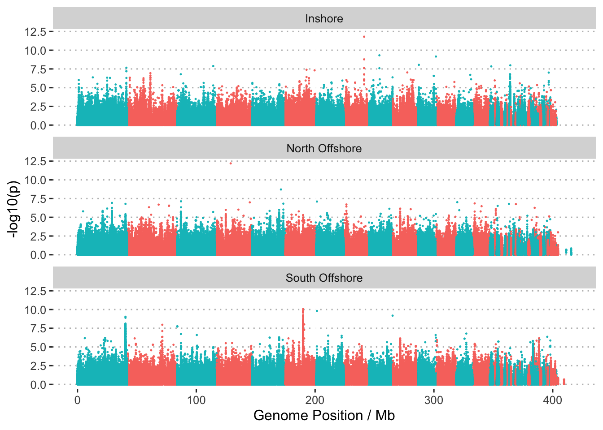

Selection analysis using haplotype information
================

We applied iHS, XP-nSL, and XP-EHH scan on scaffolds with more than 10
phased SNPs (464 scaffolds).The newer version of selscan can use
physical distance instead of genetic distance in scan.

We applied extended haplotype homozygosity (EHH) based methods to detect
the genomic regions under recent positive selection. The tool
[selscan](https://github.com/szpiech/selscan) was used to implement iHS
scan for each population, XPnSL, XPEHH scans both between every pairs of
populations and between inshore and offshore. The VCF files which were
phased by SHAPEIT were used in selscan run, we extracted samples from
each location from phased VCF file.

``` bash
bcftools view -S {pop} -r {chr} Adigi.v2.filtered.vcf.gz |bgzip > {pop}.{chr}.vcf.gz
```

Next, the iHS test was applied to every population separately.

``` bash
selscan --ihs --vcf {pop}.{chr}.vcf.gz --pmap \
  --threads 10 --out ihs_out/{pop}/{chr}
```

XP-EHH scan was conducted in inshore population using both offshore
south and north samples as reference group.

``` bash
selscan --xpehh --vcf inshore.{chr}.vcf.gz \
--vcf-ref {pop}.{chr}.vcf.gz --pmap \
--threads 10 --out xpehh_out/{chr}
```

XP-nSL scan was conducted in inshore population using both offshore
south and north samples as reference group.

``` bash
selscan --xpnsl --vcf inshore.{chr}.vcf.gz \
--vcf-ref {pop}.{chr}.vcf.gz \
--threads 10 --out xpnsl_out/{chr}
```

The unstandardised iHS and XP-EHH values were normalized in allele
frequency bins (50 bins) across the genome using `norm`.

``` bash
norm --ihs --files ihs_out/*.out --bins 50 --bp-win --min-snps 10 --winsize 50000
norm --xpehh --files xpehh_out/*.out --bins 50 --bp-win --min-snps 10 --winsize 50000
norm --xpnsl --files xpnsl_out/*.out --bins 50 --bp-win --min-snps 10 --winsize 50000
```

We plotted the standardised iHS score across the genome using the
psedu-chromosome level coordinates.

``` bash
cat ihs_out/{pop}/*.norm |cut -f1,2,7 > {pop}.ihs.50bins.norm
python translate_coords.py {pop}.ihs.50bins.norm ragtag.scaffolds.agp > {pop}.ihs.50bins.norm.ragtag.txt 
```



**Figure 1: Manhattan plot of -log10(pval) of standard \|iHS\| across
the genome in three population**

For iHS scan, we calculated the fraction of SNPs with extreme \|iHS\|
value in each divided 50Kb genomic window, excluding regions with fewer
than 10 SNPs. We did the same iHS scan for inshore and offshore
populations and used offshore samples as reference population in XP-EHH
and XP-nSL scan.

The XP-EHH results
