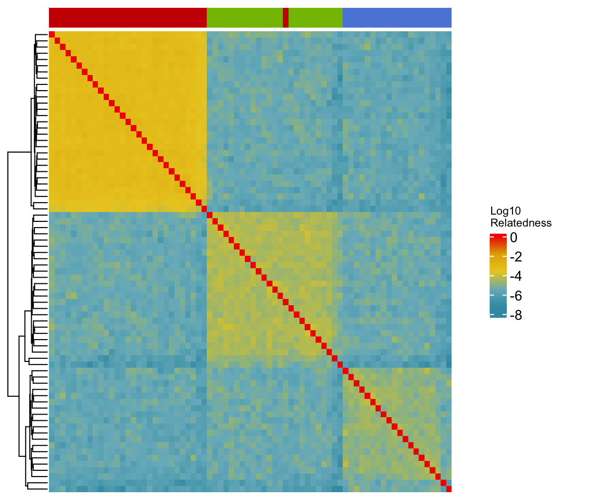

Population structure inferred by haplotype data
================

Any two samples in a population can be traced back to their most recent
common ancestor by sharing identity-by-descent haplotypes. Although we
don’t have a chromosome-level reference genome, the version two of
*A.digitifera* display significant improvement in N50 size, thus it is
worth investigating the haplotype segments sharing pattern in
population.

### Detecting identity-by-descent segements

We used `refined-ibd`
[v17Jan20](https://faculty.washington.edu/browning/refined-ibd.html) to
detect IBD segments in phased genotype data. The map file was generated
as in [selection analysis](06.selection_analysis.md).

``` bash
java -jar refined-ibd.17Jan20.102.jar nthreads=10 \
gt=Adigi.v2.indv74_phased.vcf.gz map=map.txt chrom={scaffold} \
length=0.15 trim=0.015 window=4 out={scaffold}
```

Next, we use `merge-ibd-segments` to remove any breaks and short gaps in
IBD segments.

``` bash
zcat {scaffold}.ibd.gz | java -jar merge-ibd-segments.17Jan20.102.jar \
{scaffold}.vcf map.txt 0.01 2 > {scaffold}.merged.ibd
```

### Calculating the relatedness

The pairwise relatedness can be calculated using a python script
[relatedness\_v1.py](http://faculty.washington.edu/sguy/ibd_relatedness.html)
in which the relatedness was calculated as the proportion of shared
haplotype length divided by the total chromosome length\*2.

``` bash
cat *.merged.ibd | python2 relatedness_v1.py map.txt 0 > Adigi_ind74.ibd_relatedness.txt
```



**Figure:** A heatmap shows the pairwise relatedness based on shared
haplotypes. A darker color means a higher relatedness.

### FineStructure analysis

With phased vcf file, we performed chrmopainter and finestructure msmc
and tree inferences.

The phased haps format files from shapeit were converted into
chromopainter format with `impute2chromopainter.pl` per scaffold. To use
linked mode, we generated uniform recombination rate map files using
`makeuniformrecfile.pl`.

In chromopainter EM parameter estimate, we used 30% of samples (20) and
estimated Ne and mu were used to run chromopainter. Next, fineStructure
was run with 2000000 iterations of which half was assigned to burn in
iteration and half to sampling iteration and -z 1000 as default. The
sample relationship tree was built in step4 with 100,000 iterations.

``` bash
fs adigitifera.cp -n -phasefiles phase_files/*.phase -recom/* \
-idfile samples.id -hpc 1 -s1indfrac 0.3 -s3iters 2000000 -go
cat adigitifera/commandfiles/commandfile1.txt | parallel -j 20

fs adigitifera.cp -go
cat adigitifera/commandfiles/commandfile2.txt | parallel -j 20

fs adigitifera.cp -go
cat adigitifera/commandfiles/commandfile3.txt | parallel -j 2

fs adigitifera.cp -go
cat adigitifera/commandfiles/commandfile4.txt | parallel -j 2

fs adigitifera.cp -go
fs fs -X -Y -e X2 adigitifera_linked.chunkcounts.out adigitifera_linked_tree.xml \
adigitifera_linked.mapstate.csv
fs fs -X -Y -e X2 adigitifera_linked.chunkcounts.out adigitifera_linked_mcmc.xml \
adigitifera_linked.meancoincidence.csv
```


**Figure:** Co-ancestry matrix with the tree showing inferred
relationships between samples.
