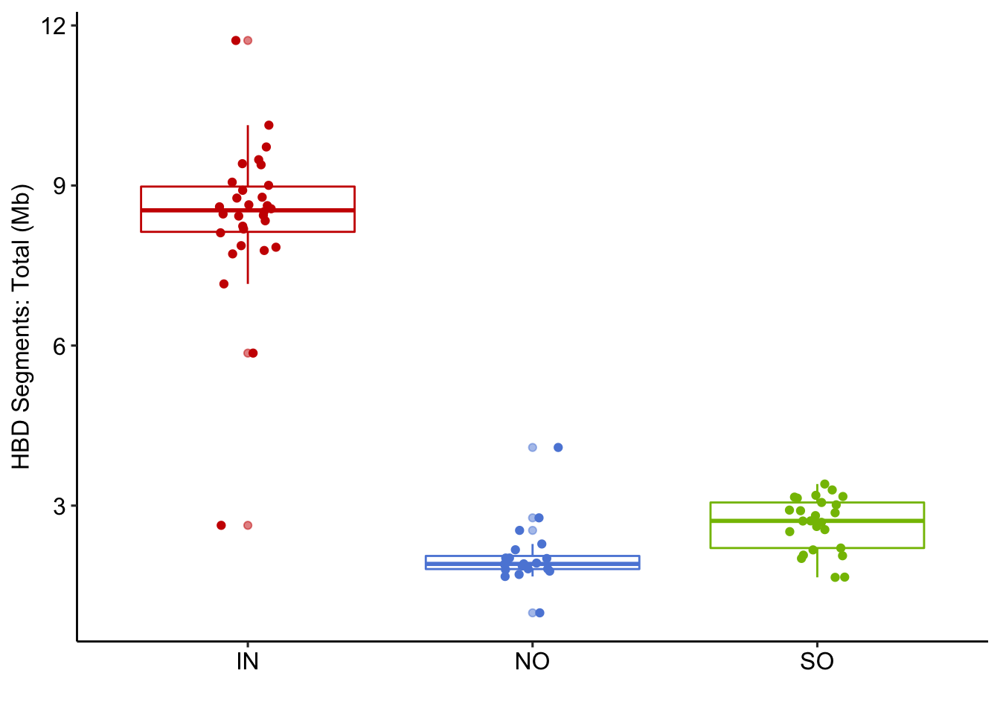
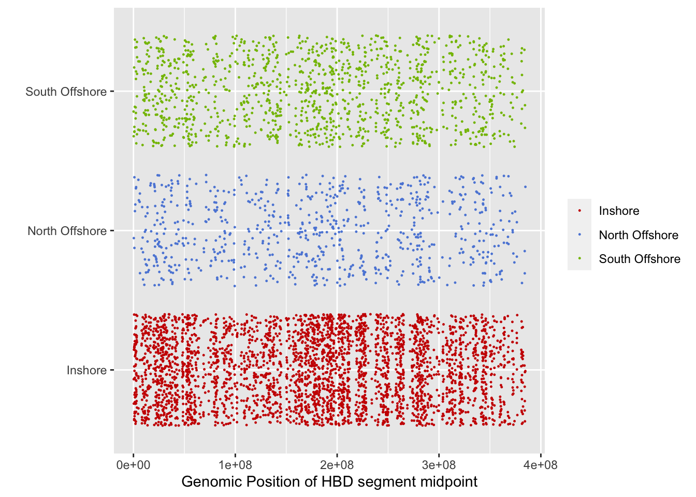

Population structure inferred by haplotype data
================

Identification of genomic segments that have been inherited by descent
(identity-by-descent; IBD) provides information on shared ancestry
within the population and within an individual. In practice our ability
to detect IBD haplotypes depends on the degree of relatedness between
individuals (higher relatedness leading to longer and more IBD
haplotypes). To some extent it is also affected by the quality of the
genome assembly, however, this is only an issue for long IBD segments
(\>1Mb). Although we don’t have a chromosome-level reference genome, the
version two of *A.digitifera* display significant improvement in N50
size, thus it is worth investigating the haplotype segments sharing
pattern in population.

### Detecting identity-by-descent segements

We used `refined-ibd`
[v17Jan20](https://faculty.washington.edu/browning/refined-ibd.html) to
detect IBD segments in phased genotype data. The map file was generated
as in [selection analysis](06.selection_analysis.md).

``` bash
java -jar refined-ibd.17Jan20.102.jar nthreads=10 \
gt=Adigi.v2.indv74_phased.vcf.gz map=map.txt chrom={scaffold} \
length=0.15 trim=0.015 window=4 out={scaffold}
```

Next, we use `merge-ibd-segments` to remove any breaks and short gaps in
IBD segments.

``` bash
zcat {scaffold}.ibd.gz | java -jar merge-ibd-segments.17Jan20.102.jar \
{scaffold}.vcf map.txt 0.01 2 > {scaffold}.merged.ibd
```

### Calculating the relatedness

The pairwise relatedness can be calculated using a python script
[relatedness\_v1.py](http://faculty.washington.edu/sguy/ibd_relatedness.html)
in which the relatedness was calculated as the proportion of shared
haplotype length divided by the total chromosome length\*2.

``` bash
cat *.merged.ibd | python2 relatedness_v1.py map.txt 0 > Adigi_ind74.ibd_relatedness.txt
```


**Figure:** Heatmap showing Log10 of the pairwise relatedness based on
shared IBD segments. Top bar indicates location of the samples

# Runs of Homozygosity

Long runs of homozygosity are expected under a range of demographic
and/or non-random mating scenarios (nicely reviewed in (Ceballos et al.
2018)). This is most obvious in cases of inbreeding, however, in human
populations it has been shown that ROH are common in the general
population simply due to a finite Ne. Small effective population size
and/or historical Ne (ie a bottleneck) can also give rise to long runs
of homozygosity. ROH are also much more likely to occur in populations
where there is limited admixture.

We used IBDSeq to identify segments of the genome thought to be
homozygous by descent (hbd) within individuals as well as those thought
to be ibd between individuals.

We did this for scaffolds longer than 1Mb based on the unphased genotype
data as follows;

``` bash
while read scaff;do
    echo $scaff
    java -Xmx2000m -jar ibdseq.r1206.jar gt=Adigi.v2.filtered.vcf.gz out=${scaff} nthreads=4 chrom=${scaff}
done < 1M_scaffolds.txt
```

If we look at the length distribution of runs of homozygosity we find
that the number of such runs is very slightly longer in inshore than in
offshore but there is otherwise little difference.


However, if we take the total length of ROH segments in each individual
we find that individuals from inshore tend to have a much higher
proportion of ROH in their genomes.



### Position of HBD segments

We mapped the midpoints of each HBD segment to chromosome level
coordinates using ragtag. When viewed across the entire genome there did
not appear to be biases in the position of HBD segments. This however
does not preclude the existence of localised hotspots.



<div id="refs" class="references">

<div id="ref-Ceballos2018-sx">

Ceballos, Francisco C, Peter K Joshi, David W Clark, Michèle Ramsay, and
James F Wilson. 2018. “Runs of Homozygosity: Windows into Population
History and Trait Architecture.” *Nat. Rev. Genet.* 19 (4): 220–34.

</div>

</div>
