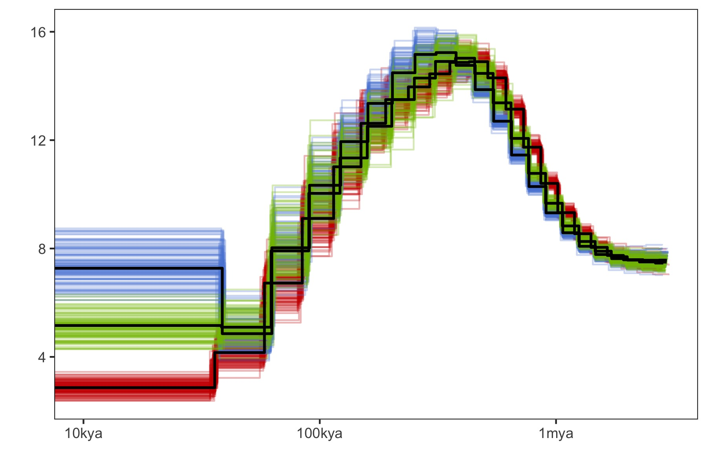

```{r setup, include=FALSE}
knitr::opts_chunk$set(echo = FALSE, warning = FALSE, message = FALSE, fig.retina = 2)
library(tidyverse)
library(ggsci)
```

## SNP data for Sequentially Markovian Coalescent (SMC) analyses
We only used variants from scaffold with a length greater than 1Mbp in which account for approximately 75% of genome size (N75=983,972, first 142 scaffolds).  Additionally, different methods have different limitations in number of samples, we used:

- Three individuals from each location in **PSMC analysis**.
- All samples (unphased, 74 indvs) except the mislabeled sample from each location in **SMC++**.

<!-- - Eight haplotypes (4 samples) from each reef in **MSMC**. -->

## 0. Mutation rate estimate
The per generation mutation rate of *A.digitifera* estimated based on a divergence time of 15.5 Million years to *A. tenuis* is 2.89e-8 in [@Mao2018]. A more recent study that used numerous fossil calibration points and 818 orthologous genes points toward a much older divergence time of 50Mya [@Shinzato2020]. Given the inherent uncertainties in these estimates we chose a value of 37.5Mya as this lies at the midpoint between the youngest Acropora fossils (25 Mya) [@Santodomingo2015-yl] and more ancient estimates from whole genome analyses [@Shinzato2020]. To translate these divergence times to mutation rates we updated calculations in [@Mao2018] as follows; 

```bash
#(79427941/(79427942+363368171)/(2 × 15.5)) x 5 × 10−6 = 2.89 × 10−8
#calibrate divergence time to 37.5
(79427941/(79427942+363368171)/(2 × 37.5)) x 5 × 10−6 = 1.20 x 10-8
```

This gave a per generation mutation rate of 1.2e-8 that we used for all analyses.

## 1. PSMC analysis

We first used bcftools mpileup and call functions to get sample-specific SNP data sets, in which we removed sites with mean map and base quality < 30. Then appied psmc to each sample with 64 atomic time (-p 4+25*2+4+6).

```bash
bcftools mpileup -Q 30 -q 30 -C 50 -f {reference}.fa -r {chr} {sample}.bam | \
 bcftools call -c | \
 vcfutils.pl vcf2fq -d 10 -D 80 -Q 30 > {sample}_{chr}.fq
 
cat {sample}_*.fq > {sample}_consensus.fq

#fq2psmcfa
fq2psmcfa {sample}_consensus.fq > {sample}.psmcfa

## run psmc
psmc -p 4+25*2+4+6 -o {sample}.psmc {sample}.psmcfa
```

To perform bootstrapping, we run splitfa to split long scaffold to shorter segments and applied psmc with `-b` option to allow it randomly sample with replacement from these segments for 100 times.
```bash
splitfa {sample}.psmcfa > split.{sample}.psmcfa
psmc -b -p 4+25*2+4+6 -o bootstrap/round-{n}.psmc split.{sample}.psmc.fa  # n=1:100
cat bootstrap/round-*.psmc > {sample}_bs_combined.psmc
```

```{r}
##### this is how I made the plot in R, however, I include the final plot directly here to avoid including so many temp files, which is not in cloudstor.

#fn <-list.files(path="data/hpc/demography/psmc/psmc_plot_temp", pattern = "final_bp.*.txt",full.names = T)
  #ggplot(aes(x=X1,y=X2)) + geom_step()+ scale_x_log10()
#read_single_psmc <- function(.x) {
#  bs_n <- gsub("data/hpc/demography/psmc/psmc_plot_temp/final_bp.(\\d+).txt","\\1",.x) %>% as.integer()
#  pop <- case_when(bs_n<=100~"inshore", bs_n>100 && bs_n<=201 ~ "northoffshore", bs_n>=202~"southoffshore")
#  tb<-read_tsv(.x,col_names = F) %>% select(X1,X2) %>% add_column(pop=pop,bs_n=bs_n)
#  tb
#}

#df <- map_df(.x=fn, .f = read_single_psmc)

#psmc_plot<-ggplot(df,aes(x=X1,y=X2,group=bs_n)) + geom_step(aes(color=pop),alpha=0.3) + geom_step(data=df %>% filter(bs_n %in% c(0,101,202)), color="black", size=.8) +
#  scale_x_log10(breaks=c(1e+4,1e+5,1e+6,1e+7), labels=c("10kya","100kya","1mya","10mya"), limits=c(1e4,3e6)) +
#  scale_color_startrek(guide=F) + theme_test() + labs(x="",y="")
#psmc_plot
#ggsave(psmc_plot, filename = "figures/psmc.jpg", width = 6, height = 4)


```
**Figure1: The demographic history inferred by PSMC for inshore, north offshore, and south offshore**

## 2. SMC++ analysis

Firstly, a single VCF file for each scaffold was extracted and indexed.

```bash
bcftools view -r {chr} -Oz -o {chr}.vcf.gz Adigi.v2.filtered.74.vcf.gz 
tabix {chr}.vcf.gz
```
To distinguish invariant positions with missing data, we mask genome regions where:
a) with low or super high coverage across all samples (less than three reads covered or greater than 3000);
b) We generated the genome mask files created using Heng Li's SNPable tools and extracted the ambiguous positions (c=="0" or c=="1").

```bash
samtools depth -r {chr} -aa -f bamfiles.txt | \
awk '{sum=0; for(i=3; i<=NF; i++) {sum+=$i}; print $1"\t"$2"\t"sum }' | \
awk '{if($3<3 || $3>3000) print $1"\t"$2"\t"$2}' | \
bedtools merge -i stdin | bgzip > {chr}.low_masked.bed.gz

zcat {chr}.low_masked.bed.gz Adigi_{chr}.mask.bed.gz | bedtools sort | bedtools merge |bgzip > {chr}.masked.bed.gz
```
Mask files of all scaffolds were concatenated together and we keep blocks with a length greater than 2Kb. Next, vcf files were converted into a SMC format file using `vcf2smc` in which we send in a vcf file of one scaffold and specify a list samples in the population. All smc+ input files were used together in a single run by varying the choice of distinguished individuals(8 from each pop) and resulting in a composite likelihood estimate.

```bash
smc++ vcf2smc -d {sample} {sample} \
  --mask all.masked.bed.gz {chr}.vcf.gz {chr}_{sample}.smc.gz {chr} \
  POP:$(cat {sample}.txt | paste -s -d ',')
```
smc++ `estimate` command was ran to estimate population history for each population. 

```bash
## cubic spine version
smc++ estimate --cores 30 -o estimate --base {pop} --spline cubic \
 --timepoints 20 200000 --em-iterations 50 --thinning 3000 --knots 10 1.2e-8 {pop}.*.smc.gz
 
## piecewise(default) spine version
smc++ estimate --cores 30 -o estimate --base {pop} \
        --em-iterations 50 --timepoints 20 200000 --thinning 3000 \
        --knots 40 1.2e-8 {pop}.*.smc.gz
```
Eventually, we chose the piecewise spline for better resemble to PSMC plot and more details. However, the result file are available for plotting ([csv](data/hpc/demography/estimate_em50_cubic_k10/em50_cubic_k10.csv),[cubic spline plot](data/hpc/demography/estimate_em50_cubic_k10/em50_cubic_k10.png)).

### 2.1 Demographic history of three reefs

```{r plot-seting}
mu <- 1.2e-8 
gen <- 5
#dtime = data.frame(name=c("LGM","Holocene"), start=c(1.2e+4,0), end=c(1.1e+5,1.2e+4))
#smc <- read_csv("data/hpc/demography/estimate_em50_cubic_k10/em50_cubic_k10.csv")
smc_main <- read_csv("data/hpc/demography/estimate_em50_k40/em50_k40.csv") %>% select(label,x,y) %>% add_column(type="main")

xbreaks <- c(1e+2*1:9, 1e+3*1:9 , 1e+4*1:9 , 1e+5*1:9 , 1e+6*1:9 , 1e+7)
xlabels <- as.character(xbreaks)
xlabels[!(xbreaks%in%c(1e+3,1e+4,1e+5,1e+6,1e+7))] <- ''
xlabels[xbreaks%in%c(1e+3,1e+4,1e+5,1e+6,1e+7)] <-c("1kya","10kya","100kya","1mya","10mya")

ybreaks <- c(1e+3*2:9 , 1e+4*1:9 , 1e+5*1:9 , 1e+6*1:2)
ylabels <- as.character(ybreaks)
ylabels[!(ybreaks%in%c(1e+4,1e+5,1e+6))] <- ''
ylabels[ybreaks%in%c(1e+4,1e+5,1e+6)] <- c("1","10","100")
```

```{r smc-plot, fig.align='left',fig.width=7,fig.height=5}
ggplot(smc_main) + geom_line(aes(x=x,y=y,color=label),size=0.8,show.legend = FALSE) +
  #geom_rect(data=dtime,aes(xmin=start,xmax=end,fill=name),ymin=-Inf, ymax=Inf,alpha=0.2,show.legend = FALSE) + 
  scale_fill_manual(values = c("yellow","grey")) +
  #geom_text(data=dtime, aes(x=c(3e+4,2e+3),y=2e+6,label=name), size=4, fontface="bold") +
  scale_x_log10(breaks=xbreaks, labels=xlabels)+
  scale_y_log10(breaks=ybreaks,labels=ylabels,limits=c(2e+3,2e+6)) + 
  scale_color_startrek() + theme_test() + 
  labs(x=expression(paste("Years Ago (g=5, ",mu, "=1.20e-8)")),
  y=expression(paste("Effective Population Size ",N[e]," (x", 10^4 ,")"))) +
  ggtitle("Historial effective population size estimated by SMC++")
```

**Figure 2: The effective population size estimate using SMC++ approach. The red, blue, and green lines represent the results of inshore, offshore north, and offshore south respectively.**

To do bootstrapping, we performed 20(due to computational constraint) bootstrap estimates in SMC++ with fragmented and re-sampled scaffolds (generate by script [bootstrap_smcpp.py](scripts/bootstrap_smcpp.py)). SMC++ `estimate` was ran with these data sets with the same parameters as before.

```{r}
smc_main <- read_csv("data/hpc/demography/estimate_em50_k40/em50_k40.csv") %>% select(label,x,y) %>% add_column(type="main")

if ( !file.exists("data/r_essentials/smc_bs.rds")){
  read_bootstrap <- function(pop, n) {
    read_csv(paste0("data/hpc/demography/smc_bootstrap/",pop,"_",n,".csv" )) %>% select(label,x,y) %>% add_column(n=paste0("bs",n))
  }

  smc_bs <- rbind(map_df(1:20, ~read_bootstrap(pop="inshore",n=.x)),
                  map_df(1:20, ~read_bootstrap(pop="northoffshore",n=.x)),
                  map_df(1:20, ~read_bootstrap(pop="southoffshore",n=.x)))

  write_rds(smc_bs,"data/r_essentials/smc_bs.rds")
} else {
  smc_bs <- read_rds("data/r_essentials/smc_bs.rds")
}
```

```{r bootstrap-plot}
#smc_bootstrap_plot
smc_bootstrap_plot <- ggplot() + geom_line(data=smc_main,aes(x=x,y=y,color=label),size=1,show.legend = FALSE) +
  geom_line(data = smc_bs, aes(x=x,y=y,color=label,group=interaction(label,n)),alpha=0.1,show.legend = FALSE)+
  scale_x_log10(breaks=xbreaks, labels=xlabels)+
  scale_y_log10(breaks=ybreaks,labels=ylabels,limits=c(2e+3,2e+6)) + 
  scale_color_startrek() + theme_test() + 
  labs(x=expression(paste("Years Ago (g=5, ",mu, "=1.20e-8)")),
  y=expression(paste("Effective Population Size ",N[e]," (x", 10^4 ,")"))) 
```

### 2.2 Divergence time among populations

The smc++ can estimate joint demography and speculate the splitting time between pair of populations. To do this, we first create a joint frequency spectrum for every pair of populations using `vcf2smc`.

```bash
smc++ vcf2smc {chr}.vcf.gz {pop1}_{pop2}.smc.gz {chr} POP1:{sampleid},..  POP2:{sampleid},..
```

Next,we ran smc++ `split` with same parameters we used in `estimate`.

```bash
smc++ split -o split --base {pop1}_{pop2} \
--timepoints 20 200000 --em-iterations 50 --thinning 3000 \
{pop1}.final.json {pop2}.final.json {pop1}_{pop2}.smc.gz
```
Eventually, we made the pairwise plot using `smc plot` tool with a five year generation time.

```{r split, fig.show="hold", out.width="33%"}
library(png)
library(knitr)
#split_plot_cubic <- list.files(path = "figures/smc_split_cubic",pattern = "*.split.png" ,full.names = TRUE)
#include_graphics(split_plot_cubic)

split_plot_pw <- list.files(path = "figures/smc_split_piecewise",pattern = "*.split.png" ,full.names = TRUE)
include_graphics(split_plot_pw)
```
**Figure 3: Three figures above show the joint demography between any two populations  (IN: Inshore, NO: North Offshore, SO: South Offshore) and the estimated splitting time (blue vertical line)**

## Add climate data in plot
```{r}
climate_data <- read_tsv("data/nature07158-s2.txt",skip = 14)
library(cowplot)

smc_plot <- ggplot() + geom_line(data=smc_main,aes(x=x,y=y,color=label),size=1,show.legend = FALSE) +
  geom_line(data = smc_bs, aes(x=x,y=y,color=label,group=interaction(label,n)),alpha=0.1,show.legend = FALSE)+
  scale_x_log10(breaks=c(1e+3,1e+4,1e+5,1e+6), labels=c("1kya","10kya","100kya","1mya"), limits=c(1e+3,1.3e+6),expand = c(0, 0))+
  scale_y_log10(breaks=ybreaks,labels=ylabels,limits=c(2e+3,2e+6)) + 
  scale_color_startrek() + theme_test() + 
  labs(x=expression(paste("Years Ago (g=5, ",mu, "=1.20e-8)")),
  y=expression(paste("Effective Population Size ",N[e]," (x", 10^4 ,")"))) 

cp <- ggplot(climate_data %>% filter(Time>1),aes(x=Time*1e3,y=-Ice_tot)) + 
  geom_line() + 
  scale_x_log10(breaks=c(1e+3,1e+4,1e+5,1e+6), labels=c("1kya","10kya","100kya","1mya"), limits=c(1e+3,1.3e+6),expand = c(0, 0)) +
  theme_minimal() +
  ylab("Sea Level") + xlab("Years Ago")
plot_grid(smc_plot,cp, ncol = 1, align = "hv", axis = "lr", rel_heights = c(0.3,0.3,0.3))
```

## Evaluating the uncertainty in mutation rate and generation time.

In SMC++, we re-ran the estimate using three mutation rates/generation time (3, 5, and 7 years) and also the splitting time.

- 1.2e-8 calculated in this study.
- 1.86e-8 from Ira Cooke et al 2020
- 2.89e-8 from Mat et al 2018

**The variance in bottleneck time**

```{r}
if ( !file.exists("data/r_essentials/07_main_data.rds")){
  all_csv_files <- list.files("data/hpc/demography/smc++_varying_mu",recursive = TRUE,"*.csv",full.names = TRUE)

  read_main <- function(path){
    pieces <- basename(path) %>% str_match("(mu[123])_main_(g[357])")
    read_csv(path) %>% 
      add_column(mu=pieces[1,2]) %>% 
      add_column(g=pieces[1,3])
  }

  main_data <- all_csv_files[grepl(all_csv_files,pattern = "main")] %>% 
    map_dfr(read_main)

  write_rds(main_data,"data/r_essentials/07_main_data.rds")
} else {
  main_data <- read_rds("data/r_essentials/07_main_data.rds")
}

botmin <- main_data %>% 
  group_by(label,mu,g) %>% 
    mutate(boty=min(y)) %>% 
    mutate(botx= ifelse(y==boty,x,NA)) %>% 
    na.omit() %>% 
    summarise(boty=first(boty),botx=mean(botx))
    #ungroup() %>% group_by(label) %>% summarise(xmin=min(botx),xmax=max(botx)) %>% 
    #add_column(y=10^c(3.3,3.4,3.5))

g.labs <- c("generation: 3 years", "generation: 5 years", "generation: 7 years")
names(g.labs) <- c("g3", "g5", "g7")

bot_plot <- botmin %>% 
  unite(col = "gid",mu,g,remove = FALSE) %>% 
  ggplot(aes(x=botx,y=label)) + 
    geom_point(aes(group=gid,color=mu)) +
    geom_line(aes(group=gid,color=mu)) +
  scale_color_hue(labels = c("1.2e-8", "1.86e-8","2.89e-8")) +
  facet_wrap(~g, ncol = 1,labeller = labeller(g = g.labs)) + 
  labs(x="Years ago",y ="", color="Mutation rate") + 
  theme(legend.position = "none",plot.margin = margin(0,0,0,0))
```

**The variance in splitting time**

```{r}
if (!file.exists("data/r_essentials/07_split_data.rds")){
  all_csv_files <- list.files("data/hpc/demography/smc++_varying_mu",recursive = TRUE,"*.csv",full.names = TRUE)  
  read_split <- function(path){
    pieces <- path %>% str_match("(mu[123])/(.+)_(g[357])\\.csv")
    read_csv(path) %>% 
      add_column(mu=pieces[2],split=pieces[3]) %>% 
      add_column(g=pieces[4])
  }
  split_data <- all_csv_files[grepl(all_csv_files,pattern = "shore")] %>% 
    map_dfr(read_split)

  write_rds(split_data,"data/r_essentials/07_split_data.rds")
} else {
    split_data <- read_rds("data/r_essentials/07_split_data.rds")
}

split_time <- split_data %>% 
  group_by(label,mu,g,split) %>% 
    mutate(max_x=max(x)) %>% ungroup() %>% 
    group_by(split,mu,g) %>% summarise(t=min(max_x))

split_plot <- split_time %>% 
  unite(col = "gid",mu,g,remove = FALSE) %>% 
  ggplot(aes(x=t,y=split)) + 
    geom_point(aes(group=gid,color=mu)) +
    geom_line(aes(group=gid,color=mu)) +
  scale_color_hue(labels = c("1.2e-8", "1.86e-8","2.89e-8")) + 
  scale_y_discrete(labels=c("split. IN-NO","split. IN-SO","split. NO-SO")) +
  facet_wrap(~g, ncol = 1,labeller = labeller(g = g.labs)) + 
  labs(x="Years ago",y ="", color="Mutation rate") + 
  theme(plot.margin = margin(0,0,0,0))


plot_grid(bot_plot,split_plot, nrow = 1, label_size = 12,align = "h", axis = "b", rel_widths = c(0.37,0.63), labels = c("A","B"))
#ggsave("fig-s10.pdf",width = 6.75,height = 3.6)
#ggsave("fig-s10.jpg",width = 6.75,height = 3.6)
```


## Reference


