Demographic history - Sequentially Markov Cross-coalescence analysis
================

  - [SNP data for Sequentially Markovian Coalescent (SMC)
    analyses](#snp-data-for-sequentially-markovian-coalescent-smc-analyses)
  - [0. Mutation rate estimate](#0-mutation-rate-estimate)
  - [1. PSMC analysis](#1-psmc-analysis)
  - [2. SMC++ analysis](#2-smc-analysis)
      - [2.1 Demographic history of three
        reefs](#21-demographic-history-of-three-reefs)
      - [2.2 Divergence time among
        populations](#22-divergence-time-among-populations)
  - [Add climate data in plot](#add-climate-data-in-plot)
  - [Evaluating the uncertainty in mutation rate and generation
    time.](#evaluating-the-uncertainty-in-mutation-rate-and-generation-time)
  - [Reference](#reference)

## SNP data for Sequentially Markovian Coalescent (SMC) analyses

We only used variants from scaffold with a length greater than 1Mbp in
which account for approximately 75% of genome size (N75=983,972, first
142 scaffolds). Additionally, different methods have different
limitations in number of samples, we used:

  - Three individuals from each location in **PSMC analysis**.
  - All samples (unphased, 74 indvs) except the mislabeled sample from
    each location in **SMC++**.

<!-- - Eight haplotypes (4 samples) from each reef in **MSMC**. -->

## 0\. Mutation rate estimate

The per generation mutation rate of *A.digitifera* estimated based on a
divergence time of 15.5 Millions years is 2.89e-8 in (Mao, Economo, and
Satoh 2018). However, the recent updated Acropora coral divergence time
in (Shinzato et al. 2020) is 25-50 million years which gave us a smaller
per generation mutation rate of 1.2e-8 based on previous calculation and
we thus used the calibrated mutation rate in our analyses.

``` bash
#(79427941/(79427942+363368171)/(2 × 15.5)) x 5 × 10−6 = 2.89 × 10−8
#calibrate divergence time to 37.5
(79427941/(79427942+363368171)/(2 × 37.5)) x 5 × 10−6 = 1.20 x 10-8
```

## 1\. PSMC analysis

We first used bcftools mpileup and call functions to get sample-specific
SNP data sets, in which we removed sites with mean map and base quality
\< 30. Then appied psmc to each sample with 64 atomic time (-p
4+25\*2+4+6).

``` bash
bcftools mpileup -Q 30 -q 30 -C 50 -f {reference}.fa -r {chr} {sample}.bam | \
 bcftools call -c | \
 vcfutils.pl vcf2fq -d 10 -D 80 -Q 30 > {sample}_{chr}.fq
 
cat {sample}_*.fq > {sample}_consensus.fq

#fq2psmcfa
fq2psmcfa {sample}_consensus.fq > {sample}.psmcfa

## run psmc
psmc -p 4+25*2+4+6 -o {sample}.psmc {sample}.psmcfa
```

To perform bootstrapping, we run splitfa to split long scaffold to
shorter segments and applied psmc with `-b` option to allow it randomly
sample with replacement from these segments for 100 times.

``` bash
splitfa {sample}.psmcfa > split.{sample}.psmcfa
psmc -b -p 4+25*2+4+6 -o bootstrap/round-{n}.psmc split.{sample}.psmc.fa  # n=1:100
cat bootstrap/round-*.psmc > {sample}_bs_combined.psmc
```

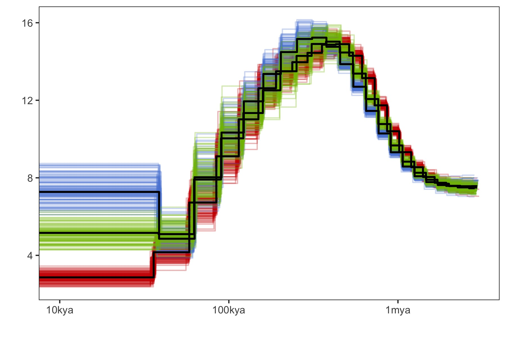 **Figure1: The demographic
history inferred by PSMC for inshore, north offshore, and south
offshore**

## 2\. SMC++ analysis

Firstly, a single VCF file for each scaffold was extracted and indexed.

``` bash
bcftools view -r {chr} -Oz -o {chr}.vcf.gz Adigi.v2.filtered.74.vcf.gz 
tabix {chr}.vcf.gz
```

To distinguish invariant positions with missing data, we mask genome
regions where: a) with low or super high coverage across all samples
(less than three reads covered or greater than 3000); b) We generated
the genome mask files created using Heng Li’s SNPable tools and
extracted the ambiguous positions (c==“0” or c==“1”).

``` bash
samtools depth -r {chr} -aa -f bamfiles.txt | \
awk '{sum=0; for(i=3; i<=NF; i++) {sum+=$i}; print $1"\t"$2"\t"sum }' | \
awk '{if($3<3 || $3>3000) print $1"\t"$2"\t"$2}' | \
bedtools merge -i stdin | bgzip > {chr}.low_masked.bed.gz

zcat {chr}.low_masked.bed.gz Adigi_{chr}.mask.bed.gz | bedtools sort | bedtools merge |bgzip > {chr}.masked.bed.gz
```

Mask files of all scaffolds were concatenated together and we keep
blocks with a length greater than 2Kb. Next, vcf files were converted
into a SMC format file using `vcf2smc` in which we send in a vcf file of
one scaffold and specify a list samples in the population. All smc+
input files were used together in a single run by varying the choice of
distinguished individuals(8 from each pop) and resulting in a composite
likelihood estimate.

``` bash
smc++ vcf2smc -d {sample} {sample} \
  --mask all.masked.bed.gz {chr}.vcf.gz {chr}_{sample}.smc.gz {chr} \
  POP:$(cat {sample}.txt | paste -s -d ',')
```

smc++ `estimate` command was ran to estimate population history for each
population.

``` bash
## cubic spine version
smc++ estimate --cores 30 -o estimate --base {pop} --spline cubic \
 --timepoints 20 200000 --em-iterations 50 --thinning 3000 --knots 10 1.2e-8 {pop}.*.smc.gz
 
## piecewise(default) spine version
smc++ estimate --cores 30 -o estimate --base {pop} \
        --em-iterations 50 --timepoints 20 200000 --thinning 3000 \
        --knots 40 1.2e-8 {pop}.*.smc.gz
```

Eventually, we chose the piecewise spline for better resemble to PSMC
plot and more details. However, the result file are available for
plotting
([csv](data/hpc/demography/estimate_em50_cubic_k10/em50_cubic_k10.csv),[cubic
spline
plot](data/hpc/demography/estimate_em50_cubic_k10/em50_cubic_k10.png)).

### 2.1 Demographic history of three reefs

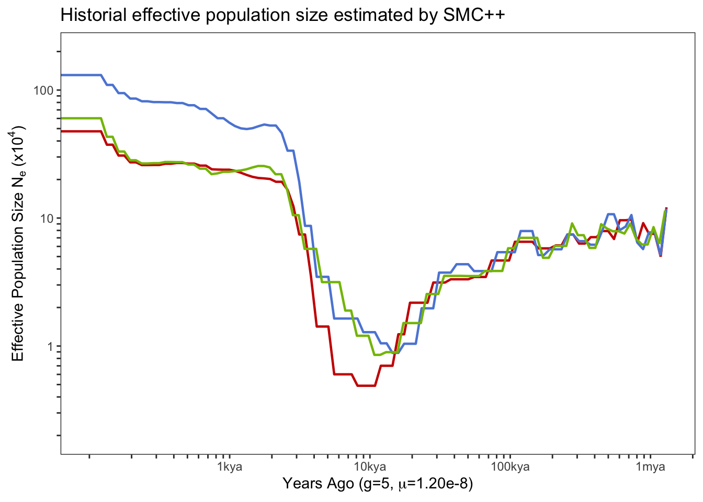

**Figure 2: The effective population size estimate using SMC++ approach.
The red, blue, and green lines represent the results of inshore,
offshore north, and offshore south respectively.**

To do bootstrapping, we performed 20(due to computational constraint)
bootstrap estimates in SMC++ with fragmented and re-sampled scaffolds
(generate by script [bootstrap\_smcpp.py](scripts/bootstrap_smcpp.py)).
SMC++ `estimate` was ran with these data sets with the same parameters
as before.

### 2.2 Divergence time among populations

The smc++ can estimate joint demography and speculate the splitting time
between pair of populations. To do this, we first create a joint
frequency spectrum for every pair of populations using `vcf2smc`.

``` bash
smc++ vcf2smc {chr}.vcf.gz {pop1}_{pop2}.smc.gz {chr} POP1:{sampleid},..  POP2:{sampleid},..
```

Next,we ran smc++ `split` with same parameters we used in `estimate`.

``` bash
smc++ split -o split --base {pop1}_{pop2} \
--timepoints 20 200000 --em-iterations 50 --thinning 3000 \
{pop1}.final.json {pop2}.final.json {pop1}_{pop2}.smc.gz
```

Eventually, we made the pairwise plot using `smc plot` tool with a five
year generation time.

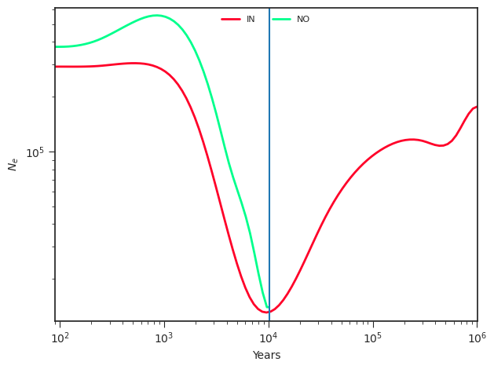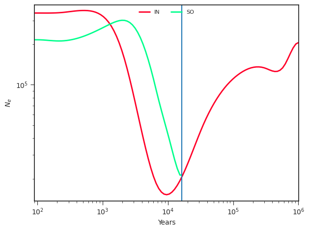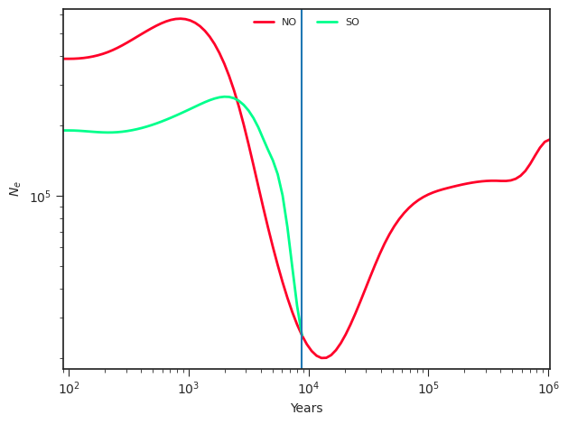

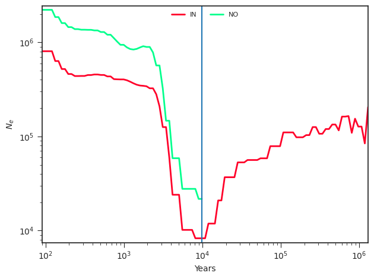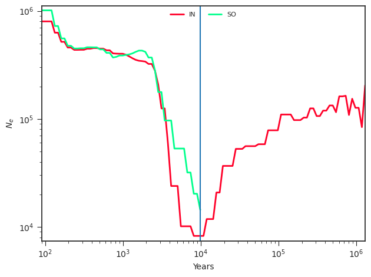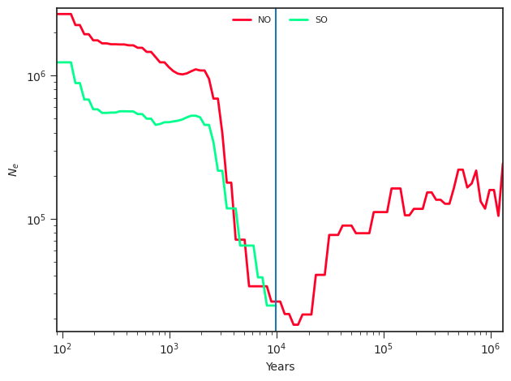
**Figure 3: Three figures above show the joint demography between any
two populations (IN: Inshore, NO: North Offshore, SO: South Offshore)
and the estimated splitting time (blue vertical line)**

<!--
## 3. MSMC analysis

We also used MSMC to infer the demographic history in which we restricted this analysis to high coverage (~20X) samples and used the maximum number of haplotypes (eight haplotypes) per population. To obtain more accurate phase information, all samples were used in initial variant calling using `bcftools` and conducting read aware phasing using `SHAPEIT2`.

```bash
bcftools mpileup -q 30 -Q 30 -C 50 -Oz -r $scaffold -f $reference.fa $(cat bamfile.txt | tr '\n' ' ') | \
bcftools call -c -V indels | bcftools view -M 2 -Oz > all.${scaffold}.vcf.gz

extractPIRs --bam ${scaffold}.bamlist --vcf all.${scaffold}.vcf.gz \
  --out ${scaffold}.PIRsList --base-quality 20 --read-quality 20

shapeit -assemble --input-vcf all.${scaffold}.vcf.gz --input-pir ${scaffold}.PIRsList -O $scaffold

shapeit -convert --input-haps $scaffold --output-vcf ${scaffold}.phased.vcf.gz

bcftools merge --force-samples all.${scaffold}.vcf.gz ${scaffold}.phased.vcf.gz |
awk 'BEGIN {{OFS="\t"}}
        $0 ~/^##/ {{print $0}}
$0 ~/^#CHROM/ {{for(i=1;i<84;i++) printf "%s"OFS, $i; print $84}}
$0 !~/^#/ {{ for(x=10;x<=84;x++) $x=$(x+75); for(j=1;j<84;j++) printf "%s"OFS, $j; print $84 }}' | \
bcftools view -Oz > final.${scaffold}.vcf.gz
```

For every sample, bamCaller.py was used to generate VCF file and mask file in bed format. `generate_multihetsep.py` was used to generate multihetsep files for every scaffold using all samples. A mappability mask file of the Acropora digitifera reference genome was generated following Heng Li’s [SNPable](http://lh3lh3.users.sourceforge.net/snpable.shtml).


```bash
$mean_cov=$(samtools depth -r $scaffold ${sample}.bam|awk '{sum += $3} END {print sum/NR}')

bcftools view -s $sample final.${scaffold}.vcf.gz |\
bamCaller.py $mean_cov ${sample}_${scaffold}_mask.bed.gz |gzip -c > ${sample}_${scaffold}.vcf.gz

generate_multihetsep.py --chr $scaffold --mask ${sample}_${scaffold}_mask.bed.gz \ 
--mask mappability/Adigi_${scaffold}.mask.bed.gz ${sample}_${scaffold}.vcf.gz > multihetsep_${scaffold}.txt
```

MSMC2 was firstly ran for haplotypes from each population separately and then calculated the cross-coalescence rate for each pair of two populations.To conduct bootstrap estimation, script multihetsep_bootstrap.py from msmc-tools was used to generate 100 sets of fragmented and resampled scaffolds by taking 20 random chunks per scaffold of size 500kb and assembling them into 20 “chromosomes”. Next, we conducted 100 bootstrap estimates for each population with 100 bootstrap data sets using the same options as before.


```bash
msmc2 -t 12 -s -I 0,1,2,3,4,5,6,7 -o inshore_8hap multihetsep_*.txt
msmc2 -t 12 -s -I 8,9,10,11,12,13,14,15 -o northoffshore_8hap multihetsep_*.txt
msmc2 -t 12 -s -I 16,17,18,19,20,21,22,23 -o southoffshore_8hap multihetsep_*.txt

multihetsep_bootstrap.py -n 100 -s 500000 —chunks_per_chromosome 20 \
 -nr_chromosomes 20 bootstrap *.multihetsep_*.txt

msmc2 -t 12 -s -I 0,1,2,3,4,5,6,7 -o bootstrap_results/inshore bootstrap_${n}/*.txt
msmc2 -t 12 -s -I 8,9,10,11,12,13,14,15 -o bootstrap_results/northoffshore bootstrap_${n}/*.txt
msmc2 -t 12 -s -I 16,17,18,19,20,21,22,23 -o bootstrap_results/southoffshore bootstrap_${n}/*.txt
```


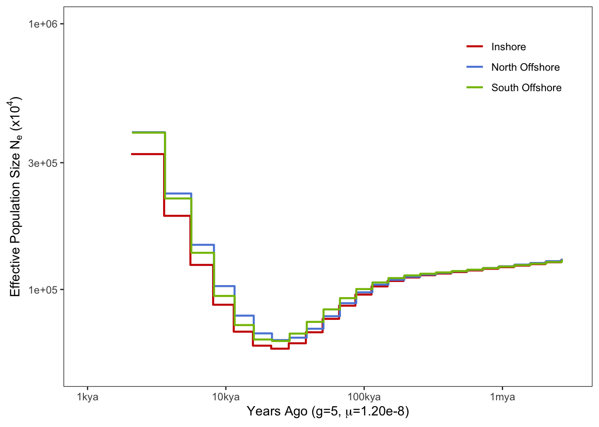

**Figure 4: Demographic history inferred by MSMC**

-->

## Add climate data in plot

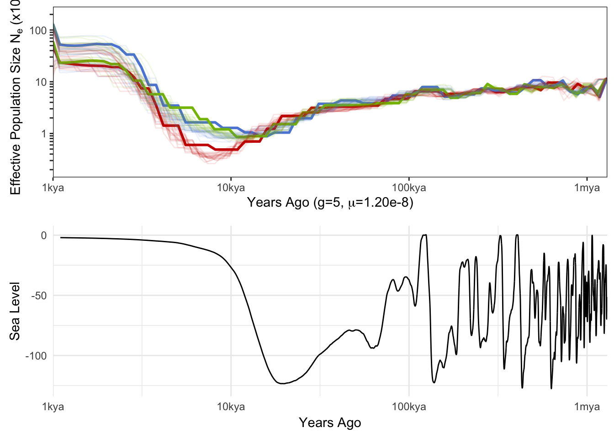

## Evaluating the uncertainty in mutation rate and generation time.

In SMC++, we re-ran the estimate using three mutation rates/generation
time (3, 5, and 7 years) and also the splitting time.

  - 1.2e-8 calculated in this study.
  - 1.86e-8 from Ira Cooke et al 2020
  - 2.89e-8 from Mat et al 2018

**The variance in bottleneck time**

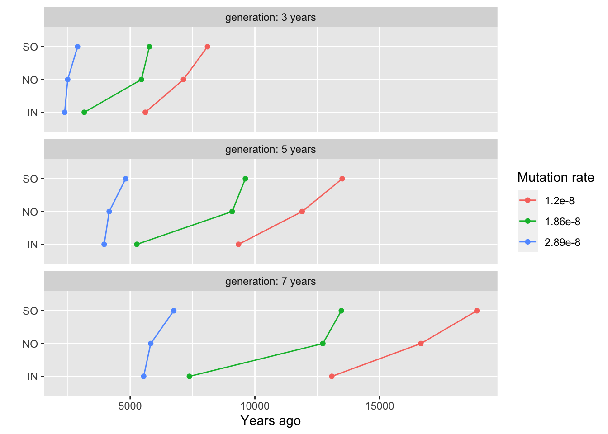

**The variance in splitting time**

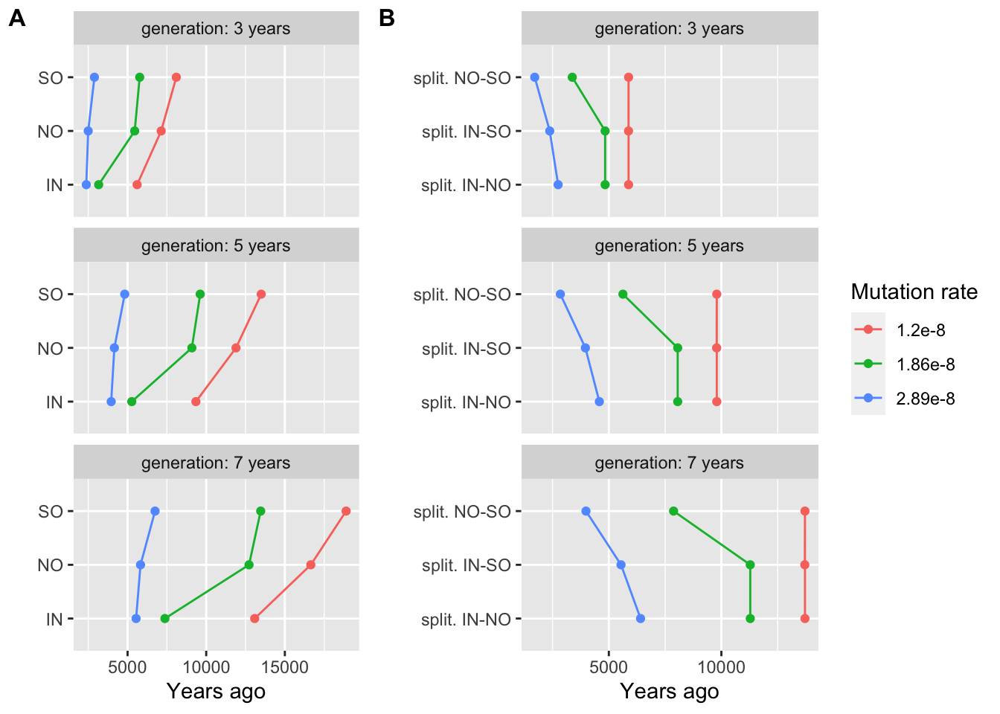

## Reference

<div id="refs" class="references">

<div id="ref-Mao2018">

Mao, Yafei, Evan P Economo, and Noriyuki Satoh. 2018. “The Roles of
Introgression and Climate Change in the Rise to Dominance of Acropora
Corals.” *Current Biology* 28 (21): 3373–3382.e5.
<https://doi.org/10.1016/j.cub.2018.08.061>.

</div>

<div id="ref-Shinzato2020">

Shinzato, Chuya, Konstantin Khalturin, Jun Inoue, Yuna Zayasu, Miyuki
Kanda, Mayumi Kawamitsu, Yuki Yoshioka, Hiroshi Yamashita, Go Suzuki,
and Noriyuki Satoh. 2020. “Eighteen Coral Genomes Reveal the
Evolutionary Origin of Acropora Strategies to Accommodate Environmental
Changes.” *Molecular Biology and Evolution* 38 (1): 16–30.
<https://doi.org/10.1093/molbev/msaa216>.

</div>

</div>
