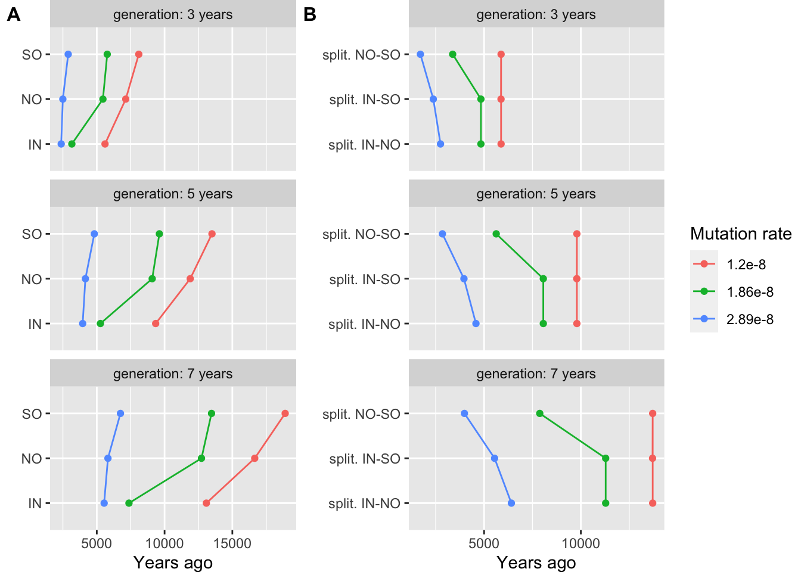

Demographic history - Sequentially Markov Cross-coalescence analysis
================

-   [SNP data for Sequentially Markovian Coalescent (SMC)
    analyses](#snp-data-for-sequentially-markovian-coalescent-smc-analyses)
-   [0. Mutation rate estimate](#0-mutation-rate-estimate)
-   [1. PSMC analysis](#1-psmc-analysis)
-   [2. SMC++ analysis](#2-smc-analysis)
    -   [2.1 Demographic history of three
        reefs](#21-demographic-history-of-three-reefs)
    -   [2.2 Divergence time among
        populations](#22-divergence-time-among-populations)
-   [Add climate data in plot](#add-climate-data-in-plot)
-   [Evaluating the uncertainty in mutation rate and generation
    time.](#evaluating-the-uncertainty-in-mutation-rate-and-generation-time)
-   [Reference](#reference)

## SNP data for Sequentially Markovian Coalescent (SMC) analyses

We only used variants from scaffold with a length greater than 1Mbp in
which account for approximately 75% of genome size (N75=983,972, first
142 scaffolds). Additionally, different methods have different
limitations in number of samples, we used:

-   Three individuals from each location in **PSMC analysis**.
-   All samples (unphased, 74 indvs) except the mislabeled sample from
    each location in **SMC++**.

<!-- - Eight haplotypes (4 samples) from each reef in **MSMC**. -->

## 0. Mutation rate estimate

The per generation mutation rate of *A.digitifera* estimated based on a
divergence time of 15.5 Millions years is 2.89e-8 in (Mao, Economo, and
Satoh 2018). However, the recent updated Acropora coral divergence time
in (Shinzato et al. 2020) is 25-50 million years which gave us a smaller
per generation mutation rate of 1.2e-8 based on previous calculation and
we thus used the calibrated mutation rate in our analyses.

``` bash
#(79427941/(79427942+363368171)/(2 × 15.5)) x 5 × 10−6 = 2.89 × 10−8
#calibrate divergence time to 37.5
(79427941/(79427942+363368171)/(2 × 37.5)) x 5 × 10−6 = 1.20 x 10-8
```

## 1. PSMC analysis

We first used bcftools mpileup and call functions to get sample-specific
SNP data sets, in which we removed sites with mean map and base quality
&lt; 30. Then appied psmc to each sample with 64 atomic time (-p
4+25\*2+4+6).

``` bash
bcftools mpileup -Q 30 -q 30 -C 50 -f {reference}.fa -r {chr} {sample}.bam | \
 bcftools call -c | \
 vcfutils.pl vcf2fq -d 10 -D 80 -Q 30 > {sample}_{chr}.fq
 
cat {sample}_*.fq > {sample}_consensus.fq

#fq2psmcfa
fq2psmcfa {sample}_consensus.fq > {sample}.psmcfa

## run psmc
psmc -p 4+25*2+4+6 -o {sample}.psmc {sample}.psmcfa
```

To perform bootstrapping, we run splitfa to split long scaffold to
shorter segments and applied psmc with `-b` option to allow it randomly
sample with replacement from these segments for 100 times.

``` bash
splitfa {sample}.psmcfa > split.{sample}.psmcfa
psmc -b -p 4+25*2+4+6 -o bootstrap/round-{n}.psmc split.{sample}.psmc.fa  # n=1:100
cat bootstrap/round-*.psmc > {sample}_bs_combined.psmc
```

 **Figure1: The
demographic history inferred by PSMC for inshore, north offshore, and
south offshore**

## 2. SMC++ analysis

Firstly, a single VCF file for each scaffold was extracted and indexed.

``` bash
bcftools view -r {chr} -Oz -o {chr}.vcf.gz Adigi.v2.filtered.74.vcf.gz 
tabix {chr}.vcf.gz
```

To distinguish invariant positions with missing data, we mask genome
regions where: a) with low or super high coverage across all samples
(less than three reads covered or greater than 3000); b) We generated
the genome mask files created using Heng Li’s SNPable tools and
extracted the ambiguous positions (c==“0” or c==“1”).

``` bash
samtools depth -r {chr} -aa -f bamfiles.txt | \
awk '{sum=0; for(i=3; i<=NF; i++) {sum+=$i}; print $1"\t"$2"\t"sum }' | \
awk '{if($3<3 || $3>3000) print $1"\t"$2"\t"$2}' | \
bedtools merge -i stdin | bgzip > {chr}.low_masked.bed.gz

zcat {chr}.low_masked.bed.gz Adigi_{chr}.mask.bed.gz | bedtools sort | bedtools merge |bgzip > {chr}.masked.bed.gz
```

Mask files of all scaffolds were concatenated together and we keep
blocks with a length greater than 2Kb. Next, vcf files were converted
into a SMC format file using `vcf2smc` in which we send in a vcf file of
one scaffold and specify a list samples in the population. All smc+
input files were used together in a single run by varying the choice of
distinguished individuals(8 from each pop) and resulting in a composite
likelihood estimate.

``` bash
smc++ vcf2smc -d {sample} {sample} \
  --mask all.masked.bed.gz {chr}.vcf.gz {chr}_{sample}.smc.gz {chr} \
  POP:$(cat {sample}.txt | paste -s -d ',')
```

smc++ `estimate` command was ran to estimate population history for each
population.

``` bash
## cubic spine version
smc++ estimate --cores 30 -o estimate --base {pop} --spline cubic \
 --timepoints 20 200000 --em-iterations 50 --thinning 3000 --knots 10 1.2e-8 {pop}.*.smc.gz
 
## piecewise(default) spine version
smc++ estimate --cores 30 -o estimate --base {pop} \
        --em-iterations 50 --timepoints 20 200000 --thinning 3000 \
        --knots 40 1.2e-8 {pop}.*.smc.gz
```

Eventually, we chose the piecewise spline for better resemble to PSMC
plot and more details. However, the result file are available for
plotting
([csv](data/hpc/demography/estimate_em50_cubic_k10/em50_cubic_k10.csv),[cubic
spline
plot](data/hpc/demography/estimate_em50_cubic_k10/em50_cubic_k10.png)).

### 2.1 Demographic history of three reefs


**Figure 2: The effective population size estimate using SMC++ approach.
The red, blue, and green lines represent the results of inshore,
offshore north, and offshore south respectively.**

To do bootstrapping, we performed 20(due to computational constraint)
bootstrap estimates in SMC++ with fragmented and re-sampled scaffolds
(generate by script [bootstrap\_smcpp.py](scripts/bootstrap_smcpp.py)).
SMC++ `estimate` was ran with these data sets with the same parameters
as before.

### 2.2 Divergence time among populations

The smc++ can estimate joint demography and speculate the splitting time
between pair of populations. To do this, we first create a joint
frequency spectrum for every pair of populations using `vcf2smc`.

``` bash
smc++ vcf2smc {chr}.vcf.gz {pop1}_{pop2}.smc.gz {chr} POP1:{sampleid},..  POP2:{sampleid},..
```

Next,we ran smc++ `split` with same parameters we used in `estimate`.

``` bash
smc++ split -o split --base {pop1}_{pop2} \
--timepoints 20 200000 --em-iterations 50 --thinning 3000 \
{pop1}.final.json {pop2}.final.json {pop1}_{pop2}.smc.gz
```

Eventually, we made the pairwise plot using `smc plot` tool with a five
year generation time.


**Figure 3: Three figures above show the joint demography between any
two populations (IN: Inshore, NO: North Offshore, SO: South Offshore)
and the estimated splitting time (blue vertical line)**

## Add climate data in plot


## Evaluating the uncertainty in mutation rate and generation time.

In SMC++, we re-ran the estimate using three mutation rates/generation
time (3, 5, and 7 years) and also the splitting time.

-   1.2e-8 calculated in this study.
-   1.86e-8 from Ira Cooke et al 2020
-   2.89e-8 from Mat et al 2018

**The variance in bottleneck time**

**The variance in splitting time**



## Reference

<div id="refs" class="references csl-bib-body hanging-indent">

<div id="ref-Mao2018" class="csl-entry">

Mao, Yafei, Evan P Economo, and Noriyuki Satoh. 2018. “<span
class="nocase">The Roles of Introgression and Climate Change in the Rise
to Dominance of Acropora Corals</span>.” *Current Biology* 28 (21):
3373–3382.e5. <https://doi.org/10.1016/j.cub.2018.08.061>.

</div>

<div id="ref-Shinzato2020" class="csl-entry">

Shinzato, Chuya, Konstantin Khalturin, Jun Inoue, Yuna Zayasu, Miyuki
Kanda, Mayumi Kawamitsu, Yuki Yoshioka, Hiroshi Yamashita, Go Suzuki,
and Noriyuki Satoh. 2020. “<span class="nocase">Eighteen Coral Genomes
Reveal the Evolutionary Origin of Acropora Strategies to Accommodate
Environmental Changes</span>.” *Molecular Biology and Evolution* 38 (1):
16–30. <https://doi.org/10.1093/molbev/msaa216>.

</div>

</div>
