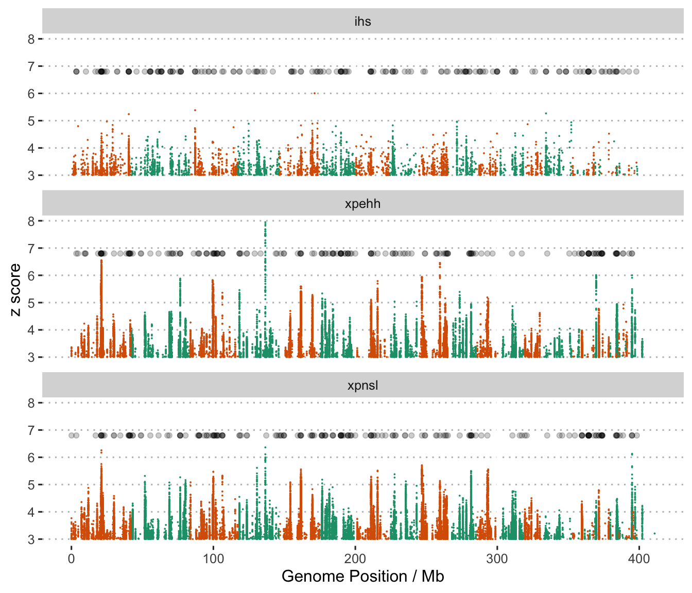

Selective sweep detection based on extended haplotype homozygosity
================

We applied extended haplotype homozygosity (EHH) based methods to detect
genomic regions under recent positive selection. The tool
[selscan](https://github.com/szpiech/selscan) was used to scan for such
regions by calculating three EHH-based statistics, iHS, XP-EHH, and
XP-nSL. While iHS is calculated for each population individually the XP
(cross population) type statistics both consider pairs of populations.

Since there is no recombination or linkage map available for *A.
digitifera* we used use physical distance instead of genetic distance in
all scans. The phased vcf file produced by SHAPEIT was used in all
selscan runs, and scans were performed on scaffolds with more than 10
phased SNPs (464 scaffolds). Several subsets of this file were created
in order to facilitate scans within and between various combinations of
populations. All such subsetting was performed using bcftools version
1.9 as follows.

``` bash
bcftools view -S {pop} -r {chr} Adigi.v2.indv74_phased.vcf.gz | bgzip > {pop}.{chr}.vcf.gz
```

## Running `selscan` and `norm`

We calculated `iHS` scores for each population separately using selscan
1.3 as follows;

``` bash
selscan --ihs --vcf {pop}.{chr}.vcf.gz --pmap --threads 10 --out ihs_out/{pop}/{chr}
```

XP-EHH and XP-nSL scans were conducted in a way that allowed each
population to act as a focal population `{pop}` with the remaining two
populations as a combined reference `{ref}`. Commands used to perform
these calculations were as follows;

``` bash
selscan --xpehh --vcf {pop}.{chr}.vcf.gz \
  --vcf-ref {ref}.{chr}.vcf.gz --pmap \
  --threads 10 --out xpehh_out/{chr}
```

``` bash
selscan --xpnsl --vcf {pop}.{chr}.vcf.gz \
  --vcf-ref {ref}.{chr}.vcf.gz \
  --threads 10 --out xpnsl_out/{chr}
```

These calculations produce files with the extension `.out` containing
raw iHS, XP-EHH or XP-nSL values. They are then normalized using the
program `norm`. This performs a z-transformation across the genome for
XP-EHH/XP-nSL scores and within each allele frequency bin for iHS
scores. The resulting value in all cases is a z-score. It represents the
number of standard deviations from the mean (in frequency bins for iHS).

To perform this normalisation the program, `norm` distributed with
`selscan` was invoked as follows.

``` bash
norm --ihs --files ihs_out/*.out --bins 50 --bp-win --min-snps 10 --winsize 50000
norm --xpehh --files xpehh_out/*.out --bp-win --min-snps 10 --winsize 50000
norm --xpnsl --files xpnsl_out/*.out --bp-win --min-snps 10 --winsize 50000
```

The outputs from `norm` are provided in two types of files. One set of
files has extension `.norm`. These are normalised values for each
variant position. Also provided are files with extension `.windows`
which summarise the normalised statistics in non-overlapping windows of
50kbp.

## Visualisation of scores genome-wide

Scores for all EHH based scans can be visualized across the genome using
the [pseudo-chromosome level coordinates](x30.ragtag_scaffolding.md).
Translation to these coordinates was performed as follows;

``` bash
python translate_coords.py {pop}.ihs.50bins.norm ragtag.scaffolds.agp > {pop}.ihs.50bins.norm.ragtag.txt 
```

##### Genome wide distribution of iHS scores

Since iHS is calculated for each population separately it is possible to
directly compare scores between populations. The Manhattan plots below
show several strong peaks in `iHS` distributed widely across the genome.
Most of the strongest peaks in terms of maximum iHS values also seem to
correspond with 50kb windows containing a high proportion of extreme iHS
values. The strongest peaks appear to be both strong and wide, showing
as dark or black dots due to overplotting of several extreme windows in
the same region.


**Figure 1:** Manhattan plot of standardised \|iHS\| across the genome
in three populations. Semi-transparent black points show the locations
of the top 1% of 50kb windows based on the proportion of extreme \|iHS\|
values within the window. Regions with many closely spaced extreme
windows will appear darker

## Genome-wide distribution of XP-EHH and XP-nSL statistics

Although the iHS statistic is sensitive to recent positive selection
while accounting for local variation in recombination rate it loses
power for sweeps that have resulted in fixation or near fixation of the
selected allele. XP-EHH and XP-nSL statistics address this issue by
comparing haplotypes in one population with those in a related
population. Our three *Acropora digitifera* populations in WA are ideal
for this because they diverged only recently and have similar
demographic histories.

The following plots consider each focal population separately. Due to
large number of loci, we only plot the loci with score &gt; 2. Note that
only positive scores are considered because we used combined haplotypes
from both remaining populations as the reference. Positive scores in the
XP\* statistics will correspond to selection in the focal population
only.

First we examine the inshore population, plotting all available EHH
statistics. This seems to show considerable concordance between peaks in
XP-EHH and XP-nSL but slightly less with iHS.


**Figure 2:** Manhattan plot of EHH based statistics (XP-EHH, XP-nSL,
iHS) where the focal population is inshore.

The North Offshore population also has several very strong peaks but
these appear to be mostly in different loci to inshore.



**Figure 3:** Manhattan plot of EHH based statistics (XP-EHH, XP-nSL,
iHS) where the focal population is north offshore

For the South Offshore population we also see many strong sweeps
including two very strong signals from the iHS statistic.


**Figure 4:** Manhattan plot of EHH based statistics (XP-EHH, XP-nSL,
iHS) where the focal population is south offshore
