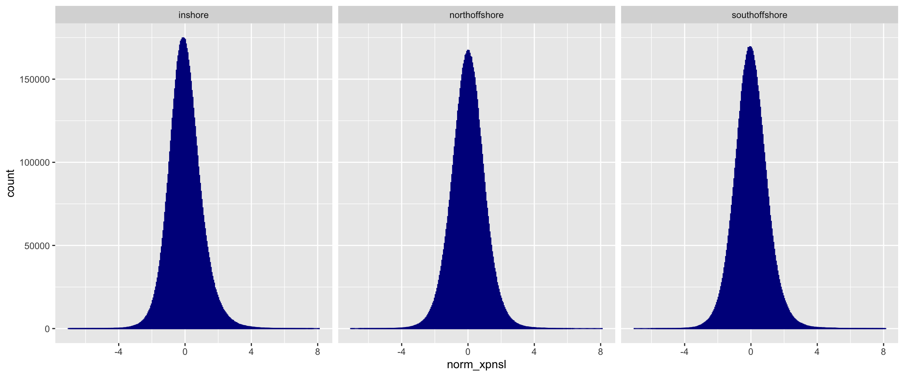

Identify outlying regions in selection analysis
================

### Windowed iHS test

We applied the selective scans for all three populations separately and
investigated the [genome-wide distribution of per site
scores](08.ehh_stats.md). To reduce the false positive rate, we
calculated the fraction of SNPs in each non-overlapping 50kb window that
has outlying iHS scores(\|iHS\|&gt;2) as (Voight 2006a) and selscan
suggested. In addition, we used `--min-snps=10` to exclude windows with
less than 10 SNPs. The regions with high proportion (1st percentile) of
extreme iHS scores were picked as candidate selective regions. note
that, while picked windows with high proportion of extreme iHS scores,
the number of SNPs in each window was also took into consideration to
avoid bias towards windows with less SNPs. The windows been picked as
candidate of iHS scan were shown in red points in three population:

**Figure: Plots display the number of site in window and the proportion
of extreme iHS scores in window. The red dots depict the windows as the
1st percentile with SNP density in each window been controlled**

\# Threshold for each bin in inshore

| Bin boundary | Number of windows in this bin | 1st percentile threshold |
|--------------|:-----------------------------:|-------------------------:|
| \[10-66\]    |              569              |                 0.557778 |
| (66-148\]    |              565              |                 0.610089 |
| (148-243\]   |              558              |                 0.369494 |
| (243-345\]   |              561              |                  0.45035 |
| (345-433\]   |              563              |                 0.390665 |
| (433-515\]   |              564              |                 0.332247 |
| (515-587\]   |              559              |                 0.396992 |
| (587-660\]   |              562              |                 0.352843 |
| (660-763\]   |              566              |                 0.343013 |
| (763-1870\]  |              555              |                 0.328067 |

\# Threshold for each bin in northoffshore

| Bin boundary | Number of windows in this bin | 1st percentile threshold |
|-------------:|:-----------------------------:|:------------------------:|
|    \[10-62\] |              577              |         0.315789         |
|    (62-132\] |              572              |         0.384005         |
|   (132-218\] |              574              |         0.410328         |
|   (218-304\] |              570              |         0.287487         |
|   (304-378\] |              571              |         0.362154         |
|   (378-444\] |              576              |         0.271412         |
|   (444-507\] |              573              |         0.257785         |
|   (507-573\] |              571              |         0.335927         |
|   (573-657\] |              578              |         0.358238         |
|  (657-1519\] |              566              |         0.290571         |

\# Threshold for each bin in southoffshore

| Bin boundary | Number of windows in this bin | 1st percentile threshold |
|--------------|:-----------------------------:|-------------------------:|
| \[10-62\]    |              577              |                 0.375811 |
| (62-137\]    |              576              |                 0.396966 |
| (137-231\]   |              572              |                 0.392147 |
| (231-324\]   |              574              |                 0.379755 |
| (324-405\]   |              567              |                 0.299749 |
| (405-478\]   |              584              |                 0.238272 |
| (478-546\]   |              568              |                 0.361146 |
| (546-613\]   |              568              |                 0.466281 |
| (613-706\]   |              572              |                 0.344451 |
| (706-1624\]  |              574              |                 0.233307 |

Next, genes that are overlapped with these windows are extracted so we
can investigate their potential function.

### XP-EHH and XP-nSL methods

We used XP-EHH and XP-nSL to detect nearly fixed or already fixed
selection in populations, XP-EHH and XP-nSL are analogous to each other
while XP-nSL has more power to detect soft sweep where the selection
happened at loci with medium allele frequency(Voight 2006b). Both test
scores are directional and usually you use one population A as a focal
population and use another population B as a reference population. So
high and positive values indicate the selective sweep in population A.
Meanwhile, the vertical mirror of the manhattan plot reflects the
selective sweep in population B. The scores were also normalised such
that the set of all such scores has zero mean and unit variance although
in general, there was a small skew towards one population and we neglect
this asymmetry when calculating significant scores.

To associate the regions with adaptive selection, again, we used `norm`
with flag `--xpehh` and `--xpnsl` for XP-EHH and XP-nSL, respectively to
compute both the maximum test score and the fraction of extreme scores
in every 50kb windows with more than 10 SNPs.

Voight, Sridhar AND Wen, Benjamin F AND Kudaravalli. 2006a. “A Map of
Recent Positive Selection in the Human Genome.” *PLOS Biology* 4 (3):
null. <https://doi.org/10.1371/journal.pbio.0040072>.

———. 2006b. “A Map of Recent Positive Selection in the Human Genome.”
*PLOS Biology* 4 (3): null.
<https://doi.org/10.1371/journal.pbio.0040072>.

