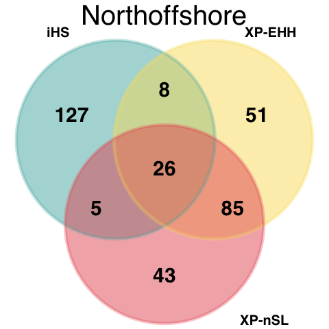

Gene Ontology analysis
================

-   [GO enrichment in inshore
    population](#go-enrichment-in-inshore-population)
-   [GO enrichment in north offshore
    population](#go-enrichment-in-north-offshore-population)
-   [GO enrichment in south offshore
    population](#go-enrichment-in-south-offshore-population)

Genes located in the candidate regions were extracted. We identified
425, 372, and 355 in inshore, north offshore, and south offshore
population respectively.

**Figure 1: Three strategies used to identify a list of genes related to
local adaptation in three populations. The iHS (blue) has more unique
selection candidate sets. The XP-EHH (light yellow) and XP-nSL (red)
selection candidate sets shared more gene sets since they both are able
to detect selective sweep that are fixed or nearly fixed.**

We then applied GO enrichment to these gene sets.

### GO enrichment in inshore population

| GO.ID        | Term                                      | Annotated | Significant | Expected | Rank in WeightFisher |  classic | WeightFisher | ontology | uniprot\_id                                                                                                                    |
|:-------------|:------------------------------------------|----------:|------------:|---------:|---------------------:|---------:|-------------:|:---------|:-------------------------------------------------------------------------------------------------------------------------------|
| <GO:0007168> | receptor guanylyl cyclase signaling path… |        10 |           5 |     0.20 |                    1 | 7.00e-07 |     7.00e-07 | BP       | P16065; Q6VVW5; P18293; Q7JQ32; P16065                                                                                         |
| <GO:0006182> | cGMP biosynthetic process                 |        12 |           5 |     0.24 |                    2 | 2.00e-06 |     2.00e-06 | BP       | P16065; Q6VVW5; P18293; Q7JQ32; P16065                                                                                         |
| <GO:0019556> | histidine catabolic process to glutamate… |         5 |           3 |     0.10 |                    3 | 7.40e-05 |     7.40e-05 | BP       | Q8VC12; A7YWP4; A7YWP4                                                                                                         |
| <GO:0019557> | histidine catabolic process to glutamate… |         5 |           3 |     0.10 |                    4 | 7.40e-05 |     7.40e-05 | BP       | Q8VC12; A7YWP4; A7YWP4                                                                                                         |
| <GO:0009408> | response to heat                          |        99 |          11 |     1.95 |                    5 | 9.60e-05 |     9.60e-05 | BP       | Q9JHH6; Q5NVI9; Q5XXA6; Q5XXA6; Q5TJE1; Q6RI86; Q7Z020; P06582; P06582; P06582; P06582                                         |
| <GO:0099532> | synaptic vesicle endosomal processing     |         7 |           3 |     0.14 |                    6 | 2.50e-04 |     2.50e-04 | BP       | Q9Z0R4; Q9Z0R6; Q9JKK1                                                                                                         |
| <GO:0042744> | hydrogen peroxide catabolic process       |        34 |           5 |     0.67 |                    7 | 5.00e-04 |     5.00e-04 | BP       | Q3UQ28; A4IGL7; Q9VEG6; Q92626; A4IGL7                                                                                         |
| <GO:0031581> | hemidesmosome assembly                    |         9 |           3 |     0.18 |                    8 | 5.80e-04 |     5.80e-04 | BP       | A6QPB3; A6QPB3; Q07563                                                                                                         |
| <GO:0061074> | regulation of neural retina development   |        10 |           3 |     0.20 |                    9 | 8.20e-04 |     8.20e-04 | BP       | Q566X8; Q566X8; Q566X8                                                                                                         |
| <GO:0043491> | protein kinase B signaling                |       101 |           5 |     1.99 |                   10 | 1.11e-03 |     1.11e-03 | BP       | Q9Z0R4; P07949; P17431; A2AKX3; P32114                                                                                         |
| <GO:0004383> | guanylate cyclase activity                |        15 |           5 |     0.29 |                    1 | 6.90e-06 |     6.90e-06 | MF       | P16065; Q6VVW5; P18293; Q7JQ32; P16065                                                                                         |
| <GO:0001653> | peptide receptor activity                 |       199 |           7 |     3.88 |                    2 | 2.90e-05 |     2.90e-05 | MF       | Q924H0; P16065; Q6VVW5; P18293; Q7JQ32; P16065; O08726                                                                         |
| <GO:0060090> | molecular adaptor activity                |       199 |           9 |     3.88 |                    3 | 1.30e-04 |     1.30e-04 | MF       | Q9Z0R4; Q9Z0R6; Q9ESK9; Q9EQJ9; Q9JKK1; Q5ZMH1; Q9WV92; P13942; B1H120                                                         |
| <GO:0005324> | long-chain fatty acid transporter activi… |         7 |           3 |     0.14 |                    4 | 2.40e-04 |     2.40e-04 | MF       | Q4R3Y4; Q4R3Y4; Q60714                                                                                                         |
| <GO:0020037> | heme binding                              |       162 |          10 |     3.16 |                    5 | 1.29e-03 |     1.29e-03 | MF       | Q3UQ28; Q4G0S4; Q66LN0; O73853; C8YR32; P51687; A4IGL7; Q9VEG6; Q92626; A4IGL7                                                 |
| <GO:0005229> | intracellular calcium activated chloride… |        13 |           3 |     0.25 |                    6 | 1.82e-03 |     1.82e-03 | MF       | Q75V66; Q5XXA6; Q5XXA6                                                                                                         |
| <GO:0047676> | arachidonate-CoA ligase activity          |        14 |           3 |     0.27 |                    7 | 2.28e-03 |     2.28e-03 | MF       | Q4R3Y4; Q4R3Y4; Q60714                                                                                                         |
| <GO:0000981> | DNA-binding transcription factor activit… |       414 |          16 |     8.08 |                    8 | 3.79e-03 |     3.79e-03 | MF       | Q02360; Q804Q5; Q90416; P42587; Q9IAK8; Q07120; P55878; Q32PP9; Q8R316; P32114; Q566X8; Q566X8; Q566X8; Q99697; Q9BZE3; Q98879 |
| <GO:0051082> | unfolded protein binding                  |        77 |           6 |     1.50 |                    9 | 3.88e-03 |     3.88e-03 | MF       | P19208; Q5NVI9; P06582; P06582; P06582; P06582                                                                                 |
| <GO:0015645> | fatty acid ligase activity                |        18 |           3 |     0.35 |                   10 | 5.37e-03 |     5.37e-03 | MF       | Q4R3Y4; Q4R3Y4; Q60714                                                                                                         |
| <GO:0030056> | hemidesmosome                             |         9 |           3 |     0.18 |                    1 | 6.00e-04 |     6.00e-04 | CC       | A6QPB3; A6QPB3; Q07563                                                                                                         |
| <GO:0030124> | AP-4 adaptor complex                      |         5 |           2 |     0.10 |                    2 | 3.80e-03 |     3.80e-03 | CC       | Q9Y6B7; O82201                                                                                                                 |
| <GO:0031105> | septin complex                            |         5 |           2 |     0.10 |                    3 | 3.80e-03 |     3.80e-03 | CC       | Q5ZMH1; B1H120                                                                                                                 |
| <GO:0005635> | nuclear envelope                          |       299 |           9 |     5.96 |                    4 | 6.40e-03 |     6.40e-03 | CC       | Q9Z0R4; Q6IQ20; Q6ZQH8; Q6V0K7; Q8WWZ8; Q29RU2; Q29RU2; Q07817; Q9ESK9                                                         |
| <GO:0033061> | DNA recombinase mediator complex          |         7 |           2 |     0.14 |                    5 | 7.80e-03 |     7.80e-03 | CC       | O15315; Q86XK3                                                                                                                 |

### GO enrichment in north offshore population

| GO.ID        | Term                                      | Annotated | Significant | Expected | Rank in WeightFisher |  classic | WeightFisher | ontology | uniprot\_id                                                                                                                                                                                                                            |
|:-------------|:------------------------------------------|----------:|------------:|---------:|---------------------:|---------:|-------------:|:---------|:---------------------------------------------------------------------------------------------------------------------------------------------------------------------------------------------------------------------------------------|
| <GO:0045542> | positive regulation of cholesterol biosy… |         6 |           4 |     0.11 |                    1 | 1.50e-06 |     1.50e-06 | BP       | Q7SIF8; Q6PBT8; Q7SIF8; P20002                                                                                                                                                                                                         |
| <GO:0060681> | branch elongation involved in ureteric b… |         7 |           4 |     0.13 |                    2 | 3.50e-06 |     3.50e-06 | BP       | Q7SIF8; Q6PBT8; Q7SIF8; P20002                                                                                                                                                                                                         |
| <GO:0050999> | regulation of nitric-oxide synthase acti… |        19 |           6 |     0.34 |                    3 | 5.50e-05 |     5.50e-05 | BP       | P20693; P20693; P16599; P34972; Q9QZN9; P34972                                                                                                                                                                                         |
| <GO:0045759> | negative regulation of action potential   |         5 |           3 |     0.09 |                    4 | 5.70e-05 |     5.70e-05 | BP       | P34972; Q9QZN9; P34972                                                                                                                                                                                                                 |
| <GO:0071763> | nuclear membrane organization             |         6 |           3 |     0.11 |                    5 | 1.10e-04 |     1.10e-04 | BP       | Q5PQX1; Q60HG2; Q60HG2                                                                                                                                                                                                                 |
| <GO:0032229> | negative regulation of synaptic transmis… |         7 |           3 |     0.13 |                    6 | 1.90e-04 |     1.90e-04 | BP       | P34972; Q9QZN9; P34972                                                                                                                                                                                                                 |
| <GO:0032769> | negative regulation of monooxygenase act… |         7 |           3 |     0.13 |                    7 | 1.90e-04 |     1.90e-04 | BP       | P34972; Q9QZN9; P34972                                                                                                                                                                                                                 |
| <GO:0001975> | response to amphetamine                   |        19 |           4 |     0.34 |                    8 | 3.20e-04 |     3.20e-04 | BP       | P11617; P34972; Q9QZN9; P34972                                                                                                                                                                                                         |
| <GO:0009750> | response to fructose                      |         9 |           3 |     0.16 |                    9 | 4.50e-04 |     4.50e-04 | BP       | Q8CIW6; Q02974; Q9R1S4                                                                                                                                                                                                                 |
| <GO:0033004> | negative regulation of mast cell activat… |         9 |           3 |     0.16 |                   10 | 4.50e-04 |     4.50e-04 | BP       | P34972; Q9QZN9; P34972                                                                                                                                                                                                                 |
| <GO:0044548> | S100 protein binding                      |        13 |           4 |     0.24 |                    1 | 6.80e-05 |     6.80e-05 | MF       | Q7SIF8; Q6PBT8; Q7SIF8; P20002                                                                                                                                                                                                         |
| <GO:0042054> | histone methyltransferase activity        |        49 |           7 |     0.89 |                    2 | 4.00e-04 |     4.00e-04 | MF       | Q5ZML9; Q3UZD5; A6QPM3; P0C6Y7; Q9NQX0; Q9NQX0; Q071E0                                                                                                                                                                                 |
| <GO:0005104> | fibroblast growth factor receptor bindin… |        21 |           4 |     0.38 |                    3 | 5.10e-04 |     5.10e-04 | MF       | Q7SIF8; Q6PBT8; Q7SIF8; P20002                                                                                                                                                                                                         |
| <GO:0008083> | growth factor activity                    |        52 |           5 |     0.95 |                    4 | 2.50e-03 |     2.50e-03 | MF       | Q7SIF8; P13497; Q6PBT8; Q7SIF8; P20002                                                                                                                                                                                                 |
| <GO:0102567> | phospholipase A2 activity (consuming 1,2… |        16 |           3 |     0.29 |                    5 | 2.82e-03 |     2.82e-03 | MF       | D2X8K2; P97819; Q3TTY0                                                                                                                                                                                                                 |
| <GO:0102568> | phospholipase A2 activity consuming 1,2-… |        16 |           3 |     0.29 |                    6 | 2.82e-03 |     2.82e-03 | MF       | D2X8K2; P97819; Q3TTY0                                                                                                                                                                                                                 |
| <GO:0005381> | iron ion transmembrane transporter activ… |         5 |           2 |     0.09 |                    7 | 3.20e-03 |     3.20e-03 | MF       | Q7T292; A0A0G2KQY6                                                                                                                                                                                                                     |
| <GO:0004623> | phospholipase A2 activity                 |        17 |           3 |     0.31 |                    8 | 3.38e-03 |     3.38e-03 | MF       | D2X8K2; P97819; Q3TTY0                                                                                                                                                                                                                 |
| <GO:0031628> | opioid receptor binding                   |        37 |           4 |     0.68 |                    9 | 4.45e-03 |     4.45e-03 | MF       | Q9Y5X5; Q9EQD2; Q924H0; Q9Y5X5                                                                                                                                                                                                         |
| <GO:0004322> | ferroxidase activity                      |         6 |           2 |     0.11 |                   10 | 4.74e-03 |     4.74e-03 | MF       | P42577; P42577                                                                                                                                                                                                                         |
| <GO:0005769> | early endosome                            |       308 |          12 |     5.29 |                    1 | 1.20e-03 |     1.20e-03 | CC       | P07949; P04274; P04274; Q8K4M5; O75581; P08582; O42574; G3V9H8; Q4PZA2; Q4PZA2; Q8BVF7; A0A0G2KQY6                                                                                                                                     |
| <GO:0005615> | extracellular space                       |      1050 |          29 |    18.04 |                    2 | 1.30e-03 |     1.30e-03 | CC       | O60293; Q24322; A2AJ76; P24821; P21399; Q5G872; A1E295; O54990; H9JW43; P97819; Q92752; P22105; P08582; O93429; O97490; Q08731; P28648; P35444; Q61361; Q96P44; P07911; P16599; Q7SIF8; P13497; Q6PBT8; Q7SIF8; P20002; P07686; Q64191 |
| <GO:0031234> | extrinsic component of cytoplasmic side … |        32 |           4 |     0.55 |                    3 | 2.10e-03 |     2.10e-03 | CC       | P43404; P34972; Q9QZN9; P34972                                                                                                                                                                                                         |
| <GO:0005788> | endoplasmic reticulum lumen               |       137 |           8 |     2.35 |                    4 | 2.50e-03 |     2.50e-03 | CC       | P24821; P24367; Q5NDL2; Q60HG2; Q60HG2; P08582; Q8VEH8; Q96P44                                                                                                                                                                         |
| <GO:0009897> | external side of plasma membrane          |       120 |           8 |     2.06 |                    5 | 4.90e-03 |     4.90e-03 | CC       | P14207; Q5G872; P20693; P20693; O15439; Q4PZA2; Q4PZA2; P16599                                                                                                                                                                         |
| <GO:0042406> | extrinsic component of endoplasmic retic… |         7 |           2 |     0.12 |                    6 | 5.80e-03 |     5.80e-03 | CC       | Q60HG2; Q60HG2                                                                                                                                                                                                                         |
| <GO:0070852> | cell body fiber                           |        24 |           3 |     0.41 |                    7 | 7.80e-03 |     7.80e-03 | CC       | Q9NZJ4; Q9NZJ4; Q9NZJ4                                                                                                                                                                                                                 |
| <GO:0033093> | Weibel-Palade body                        |         9 |           2 |     0.15 |                    8 | 9.80e-03 |     9.80e-03 | CC       | Q4PZA2; Q4PZA2                                                                                                                                                                                                                         |

### GO enrichment in south offshore population

| GO.ID        | Term                                      | Annotated | Significant | Expected | Rank in WeightFisher |  classic | WeightFisher | ontology | uniprot\_id                                                                                                                                                                                                                                                                                                                                                                                                                                                                                                                                                                                                                                                                                            |
|:-------------|:------------------------------------------|----------:|------------:|---------:|---------------------:|---------:|-------------:|:---------|:-------------------------------------------------------------------------------------------------------------------------------------------------------------------------------------------------------------------------------------------------------------------------------------------------------------------------------------------------------------------------------------------------------------------------------------------------------------------------------------------------------------------------------------------------------------------------------------------------------------------------------------------------------------------------------------------------------|
| <GO:0044038> | cell wall macromolecule biosynthetic pro… |        12 |           4 |     0.20 |                    1 | 4.80e-06 |     4.80e-06 | BP       | Q9SCN0; B5YFT1; Q2JJV2; Q31I42                                                                                                                                                                                                                                                                                                                                                                                                                                                                                                                                                                                                                                                                         |
| <GO:0048022> | negative regulation of melanin biosynthe… |        18 |           5 |     0.31 |                    2 | 9.60e-06 |     9.60e-06 | BP       | Q71RS6; P41221; Q6NUT3; Q6NUT3; Q3U481                                                                                                                                                                                                                                                                                                                                                                                                                                                                                                                                                                                                                                                                 |
| <GO:0003279> | cardiac septum development                |        96 |           6 |     1.63 |                    3 | 3.60e-05 |     3.60e-05 | BP       | O60462; Q9UKP5; Q9UKP5; Q9UKP5; Q9UKP5; P41221                                                                                                                                                                                                                                                                                                                                                                                                                                                                                                                                                                                                                                                         |
| <GO:0071555> | cell wall organization                    |        16 |           4 |     0.27 |                    4 | 2.50e-04 |     2.50e-04 | BP       | Q9SCN0; B5YFT1; Q2JJV2; Q31I42                                                                                                                                                                                                                                                                                                                                                                                                                                                                                                                                                                                                                                                                         |
| <GO:0009273> | peptidoglycan-based cell wall biogenesis  |         8 |           3 |     0.14 |                    5 | 2.50e-04 |     2.50e-04 | BP       | B5YFT1; Q2JJV2; Q31I42                                                                                                                                                                                                                                                                                                                                                                                                                                                                                                                                                                                                                                                                                 |
| <GO:0002329> | pre-B cell differentiation                |         8 |           3 |     0.14 |                    6 | 2.50e-04 |     2.50e-04 | BP       | Q8IWT6; Q4V8I7; Q8IWT6                                                                                                                                                                                                                                                                                                                                                                                                                                                                                                                                                                                                                                                                                 |
| <GO:0140361> | cyclic-GMP-AMP transmembrane import acro… |         9 |           3 |     0.15 |                    7 | 3.80e-04 |     3.80e-04 | BP       | Q8IWT6; Q4V8I7; Q8IWT6                                                                                                                                                                                                                                                                                                                                                                                                                                                                                                                                                                                                                                                                                 |
| <GO:0042297> | vocal learning                            |         9 |           3 |     0.15 |                    8 | 3.80e-04 |     3.80e-04 | BP       | Q9CS84; E9Q7X7; Q9P2S2                                                                                                                                                                                                                                                                                                                                                                                                                                                                                                                                                                                                                                                                                 |
| <GO:0097104> | postsynaptic membrane assembly            |        11 |           3 |     0.19 |                    9 | 7.20e-04 |     7.20e-04 | BP       | Q9CS84; E9Q7X7; Q9P2S2                                                                                                                                                                                                                                                                                                                                                                                                                                                                                                                                                                                                                                                                                 |
| <GO:0006811> | ion transport                             |      1047 |          23 |    17.79 |                   10 | 8.70e-04 |     8.70e-04 | BP       | Q8IWT6; Q4V8I7; Q8IWT6; Q3UHD6; Q9WTN5; O73606; Q9SDQ4; Q71RS6; Q9HC58; P08582; O93429; O97490; O93429; Q6AZN8; Q9JJ09; Q9JJ09; P27080; P54145; B9EJ86; Q6NUT3; Q6NUT3; Q3U481; Q9VCA2                                                                                                                                                                                                                                                                                                                                                                                                                                                                                                                 |
| <GO:0008273> | calcium, potassium:sodium antiporter act… |        10 |           4 |     0.17 |                    1 | 1.60e-05 |     1.60e-05 | MF       | Q71RS6; Q9HC58; Q49SH1; Q49SH1                                                                                                                                                                                                                                                                                                                                                                                                                                                                                                                                                                                                                                                                         |
| <GO:0016881> | acid-amino acid ligase activity           |        27 |           5 |     0.46 |                    2 | 8.40e-05 |     8.40e-05 | MF       | P48506; B5YFT1; Q2JJV2; Q31I42; Q9HAB8                                                                                                                                                                                                                                                                                                                                                                                                                                                                                                                                                                                                                                                                 |
| <GO:0004518> | nuclease activity                         |       355 |           9 |     6.09 |                    3 | 1.30e-04 |     1.30e-04 | MF       | B0BN95; Q2TB18; Q2TB18; Q2TB18; Q9M2U3; Q6ZQ08; Q9M2U3; Q5QJC4; Q8K3Z0                                                                                                                                                                                                                                                                                                                                                                                                                                                                                                                                                                                                                                 |
| <GO:0140360> | cyclic-GMP-AMP transmembrane transporter… |         7 |           3 |     0.12 |                    4 | 1.70e-04 |     1.70e-04 | MF       | Q8IWT6; Q4V8I7; Q8IWT6                                                                                                                                                                                                                                                                                                                                                                                                                                                                                                                                                                                                                                                                                 |
| <GO:0015293> | symporter activity                        |       136 |           9 |     2.33 |                    5 | 1.70e-04 |     1.70e-04 | MF       | Q71RS6; Q9HC58; Q49SH1; Q49SH1; Q9JJ09; Q9JJ09; Q6NUT3; Q6NUT3; Q3U481                                                                                                                                                                                                                                                                                                                                                                                                                                                                                                                                                                                                                                 |
| <GO:0008454> | alpha-1,3-mannosylglycoprotein 4-beta-N-… |         9 |           3 |     0.15 |                    6 | 3.90e-04 |     3.90e-04 | MF       | Q9UBM8; Q9UBM8; Q9UBM8                                                                                                                                                                                                                                                                                                                                                                                                                                                                                                                                                                                                                                                                                 |
| <GO:0005225> | volume-sensitive anion channel activity   |        12 |           3 |     0.21 |                    7 | 9.80e-04 |     9.80e-04 | MF       | Q8IWT6; Q4V8I7; Q8IWT6                                                                                                                                                                                                                                                                                                                                                                                                                                                                                                                                                                                                                                                                                 |
| <GO:0005246> | calcium channel regulator activity        |        15 |           3 |     0.26 |                    8 | 1.94e-03 |     1.94e-03 | MF       | Q9CS84; E9Q7X7; Q9P2S2                                                                                                                                                                                                                                                                                                                                                                                                                                                                                                                                                                                                                                                                                 |
| <GO:0033229> | cysteine transmembrane transporter activ… |        16 |           3 |     0.27 |                    9 | 2.36e-03 |     2.36e-03 | MF       | Q6NUT3; Q6NUT3; Q3U481                                                                                                                                                                                                                                                                                                                                                                                                                                                                                                                                                                                                                                                                                 |
| <GO:0004364> | glutathione transferase activity          |        18 |           3 |     0.31 |                   10 | 3.36e-03 |     3.36e-03 | MF       | P46436; Q0ZS46; P46428                                                                                                                                                                                                                                                                                                                                                                                                                                                                                                                                                                                                                                                                                 |
| <GO:0016021> | integral component of membrane            |      3667 |          85 |    62.72 |                    1 | 3.60e-04 |     3.60e-04 | CC       | P79218; Q9Y5X5; Q8IWT6; Q4V8I7; Q8IWT6; Q14703; D2IYS2; Q9WTN5; Q5RCB9; O60462; Q9UBM8; Q9UBM8; Q9UBM8; Q4VCS5; P79400; B2RPY5; Q2KHV4; Q9R0A0; O57422; O73606; Q91755; Q9SDQ4; Q19319; Q9SCN0; Q8TC41; Q9UBU6; Q9PUU6; F7E235; Q0GBZ5; O54799; Q7TN88; Q71RS6; Q9HC58; Q49SH1; Q49SH1; Q4V7Q8; Q5VVB8; Q9CS84; E9Q7X7; Q9P2S2; G3M4F8; G3M4F8; Q60803; P35409; Q9UGQ2; Q9HAR2; G8HTB6; Q54KF7; Q54KF7; Q9Z1G4; Q55E32; Q8IUH5; E9PTT0; Q6AZN8; Q0V8S9; Q0V8S9; Q0V8S9; Q9JJ09; Q9JJ09; Q5U3V7; P27080; P54145; B9EJ86; Q28193; Q6NUT3; Q6NUT3; Q3U481; O73792; Q3SZN3; P18841; O57579; Q9Y5X5; E7F7V7; Q96P65; C3ZQF9; O43184; Q5ZKJ5; Q6BEA0; Q9VCA2; Q6DFQ7; P19491; Q4KWL2; Q32LQ0; Q32LQ0; P34972 |
| <GO:1905103> | integral component of lysosomal membrane  |        17 |           3 |     0.29 |                    2 | 2.81e-03 |     2.81e-03 | CC       | Q8IWT6; Q4V8I7; Q8IWT6                                                                                                                                                                                                                                                                                                                                                                                                                                                                                                                                                                                                                                                                                 |
| <GO:0002116> | semaphorin receptor complex               |         6 |           2 |     0.10 |                    3 | 4.18e-03 |     4.18e-03 | CC       | O60462; Q6BEA0                                                                                                                                                                                                                                                                                                                                                                                                                                                                                                                                                                                                                                                                                         |
| <GO:0031012> | extracellular matrix                      |       489 |           9 |     8.36 |                    4 | 4.81e-03 |     4.81e-03 | CC       | P08572; Q9UKP5; Q8TE60; Q9UKP5; Q9UKP5; Q9UKP5; Q61361; P41221; P22105                                                                                                                                                                                                                                                                                                                                                                                                                                                                                                                                                                                                                                 |

Interestingly, we found the genes under selection in inshore were
enriched in response to heat `GO:0009408` (Figure 2). Within these six
unique annotated genes, two genes(`CBPB2_MOUSE`,`DNAJA1_PONAB`) were
identified as candidates in all three methods, two
genes(`DAXX_CANLF`,`HSP12_CAEEL`) were detected by cross population
tests, beside, two genes(`ANO1_HUMAN` and `TRPA1_RAT`) were detected as
under selection in XP-nSL.

| Unprot Entry Name |     Scaffold |   Start |     End | Fraction of \|iHS\|&gt;2 | Max XP-EHH | Max XP-nSL |
|------------------:|-------------:|--------:|--------:|-------------------------:|-----------:|-----------:|
|      CBPB2\_MOUSE | BLFC01000770 | 1200001 | 1250001 |                 0.393443 |     7.1799 |    7.69895 |
|      DNJA1\_PONAB | BLFC01000326 | 1550001 | 2150000 |                0.8854482 |    10.0019 |    6.20647 |
|       ANO1\_HUMAN | BLFC01000375 | 1200001 | 1250001 |                       \- |         \- |     4.5262 |
|       DAXX\_CANLF | BLFC01000185 |  900001 | 1050001 |                       \- |    7.54117 |    7.16109 |
|        TRPA1\_RAT | BLFC01000277 | 1200001 | 1250001 |                       \- |         \- |    4.93185 |
|      HSP12\_CAEEL | BLFC01000298 |  200001 |  300001 |                       \- |    6.28043 |    5.50613 |
