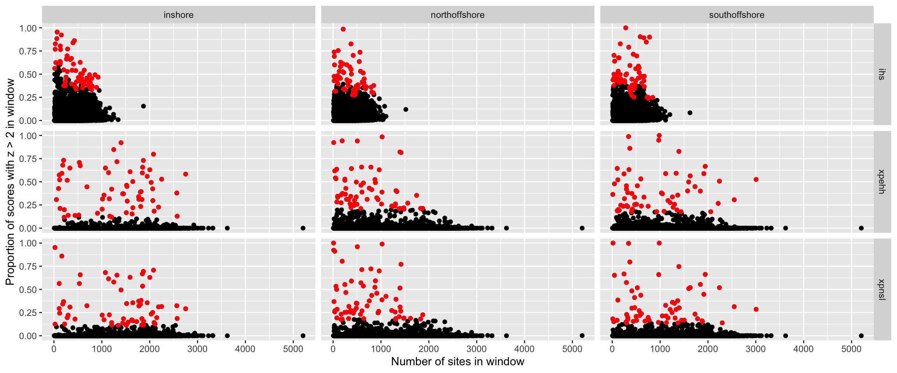

Identify outlying regions in selection analysis
================

## Windowed EHH tests

[Previously](08.ehh_stats.md), we calculated iHS, XP-EHH and XP-nSL
scores for all three populations and visualised their distribution
across the genome via Manhattan plots. Since selective sweeps should
have consistently outlying values of EHH statistics across a large
linked region we calculated the fraction of SNPs in each non-overlapping
50kb window that contained outlying, (\|z-score\|&gt;2) scores. This
follows the analysis of (Voight 2006) and was performed using the
program `norm` included with selscan. See
[08.ehh\_stats.md](08.ehh_stats.md) for details of the z-score
calculation.

Both the XP-EHH and XP-nSL statistics are designed to compare two
populations. We designed our contrasts so that for each comparison there
was always one focal population while the remaining two populations were
used as a reference. This was based on the reasoning that it was
unlikely a selective sweep would occur independently at the same locus
in two separate populations. In the selscan outputs populations are
coded as A or B. Our focal population was always “A” so that positive
value of the statistic is associated with selection in the focal
population.

Regions in the top 1st percentile of extreme scores were picked as
candidate selective regions. Note that, while we picked windows with a
high proportion of extreme scores, the number of SNPs in each window was
also taken into consideration to avoid bias towards windows with less
SNPs. This is illustrated in the QC plot below which shows a relatively
even spread of selected windows across regions with different snp
densities.



**Figure 1:** Plots display the number of sites in window and the
proportion of extreme scores in window. The red dots depict the windows
in the 1st percentile where SNP density in each window been controlled.

## Overlap of windows between populations

Our main interest in this study is in selective sweeps that occurred
after the split between populations. For this reason we excluded regions
where the iHS test was also significant at 1% level in the other two
populations. This step was not necessary for the XP-EHH and XP-nSL tests
because these work by comparing levels of EHH in the focal population
against the reference and will therefore identify sweeps that exist only
in the focal population by design.

After excluding shared iHS significant signals, less than 1% of genomic
regions were identified as candidates in three populations.

**Table 1:** The proportion of genome regions that are uniquely under
selective sweep in three populations

| Population     | Total length (Mb) of genomic regions | Number of Regions | Percentage of Total Genome (%) |
|:---------------|-------------------------------------:|------------------:|-------------------------------:|
| Inshore        |                             2.650040 |                40 |                      0.6370288 |
| North Offshore |                             2.250036 |                36 |                      0.5408740 |
| South Offshore |                             2.350036 |                36 |                      0.5649125 |

## Consolidated list of all selected regions

For each population we then created a list of all candidate regions
under selection by merging intervals that are adjacent, or separated by
no more than 100kb across all of the EHH statistics.

### Annotating candidate regions

To facilitate downstream analyses we annotated candidate regions by

-   Identifying overlapping genes
-   Information from `selscan` used to assess the region (fraction of
    extreme values, stats in which the region was in the 1st percentile)
-   Gene names from Uniprot

The complete list of these annotated candidate regions is available as a
supplementary table in the paper

These analyses rely on a BED formatted file with the genomic coordinates
of all genes.

``` bash
cat ../../genome/adig-v2-ncbi.gff | awk 'BEGIN{OFS="\t"}$3=="gene"{print $1,$4,$5,$9}' | sed 's/ID=//' | sort -u  > allgenes.bed
```

For the purposes of making a human viewable table in supp info we also
attach gene names from uniprot. The final table is provided as Supp
Table 5 in the paper

<div id="refs" class="references csl-bib-body hanging-indent">

<div id="ref-Voight2006" class="csl-entry">

Voight, Sridhar AND Wen, Benjamin F AND Kudaravalli. 2006. “A Map of
Recent Positive Selection in the Human Genome.” *PLOS Biology* 4 (3).

</div>

</div>
