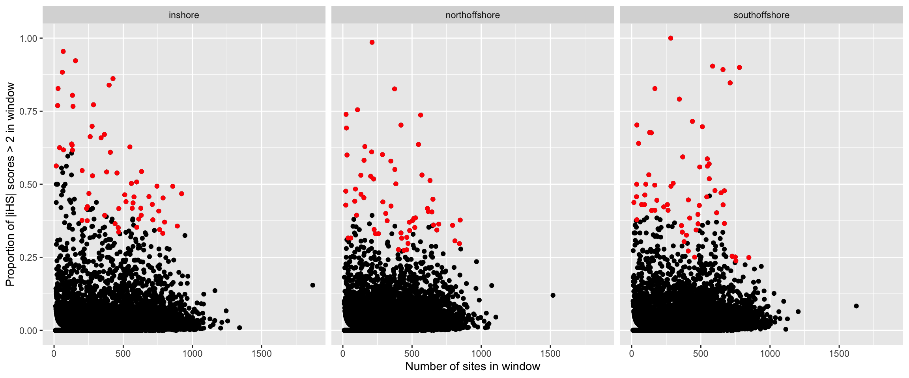
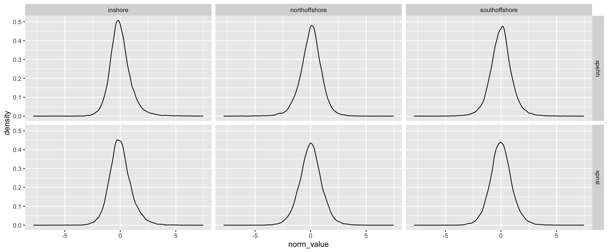
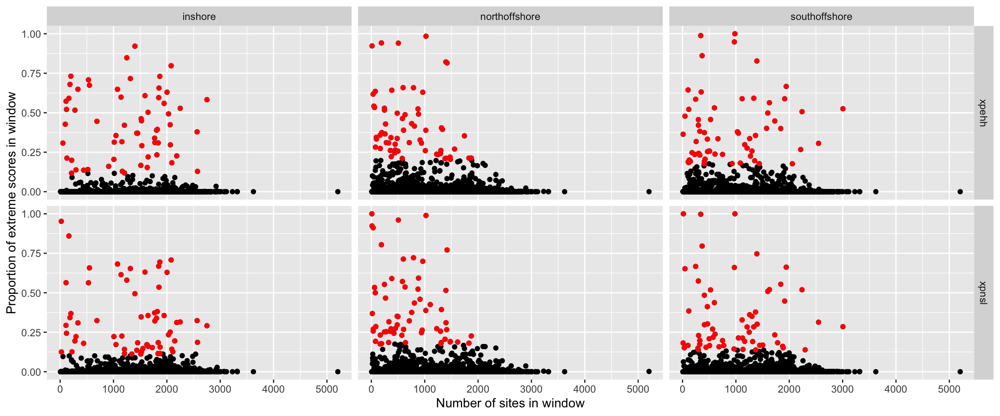

Identify outlying regions in selection analysis
================

-   [Windowed iHS test](#windowed-ihs-test)
    -   [Genes uniquely under selection in each of the three populations
        based on iHS
        scan](#genes-uniquely-under-selection-in-each-of-the-three-populations-based-on-ihs-scan)
-   [XP-EHH and XP-nSL methods](#xp-ehh-and-xp-nsl-methods)
    -   [Genes under selection in three population based on XP-EHH
        scan](#genes-under-selection-in-three-population-based-on-xp-ehh-scan)
    -   [Genes under selection in three population based on XP-nSL
        scan](#genes-under-selection-in-three-population-based-on-xp-nsl-scan)

## Windowed iHS test

We applied the selective scans for all three populations separately and
investigated the [genome-wide distribution of per site
scores](08.ehh_stats.md). To reduce the false positive rate, we
calculated the fraction of SNPs in each non-overlapping 50kb window that
has outlying iHS scores(\|iHS\|&gt;2) as (**Voight2006?**) and selscan
suggested. In addition, we used `--min-snps=10` to exclude windows with
less than 10 SNPs. The regions with high proportion (1st percentile) of
extreme iHS scores were picked as candidate selective regions. note
that, while we picked windows with a high proportion of extreme iHS
scores, the number of SNPs in each window was also taken into
consideration to avoid bias towards windows with less SNPs. The windows
picked as candidate sweeps based on the iHS scan are shown as red points
in three population:

**Figure 1:** Plots display the number of site in window and the
proportion of extreme iHS scores in window. The red dots depict the
windows as the 1st percentile with SNP density in each window been
controlled

**Table 1:** The threshold for each bin with different SNP number in iHS
scans of inshore, north offshore, and south offshore populations

\# Threshold for each bin in northoffshore

| Bin boundary | Number of windows in this bin | 1st percentile threshold |
|-------------:|:-----------------------------:|:------------------------:|
|    \[10-66\] |              569              |         0.557778         |
|    (66-148\] |              565              |         0.610089         |
|   (148-243\] |              558              |         0.369494         |
|   (243-345\] |              561              |         0.45035          |
|   (345-433\] |              563              |         0.390665         |
|   (433-515\] |              564              |         0.332247         |
|   (515-587\] |              559              |         0.396992         |
|   (587-660\] |              562              |         0.352843         |
|   (660-763\] |              566              |         0.343013         |
|  (763-1870\] |              555              |         0.328067         |

\# Threshold for each bin in northoffshore

| Bin boundary | Number of windows in this bin | 1st percentile threshold |
|-------------:|:-----------------------------:|:------------------------:|
|    \[10-62\] |              577              |         0.315789         |
|    (62-132\] |              572              |         0.384005         |
|   (132-218\] |              574              |         0.410328         |
|   (218-304\] |              570              |         0.287487         |
|   (304-378\] |              571              |         0.362154         |
|   (378-444\] |              576              |         0.271412         |
|   (444-507\] |              573              |         0.257785         |
|   (507-573\] |              571              |         0.335927         |
|   (573-657\] |              578              |         0.358238         |
|  (657-1519\] |              566              |         0.290571         |

\# Threshold for each bin in southoffshore

| Bin boundary | Number of windows in this bin | 1st percentile threshold |
|-------------:|:-----------------------------:|:------------------------:|
|    \[10-62\] |              577              |         0.375811         |
|    (62-137\] |              576              |         0.396966         |
|   (137-231\] |              572              |         0.392147         |
|   (231-324\] |              574              |         0.379755         |
|   (324-405\] |              567              |         0.299749         |
|   (405-478\] |              584              |         0.238272         |
|   (478-546\] |              568              |         0.361146         |
|   (546-613\] |              568              |         0.466281         |
|   (613-706\] |              572              |         0.344451         |
|  (706-1624\] |              574              |         0.233307         |

Next, for each population, we excluded regions where the iHS test was
also significant at 1% level in the other two populations. This
exclusion step was to enrich for signals of local adaption in
populations separately. After excluding the shared iHS significant
signals, less than 1% of genomic regions were identified as candidates
in three populations.

**Table 2:** The proportion of genome regions that are uniquely under
selective sweep in three populations

| Population     | Total length (Mb) of genomic regions | Number of Regions | Percentage of Total Genome (%) |
|:---------------|-------------------------------------:|------------------:|-------------------------------:|
| Inshore        |                             2.650040 |                40 |                      0.6370288 |
| North Offshore |                             2.250036 |                36 |                      0.5408740 |
| South Offshore |                             2.350036 |                36 |                      0.5649125 |

### Genes uniquely under selection in each of the three populations based on iHS scan

| chr          |   Start |     End | Population     | Genes in this window                                                                                                                                                                                                                            | SNP number | Fraction of \|iHS\|&gt;2 |
|:-------------|--------:|--------:|:---------------|:------------------------------------------------------------------------------------------------------------------------------------------------------------------------------------------------------------------------------------------------|-----------:|-------------------------:|
| BLFC01000326 | 1750000 | 1800001 | Inshore        | adig\_s0038.g93; PGES2\_BOVIN; DNJA1\_PONAB; HM20A\_MOUSE                                                                                                                                                                                       |        155 |                0.9225810 |
| BLFC01000326 | 1550000 | 1600001 | Inshore        | ODR4\_CHICK; adig\_s0038.g81; USF\_AQUPY; adig\_s0038.g83                                                                                                                                                                                       |        398 |                0.8391960 |
| BLFC01000158 |  700000 |  750001 | Inshore        | BLM\_XENLA                                                                                                                                                                                                                                      |        133 |                0.8045110 |
| BLFC01000706 |  350000 |  400001 | Inshore        | adig\_s0094.g9                                                                                                                                                                                                                                  |         26 |                0.7692310 |
| BLFC01000324 | 1600000 | 1800001 | Inshore        | AAGAB\_HUMAN; HTK7\_HYDVU; adig\_s0041.g86; B2CL1\_HUMAN; DRB1\_ORYSJ; ULK3\_CHICK                                                                                                                                                              |       1379 |                0.7264010 |
| BLFC01000082 |  550000 |  600001 | Inshore        | adig\_s0168.g24                                                                                                                                                                                                                                 |        127 |                0.6377950 |
| BLFC01000706 |  900000 |  950001 | Inshore        | adig\_s0094.g25                                                                                                                                                                                                                                 |        131 |                0.6335880 |
| BLFC01000591 |  150000 |  200001 | Inshore        | adig\_s0275.g6; adig\_s0275.g7; adig\_s0275.g8                                                                                                                                                                                                  |         40 |                0.6250000 |
| BLFC01000838 |  550000 |  600001 | Inshore        | TRNK1\_HUMAN; TRAF5\_MOUSE                                                                                                                                                                                                                      |         68 |                0.6176470 |
| BLFC01000655 |  200000 |  250001 | Inshore        | K319L\_MOUSE; adig\_s0250.g15                                                                                                                                                                                                                   |        133 |                0.6165410 |
| BLFC01000718 | 1250000 | 1400001 | Inshore        | KCMA1\_XENLA; adig\_s0112.g35; LRMDA\_MOUSE; LRMDA\_HUMAN; F241B\_MOUSE; WAPL\_HUMAN; ZN503\_DANRE; adig\_s0112.g41                                                                                                                             |        891 |                0.6122553 |
| BLFC01000277 |  150000 |  250001 | Inshore        | UBA6\_MOUSE; adig\_s0082.g15; adig\_s0082.g16; RIT1\_HUMAN; CC038\_HUMAN; SFR1\_HUMAN; PCSK5\_BRACL; PCSK6\_RAT                                                                                                                                 |       1003 |                0.5830995 |
| BLFC01000201 | 2450000 | 2500001 | Inshore        | adig\_s0044.g131                                                                                                                                                                                                                                |         16 |                0.5625000 |
| BLFC01000348 | 2400000 | 2450001 | Inshore        | RSPRY\_MACFA; TAF4\_HUMAN; SL9A8\_HUMAN; adig\_s0001.g108                                                                                                                                                                                       |        278 |                0.5287770 |
| BLFC01000820 | 1050000 | 1100001 | Inshore        | CPT1A\_RAT; TRPC4\_HUMAN; SETX\_MOUSE                                                                                                                                                                                                           |        597 |                0.5075380 |
| BLFC01000289 |  450000 |  500001 | Inshore        | PTHB1\_XENLA; BMPER\_MOUSE; adig\_s0153.g19; adig\_s0153.g20                                                                                                                                                                                    |        559 |                0.5026830 |
| BLFC01000610 |  900000 |  950001 | Inshore        | RNH2B\_XENLA; adig\_s0050.g52; TLL1\_CHICK; adig\_s0050.g54                                                                                                                                                                                     |        858 |                0.4930070 |
| BLFC01000639 | 1450000 | 1550001 | Inshore        | adig\_s0017.g67; HSP7C\_CAEBR; COP1\_MOUSE; PI4KB\_HUMAN; adig\_s0017.g71                                                                                                                                                                       |       1101 |                0.4800555 |
| BLFC01000074 |  100000 |  250001 | Inshore        | HUTU\_MOUSE; HUTH\_BOVIN; CATC\_HUMAN; ODPB\_MOUSE; ARF4\_XENLA; adig\_s0057.g11; adig\_s0057.g12; KLKB1\_BOVIN; ABLM1\_MOUSE; adig\_s0057.g15; NAGK\_MOUSE; adig\_s0057.g17                                                                    |       1601 |                0.4789623 |
| BLFC01000610 | 1000000 | 1100001 | Inshore        | adig\_s0050.g56; adig\_s0050.g57; VP37A\_HUMAN; SOX14\_DANRE; GALR2\_RAT; DOCK9\_MOUSE                                                                                                                                                          |       1371 |                0.4555715 |
| BLFC01000298 |  300000 |  350001 | Inshore        | PRS23\_MOUSE; KI16B\_HUMAN                                                                                                                                                                                                                      |        788 |                0.4530460 |
| BLFC01000745 |  300000 |  400001 | Inshore        | ECE1\_BOVIN; PRUN1\_BOVIN; LHPL2\_DANRE; adig\_s0118.g25; MA2A2\_HUMAN; CYBP\_PONAB; AP3S1\_MOUSE; PRUN2\_XENTR; adig\_s0118.g30; DEPD7\_RAT; UBP47\_HUMAN                                                                                      |       1143 |                0.4372230 |
| BLFC01000690 | 2600000 | 2700001 | Inshore        | adig\_s0030.g199; MICA1\_DANRE; CF157\_XENTR; TDIF2\_HUMAN; DHYS\_MOUSE; COQ4\_NEMVE; TBX5A\_DANRE; PSB1B\_CARAU; LSM2\_MOUSE; CSK2B\_DANRE; DPOE3\_PONAB; PIN1\_HUMAN; SYF1\_DROME; adig\_s0030.g212; FBP1\_STRPU                              |       1277 |                0.4242875 |
| BLFC01000729 |  150000 |  200001 | Inshore        | HEPHL\_ACRMI; NIPA2\_PONAB; LRC51\_BOVIN; TM216\_BOVIN; adig\_s0124.g8                                                                                                                                                                          |        241 |                0.4232370 |
| BLFC01000593 |  400000 |  450001 | Inshore        | DMBT1\_MOUSE; DYDC1\_HUMAN; TYRO\_CHICK                                                                                                                                                                                                         |        235 |                0.4170210 |
| BLFC01000690 | 2750000 | 2850001 | Inshore        | CRB\_DROME; Y1388\_SYNY3; CMC\_DICDI; NUD19\_XENLA; RT33\_MOUSE; CNTRL\_HUMAN; adig\_s0030.g221; adig\_s0030.g222; GFI1\_RAT; ACADM\_BOVIN                                                                                                      |       1284 |                0.4052845 |
| BLFC01000734 |  350000 |  400001 | Inshore        | TDRD1\_MOUSE; adig\_s0081.g28; LACC1\_HUMAN; E41L3\_MOUSE; LITAF\_CHICK; RS12\_ORENI; ALK\_MOUSE                                                                                                                                                |        630 |                0.3936510 |
| BLFC01000770 | 1200000 | 1250001 | Inshore        | adig\_s0003.g71; CBPB2\_MOUSE; RPAP3\_HUMAN                                                                                                                                                                                                     |        366 |                0.3934430 |
| BLFC01000834 | 3350000 | 3400001 | Inshore        | adig\_s0028.g243; CTNS\_DICDI; DEOC\_HUMAN; AMN1\_PONAB                                                                                                                                                                                         |        612 |                0.3807190 |
| BLFC01000051 |  600000 |  650001 | Inshore        | S35F5\_MOUSE; ENPP5\_RAT; adig\_s0009.g26                                                                                                                                                                                                       |        714 |                0.3781510 |
| BLFC01000008 | 1150000 | 1200001 | Inshore        | adig\_s0073.g90                                                                                                                                                                                                                                 |        202 |                0.3762380 |
| BLFC01000690 | 3200000 | 3250001 | Inshore        | RABX5\_MOUSE; adig\_s0030.g253; adig\_s0030.g254; adig\_s0030.g255; adig\_s0030.g256; adig\_s0030.g257                                                                                                                                          |        240 |                0.3750000 |
| BLFC01000770 |  850000 |  900001 | Inshore        | FEZF2\_DANRE; MORN5\_HUMAN; S35A1\_HUMAN; S35A1\_MOUSE; RAD50\_PLAF7; VIAAT\_XENLA; CDK20\_DANRE                                                                                                                                                |        799 |                0.3704630 |
| BLFC01000770 | 3100000 | 3150001 | Inshore        | NAPEP\_HUMAN; adig\_s0003.g202; adig\_s0003.g203; adig\_s0003.g204                                                                                                                                                                              |        441 |                0.3650790 |
| BLFC01000450 |  750000 |  800001 | Inshore        | adig\_s0015.g55; CAC1A\_APIME; CAC1A\_HUMAN                                                                                                                                                                                                     |        891 |                0.3569020 |
| BLFC01000309 | 3050000 | 3100001 | Inshore        | DMX1B\_DANRE; PITX2\_HUMAN                                                                                                                                                                                                                      |        598 |                0.3528430 |
| BLFC01000653 | 2050000 | 2100001 | Inshore        | INO80\_MOUSE; ACAP3\_HUMAN; CB042\_MOUSE; TISB\_RAT; RA51B\_HUMAN                                                                                                                                                                               |        464 |                0.3512930 |
| BLFC01000235 | 3250000 | 3300001 | Inshore        | RAD54\_CHICK; ALKB7\_BOVIN; MKRN1\_XENLA; RHBGB\_XENLA; CFA57\_HUMAN                                                                                                                                                                            |        763 |                0.3446920 |
| BLFC01000375 | 1150000 | 1200001 | Inshore        | SKAP2\_TAKRU; adig\_s0052.g70; ANO5\_HUMAN; adig\_s0052.g72; ANO4\_MOUSE                                                                                                                                                                        |        467 |                0.3361880 |
| BLFC01000413 |  150000 |  200001 | Inshore        | PTPRF\_MOUSE; COBA2\_HUMAN; COHA1\_BOVIN; SUOX\_HUMAN                                                                                                                                                                                           |        786 |                0.3320610 |
| BLFC01000047 | 1200000 | 1300001 | North Offshore | TTC28\_MOUSE; adig\_s0061.g54; adig\_s0061.g55; MFSD6\_MOUSE                                                                                                                                                                                    |        982 |                0.7195180 |
| BLFC01000310 |  200000 |  250001 | North Offshore | TENA\_HUMAN                                                                                                                                                                                                                                     |         26 |                0.6923080 |
| BLFC01000298 | 1250000 | 1300001 | North Offshore | 4CL1\_TOBAC; TNFA\_RAT; adig\_s0120.g103                                                                                                                                                                                                        |        159 |                0.6289310 |
| BLFC01000632 | 2550000 | 2800001 | North Offshore | adig\_s0004.g191; adig\_s0004.g192; SETD3\_CHICK; NPFF2\_HUMAN; S26A6\_MOUSE; adig\_s0004.g196; ZC3H1\_HUMAN; NPFF2\_RAT; QRFPR\_BRAFL; NPFF2\_MOUSE; KHK\_RAT; NK2R\_RABIT; adig\_s0004.g203                                                   |       1961 |                0.6118122 |
| BLFC01000310 | 2100000 | 2150001 | North Offshore | PGBD4\_HUMAN; adig\_s0027.g90; adig\_s0027.g91; adig\_s0027.g92; adig\_s0027.g93                                                                                                                                                                |        208 |                0.6105770 |
| BLFC01000309 |  400000 |  450001 | North Offshore | PLPL9\_MOUSE; adig\_s0069.g23; TENR\_HUMAN; TENX\_HUMAN; adig\_s0069.g26                                                                                                                                                                        |        153 |                0.5816990 |
| BLFC01000573 |  150000 |  200001 | North Offshore | FBX30\_RAT; APH1A\_MOUSE; S39AE\_DANRE; DAZP1\_XENLA; HEXB\_HUMAN                                                                                                                                                                               |        572 |                0.5314690 |
| BLFC01000522 | 1650000 | 1700001 | North Offshore | adig\_s0035.g117; NLRC5\_ICTPU; Y1101\_SYNY3; YQA3\_THEAQ; CATIP\_DANRE                                                                                                                                                                         |        201 |                0.5273630 |
| BLFC01000632 | 1650000 | 1700001 | North Offshore | TMP2L\_NEMVE; adig\_s0004.g116; adig\_s0004.g117; TBC14\_BOVIN; CRYD\_XENLA                                                                                                                                                                     |        222 |                0.5180180 |
| BLFC01000211 |  400000 |  450001 | North Offshore | IMB1\_RAT; ERLEC\_MOUSE                                                                                                                                                                                                                         |         91 |                0.4835160 |
| BLFC01000632 | 2900000 | 2950001 | North Offshore | ENPP\_APLCA; adig\_s0004.g209; adig\_s0004.g210; CADN\_ACRMI                                                                                                                                                                                    |         21 |                0.4761900 |
| BLFC01000125 | 1600000 | 1650001 | North Offshore | NCL\_ARATH; adig\_s0010.g98                                                                                                                                                                                                                     |        131 |                0.4656490 |
| BLFC01000718 | 1150000 | 1200001 | North Offshore | adig\_s0112.g31; H2AV\_STRPU                                                                                                                                                                                                                    |         86 |                0.4418600 |
| BLFC01000715 |  150000 |  200001 | North Offshore | adig\_s0231.g9; CP4V2\_HUMAN; CP4V2\_MOUSE                                                                                                                                                                                                      |        289 |                0.4394460 |
| BLFC01000100 | 1550000 | 1700001 | North Offshore | YRD6\_CAEEL; RTJK\_DROME; adig\_s0008.g78; adig\_s0008.g79; adig\_s0008.g80; MCTP1\_MOUSE                                                                                                                                                       |        518 |                0.4384080 |
| BLFC01000137 |  350000 |  400001 | North Offshore | no gene in this window                                                                                                                                                                                                                          |         21 |                0.4285710 |
| BLFC01000632 | 3000000 | 3100001 | North Offshore | NPFF2\_HUMAN; ACHB\_XENLA; ACH10\_CHICK; ACHA7\_MACMU; GSKIP\_DANRE; SQOR\_MOUSE; CERS1\_MOUSE; FOLR2\_HUMAN                                                                                                                                    |        845 |                0.4097435 |
| BLFC01000511 |  800000 |  850001 | North Offshore | MRP4\_HUMAN; adig\_s0075.g74; DRD1L\_OREMO; ADRB1\_XENLA; FIBP\_MOUSE; adig\_s0075.g78; PYC\_HUMAN                                                                                                                                              |        644 |                0.4052800 |
| BLFC01000341 | 1750000 | 1800001 | North Offshore | GBPH\_PLAFB; EOGT\_HUMAN; COT2\_MOUSE                                                                                                                                                                                                           |        310 |                0.4000000 |
| BLFC01000639 | 2100000 | 2150001 | North Offshore | TRPC5\_MOUSE                                                                                                                                                                                                                                    |         99 |                0.3939390 |
| BLFC01000451 |  750000 |  800001 | North Offshore | adig\_s0054.g57; LRP6\_HUMAN; adig\_s0054.g59; GR101\_LYMST; PROM1\_MOUSE                                                                                                                                                                       |        525 |                0.3847620 |
| BLFC01000016 | 3200000 | 3250001 | North Offshore | BRWD1\_HUMAN; DHDDS\_HUMAN; LIN41\_DANRE; ICEF1\_HUMAN                                                                                                                                                                                          |        848 |                0.3773580 |
| BLFC01000255 |  250000 |  300001 | North Offshore | adig\_s0127.g8; adig\_s0127.g9; OPN4B\_GADMO                                                                                                                                                                                                    |        320 |                0.3750000 |
| BLFC01000410 | 1050000 | 1100001 | North Offshore | CFI1\_CAEEL; ARI1B\_HUMAN; adig\_s0163.g79; FGF1\_DANRE; FGF1\_NOTVI; FGF1\_PIG; DCMC\_HUMAN                                                                                                                                                    |        481 |                0.3700620 |
| BLFC01000324 |  350000 |  400001 | North Offshore | PRDM6\_BOVIN; PRDM9\_RAT; PRDM6\_HUMAN; CE120\_HUMAN; adig\_s0041.g29; DRC8\_MOUSE                                                                                                                                                              |        655 |                0.3603050 |
| BLFC01000773 | 1700000 | 1750001 | North Offshore | RRN3\_MOUSE; GLO2\_MOUSE; UBP1\_RAT; DPOD2\_MOUSE; KLH20\_RAT; adig\_s0046.g126                                                                                                                                                                 |        520 |                0.3519230 |
| BLFC01000439 | 2650000 | 2700001 | North Offshore | ALG6\_HUMAN; adig\_s0042.g161; KAD3\_BOVIN; PUM3\_RAT; adig\_s0042.g164                                                                                                                                                                         |        679 |                0.3431520 |
| BLFC01000427 |  850000 |  900001 | North Offshore | COMP\_RAT; MTR1A\_SHEEP; MFAP1\_BOVIN; adig\_s0092.g62                                                                                                                                                                                          |        483 |                0.3416150 |
| BLFC01000152 |   50000 |  100001 | North Offshore | adig\_s0014.g4; adig\_s0014.g5; ZPP\_ACRMI; HMCN2\_MOUSE                                                                                                                                                                                        |        420 |                0.3333330 |
| BLFC01000909 |   50000 |  100001 | North Offshore | no gene in this window                                                                                                                                                                                                                          |         38 |                0.3157890 |
| BLFC01000647 | 2800000 | 2850001 | North Offshore | TCPD\_TAKRU; adig\_s0012.g220; SGPP2\_HUMAN; COQ6\_DANRE; COMD1\_MOUSE; ARMT1\_BOVIN; adig\_s0012.g225; adig\_s0012.g226; ZN410\_BOVIN                                                                                                          |        425 |                0.3152940 |
| BLFC01000016 | 1250000 | 1350001 | North Offshore | LIP1\_CAEEL; RHO1\_ASHGO; S15A2\_DANRE; MPC1\_RAT; adig\_s0011.g90; DZIP3\_HUMAN; PTHD3\_MOUSE                                                                                                                                                  |        728 |                0.3139895 |
| BLFC01000235 | 3050000 | 3100001 | North Offshore | adig\_s0007.g118; TESK2\_HUMAN; PRDM6\_MOUSE; ASND1\_BOVIN; ASNA\_NEMVE                                                                                                                                                                         |        810 |                0.3061730 |
| BLFC01000557 |  300000 |  350001 | North Offshore | adig\_s0152.g9; DDGS\_TRIV2; LIN41\_RAT                                                                                                                                                                                                         |        402 |                0.2761190 |
| BLFC01000201 |  800000 |  850001 | North Offshore | IN80E\_RAT; adig\_s0044.g46; SPB1\_PONAB                                                                                                                                                                                                        |        461 |                0.2754880 |
| BLFC01000201 |  150000 |  200001 | North Offshore | DDAH1\_BOVIN; adig\_s0044.g13; ADB4C\_MELGA; CATB\_PIG                                                                                                                                                                                          |        442 |                0.2737560 |
| BLFC01000375 |  150000 |  400001 | South Offshore | TEDC2\_HUMAN; KLHDB\_DROER; CG026\_DANRE; NCKX5\_HUMAN; NCKX3\_HUMAN; NCKX5\_DANRE; PGBD4\_HUMAN; LC7L2\_HUMAN; adig\_s0052.g17; CO4A2\_HUMAN; adig\_s0052.g19; EIF3L\_NEMVE; TM220\_XENLA; ACON\_MOUSE; XPO6\_HUMAN; ASTE1\_HUMAN; LST8\_DANRE |       1940 |                0.8093584 |
| BLFC01000600 |  400000 |  450001 | South Offshore | RBP2\_PANTR; adig\_s0005.g52; MCM7\_HUMAN                                                                                                                                                                                                       |        511 |                0.6966730 |
| BLFC01000286 | 1950000 | 2000001 | South Offshore | adig\_s0024.g113                                                                                                                                                                                                                                |        142 |                0.6760560 |
| BLFC01000454 |  300000 |  400001 | South Offshore | BMPH\_STRPU; E2F3\_HUMAN; GANP\_MOUSE; PGCB\_MOUSE                                                                                                                                                                                              |        861 |                0.5762195 |
| BLFC01000137 |  650000 |  850001 | South Offshore | adig\_s0108.g20; adig\_s0108.g21; ALPL\_ARATH; adig\_s0108.g23; adig\_s0108.g24; adig\_s0108.g25; adig\_s0108.g26; adig\_s0108.g27; adig\_s0108.g28; ZN862\_HUMAN                                                                               |        447 |                0.5682340 |
| BLFC01000583 |   50000 |  100001 | South Offshore | RBM38\_HUMAN; CAP2\_HUMAN                                                                                                                                                                                                                       |        124 |                0.5322580 |
| BLFC01000148 |  650000 |  700001 | South Offshore | KTBL1\_HUMAN; adig\_s0149.g24; PPM1A\_RAT; adig\_s0149.g26                                                                                                                                                                                      |        300 |                0.5033330 |
| BLFC01000763 |  350000 |  400001 | South Offshore | adig\_s0200.g12; PLBL1\_RAT; adig\_s0200.g14                                                                                                                                                                                                    |         36 |                0.5000000 |
| BLFC01000100 | 3250000 | 3350001 | South Offshore | adig\_s0008.g145; MB213\_XENLA; adig\_s0008.g147; adig\_s0008.g148; KSR2\_HUMAN; SNX27\_MOUSE; CRTC1\_MOUSE                                                                                                                                     |        715 |                0.4987755 |
| BLFC01000255 |  450000 |  500001 | South Offshore | adig\_s0127.g15                                                                                                                                                                                                                                 |        167 |                0.4970060 |
| BLFC01000660 |  700000 |  750001 | South Offshore | adig\_s0133.g29; MFS12\_HUMAN; MFS12\_MOUSE                                                                                                                                                                                                     |        602 |                0.4784050 |
| BLFC01000954 | 1100000 | 1150001 | South Offshore | no gene in this window                                                                                                                                                                                                                          |        670 |                0.4776120 |
| BLFC01000055 |  150000 |  200001 | South Offshore | ZPP\_ACRMI; adig\_s0084.g12; SIBA\_DICDI                                                                                                                                                                                                        |         95 |                0.4631580 |
| BLFC01000692 |       0 |   50001 | South Offshore | adig\_s0191.g1; adig\_s0191.g2                                                                                                                                                                                                                  |         35 |                0.4571430 |
| BLFC01000124 |  650000 |  700001 | South Offshore | adig\_s0098.g54; TF2B\_XENLA; EBP\_DICDI; ZDH17\_HUMAN; ZDH17\_RAT; KMT5B\_BOVIN; CAPR1\_HUMAN                                                                                                                                                  |        543 |                0.4567220 |
| BLFC01000468 |  300000 |  400001 | South Offshore | DCR1A\_CHICK; CCNJ\_XENLA; MVP\_BOVIN; SOX8\_TETNG; adig\_s0172.g16; CC142\_MOUSE; DUS11\_MOUSE; MF13A\_CHICK; PDCD4\_CHICK; CFA43\_XENLA                                                                                                       |        980 |                0.4514825 |
| BLFC01000185 |  100000 |  150001 | South Offshore | OCTB2\_CHISP                                                                                                                                                                                                                                    |        410 |                0.4463410 |
| BLFC01000734 |  800000 |  850001 | South Offshore | AGRL3\_HUMAN; adig\_s0081.g71; MAB21\_DROME                                                                                                                                                                                                     |        182 |                0.4450550 |
| BLFC01000596 | 3450000 | 3500001 | South Offshore | LRC8A\_HUMAN; LRC8A\_RAT; adig\_s0006.g222; adig\_s0006.g223; adig\_s0006.g224                                                                                                                                                                  |         16 |                0.4375000 |
| BLFC01000524 | 1050000 | 1100001 | South Offshore | no gene in this window                                                                                                                                                                                                                          |         72 |                0.4305560 |
| BLFC01000857 |       0 |   50001 | South Offshore | TRFM\_HUMAN; TRFE\_PAROL; TRFM\_RABIT                                                                                                                                                                                                           |         93 |                0.4301080 |
| BLFC01000152 | 2400000 | 2450001 | South Offshore | MGT4C\_HUMAN; AMOT\_HUMAN; 5HT1D\_PIG; GP161\_MOUSE; PARL\_BOVIN                                                                                                                                                                                |        661 |                0.4296520 |
| BLFC01000765 |  250000 |  300001 | South Offshore | PATS1\_DICDI; adig\_s0157.g10; KDM1B\_HUMAN                                                                                                                                                                                                     |        489 |                0.4274030 |
| BLFC01000756 |  600000 |  650001 | South Offshore | VPP1\_MOUSE; KS6A1\_CAEEL                                                                                                                                                                                                                       |        232 |                0.4224140 |
| BLFC01000857 |  650000 |  700001 | South Offshore | DDL\_THEYD; DDL\_SYNJB; DDL\_HYDCU; CV039\_XENLA; TXD17\_MOUSE                                                                                                                                                                                  |        144 |                0.4097220 |
| BLFC01000524 | 1200000 | 1250001 | South Offshore | adig\_s0040.g40; MA2C1\_RAT; MA2C1\_MOUSE; OX1R\_BOVIN; NMBR\_MOUSE                                                                                                                                                                             |        614 |                0.4022800 |
| BLFC01000632 |  550000 |  600001 | South Offshore | adig\_s0004.g41; SODC\_CAEBR                                                                                                                                                                                                                    |        480 |                0.3645830 |
| BLFC01000123 | 1650000 | 1750001 | South Offshore | adig\_s0039.g130; CADH4\_CAEEL; STL2\_ARATH; NSE2\_XENLA; RN217\_HUMAN; FA8A1\_HUMAN; adig\_s0039.g136; ACOX1\_CAVPO; JMJD7\_MOUSE; XRCC5\_MOUSE; FZD2\_XENLA; adig\_s0039.g141; FAXC\_XENTR; TRM11\_CHICK; GSH1\_HUMAN                         |        875 |                0.3612090 |
| BLFC01000647 | 3000000 | 3050001 | South Offshore | TPC1\_RAT; PMGT1\_PONAB; PUS10\_HUMAN; NRP2\_HUMAN; Y1425\_MYCTU                                                                                                                                                                                |        360 |                0.3583330 |
| BLFC01000184 | 1600000 | 1650001 | South Offshore | BIG1\_BOVIN; CATL\_DROME                                                                                                                                                                                                                        |        466 |                0.3433480 |
| BLFC01000201 | 1300000 | 1350001 | South Offshore | PK1L2\_MOUSE; VGFAA\_DANRE; adig\_s0044.g69; adig\_s0044.g70; adig\_s0044.g71                                                                                                                                                                   |        379 |                0.3034300 |
| BLFC01000154 |       0 |   50001 | South Offshore | AMPN\_CHICK; NPFF2\_HUMAN; GAL2B\_DANRE; QRFPR\_HUMAN; QRFPR\_BRAFL; RGS19\_RAT                                                                                                                                                                 |        409 |                0.2713940 |
| BLFC01000834 | 3550000 | 3600001 | South Offshore | LOXH1\_MOUSE; OPN4B\_XENLA; CATA\_PIG                                                                                                                                                                                                           |        749 |                0.2510010 |
| BLFC01000774 | 1650000 | 1700001 | South Offshore | IGBP1\_HUMAN; PPCS\_HUMAN; NPT2B\_RAT                                                                                                                                                                                                           |        455 |                0.2505490 |
| BLFC01000208 |  350000 |  400001 | South Offshore | ADRB2\_TSCTR; TENX\_HUMAN; BTBD6\_XENLA; LR74A\_RAT; FCF1\_PONAB; adig\_s0199.g37; adig\_s0199.g38                                                                                                                                              |        847 |                0.2491150 |
| BLFC01000599 |  750000 |  800001 | South Offshore | GRB2\_XENTR; UBE2S\_NEMVE; SMBT1\_HUMAN; adig\_s0135.g47; NUBP2\_NEMVE                                                                                                                                                                          |        753 |                0.2377160 |

## XP-EHH and XP-nSL methods

We used XP-EHH and XP-nSL to detect nearly fixed or already fixed
selection in populations, XP-EHH and XP-nSL are analogous to each other
while XP-nSL has more power to detect soft sweep where the selection
happened at loci with medium allele frequency(**Szpiech2021?**). Both
test scores are directional and usually you use one population A as a
focal population and use another population B as a reference population.
So a positive value indicates the a longer and higher frequency
haplotypes in population A and verse vica the negative values for
population B. The scores were also normalised such that the set of all
such scores has zero mean and unit variance although in general, there
was a small skew towards one population and we neglect this asymmetry
when calculating significant scores. Respectively, we used three
populations as target population, and samples from the other two
population as reference.

**Figure 2:** The distribution of XP-EHH or XP-nSL scores for each
population comparison. In XP-EHH method for inshore vs. offshore
samples, a score of 3.83107 is in the 99.95 percentile. For north
offshore vs inshore+ south offshore, a score of 2.79556 is in the 99.95
percentile. For south offshore vs inshore + north offshore, a score of
3.11493 is in the 99.95 percentile. In XP-nSL method for inshore
vs. offshore samples, a score of 3.19748 is in the 99.95 percentile. For
north offshore vs inshore+ south offshore, a score of 2.8621 is in the
99.95 percentile. For south offshore vs inshore + north offshore, a
score of 3.05259 is in the 99.95 percentile.

To associate the regions with adaptive selection by clustering the
signals, again, we used `norm` with flag `--xpehh` and `--xpnsl` for
XP-EHH and XP-nSL, respectively to compute both the maximum test score
and the fraction of extreme scores in every non-overlapping 50kb windows
with more than 10 SNPs. The extreme score value in each test were
decided as the 1st percentile of genome-wide scores value. The
thresholds of extreme values were picked as the first percentile of all
scores as we described before.

**Figure 3: Plots display the number of site in window and the
proportion of extreme XP-EHH or XP-nSL scores in window. The red dots
depict the windows as the 1st percentile in each scan**

### Genes under selection in three population based on XP-EHH scan

| chr          |   Start |     End | Population     | Genes in this window                                                                                                                                                                                                                                            | SNP number | Maximum XP-EHH score |
|:-------------|--------:|--------:|:---------------|:----------------------------------------------------------------------------------------------------------------------------------------------------------------------------------------------------------------------------------------------------------------|-----------:|---------------------:|
| BLFC01000326 | 1550001 | 1600001 | Inshore        | ODR4\_CHICK; adig\_s0038.g81; USF\_AQUPY; adig\_s0038.g83                                                                                                                                                                                                       |       1647 |             10.00190 |
| BLFC01000639 | 1300001 | 1350001 | Inshore        | PXDN\_MOUSE; BECN1\_PIG; AP4B1\_HUMAN; adig\_s0017.g57; RNK\_DROME                                                                                                                                                                                              |       1075 |              9.09364 |
| BLFC01000154 |  250001 |  300001 | Inshore        | PXDN\_XENTR; adig\_s0150.g22; PERC\_DROME; PXDN\_HUMAN                                                                                                                                                                                                          |       1007 |              8.52351 |
| BLFC01000928 |  550001 |  600001 | Inshore        | adig\_s0079.g42; adig\_s0079.g43; adig\_s0079.g44; WDR35\_RAT                                                                                                                                                                                                   |        531 |              8.10162 |
| BLFC01000653 | 2050001 | 2150001 | Inshore        | INO80\_MOUSE; ACAP3\_HUMAN; CB042\_MOUSE; TISB\_RAT; RA51B\_HUMAN; adig\_s0034.g145; MTRR\_RAT; MTMR2\_DANRE; COHA1\_BOVIN                                                                                                                                      |       3932 |              7.79232 |
| BLFC01000039 |  100001 |  150001 | Inshore        | SEPT8\_XENTR; LRBA\_MOUSE                                                                                                                                                                                                                                       |       1868 |              7.71652 |
| BLFC01000600 | 3700001 | 3800001 | Inshore        | FRIS\_LYMST; PEX19\_RAT; PHS2\_HUMAN; adig\_s0005.g347; adig\_s0005.g348; adig\_s0005.g349; LRC58\_XENLA; GABR2\_RAT; CAD96\_DROME; PGBM\_MOUSE; RET\_HUMAN                                                                                                     |       3850 |              7.58099 |
| BLFC01000185 |  900001 | 1050001 | Inshore        | HBP1\_MOUSE; LOXH1\_MOUSE; S27A4\_MACFA; S27A1\_MOUSE; DAXX\_CANLF; WDR47\_MOUSE; MAGI3\_MOUSE; STX6\_MOUSE; HMA2\_ORYSJ; adig\_s0062.g79; RXR\_LYMST; SARDH\_RAT; SCMC2\_XENTR                                                                                 |       5198 |              7.54117 |
| BLFC01000404 | 1000001 | 1050001 | Inshore        | adig\_s0020.g95; TPRGL\_BOVIN; adig\_s0020.g97; OPN4\_PODSI; NU188\_MOUSE                                                                                                                                                                                       |       2250 |              7.53204 |
| BLFC01000729 |  150001 |  200001 | Inshore        | HEPHL\_ACRMI; NIPA2\_PONAB; LRC51\_BOVIN; TM216\_BOVIN; adig\_s0124.g8                                                                                                                                                                                          |       1316 |              7.28515 |
| BLFC01000770 | 1200001 | 1250001 | Inshore        | adig\_s0003.g71; CBPB2\_MOUSE; RPAP3\_HUMAN                                                                                                                                                                                                                     |       1141 |              7.17990 |
| BLFC01000326 | 1750001 | 2000001 | Inshore        | adig\_s0038.g93; PGES2\_BOVIN; DNJA1\_PONAB; HM20A\_MOUSE; adig\_s0038.g97; NPFF2\_MOUSE; adig\_s0038.g99; QOR\_HUMAN; adig\_s0038.g101; adig\_s0038.g102; adig\_s0038.g103; adig\_s0038.g104; OIT3\_HUMAN; OIT3\_BOVIN; TLL2\_HUMAN                            |       7145 |              7.04423 |
| BLFC01000770 |  650001 |  700001 | Inshore        | adig\_s0003.g29; adig\_s0003.g30; adig\_s0003.g31; ZN862\_HUMAN                                                                                                                                                                                                 |        689 |              6.99494 |
| BLFC01000265 |  200001 |  250001 | Inshore        | IMPA1\_BOVIN; ASGL1\_MACFA; adig\_s0125.g21; SNTB1\_HUMAN; COHA1\_MOUSE; CP087\_DANRE                                                                                                                                                                           |       1775 |              6.85913 |
| BLFC01000690 | 2750001 | 2800001 | Inshore        | CRB\_DROME; Y1388\_SYNY3; CMC\_DICDI; NUD19\_XENLA; RT33\_MOUSE; CNTRL\_HUMAN; adig\_s0030.g221                                                                                                                                                                 |       2567 |              6.75395 |
| BLFC01000439 | 1750001 | 1800001 | Inshore        | R3HD4\_BOVIN; RBCC1\_MOUSE; METK1\_MOUSE; NALCN\_HUMAN; CHST3\_TETCF                                                                                                                                                                                            |       1649 |              6.65440 |
| BLFC01000770 | 2800001 | 2900001 | Inshore        | adig\_s0003.g177; adig\_s0003.g178; adig\_s0003.g179; adig\_s0003.g180; adig\_s0003.g181; adig\_s0003.g182; DALD3\_DANRE; AASS\_BOVIN; FD2\_DROME                                                                                                               |       4936 |              6.45083 |
| BLFC01000393 | 1400001 | 1450001 | Inshore        | adig\_s0102.g96; adig\_s0102.g97; adig\_s0102.g98; adig\_s0102.g99; BRSK2\_HUMAN                                                                                                                                                                                |       1157 |              6.41692 |
| BLFC01000773 | 2100001 | 2250001 | Inshore        | GCY\_STRPU; ANPRB\_MOUSE; ANPRA\_MOUSE; GC76C\_DROME                                                                                                                                                                                                            |       5360 |              6.40305 |
| BLFC01000298 |  200001 |  300001 | Inshore        | MTNN\_DESPS; HSP12\_CAEEL; GCP60\_HUMAN; TREA\_APIME; adig\_s0120.g20; adig\_s0120.g21; adig\_s0120.g22; AP4S\_ARATH; adig\_s0120.g24; adig\_s0120.g25; PRS23\_MOUSE                                                                                            |       3043 |              6.28043 |
| BLFC01000309 | 2950001 | 3000001 | Inshore        | AVIL\_MOUSE; GELS\_HOMAM; TM9S3\_HUMAN; PK1IP\_MOUSE; PAX2\_MOUSE                                                                                                                                                                                               |       2031 |              6.18554 |
| BLFC01000706 |  900001 | 1000001 | Inshore        | adig\_s0094.g25; FCN2\_HUMAN                                                                                                                                                                                                                                    |        534 |              6.18000 |
| BLFC01000565 |  100001 |  150001 | Inshore        | BMPR2\_HUMAN; CDK2\_CARAU; ORC4\_PONAB; adig\_s0198.g12; CBH\_CLOPE                                                                                                                                                                                             |       1436 |              6.14604 |
| BLFC01000706 |  750001 |  800001 | Inshore        | no gene in this window                                                                                                                                                                                                                                          |        119 |              5.78143 |
| BLFC01000074 |  100001 |  150001 | Inshore        | HUTU\_MOUSE; HUTH\_BOVIN; CATC\_HUMAN; ODPB\_MOUSE                                                                                                                                                                                                              |       1806 |              5.74859 |
| BLFC01000706 |  450001 |  500001 | Inshore        | no gene in this window                                                                                                                                                                                                                                          |        184 |              5.68070 |
| BLFC01000008 | 2050001 | 2100001 | Inshore        | CPP1\_ACRMI; BARH1\_HUMAN; DLX4A\_DANRE; adig\_s0073.g156; PLSL\_DANRE; GOGA4\_MOUSE                                                                                                                                                                            |       1821 |              5.67936 |
| BLFC01000309 | 2200001 | 2250001 | Inshore        | adig\_s0069.g143; adig\_s0069.g144; adig\_s0069.g145                                                                                                                                                                                                            |        549 |              5.58234 |
| BLFC01000123 |  850001 |  900001 | Inshore        | adig\_s0039.g83; QCR7\_FASHE; RAB38\_MOUSE; GDF5\_HUMAN                                                                                                                                                                                                         |       1948 |              5.52992 |
| BLFC01000600 | 2250001 | 2300001 | Inshore        | ATS6\_HUMAN; ULK3\_CHICK; Y9963\_DICDI                                                                                                                                                                                                                          |       1014 |              5.46134 |
| BLFC01000816 |  400001 |  450001 | Inshore        | GDAP2\_NEMVE; CFA47\_HUMAN                                                                                                                                                                                                                                      |       2574 |              5.44239 |
| BLFC01000326 | 2050001 | 2100001 | Inshore        | OIT3\_BOVIN                                                                                                                                                                                                                                                     |        164 |              5.43863 |
| BLFC01000732 | 1950001 | 2000001 | Inshore        | C27C1\_HUMAN; adig\_s0032.g130; adig\_s0032.g131; TM241\_XENLA                                                                                                                                                                                                  |       1206 |              5.41867 |
| BLFC01000600 | 2900001 | 2950001 | Inshore        | SIDT1\_HUMAN; F234A\_MOUSE; FBX3\_BOVIN; DDX6\_DICDI; RXRGA\_DANRE; BCAL2\_ARATH                                                                                                                                                                                |       1633 |              5.38865 |
| BLFC01000706 |  250001 |  400001 | Inshore        | adig\_s0094.g8; adig\_s0094.g9                                                                                                                                                                                                                                  |        926 |              5.34770 |
| BLFC01000277 |  150001 |  250001 | Inshore        | UBA6\_MOUSE; adig\_s0082.g15; adig\_s0082.g16; RIT1\_HUMAN; CC038\_HUMAN; SFR1\_HUMAN; PCSK5\_BRACL; PCSK6\_RAT                                                                                                                                                 |       3879 |              5.26146 |
| BLFC01000773 |  500001 |  550001 | Inshore        | adig\_s0046.g42; UB2Q1\_HUMAN; TTC28\_MOUSE; adig\_s0046.g45; PCDH8\_HUMAN                                                                                                                                                                                      |       1046 |              5.21464 |
| BLFC01000161 |  700001 |  750001 | Inshore        | adig\_s0021.g39                                                                                                                                                                                                                                                 |        440 |              4.78477 |
| BLFC01000407 | 2000001 | 2050001 | Inshore        | adig\_s0145.g121; ALMA7\_EMIHU                                                                                                                                                                                                                                  |        910 |              4.76862 |
| BLFC01000166 | 1100001 | 1150001 | Inshore        | adig\_s0026.g37; adig\_s0026.g38; adig\_s0026.g39; adig\_s0026.g40; adig\_s0026.g41; adig\_s0026.g42                                                                                                                                                            |         96 |              4.76495 |
| BLFC01000407 | 1800001 | 1850001 | Inshore        | no gene in this window                                                                                                                                                                                                                                          |         52 |              4.74613 |
| BLFC01000274 |  600001 |  650001 | Inshore        | adig\_s0110.g23; TF26\_SCHPO                                                                                                                                                                                                                                    |        216 |              4.68778 |
| BLFC01000407 | 1900001 | 1950001 | Inshore        | P52K\_HUMAN; adig\_s0145.g117; TIE1\_DANRE                                                                                                                                                                                                                      |        277 |              4.68278 |
| BLFC01000051 | 3550001 | 3600001 | Inshore        | adig\_s0009.g174                                                                                                                                                                                                                                                |        213 |              4.47151 |
| BLFC01000016 | 1050001 | 1100001 | Inshore        | SLN13\_HUMAN; SLN14\_RABIT; MLC2\_DROME                                                                                                                                                                                                                         |        127 |              4.30497 |
| BLFC01000715 |       1 |   50001 | Inshore        | ENDOU\_XENTR; adig\_s0231.g3; adig\_s0231.g2                                                                                                                                                                                                                    |       1165 |              4.12845 |
| BLFC01000632 | 2650001 | 2800001 | North Offshore | S26A6\_MOUSE; adig\_s0004.g196; ZC3H1\_HUMAN; NPFF2\_RAT; QRFPR\_BRAFL; NPFF2\_MOUSE; KHK\_RAT; NK2R\_RABIT; adig\_s0004.g203                                                                                                                                   |       3648 |              6.55290 |
| BLFC01000007 |  450001 |  500001 | North Offshore | ANK3\_HUMAN; adig\_s0063.g12; adig\_s0063.g14; adig\_s0063.g13                                                                                                                                                                                                  |       1225 |              6.45251 |
| BLFC01000730 |  900001 | 1000001 | North Offshore | adig\_s0077.g33; adig\_s0077.g34; CFDP2\_BOVIN; ASI1A\_DANRE; YJ9J\_YEAST                                                                                                                                                                                       |       1357 |              6.01023 |
| BLFC01000089 |  100001 |  200001 | North Offshore | CNR2\_HUMAN; CNR2\_RAT                                                                                                                                                                                                                                          |        939 |              6.00170 |
| BLFC01000632 | 2900001 | 2950001 | North Offshore | ENPP\_APLCA; adig\_s0004.g209; adig\_s0004.g210                                                                                                                                                                                                                 |        189 |              5.91989 |
| BLFC01000324 | 1200001 | 1350001 | North Offshore | FCER2\_MOUSE; adig\_s0041.g76; adig\_s0041.g77; adig\_s0041.g79; LRC72\_BOVIN                                                                                                                                                                                   |       1447 |              5.88010 |
| BLFC01000341 |  950001 | 1000001 | North Offshore | NLRC3\_HUMAN; RAE1\_MOUSE; S2536\_HUMAN                                                                                                                                                                                                                         |        383 |              5.82197 |
| BLFC01000726 |  800001 |  850001 | North Offshore | adig\_s0119.g22; adig\_s0119.g23; KT5AA\_DANRE; XBP1\_RAT; adig\_s0119.g26                                                                                                                                                                                      |        583 |              5.79018 |
| BLFC01000341 | 1500001 | 1550001 | North Offshore | CPP1\_ACRMI; MALT1\_MOUSE; adig\_s0053.g83                                                                                                                                                                                                                      |        790 |              5.67713 |
| BLFC01000047 | 1200001 | 1300001 | North Offshore | TTC28\_MOUSE; adig\_s0061.g54; adig\_s0061.g55; MFSD6\_MOUSE                                                                                                                                                                                                    |       2443 |              5.59139 |
| BLFC01000454 |  400001 |  450001 | North Offshore | adig\_s0096.g11                                                                                                                                                                                                                                                 |        356 |              5.45898 |
| BLFC01000729 |       1 |  100001 | North Offshore | BMP1\_HUMAN; TLL2\_XENLA; TLL1\_DANRE                                                                                                                                                                                                                           |         47 |              5.36156 |
| BLFC01000745 | 1600001 | 1650001 | North Offshore | LSHR\_BOVIN; EMRE\_XENTR; LRC56\_HUMAN; LIPA1\_HUMAN                                                                                                                                                                                                            |       1873 |              5.33661 |
| BLFC01000536 |  200001 |  250001 | North Offshore | COLA1\_HUMAN; UROM\_HUMAN                                                                                                                                                                                                                                       |       1381 |              5.19173 |
| BLFC01000647 |  200001 |  250001 | North Offshore | adig\_s0012.g15; adig\_s0012.g16; SF3B2\_HUMAN; CAN9\_RAT                                                                                                                                                                                                       |       1476 |              5.15908 |
| BLFC01000393 | 1650001 | 1700001 | North Offshore | RET\_RAT; adig\_s0102.g117; adig\_s0102.g118                                                                                                                                                                                                                    |        484 |              5.11696 |
| BLFC01000857 |       1 |  100001 | North Offshore | TRFM\_HUMAN; TRFE\_PAROL; TRFM\_RABIT                                                                                                                                                                                                                           |        841 |              5.10738 |
| BLFC01000255 |  450001 |  600001 | North Offshore | adig\_s0127.g15; adig\_s0127.g16; adig\_s0127.g17; ZN862\_HUMAN                                                                                                                                                                                                 |       2065 |              4.94422 |
| BLFC01000600 | 3650001 | 3700001 | North Offshore | adig\_s0005.g338; RET\_HUMAN; ASPM\_MACMU; FRIS\_LYMST                                                                                                                                                                                                          |       1314 |              4.94101 |
| BLFC01000051 | 3450001 | 3500001 | North Offshore | adig\_s0009.g172; THAP1\_SALSA                                                                                                                                                                                                                                  |        168 |              4.93851 |
| BLFC01000522 | 1650001 | 1700001 | North Offshore | adig\_s0035.g117; NLRC5\_ICTPU; Y1101\_SYNY3; YQA3\_THEAQ; CATIP\_DANRE                                                                                                                                                                                         |        604 |              4.88052 |
| BLFC01000051 | 3050001 | 3100001 | North Offshore | adig\_s0009.g162                                                                                                                                                                                                                                                |        266 |              4.75509 |
| BLFC01000847 | 1300001 | 1350001 | North Offshore | adig\_s0087.g33                                                                                                                                                                                                                                                 |         74 |              4.74441 |
| BLFC01000100 | 2200001 | 2250001 | North Offshore | adig\_s0008.g101; YRD6\_CAEEL                                                                                                                                                                                                                                   |        195 |              4.66895 |
| BLFC01000100 |  800001 |  850001 | North Offshore | ADRB2\_MESAU; ARRD2\_MOUSE; RLP24\_PONAB; SEM1A\_DROME                                                                                                                                                                                                          |        964 |              4.65824 |
| BLFC01000847 | 1200001 | 1250001 | North Offshore | GLBL2\_MOUSE; ITA2\_BOVIN; adig\_s0087.g31                                                                                                                                                                                                                      |        711 |              4.54342 |
| BLFC01000255 |   50001 |  150001 | North Offshore | adig\_s0127.g3; HARB1\_MOUSE; adig\_s0127.g5; adig\_s0127.g6                                                                                                                                                                                                    |        445 |              4.54118 |
| BLFC01000256 |  400001 |  450001 | North Offshore | DMRT3\_HUMAN; DMTA2\_ORYLA                                                                                                                                                                                                                                      |       1481 |              4.48318 |
| BLFC01000298 | 1250001 | 1300001 | North Offshore | 4CL1\_TOBAC; TNFA\_RAT                                                                                                                                                                                                                                          |        446 |              4.32137 |
| BLFC01000745 | 1250001 | 1300001 | North Offshore | ECE1\_MOUSE                                                                                                                                                                                                                                                     |        939 |              4.15836 |
| BLFC01000834 | 1200001 | 1250001 | North Offshore | ACOC\_HUMAN; SCUB2\_DANRE; adig\_s0028.g83; PA2\_CONGI; adig\_s0028.g85; Y1388\_SYNY3; AA2AR\_CANLF; PPAT\_XENLA                                                                                                                                                |       1829 |              4.09158 |
| BLFC01000632 | 3050001 | 3150001 | North Offshore | GSKIP\_DANRE; SQOR\_MOUSE; CERS1\_MOUSE; FOLR2\_HUMAN; CALM\_PNECA; SERIC\_NEMVE; USOM5\_ACRMI; adig\_s0004.g224                                                                                                                                                |       2635 |              4.07845 |
| BLFC01000632 | 1650001 | 1700001 | North Offshore | TMP2L\_NEMVE; adig\_s0004.g116; adig\_s0004.g117; TBC14\_BOVIN; CRYD\_XENLA                                                                                                                                                                                     |        756 |              4.07223 |
| BLFC01000889 |  250001 |  300001 | North Offshore | no gene in this window                                                                                                                                                                                                                                          |         96 |              4.01660 |
| BLFC01000838 | 1800001 | 1950001 | North Offshore | TCPR1\_MOUSE; ZFP2\_HUMAN; MATN2\_HUMAN; adig\_s0033.g56                                                                                                                                                                                                        |       2808 |              3.97819 |
| BLFC01000125 | 1600001 | 1650001 | North Offshore | NCL\_ARATH; adig\_s0010.g98                                                                                                                                                                                                                                     |        485 |              3.96101 |
| BLFC01000056 |  950001 | 1000001 | North Offshore | POL4\_DROME; adig\_s0099.g29; adig\_s0099.g30; MD2BP\_HUMAN; COG2\_HUMAN                                                                                                                                                                                        |        884 |              3.92168 |
| BLFC01000450 | 1550001 | 1600001 | North Offshore | SC5A6\_MOUSE; SC5A8\_DANRE; adig\_s0015.g116; adig\_s0015.g117; adig\_s0015.g118                                                                                                                                                                                |        579 |              3.83659 |
| BLFC01000057 |  650001 |  700001 | North Offshore | CSR2B\_HUMAN; ZAP70\_MOUSE; GPSM2\_MOUSE; SPAT1\_HUMAN; CDA8\_BOMMO; RDH12\_MOUSE; CLPP\_MOUSE                                                                                                                                                                  |       1399 |              3.81337 |
| BLFC01000348 | 1350001 | 1400001 | North Offshore | MFRN2\_DANRE; SUFU\_MOUSE; BOD1\_RAT; TMM53\_DANRE                                                                                                                                                                                                              |       1246 |              3.76859 |
| BLFC01000051 | 2800001 | 2850001 | North Offshore | adig\_s0009.g158; adig\_s0009.g159; adig\_s0009.g160                                                                                                                                                                                                            |         48 |              3.76386 |
| BLFC01000211 |  650001 |  700001 | North Offshore | MSHA1\_CATAD; CD63\_RAT                                                                                                                                                                                                                                         |         93 |              3.75343 |
| BLFC01000047 |  950001 | 1000001 | North Offshore | SACS\_HUMAN; adig\_s0061.g34; adig\_s0061.g35; SACS\_MOUSE                                                                                                                                                                                                      |        257 |              3.53235 |
| BLFC01000927 |  850001 |  900001 | North Offshore | no gene in this window                                                                                                                                                                                                                                          |         78 |              3.42451 |
| BLFC01000298 |  550001 |  600001 | North Offshore | FGF1\_NOTVI; PLB1\_MOUSE; ERH\_AEDAE; CDKN3\_HUMAN; HSP12\_CAEEL; adig\_s0120.g51; CRG1\_YEAST                                                                                                                                                                  |       1560 |              3.36411 |
| BLFC01000174 |   50001 |  100001 | North Offshore | ASPG\_MOUSE                                                                                                                                                                                                                                                     |        374 |              3.21697 |
| BLFC01000317 | 1000001 | 1050001 | South Offshore | FA5V\_OXYSU; SF3B3\_MOUSE                                                                                                                                                                                                                                       |       1943 |              7.80811 |
| BLFC01000185 |  150001 |  300001 | South Offshore | ATS6\_HUMAN; ATS18\_HUMAN; KLH28\_MOUSE; adig\_s0062.g18; UBAC1\_XENTR; FLOWR\_HUMAN; LRSM1\_MOUSE; SPTN1\_HUMAN                                                                                                                                                |       6227 |              7.24750 |
| BLFC01000375 |  100001 |  400001 | South Offshore | adig\_s0052.g7; TEDC2\_HUMAN; KLHDB\_DROER; CG026\_DANRE; NCKX5\_HUMAN; NCKX3\_HUMAN; NCKX5\_DANRE; PGBD4\_HUMAN; LC7L2\_HUMAN; adig\_s0052.g17; CO4A2\_HUMAN; adig\_s0052.g19; EIF3L\_NEMVE; TM220\_XENLA; ACON\_MOUSE; XPO6\_HUMAN; ASTE1\_HUMAN; LST8\_DANRE |       5085 |              7.02986 |
| BLFC01000596 |  550001 |  600001 | South Offshore | adig\_s0006.g36; adig\_s0006.g37; adig\_s0006.g38; MBTP1\_HUMAN                                                                                                                                                                                                 |        409 |              6.74760 |
| BLFC01000645 |  400001 |  450001 | South Offshore | PL8L1\_HUMAN; PLAC8\_HUMAN; CNFN\_XENTR; ADA12\_HUMAN                                                                                                                                                                                                           |       1598 |              6.74455 |
| BLFC01000647 | 1450001 | 1500001 | South Offshore | TORSO\_BOMMO; CHIA\_BOVIN                                                                                                                                                                                                                                       |       2549 |              6.43082 |
| BLFC01000745 | 1350001 | 1400001 | South Offshore | adig\_s0118.g116; AMT1\_CAEEL; BMAL1\_HUMAN; adig\_s0118.g119; CHKA\_HUMAN                                                                                                                                                                                      |       1210 |              6.03626 |
| BLFC01000632 | 2950001 | 3000001 | South Offshore | NK2R\_RABIT; NPFF2\_HUMAN                                                                                                                                                                                                                                       |        525 |              5.95263 |
| BLFC01000600 |  400001 |  450001 | South Offshore | RBP2\_PANTR; adig\_s0005.g52; MCM7\_HUMAN                                                                                                                                                                                                                       |       1914 |              5.49617 |
| BLFC01000480 |  800001 |  900001 | South Offshore | adig\_s0100.g67; adig\_s0100.g68; adig\_s0100.g69; adig\_s0100.g70; CNTP5\_CHICK                                                                                                                                                                                |        578 |              5.44176 |
| BLFC01000734 |  800001 |  850001 | South Offshore | AGRL3\_HUMAN; adig\_s0081.g71; MAB21\_DROME                                                                                                                                                                                                                     |        609 |              5.43089 |
| BLFC01000100 | 3250001 | 3350001 | South Offshore | adig\_s0008.g145; MB213\_XENLA; adig\_s0008.g147; adig\_s0008.g148; KSR2\_HUMAN; SNX27\_MOUSE; CRTC1\_MOUSE                                                                                                                                                     |       2877 |              5.41373 |
| BLFC01000404 | 1250001 | 1300001 | South Offshore | PEX14\_MOUSE; NOC2L\_MOUSE; adig\_s0020.g115                                                                                                                                                                                                                    |       1116 |              5.37037 |
| BLFC01000148 |  600001 |  700001 | South Offshore | CCD61\_RAT; adig\_s0149.g21; adig\_s0149.g22; KTBL1\_HUMAN; adig\_s0149.g24; PPM1A\_RAT; adig\_s0149.g26                                                                                                                                                        |       2423 |              5.34751 |
| BLFC01000201 | 2350001 | 2400001 | South Offshore | adig\_s0044.g129                                                                                                                                                                                                                                                |        229 |              5.18438 |
| BLFC01000632 |  550001 |  600001 | South Offshore | adig\_s0004.g41; SODC\_CAEBR                                                                                                                                                                                                                                    |       1301 |              5.08634 |
| BLFC01000454 |  300001 |  400001 | South Offshore | BMPH\_STRPU; E2F3\_HUMAN; GANP\_MOUSE                                                                                                                                                                                                                           |       3304 |              5.07427 |
| BLFC01000051 |  400001 |  450001 | South Offshore | LAC4\_TRAVE; YSM6\_CAEEL                                                                                                                                                                                                                                        |        407 |              5.05569 |
| BLFC01000286 | 1950001 | 2000001 | South Offshore | adig\_s0024.g113                                                                                                                                                                                                                                                |        350 |              4.90958 |
| BLFC01000557 |  550001 |  600001 | South Offshore | adig\_s0152.g15; ZMYM2\_PONAB; ALPL\_ARATH                                                                                                                                                                                                                      |       1273 |              4.90754 |
| BLFC01000765 |  200001 |  250001 | South Offshore | adig\_s0157.g6; adig\_s0157.g7; adig\_s0157.g8; PATS1\_DICDI                                                                                                                                                                                                    |        367 |              4.80572 |
| BLFC01000954 |  750001 |  800001 | South Offshore | no gene in this window                                                                                                                                                                                                                                          |        750 |              4.75934 |
| BLFC01000596 | 1400001 | 1450001 | South Offshore | adig\_s0006.g102; adig\_s0006.g103; AOSL\_PLEHO                                                                                                                                                                                                                 |       1047 |              4.68104 |
| BLFC01000542 |  200001 |  300001 | South Offshore | adig\_s0177.g14                                                                                                                                                                                                                                                 |        588 |              4.64460 |
| BLFC01000298 | 1300001 | 1350001 | South Offshore | adig\_s0120.g104; 4CL1\_PETHY; RGPA1\_HUMAN; RGPA2\_HUMAN                                                                                                                                                                                                       |        597 |              4.61273 |
| BLFC01000208 |  350001 |  400001 | South Offshore | ADRB2\_TSCTR; TENX\_HUMAN; BTBD6\_XENLA; LR74A\_RAT; FCF1\_PONAB; adig\_s0199.g37; adig\_s0199.g38                                                                                                                                                              |       2058 |              4.48945 |
| BLFC01000074 | 1200001 | 1250001 | South Offshore | GST1\_ASCSU; GST\_PLAVI; adig\_s0057.g33; GST\_ANOGA; NLRC3\_HUMAN                                                                                                                                                                                              |        500 |              4.47080 |
| BLFC01000468 |  300001 |  400001 | South Offshore | DCR1A\_CHICK; CCNJ\_XENLA; MVP\_BOVIN; SOX8\_TETNG; adig\_s0172.g16; CC142\_MOUSE; DUS11\_MOUSE; MF13A\_CHICK; PDCD4\_CHICK; CFA43\_XENLA                                                                                                                       |       3065 |              4.45588 |
| BLFC01000857 |   50001 |  150001 | South Offshore | KHDR3\_MOUSE                                                                                                                                                                                                                                                    |       2087 |              4.44045 |
| BLFC01000309 | 2150001 | 2200001 | South Offshore | NDKA2\_XENLA; SNX25\_HUMAN; RH24\_ORYSJ; adig\_s0069.g140; adig\_s0069.g141; adig\_s0069.g142                                                                                                                                                                   |       1368 |              4.43253 |
| BLFC01000850 | 1200001 | 1300001 | South Offshore | adig\_s0076.g65; ZSC29\_HUMAN                                                                                                                                                                                                                                   |        767 |              4.41474 |
| BLFC01000818 | 2100001 | 2150001 | South Offshore | GBP2\_RAT; GRIK2\_XENLA; GLR37\_ARATH; GFPT1\_MOUSE                                                                                                                                                                                                             |       1028 |              4.31912 |
| BLFC01000056 | 1050001 | 1100001 | South Offshore | ZNT6A\_XENLA; adig\_s0099.g35                                                                                                                                                                                                                                   |        469 |              4.29211 |
| BLFC01000256 | 1300001 | 1400001 | South Offshore | PLXA4\_DANRE                                                                                                                                                                                                                                                    |        342 |              4.26542 |
| BLFC01000047 |  750001 |  800001 | South Offshore | no gene in this window                                                                                                                                                                                                                                          |        507 |              4.20586 |
| BLFC01000778 |  700001 |  800001 | South Offshore | FXL14\_HUMAN; WNT5A\_HUMAN                                                                                                                                                                                                                                      |       1407 |              4.14284 |
| BLFC01000211 |  400001 |  450001 | South Offshore | IMB1\_RAT; ERLEC\_MOUSE                                                                                                                                                                                                                                         |        297 |              4.07964 |
| BLFC01000827 | 1250001 | 1300001 | South Offshore | adig\_s0018.g63                                                                                                                                                                                                                                                 |        422 |              4.06275 |
| BLFC01000148 |  750001 |  800001 | South Offshore | MOK\_HUMAN; adig\_s0149.g30; DRC7\_XENTR                                                                                                                                                                                                                        |       1353 |              4.03120 |
| BLFC01000348 | 2050001 | 2150001 | South Offshore | no gene in this window                                                                                                                                                                                                                                          |        239 |              3.99516 |
| BLFC01000185 | 1550001 | 1600001 | South Offshore | TRAF3\_MOUSE; GLHR\_ANTEL                                                                                                                                                                                                                                       |        146 |              3.99305 |
| BLFC01000765 |  100001 |  150001 | South Offshore | TTC28\_HUMAN                                                                                                                                                                                                                                                    |        104 |              3.98911 |
| BLFC01000243 |  650001 |  700001 | South Offshore | no gene in this window                                                                                                                                                                                                                                          |         11 |              3.81108 |
| BLFC01000055 |  200001 |  250001 | South Offshore | SIBA\_DICDI; OIT3\_HUMAN                                                                                                                                                                                                                                        |        106 |              3.50319 |

### Genes under selection in three population based on XP-nSL scan

| chr          |   Start |     End | Population     | Genes in this window                                                                                                                                                                                                                 | SNP number | Maximum XP-nSL score |
|:-------------|--------:|--------:|:---------------|:-------------------------------------------------------------------------------------------------------------------------------------------------------------------------------------------------------------------------------------|-----------:|---------------------:|
| BLFC01000600 | 3700001 | 3800001 | Inshore        | FRIS\_LYMST; PEX19\_RAT; PHS2\_HUMAN; adig\_s0005.g347; adig\_s0005.g348; adig\_s0005.g349; LRC58\_XENLA; GABR2\_RAT; CAD96\_DROME; PGBM\_MOUSE; RET\_HUMAN                                                                          |       3850 |              8.04479 |
| BLFC01000770 | 1200001 | 1250001 | Inshore        | adig\_s0003.g71; CBPB2\_MOUSE; RPAP3\_HUMAN                                                                                                                                                                                          |       1141 |              7.69895 |
| BLFC01000154 |  250001 |  300001 | Inshore        | adig\_s0150.g22; PERC\_DROME; PXDN\_HUMAN; PXDN\_XENTR                                                                                                                                                                               |       1007 |              7.56992 |
| BLFC01000185 |  900001 | 1050001 | Inshore        | HBP1\_MOUSE; LOXH1\_MOUSE; S27A4\_MACFA; S27A1\_MOUSE; DAXX\_CANLF; WDR47\_MOUSE; MAGI3\_MOUSE; STX6\_MOUSE; HMA2\_ORYSJ; adig\_s0062.g79; RXR\_LYMST; SARDH\_RAT; SCMC2\_XENTR                                                      |       5198 |              7.16109 |
| BLFC01000639 | 1300001 | 1350001 | Inshore        | PXDN\_MOUSE; BECN1\_PIG; AP4B1\_HUMAN; adig\_s0017.g57; RNK\_DROME                                                                                                                                                                   |       1075 |              6.80179 |
| BLFC01000653 | 2050001 | 2150001 | Inshore        | INO80\_MOUSE; ACAP3\_HUMAN; CB042\_MOUSE; TISB\_RAT; RA51B\_HUMAN; adig\_s0034.g145; MTRR\_RAT; MTMR2\_DANRE; COHA1\_BOVIN                                                                                                           |       3932 |              6.41791 |
| BLFC01000326 | 2050001 | 2150001 | Inshore        | OIT3\_BOVIN; TLL2\_MOUSE                                                                                                                                                                                                             |        185 |              6.20647 |
| BLFC01000816 |  400001 |  450001 | Inshore        | GDAP2\_NEMVE; CFA47\_HUMAN                                                                                                                                                                                                           |       2574 |              6.01676 |
| BLFC01000326 | 1550001 | 1650001 | Inshore        | ODR4\_CHICK; adig\_s0038.g81; USF\_AQUPY; adig\_s0038.g83; adig\_s0038.g84; adig\_s0038.g85; adig\_s0038.g86; adig\_s0038.g87                                                                                                        |       1756 |              6.00880 |
| BLFC01000008 | 2050001 | 2100001 | Inshore        | CPP1\_ACRMI; BARH1\_HUMAN; DLX4A\_DANRE; adig\_s0073.g156; PLSL\_DANRE; GOGA4\_MOUSE                                                                                                                                                 |       1821 |              5.87126 |
| BLFC01000770 | 2800001 | 2900001 | Inshore        | adig\_s0003.g177; adig\_s0003.g178; adig\_s0003.g179; adig\_s0003.g180; adig\_s0003.g181; adig\_s0003.g182; DALD3\_DANRE; AASS\_BOVIN; FD2\_DROME                                                                                    |       4936 |              5.72164 |
| BLFC01000039 |  100001 |  150001 | Inshore        | SEPT8\_XENTR; LRBA\_MOUSE                                                                                                                                                                                                            |       1868 |              5.68318 |
| BLFC01000404 | 1000001 | 1050001 | Inshore        | adig\_s0020.g95; TPRGL\_BOVIN; adig\_s0020.g97; OPN4\_PODSI; NU188\_MOUSE                                                                                                                                                            |       2250 |              5.66851 |
| BLFC01000265 |  200001 |  250001 | Inshore        | IMPA1\_BOVIN; ASGL1\_MACFA; adig\_s0125.g21; SNTB1\_HUMAN; COHA1\_MOUSE; CP087\_DANRE                                                                                                                                                |       1775 |              5.64723 |
| BLFC01000690 | 2750001 | 2800001 | Inshore        | CRB\_DROME; Y1388\_SYNY3; CMC\_DICDI; NUD19\_XENLA; RT33\_MOUSE; CNTRL\_HUMAN; adig\_s0030.g221                                                                                                                                      |       2567 |              5.62148 |
| BLFC01000393 | 1400001 | 1450001 | Inshore        | adig\_s0102.g96; adig\_s0102.g97; adig\_s0102.g98; adig\_s0102.g99; BRSK2\_HUMAN                                                                                                                                                     |       1157 |              5.61381 |
| BLFC01000309 | 2200001 | 2300001 | Inshore        | adig\_s0069.g143; adig\_s0069.g144; adig\_s0069.g145; adig\_s0069.g146                                                                                                                                                               |        771 |              5.53468 |
| BLFC01000298 |  250001 |  300001 | Inshore        | adig\_s0120.g22; AP4S\_ARATH; adig\_s0120.g24; adig\_s0120.g25; PRS23\_MOUSE                                                                                                                                                         |       1512 |              5.50613 |
| BLFC01000172 | 1250001 | 1300001 | Inshore        | EBP2\_MOUSE; T38B1\_CAEEL; adig\_s0078.g100; adig\_s0078.g101; MB21L\_DROPS; adig\_s0078.g103; adig\_s0078.g104; ECH1\_MOUSE                                                                                                         |       2148 |              5.47847 |
| BLFC01000439 | 1750001 | 1800001 | Inshore        | R3HD4\_BOVIN; RBCC1\_MOUSE; METK1\_MOUSE; NALCN\_HUMAN; CHST3\_TETCF                                                                                                                                                                 |       1649 |              5.47662 |
| BLFC01000729 |  150001 |  200001 | Inshore        | NIPA2\_PONAB; LRC51\_BOVIN; TM216\_BOVIN; adig\_s0124.g8                                                                                                                                                                             |       1316 |              5.37354 |
| BLFC01000706 |  850001 | 1000001 | Inshore        | adig\_s0094.g22; adig\_s0094.g23; adig\_s0094.g24; adig\_s0094.g25; FCN2\_HUMAN                                                                                                                                                      |        558 |              5.29937 |
| BLFC01000773 | 2100001 | 2250001 | Inshore        | GCY\_STRPU; ANPRB\_MOUSE; ANPRA\_MOUSE; GC76C\_DROME                                                                                                                                                                                 |       5360 |              5.28582 |
| BLFC01000326 | 1750001 | 2000001 | Inshore        | adig\_s0038.g93; PGES2\_BOVIN; DNJA1\_PONAB; HM20A\_MOUSE; adig\_s0038.g97; NPFF2\_MOUSE; adig\_s0038.g99; QOR\_HUMAN; adig\_s0038.g101; adig\_s0038.g102; adig\_s0038.g103; adig\_s0038.g104; OIT3\_HUMAN; OIT3\_BOVIN; TLL2\_HUMAN |       7145 |              5.18287 |
| BLFC01000770 |  650001 |  700001 | Inshore        | adig\_s0003.g29; adig\_s0003.g30; adig\_s0003.g31; ZN862\_HUMAN                                                                                                                                                                      |        689 |              5.09530 |
| BLFC01000928 |  550001 |  600001 | Inshore        | adig\_s0079.g42; adig\_s0079.g43; adig\_s0079.g44; WDR35\_RAT                                                                                                                                                                        |        531 |              5.05025 |
| BLFC01000522 | 1250001 | 1300001 | Inshore        | adig\_s0035.g90; S39AE\_MOUSE; adig\_s0035.g92                                                                                                                                                                                       |       1550 |              5.02645 |
| BLFC01000309 | 2950001 | 3000001 | Inshore        | AVIL\_MOUSE; GELS\_HOMAM; TM9S3\_HUMAN; PK1IP\_MOUSE; PAX2\_MOUSE                                                                                                                                                                    |       2031 |              4.96952 |
| BLFC01000074 |  100001 |  150001 | Inshore        | HUTU\_MOUSE; HUTH\_BOVIN; CATC\_HUMAN; ODPB\_MOUSE                                                                                                                                                                                   |       1806 |              4.93609 |
| BLFC01000277 | 1200001 | 1250001 | Inshore        | NOSIP\_DANRE; TRPA1\_RAT; TRPA1\_DROME; adig\_s0082.g85                                                                                                                                                                              |       1834 |              4.93185 |
| BLFC01000600 | 2900001 | 2950001 | Inshore        | SIDT1\_HUMAN; F234A\_MOUSE; FBX3\_BOVIN; DDX6\_DICDI; RXRGA\_DANRE; BCAL2\_ARATH                                                                                                                                                     |       1633 |              4.92485 |
| BLFC01000522 |  350001 |  400001 | Inshore        | OIT3\_RAT; adig\_s0035.g28; CQ098\_HUMAN; GLI1\_CHICK; PGCA\_BOVIN                                                                                                                                                                   |       1727 |              4.84042 |
| BLFC01000368 |  800001 |  850001 | Inshore        | adig\_s0025.g56; XRN2\_MOUSE; NICN1\_MOUSE; HNK2\_XENLA                                                                                                                                                                              |       1624 |              4.73148 |
| BLFC01000123 |  850001 |  900001 | Inshore        | adig\_s0039.g83; QCR7\_FASHE; RAB38\_MOUSE; GDF5\_HUMAN                                                                                                                                                                              |       1948 |              4.63710 |
| BLFC01000375 | 1200001 | 1250001 | Inshore        | ANO4\_MOUSE; ANO1\_HUMAN; adig\_s0052.g77; adig\_s0052.g78                                                                                                                                                                           |       2112 |              4.52620 |
| BLFC01000706 |  300001 |  400001 | Inshore        | adig\_s0094.g8; adig\_s0094.g9                                                                                                                                                                                                       |        407 |              4.47299 |
| BLFC01000732 | 1950001 | 2000001 | Inshore        | C27C1\_HUMAN; adig\_s0032.g130; adig\_s0032.g131; TM241\_XENLA                                                                                                                                                                       |       1206 |              4.47239 |
| BLFC01000407 | 1900001 | 1950001 | Inshore        | P52K\_HUMAN; adig\_s0145.g117                                                                                                                                                                                                        |        277 |              4.46260 |
| BLFC01000773 |  200001 |  250001 | Inshore        | GON4L\_MOUSE; CERT\_XENTR; adig\_s0046.g21; CP17A\_ICTPU                                                                                                                                                                             |       1872 |              4.44733 |
| BLFC01000706 |  450001 |  500001 | Inshore        | no gene in this window                                                                                                                                                                                                               |        184 |              4.39861 |
| BLFC01000161 |  700001 |  750001 | Inshore        | adig\_s0021.g39                                                                                                                                                                                                                      |        440 |              4.30954 |
| BLFC01000235 | 3250001 | 3300001 | Inshore        | RAD54\_CHICK; ALKB7\_BOVIN; MKRN1\_XENLA; RHBGB\_XENLA; CFA57\_HUMAN                                                                                                                                                                 |       1873 |              4.28589 |
| BLFC01000565 |  100001 |  150001 | Inshore        | BMPR2\_HUMAN; CDK2\_CARAU; ORC4\_PONAB; adig\_s0198.g12; CBH\_CLOPE                                                                                                                                                                  |       1436 |              4.27051 |
| BLFC01000773 |  500001 |  550001 | Inshore        | adig\_s0046.g42; UB2Q1\_HUMAN; TTC28\_MOUSE; adig\_s0046.g45; PCDH8\_HUMAN                                                                                                                                                           |       1046 |              4.13906 |
| BLFC01000846 | 6200001 | 6250001 | Inshore        | ITSN1\_MOUSE; ITSN2\_MOUSE; LTN1\_CHICK; adig\_s0002.g566; MGT4C\_CHICK; adig\_s0002.g568                                                                                                                                            |       1343 |              4.06198 |
| BLFC01000706 |  750001 |  800001 | Inshore        | no gene in this window                                                                                                                                                                                                               |        119 |              3.79477 |
| BLFC01000632 | 2700001 | 2800001 | North Offshore | ZC3H1\_HUMAN; NPFF2\_RAT; QRFPR\_BRAFL; NPFF2\_MOUSE; KHK\_RAT; NK2R\_RABIT; adig\_s0004.g203                                                                                                                                        |       1903 |              6.25649 |
| BLFC01000511 | 1750001 | 1800001 | North Offshore | DMTA2\_TAKRU; LIT2\_MOUSE; MLP\_ACRMI                                                                                                                                                                                                |       1413 |              5.70655 |
| BLFC01000047 | 1150001 | 1300001 | North Offshore | adig\_s0061.g51; adig\_s0061.g52; TTC28\_MOUSE; adig\_s0061.g54; adig\_s0061.g55; MFSD6\_MOUSE                                                                                                                                       |       2478 |              5.55650 |
| BLFC01000726 |  800001 |  850001 | North Offshore | adig\_s0119.g22; adig\_s0119.g23; KT5AA\_DANRE; XBP1\_RAT; adig\_s0119.g26                                                                                                                                                           |        583 |              5.51176 |
| BLFC01000536 |  200001 |  250001 | North Offshore | COLA1\_HUMAN; UROM\_HUMAN                                                                                                                                                                                                            |       1381 |              5.49663 |
| BLFC01000341 | 1500001 | 1550001 | North Offshore | CPP1\_ACRMI; MALT1\_MOUSE; adig\_s0053.g83                                                                                                                                                                                           |        790 |              5.47135 |
| BLFC01000729 |       1 |  150001 | North Offshore | BMP1\_HUMAN; TLL2\_XENLA; TLL1\_DANRE                                                                                                                                                                                                |         66 |              5.32173 |
| BLFC01000632 | 2850001 | 2950001 | North Offshore | adig\_s0004.g206; CALM\_HETTR; ENPP\_APLCA; adig\_s0004.g209; adig\_s0004.g210                                                                                                                                                       |        199 |              5.29275 |
| BLFC01000857 |       1 |  100001 | North Offshore | TRFM\_HUMAN; TRFE\_PAROL; TRFM\_RABIT                                                                                                                                                                                                |        846 |              5.28861 |
| BLFC01000324 | 1200001 | 1400001 | North Offshore | FCER2\_MOUSE; adig\_s0041.g76; adig\_s0041.g77; adig\_s0041.g79; LRC72\_BOVIN; PPIB\_CHICK                                                                                                                                           |       2400 |              5.26683 |
| BLFC01000745 | 1600001 | 1650001 | North Offshore | LSHR\_BOVIN; EMRE\_XENTR; LRC56\_HUMAN; LIPA1\_HUMAN                                                                                                                                                                                 |       1873 |              5.17966 |
| BLFC01000299 | 1950001 | 2000001 | North Offshore | GPR63\_HUMAN; NPY1R\_CANLF; adig\_s0031.g139; adig\_s0031.g140; adig\_s0031.g141                                                                                                                                                     |       1303 |              5.16142 |
| BLFC01000007 |  450001 |  500001 | North Offshore | ANK3\_HUMAN; adig\_s0063.g12; adig\_s0063.g14; adig\_s0063.g13                                                                                                                                                                       |       1225 |              5.13275 |
| BLFC01000100 |  800001 |  850001 | North Offshore | ADRB2\_MESAU; ARRD2\_MOUSE; RLP24\_PONAB; SEM1A\_DROME                                                                                                                                                                               |        964 |              5.07494 |
| BLFC01000051 | 3400001 | 3500001 | North Offshore | adig\_s0009.g171; adig\_s0009.g172; THAP1\_SALSA                                                                                                                                                                                     |        252 |              4.90180 |
| BLFC01000522 | 1650001 | 1750001 | North Offshore | adig\_s0035.g117; NLRC5\_ICTPU; Y1101\_SYNY3; YQA3\_THEAQ; CATIP\_DANRE; DUS3L\_XENLA; adig\_s0035.g123; BTBD6\_XENTR; adig\_s0035.g125; M3K1\_HUMAN                                                                                 |       2222 |              4.83047 |
| BLFC01000647 |  200001 |  250001 | North Offshore | adig\_s0012.g15; adig\_s0012.g16; SF3B2\_HUMAN; CAN9\_RAT                                                                                                                                                                            |       1476 |              4.80798 |
| BLFC01000847 | 1200001 | 1250001 | North Offshore | GLBL2\_MOUSE; ITA2\_BOVIN; adig\_s0087.g31                                                                                                                                                                                           |        711 |              4.79447 |
| BLFC01000016 | 1300001 | 1350001 | North Offshore | S15A2\_DANRE; MPC1\_RAT; adig\_s0011.g90; DZIP3\_HUMAN; PTHD3\_MOUSE                                                                                                                                                                 |       1311 |              4.75458 |
| BLFC01000632 | 1650001 | 1700001 | North Offshore | TMP2L\_NEMVE; adig\_s0004.g116; adig\_s0004.g117; TBC14\_BOVIN; CRYD\_XENLA                                                                                                                                                          |        756 |              4.69256 |
| BLFC01000341 |  950001 | 1000001 | North Offshore | NLRC3\_HUMAN; RAE1\_MOUSE; S2536\_HUMAN                                                                                                                                                                                              |        383 |              4.62675 |
| BLFC01000255 |  450001 |  500001 | North Offshore | adig\_s0127.g15                                                                                                                                                                                                                      |        807 |              4.45658 |
| BLFC01000256 |  400001 |  450001 | North Offshore | DMRT3\_HUMAN; DMTA2\_ORYLA                                                                                                                                                                                                           |       1481 |              4.43736 |
| BLFC01000056 |  950001 | 1000001 | North Offshore | POL4\_DROME; adig\_s0099.g29; adig\_s0099.g30; MD2BP\_HUMAN; COG2\_HUMAN                                                                                                                                                             |        884 |              4.43230 |
| BLFC01000745 | 1250001 | 1300001 | North Offshore | ECE1\_MOUSE                                                                                                                                                                                                                          |        939 |              4.41272 |
| BLFC01000255 |   50001 |  150001 | North Offshore | adig\_s0127.g3; HARB1\_MOUSE; adig\_s0127.g5; adig\_s0127.g6                                                                                                                                                                         |        445 |              4.40546 |
| BLFC01000730 |  900001 | 1000001 | North Offshore | adig\_s0077.g33; adig\_s0077.g34; CFDP2\_BOVIN; ASI1A\_DANRE; YJ9J\_YEAST                                                                                                                                                            |       1357 |              4.40188 |
| BLFC01000838 | 1750001 | 1950001 | North Offshore | VIAAT\_XENLA; KLF5\_HUMAN; adig\_s0033.g52; TCPR1\_MOUSE; ZFP2\_HUMAN; MATN2\_HUMAN; adig\_s0033.g56                                                                                                                                 |       3913 |              4.37986 |
| BLFC01000834 | 1200001 | 1250001 | North Offshore | SCUB2\_DANRE; adig\_s0028.g83; PA2\_CONGI; adig\_s0028.g85; Y1388\_SYNY3; AA2AR\_CANLF; PPAT\_XENLA                                                                                                                                  |       1829 |              4.26273 |
| BLFC01000454 |  400001 |  450001 | North Offshore | PGCB\_MOUSE; adig\_s0096.g11                                                                                                                                                                                                         |        356 |              4.25351 |
| BLFC01000125 | 1600001 | 1650001 | North Offshore | NCL\_ARATH; adig\_s0010.g98                                                                                                                                                                                                          |        485 |              4.22175 |
| BLFC01000051 | 3050001 | 3100001 | North Offshore | adig\_s0009.g162                                                                                                                                                                                                                     |        266 |              4.20267 |
| BLFC01000125 | 2250001 | 2300001 | North Offshore | YRD6\_CAEEL; PZRN3\_MOUSE                                                                                                                                                                                                            |        423 |              4.18321 |
| BLFC01000393 | 1650001 | 1700001 | North Offshore | RET\_RAT; adig\_s0102.g117; adig\_s0102.g118                                                                                                                                                                                         |        484 |              4.10532 |
| BLFC01000593 |  900001 |  950001 | North Offshore | no gene in this window                                                                                                                                                                                                               |        572 |              4.00939 |
| BLFC01000185 | 1150001 | 1200001 | North Offshore | ALKMO\_MOUSE; adig\_s0062.g96; TOIP1\_RAT; TOR1A\_MACFA; UBP20\_BOVIN                                                                                                                                                                |        640 |              3.99023 |
| BLFC01000152 | 2450001 | 2500001 | North Offshore | PARL\_BOVIN; adig\_s0014.g150; FA5V\_PSETE                                                                                                                                                                                           |         37 |              3.89036 |
| BLFC01000847 | 1300001 | 1350001 | North Offshore | adig\_s0087.g33                                                                                                                                                                                                                      |         74 |              3.78730 |
| BLFC01000930 |  500001 |  550001 | North Offshore | adig\_s0013.g36; adig\_s0013.g37; adig\_s0013.g38; adig\_s0013.g39; adig\_s0013.g40; adig\_s0013.g41                                                                                                                                 |        191 |              3.71702 |
| BLFC01000255 |  550001 |  600001 | North Offshore | adig\_s0127.g17; ZN862\_HUMAN                                                                                                                                                                                                        |        246 |              3.67209 |
| BLFC01000440 |       1 |   50001 | North Offshore | MLP\_ACRMI; MATN4\_HUMAN                                                                                                                                                                                                             |        329 |              3.54545 |
| BLFC01000927 |  850001 |  900001 | North Offshore | no gene in this window                                                                                                                                                                                                               |         78 |              3.41805 |
| BLFC01000317 | 1000001 | 1050001 | South Offshore | FA5V\_OXYSU; SF3B3\_MOUSE                                                                                                                                                                                                            |       1943 |              8.07608 |
| BLFC01000596 |  550001 |  600001 | South Offshore | adig\_s0006.g36; adig\_s0006.g37; adig\_s0006.g38; MBTP1\_HUMAN                                                                                                                                                                      |        409 |              7.08919 |
| BLFC01000184 | 1050001 | 1100001 | South Offshore | TKB1\_STRPU; TM244\_HUMAN; NRX1A\_MOUSE; adig\_s0060.g37; NRX2A\_MOUSE; MAB21\_CAEBR; NRX2A\_HUMAN                                                                                                                                   |       1133 |              6.87178 |
| BLFC01000375 |  250001 |  450001 | South Offshore | CO4A2\_HUMAN; adig\_s0052.g19; EIF3L\_NEMVE; TM220\_XENLA; ACON\_MOUSE; XPO6\_HUMAN; ASTE1\_HUMAN; LST8\_DANRE                                                                                                                       |       3085 |              6.79577 |
| BLFC01000745 | 1350001 | 1450001 | South Offshore | adig\_s0118.g116; AMT1\_CAEEL; BMAL1\_HUMAN; adig\_s0118.g119; CHKA\_HUMAN; RL27A\_XENLA; TRI33\_MOUSE; adig\_s0118.g123; OSBL8\_MOUSE                                                                                               |       2658 |              6.66027 |
| BLFC01000645 |  400001 |  450001 | South Offshore | PL8L1\_HUMAN; PLAC8\_HUMAN; CNFN\_XENTR; ADA12\_HUMAN                                                                                                                                                                                |       1598 |              6.46731 |
| BLFC01000185 |  150001 |  300001 | South Offshore | ATS6\_HUMAN; ATS18\_HUMAN; KLH28\_MOUSE; adig\_s0062.g18; UBAC1\_XENTR; FLOWR\_HUMAN; LRSM1\_MOUSE; SPTN1\_HUMAN                                                                                                                     |       6227 |              6.36994 |
| BLFC01000647 | 1450001 | 1500001 | South Offshore | TORSO\_BOMMO; CHIA\_BOVIN                                                                                                                                                                                                            |       2549 |              6.36340 |
| BLFC01000829 |  450001 |  500001 | South Offshore | ALG13\_RAT; NTAQ1\_DANRE; adig\_s0242.g39; adig\_s0242.g40; BAP18\_MOUSE; AMPE\_BOVIN                                                                                                                                                |        965 |              5.74433 |
| BLFC01000375 |  100001 |  200001 | South Offshore | adig\_s0052.g7; TEDC2\_HUMAN; KLHDB\_DROER; CG026\_DANRE; NCKX5\_HUMAN                                                                                                                                                               |       1088 |              5.65181 |
| BLFC01000289 |  650001 |  700001 | South Offshore | NR2E3\_BOVIN; YDAC\_BACSU                                                                                                                                                                                                            |       1372 |              5.55124 |
| BLFC01000632 |  550001 |  600001 | South Offshore | adig\_s0004.g41; SODC\_CAEBR                                                                                                                                                                                                         |       1301 |              5.45417 |
| BLFC01000309 | 1800001 | 1850001 | South Offshore | adig\_s0069.g114; adig\_s0069.g115; adig\_s0069.g116; adig\_s0069.g117; adig\_s0069.g118; adig\_s0069.g119                                                                                                                           |        684 |              5.39742 |
| BLFC01000148 |  600001 |  750001 | South Offshore | CCD61\_RAT; adig\_s0149.g21; adig\_s0149.g22; KTBL1\_HUMAN; adig\_s0149.g24; PPM1A\_RAT; adig\_s0149.g26; ADA1B\_MESAU; UBR7\_HUMAN; MOK\_HUMAN                                                                                      |       3673 |              5.30524 |
| BLFC01000632 | 2950001 | 3000001 | South Offshore | NK2R\_RABIT; NPFF2\_HUMAN                                                                                                                                                                                                            |        525 |              5.30259 |
| BLFC01000480 |  800001 |  850001 | South Offshore | adig\_s0100.g67; adig\_s0100.g68; adig\_s0100.g69; adig\_s0100.g70; CNTP5\_CHICK                                                                                                                                                     |        323 |              5.23233 |
| BLFC01000596 | 1400001 | 1450001 | South Offshore | adig\_s0006.g102; adig\_s0006.g103; AOSL\_PLEHO                                                                                                                                                                                      |       1047 |              5.18493 |
| BLFC01000303 |  500001 |  550001 | South Offshore | ORCT\_DROME; K0513\_HUMAN; DLRB2\_BOVIN; TM198\_XENTR; GRIA2\_RAT; DUS22\_HUMAN                                                                                                                                                      |       1886 |              5.17207 |
| BLFC01000404 | 1250001 | 1300001 | South Offshore | PEX14\_MOUSE; NOC2L\_MOUSE; adig\_s0020.g115                                                                                                                                                                                         |       1116 |              5.16830 |
| BLFC01000309 | 2150001 | 2200001 | South Offshore | NDKA2\_XENLA; SNX25\_HUMAN; RH24\_ORYSJ; adig\_s0069.g140; adig\_s0069.g141; adig\_s0069.g142                                                                                                                                        |       1368 |              5.16289 |
| BLFC01000298 | 1300001 | 1350001 | South Offshore | adig\_s0120.g103; adig\_s0120.g104; 4CL1\_PETHY; RGPA1\_HUMAN; RGPA2\_HUMAN                                                                                                                                                          |        597 |              5.01550 |
| BLFC01000454 |  300001 |  350001 | South Offshore | BMPH\_STRPU; E2F3\_HUMAN; GANP\_MOUSE                                                                                                                                                                                                |       1729 |              4.96914 |
| BLFC01000256 | 1300001 | 1400001 | South Offshore | PLXA4\_DANRE                                                                                                                                                                                                                         |        342 |              4.94323 |
| BLFC01000834 | 1150001 | 1200001 | South Offshore | KCNG2\_CHICK; adig\_s0028.g80                                                                                                                                                                                                        |       1782 |              4.89078 |
| BLFC01000857 |   50001 |  150001 | South Offshore | KHDR3\_MOUSE                                                                                                                                                                                                                         |       2087 |              4.82474 |
| BLFC01000765 |  200001 |  250001 | South Offshore | adig\_s0157.g6; adig\_s0157.g7; adig\_s0157.g8; PATS1\_DICDI                                                                                                                                                                         |        367 |              4.74288 |
| BLFC01000600 |  400001 |  450001 | South Offshore | RBP2\_PANTR; adig\_s0005.g52; MCM7\_HUMAN                                                                                                                                                                                            |       1914 |              4.71321 |
| BLFC01000393 | 1950001 | 2000001 | South Offshore | USOM1\_ACRMI; adig\_s0102.g134                                                                                                                                                                                                       |        563 |              4.63423 |
| BLFC01000766 |  900001 |  950001 | South Offshore | MLRP1\_ACRMI; WSDU1\_RAT                                                                                                                                                                                                             |       1877 |              4.58846 |
| BLFC01000106 |  450001 |  500001 | South Offshore | CNOT1\_MOUSE; ARPC4\_XENLA; FURIN\_BOVIN; DCDC2\_RAT                                                                                                                                                                                 |       2298 |              4.58558 |
| BLFC01000542 |  200001 |  250001 | South Offshore | adig\_s0177.g14                                                                                                                                                                                                                      |        410 |              4.58087 |
| BLFC01000468 |  300001 |  350001 | South Offshore | DCR1A\_CHICK; CCNJ\_XENLA; MVP\_BOVIN; SOX8\_TETNG; adig\_s0172.g16; CC142\_MOUSE                                                                                                                                                    |       1628 |              4.57003 |
| BLFC01000089 |  100001 |  200001 | South Offshore | CNR2\_HUMAN                                                                                                                                                                                                                          |        939 |              4.46437 |
| BLFC01000407 | 1950001 | 2000001 | South Offshore | adig\_s0145.g119; OMA1\_BOVIN                                                                                                                                                                                                        |       1125 |              4.45478 |
| BLFC01000954 |  750001 |  800001 | South Offshore | no gene in this window                                                                                                                                                                                                               |        750 |              4.43396 |
| BLFC01000850 | 1200001 | 1350001 | South Offshore | adig\_s0076.g65; ZSC29\_HUMAN; adig\_s0076.g67; adig\_s0076.g68                                                                                                                                                                      |       1340 |              4.37861 |
| BLFC01000734 |  800001 |  850001 | South Offshore | AGRL3\_HUMAN; adig\_s0081.g71; MAB21\_DROME                                                                                                                                                                                          |        609 |              4.33688 |
| BLFC01000877 |  650001 |  700001 | South Offshore | UFSP2\_HUMAN; CGAS\_NEMVE; TTC28\_MOUSE; UBE2A\_MOUSE; S2543\_DANRE; ADT\_CHLRE                                                                                                                                                      |       1503 |              4.22496 |
| BLFC01000154 |  200001 |  250001 | South Offshore | PXDN\_XENTR                                                                                                                                                                                                                          |        771 |              4.14854 |
| BLFC01000211 |  400001 |  450001 | South Offshore | IMB1\_RAT; ERLEC\_MOUSE                                                                                                                                                                                                              |        297 |              4.08410 |
| BLFC01000243 |  650001 |  700001 | South Offshore | no gene in this window                                                                                                                                                                                                               |         11 |              4.00147 |
| BLFC01000056 | 1050001 | 1100001 | South Offshore | ZNT6A\_XENLA; adig\_s0099.g35                                                                                                                                                                                                        |        469 |              3.97007 |
| BLFC01000047 |  750001 |  800001 | South Offshore | no gene in this window                                                                                                                                                                                                               |        507 |              3.96488 |
| BLFC01000524 | 1050001 | 1100001 | South Offshore | no gene in this window                                                                                                                                                                                                               |        289 |              3.74598 |
| BLFC01000565 |  300001 |  350001 | South Offshore | NOD2\_MOUSE                                                                                                                                                                                                                          |         33 |              3.37558 |
| BLFC01000929 |  100001 |  150001 | South Offshore | adig\_s0036.g2                                                                                                                                                                                                                       |        102 |              3.30918 |

Combined these three methods, genes that seat in the candidate windows
are extracted so we can [investigate their
function](11.GO_enrichement.md).
