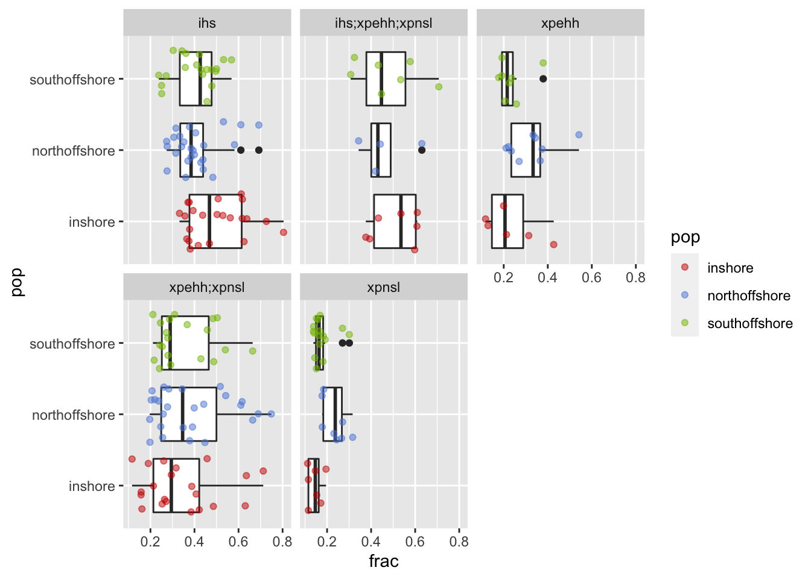

Identify outlying regions in selection analysis
================

-   [Windowed EHH tests](#windowed-ehh-tests)
-   [Overlap of windows between
    populations](#overlap-of-windows-between-populations)
-   [Consolidated list of all selected
    regions](#consolidated-list-of-all-selected-regions)
    -   [Annotating candidate regions](#annotating-candidate-regions)

## Windowed EHH tests

[Previously](08.ehh_stats.md), we calculated iHS, XP-EHH and XP-nSL
scores for all three populations and visualised their distribution
across the genome via Manhattan plots. Since selective sweeps should
have consistently outlying values of EHH statistics across a large
linked region we calculated the fraction of SNPs in each non-overlapping
50kb window that contained outlying, (\|z-score\|&gt;2) scores. This
follows the analysis of (**Voight2006?**) and was performed using the
program `norm` included with selscan. See
[08.ehh\_stats.md](08.ehh_stats.md) for details.

Both the XP-EHH and XP-nSL statistics are designed to compare two
populations. We designed our contrasts so that for each comparison there
was always one focal population while the remaining two populations were
used as a reference. This was based on the reasoning that it was
unlikely a selective sweep would occur independently at the same locus
in two separate populations. In the selscan outputs populations are
coded as A or B. Our focal population was always “A” so that positive
value of the statistic is associated with selection in the focal
population.

Regions in the top 1st percentile of extreme scores were picked as
candidate selective regions. Note that, while we picked windows with a
high proportion of extreme scores, the number of SNPs in each window was
also taken into consideration to avoid bias towards windows with less
SNPs. This is illustrated in the QC plot below which shows a relatively
even spread of selected windows across regions with different snp
densities.

**Figure 1:** Plots display the number of sites in window and the
proportion of extreme scores in window. The red dots depict the windows
in the 1st percentile where SNP density in each window been controlled.

## Overlap of windows between populations

Our main interest in this study is in selective sweeps that occurred
after the split between populations. For this reason we excluded regions
where the iHS test was also significant at 1% level in the other two
populations. This step was not necessary for the XP-EHH and XP-nSL tests
because these work by comparing levels of EHH in the focal population
against the reference and will therefore identify sweeps that exist only
in the focal population by design.

After excluding the shared iHS significant signals, less than 1% of
genomic regions were identified as candidates in three populations.

**Table 2:** The proportion of genome regions that are uniquely under
selective sweep in three populations

| Population     | Total length (Mb) of genomic regions | Number of Regions | Percentage of Total Genome (%) |
|:---------------|-------------------------------------:|------------------:|-------------------------------:|
| Inshore        |                             2.650040 |                40 |                      0.6370288 |
| North Offshore |                             2.250036 |                36 |                      0.5408740 |
| South Offshore |                             2.350036 |                36 |                      0.5649125 |

## Consolidated list of all selected regions

For each population we then created a list of all candidate regions
under selection by merging intervals that are adjacent, or separated by
no more than 100kb across all of the EHH statistics.

### Annotating candidate regions

To facilitate downstream analyses we annotated candidate regions by; 1.
Identifying overlapping genes 2. Information from `selscan` used to
assess the region (fraction of extreme values, stats in which the region
was in the 1st percentile)

These annotated candidate windows form the basis for [Supplementary
Table
S9](https://docs.google.com/spreadsheets/d/1d587-tYfD6Q5bRmBB0XYaKZRE-bmCqnhyQjpemAkvro/edit?usp=sharing)
in the paper. We save them so that later we can [investigate their
function](11.GO_enrichement.md) via GO enrichment analysis.

For the purposes of making a human viewable table in supp info we also
attach gene names from uniprot

| chr          |   Start |     End | Population     | Fraction with z-score &gt; 2 | stats           | Genes in this window                                                                                                                                                                                                                                                                                                                                                                                                                                                                                                                                                                                                                                                                                                                                                                                                                                                                                                                                                                                                                                                                                                                                                                                                                                                                                                                                                                                                                                                                                                                                                                                                                                                                                                                                                                                                                                                                                                                           |
|:-------------|--------:|--------:|:---------------|-----------------------------:|:----------------|:-----------------------------------------------------------------------------------------------------------------------------------------------------------------------------------------------------------------------------------------------------------------------------------------------------------------------------------------------------------------------------------------------------------------------------------------------------------------------------------------------------------------------------------------------------------------------------------------------------------------------------------------------------------------------------------------------------------------------------------------------------------------------------------------------------------------------------------------------------------------------------------------------------------------------------------------------------------------------------------------------------------------------------------------------------------------------------------------------------------------------------------------------------------------------------------------------------------------------------------------------------------------------------------------------------------------------------------------------------------------------------------------------------------------------------------------------------------------------------------------------------------------------------------------------------------------------------------------------------------------------------------------------------------------------------------------------------------------------------------------------------------------------------------------------------------------------------------------------------------------------------------------------------------------------------------------------|
| BLFC01000007 |  450000 |  500001 | North Offshore |                    0.2551020 | xpehh;xpnsl     | Ankyrin-3 (ANK-3) (Ankyrin-G);NA                                                                                                                                                                                                                                                                                                                                                                                                                                                                                                                                                                                                                                                                                                                                                                                                                                                                                                                                                                                                                                                                                                                                                                                                                                                                                                                                                                                                                                                                                                                                                                                                                                                                                                                                                                                                                                                                                                               |
| BLFC01000008 | 1150000 | 1200001 | Inshore        |                    0.3762380 | ihs             | NA                                                                                                                                                                                                                                                                                                                                                                                                                                                                                                                                                                                                                                                                                                                                                                                                                                                                                                                                                                                                                                                                                                                                                                                                                                                                                                                                                                                                                                                                                                                                                                                                                                                                                                                                                                                                                                                                                                                                             |
| BLFC01000008 | 2050000 | 2100001 | Inshore        |                    0.3876990 | xpehh;xpnsl     | CUB and peptidase domain-containing protein 1 (Fragment);BarH-like 1 homeobox protein;Homeobox protein Dlx4a (DLX-8) (Distal-less homeobox protein 4a);NA;Plastin-2 (L-plastin) (Lymphocyte cytosolic plastin 1);Golgin subfamily A member 4 (tGolgin-1)                                                                                                                                                                                                                                                                                                                                                                                                                                                                                                                                                                                                                                                                                                                                                                                                                                                                                                                                                                                                                                                                                                                                                                                                                                                                                                                                                                                                                                                                                                                                                                                                                                                                                       |
| BLFC01000016 | 1050000 | 1100001 | Inshore        |                    0.2125980 | xpehh           | Schlafen family member 13 (EC 3.1.-.-) (Schlafen-13) (hSLFN13);Protein SLFN14 \[Cleaved into: C-terminally truncated SLFN14 endoribonuclease (EC 3.1.-.-) (Schlafen family member 14)\];Myosin-2 essential light chain (Myosin II essential light chain) (Non-muscle myosin essential light chain)                                                                                                                                                                                                                                                                                                                                                                                                                                                                                                                                                                                                                                                                                                                                                                                                                                                                                                                                                                                                                                                                                                                                                                                                                                                                                                                                                                                                                                                                                                                                                                                                                                             |
| BLFC01000016 | 1250000 | 1350001 | North Offshore |                    0.2711113 | ihs;xpnsl       | Lipase ZK262.3 (EC 3.1.1.-);GTP-binding protein RHO1;Solute carrier family 15 member 2 (Peptide transporter 2) (PEPT2);Mitochondrial pyruvate carrier 1 (Apoptosis-regulating basic protein) (Brain protein 44-like protein);NA;E3 ubiquitin-protein ligase DZIP3 (EC 2.3.2.27) (DAZ-interacting protein 3) (RING-type E3 ubiquitin transferase DZIP3) (RNA-binding ubiquitin ligase of 138 kDa) (hRUL138);Patched domain-containing protein 3 (RND-type protein RNDEu-3)                                                                                                                                                                                                                                                                                                                                                                                                                                                                                                                                                                                                                                                                                                                                                                                                                                                                                                                                                                                                                                                                                                                                                                                                                                                                                                                                                                                                                                                                      |
| BLFC01000016 | 3200000 | 3250001 | North Offshore |                    0.3773580 | ihs             | Bromodomain and WD repeat-containing protein 1 (WD repeat-containing protein 9);Dehydrodolichyl diphosphate synthase complex subunit DHDDS (EC 2.5.1.87) (Cis-isoprenyltransferase) (CIT) (Cis-IPTase) (Cis-prenyltransferase subunit hCIT) (Epididymis tissue protein Li 189m);E3 ubiquitin-protein ligase TRIM71 (EC 2.3.2.27) (Protein lin-41 homolog) (RING-type E3 ubiquitin transferase TRIM71) (Tripartite motif-containing protein 71);Interactor protein for cytohesin exchange factors 1 (Phosphoinositide-binding protein PIP3-E)                                                                                                                                                                                                                                                                                                                                                                                                                                                                                                                                                                                                                                                                                                                                                                                                                                                                                                                                                                                                                                                                                                                                                                                                                                                                                                                                                                                                   |
| BLFC01000039 |  100000 |  150001 | Inshore        |                    0.7122590 | xpehh;xpnsl     | Septin-8;Lipopolysaccharide-responsive and beige-like anchor protein (Beige-like protein)                                                                                                                                                                                                                                                                                                                                                                                                                                                                                                                                                                                                                                                                                                                                                                                                                                                                                                                                                                                                                                                                                                                                                                                                                                                                                                                                                                                                                                                                                                                                                                                                                                                                                                                                                                                                                                                      |
| BLFC01000047 |  750000 |  800001 | South Offshore |                    0.2110450 | xpehh;xpnsl     | NA                                                                                                                                                                                                                                                                                                                                                                                                                                                                                                                                                                                                                                                                                                                                                                                                                                                                                                                                                                                                                                                                                                                                                                                                                                                                                                                                                                                                                                                                                                                                                                                                                                                                                                                                                                                                                                                                                                                                             |
| BLFC01000047 |  950000 | 1000001 | North Offshore |                    0.3657590 | xpehh           | Sacsin (DnaJ homolog subfamily C member 29) (DNAJC29);NA                                                                                                                                                                                                                                                                                                                                                                                                                                                                                                                                                                                                                                                                                                                                                                                                                                                                                                                                                                                                                                                                                                                                                                                                                                                                                                                                                                                                                                                                                                                                                                                                                                                                                                                                                                                                                                                                                       |
| BLFC01000047 | 1150000 | 1300001 | North Offshore |                    0.7508771 | xpnsl;ihs;xpehh | NA;Tetratricopeptide repeat protein 28 (TPR repeat protein 28);Major facilitator superfamily domain-containing protein 6 (Macrophage MHC class I receptor 2)                                                                                                                                                                                                                                                                                                                                                                                                                                                                                                                                                                                                                                                                                                                                                                                                                                                                                                                                                                                                                                                                                                                                                                                                                                                                                                                                                                                                                                                                                                                                                                                                                                                                                                                                                                                   |
| BLFC01000051 |  400000 |  450001 | South Offshore |                    0.1769040 | xpehh           | Laccase-4 (EC 1.10.3.2) (Benzenediol:oxygen oxidoreductase 4) (Diphenol oxidase 4) (Urishiol oxidase 4);Putative uncharacterized transposon-derived protein F52C9.6                                                                                                                                                                                                                                                                                                                                                                                                                                                                                                                                                                                                                                                                                                                                                                                                                                                                                                                                                                                                                                                                                                                                                                                                                                                                                                                                                                                                                                                                                                                                                                                                                                                                                                                                                                            |
| BLFC01000051 |  600000 |  650001 | Inshore        |                    0.3781510 | ihs             | Solute carrier family 35 member F5;Ectonucleotide pyrophosphatase/phosphodiesterase family member 5 (E-NPP 5) (NPP-5) (EC 3.1.-.-);NA                                                                                                                                                                                                                                                                                                                                                                                                                                                                                                                                                                                                                                                                                                                                                                                                                                                                                                                                                                                                                                                                                                                                                                                                                                                                                                                                                                                                                                                                                                                                                                                                                                                                                                                                                                                                          |
| BLFC01000051 | 2800000 | 2850001 | North Offshore |                    0.5416670 | xpehh           | NA                                                                                                                                                                                                                                                                                                                                                                                                                                                                                                                                                                                                                                                                                                                                                                                                                                                                                                                                                                                                                                                                                                                                                                                                                                                                                                                                                                                                                                                                                                                                                                                                                                                                                                                                                                                                                                                                                                                                             |
| BLFC01000051 | 3050000 | 3100001 | North Offshore |                    0.4473680 | xpehh;xpnsl     | NA                                                                                                                                                                                                                                                                                                                                                                                                                                                                                                                                                                                                                                                                                                                                                                                                                                                                                                                                                                                                                                                                                                                                                                                                                                                                                                                                                                                                                                                                                                                                                                                                                                                                                                                                                                                                                                                                                                                                             |
| BLFC01000051 | 3400000 | 3500001 | North Offshore |                    0.2638890 | xpnsl;xpehh     | NA;THAP domain-containing protein 1                                                                                                                                                                                                                                                                                                                                                                                                                                                                                                                                                                                                                                                                                                                                                                                                                                                                                                                                                                                                                                                                                                                                                                                                                                                                                                                                                                                                                                                                                                                                                                                                                                                                                                                                                                                                                                                                                                            |
| BLFC01000051 | 3550000 | 3600001 | Inshore        |                    0.1173710 | xpehh           | NA                                                                                                                                                                                                                                                                                                                                                                                                                                                                                                                                                                                                                                                                                                                                                                                                                                                                                                                                                                                                                                                                                                                                                                                                                                                                                                                                                                                                                                                                                                                                                                                                                                                                                                                                                                                                                                                                                                                                             |
| BLFC01000055 |  150000 |  250001 | South Offshore |                    0.3259185 | ihs;xpehh       | ZP domain-containing protein;NA;Integrin beta-like protein A (109 gene 1 protein);Oncoprotein-induced transcript 3 protein (Liver-specific zona pellucida domain-containing protein)                                                                                                                                                                                                                                                                                                                                                                                                                                                                                                                                                                                                                                                                                                                                                                                                                                                                                                                                                                                                                                                                                                                                                                                                                                                                                                                                                                                                                                                                                                                                                                                                                                                                                                                                                           |
| BLFC01000056 |  950000 | 1000001 | North Offshore |                    0.5418550 | xpehh;xpnsl     | Retrovirus-related Pol polyprotein from transposon 412 \[Includes: Protease (EC 3.4.23.-); Reverse transcriptase (EC 2.7.7.49); Endonuclease\];NA;MAD2L1-binding protein (Caught by MAD2 protein) (p31(comet));Conserved oligomeric Golgi complex subunit 2 (COG complex subunit 2) (Component of oligomeric Golgi complex 2) (Low density lipoprotein receptor defect C-complementing protein)                                                                                                                                                                                                                                                                                                                                                                                                                                                                                                                                                                                                                                                                                                                                                                                                                                                                                                                                                                                                                                                                                                                                                                                                                                                                                                                                                                                                                                                                                                                                                |
| BLFC01000056 | 1050000 | 1100001 | South Offshore |                    0.2782515 | xpehh;xpnsl     | Zinc transporter 6-A (ZnT-6-A) (Solute carrier family 30 member 6-A);NA                                                                                                                                                                                                                                                                                                                                                                                                                                                                                                                                                                                                                                                                                                                                                                                                                                                                                                                                                                                                                                                                                                                                                                                                                                                                                                                                                                                                                                                                                                                                                                                                                                                                                                                                                                                                                                                                        |
| BLFC01000057 |  650000 |  700001 | North Offshore |                    0.2609010 | xpehh;xpnsl     | Cysteine-rich protein 2-binding protein (CSRP2-binding protein) (ADA2A-containing complex subunit 2) (ATAC2) (CRP2-binding partner) (CRP2BP) (Lysine acetyltransferase 14);Tyrosine-protein kinase ZAP-70 (EC 2.7.10.2) (70 kDa zeta-chain associated protein) (Syk-related tyrosine kinase);G-protein-signaling modulator 2 (Pins homolog);Spermatogenesis-associated protein 1 (Sperm-specific protein SP-2);Chitin deacetylase 8 (BmCDA8) (EC 3.5.1.41) (Chitin deacetylase 17);Retinol dehydrogenase 12 (EC 1.1.1.300);ATP-dependent Clp protease proteolytic subunit, mitochondrial (EC 3.4.21.92) (Endopeptidase Clp)                                                                                                                                                                                                                                                                                                                                                                                                                                                                                                                                                                                                                                                                                                                                                                                                                                                                                                                                                                                                                                                                                                                                                                                                                                                                                                                    |
| BLFC01000057 |  650000 |  700001 | South Offshore |                    0.3009290 | xpnsl           | Cysteine-rich protein 2-binding protein (CSRP2-binding protein) (ADA2A-containing complex subunit 2) (ATAC2) (CRP2-binding partner) (CRP2BP) (Lysine acetyltransferase 14);Tyrosine-protein kinase ZAP-70 (EC 2.7.10.2) (70 kDa zeta-chain associated protein) (Syk-related tyrosine kinase);G-protein-signaling modulator 2 (Pins homolog);Spermatogenesis-associated protein 1 (Sperm-specific protein SP-2);Chitin deacetylase 8 (BmCDA8) (EC 3.5.1.41) (Chitin deacetylase 17);Retinol dehydrogenase 12 (EC 1.1.1.300);ATP-dependent Clp protease proteolytic subunit, mitochondrial (EC 3.4.21.92) (Endopeptidase Clp)                                                                                                                                                                                                                                                                                                                                                                                                                                                                                                                                                                                                                                                                                                                                                                                                                                                                                                                                                                                                                                                                                                                                                                                                                                                                                                                    |
| BLFC01000074 |  100000 |  250001 | Inshore        |                    0.4330030 | ihs;xpehh;xpnsl | Urocanate hydratase (Urocanase) (EC 4.2.1.49) (Imidazolonepropionate hydrolase);Histidine ammonia-lyase (Histidase) (EC 4.3.1.3);Dipeptidyl peptidase 1 (EC 3.4.14.1) (Cathepsin C) (Cathepsin J) (Dipeptidyl peptidase I) (DPP-I) (DPPI) (Dipeptidyl transferase) \[Cleaved into: Dipeptidyl peptidase 1 exclusion domain chain (Dipeptidyl peptidase I exclusion domain chain); Dipeptidyl peptidase 1 heavy chain (Dipeptidyl peptidase I heavy chain); Dipeptidyl peptidase 1 light chain (Dipeptidyl peptidase I light chain)\];Pyruvate dehydrogenase E1 component subunit beta, mitochondrial (PDHE1-B) (EC 1.2.4.1);ADP-ribosylation factor 4;NA;Plasma kallikrein (EC 3.4.21.34) (Fletcher factor) (Kininogenin) (Plasma prekallikrein) \[Cleaved into: Plasma kallikrein heavy chain; Plasma kallikrein light chain\];Actin-binding LIM protein 1 (abLIM-1) (Actin-binding LIM protein family member 1);N-acetyl-D-glucosamine kinase (N-acetylglucosamine kinase) (EC 2.7.1.59) (GlcNAc kinase)                                                                                                                                                                                                                                                                                                                                                                                                                                                                                                                                                                                                                                                                                                                                                                                                                                                                                                                                     |
| BLFC01000074 | 1200000 | 1250001 | South Offshore |                    0.2580000 | xpehh           | Glutathione S-transferase 1 (EC 2.5.1.18) (GST class-sigma);Glutathione S-transferase (EC 2.5.1.18);NA;Glutathione S-transferase (EC 2.5.1.18) (GST class-sigma);NLR family CARD domain-containing protein 3 (CARD15-like protein) (Caterpiller protein 16.2) (CLR16.2) (NACHT, LRR and CARD domains-containing protein 3) (Nucleotide-binding oligomerization domain protein 3)                                                                                                                                                                                                                                                                                                                                                                                                                                                                                                                                                                                                                                                                                                                                                                                                                                                                                                                                                                                                                                                                                                                                                                                                                                                                                                                                                                                                                                                                                                                                                               |
| BLFC01000082 |  550000 |  600001 | Inshore        |                    0.6377950 | ihs             | NA                                                                                                                                                                                                                                                                                                                                                                                                                                                                                                                                                                                                                                                                                                                                                                                                                                                                                                                                                                                                                                                                                                                                                                                                                                                                                                                                                                                                                                                                                                                                                                                                                                                                                                                                                                                                                                                                                                                                             |
| BLFC01000089 |  100000 |  200001 | North Offshore |                    0.2835550 | xpehh;xpnsl     | Cannabinoid receptor 2 (CB-2) (CB2) (hCB2) (CX5);Cannabinoid receptor 2 (CB-2) (CB2) (rCB2)                                                                                                                                                                                                                                                                                                                                                                                                                                                                                                                                                                                                                                                                                                                                                                                                                                                                                                                                                                                                                                                                                                                                                                                                                                                                                                                                                                                                                                                                                                                                                                                                                                                                                                                                                                                                                                                    |
| BLFC01000089 |  100000 |  200001 | South Offshore |                    0.1814810 | xpnsl           | Cannabinoid receptor 2 (CB-2) (CB2) (hCB2) (CX5);Cannabinoid receptor 2 (CB-2) (CB2) (rCB2)                                                                                                                                                                                                                                                                                                                                                                                                                                                                                                                                                                                                                                                                                                                                                                                                                                                                                                                                                                                                                                                                                                                                                                                                                                                                                                                                                                                                                                                                                                                                                                                                                                                                                                                                                                                                                                                    |
| BLFC01000100 |  800000 |  850001 | North Offshore |                    0.6644190 | xpehh;xpnsl     | Beta-2 adrenergic receptor (Beta-2 adrenoreceptor) (Beta-2 adrenoceptor);Arrestin domain-containing protein 2;Probable ribosome biogenesis protein RLP24 (Ribosomal L24 domain-containing protein 1) (Ribosomal protein L24-like);Semaphorin-1A (Semaphorin-I) (Sema I)                                                                                                                                                                                                                                                                                                                                                                                                                                                                                                                                                                                                                                                                                                                                                                                                                                                                                                                                                                                                                                                                                                                                                                                                                                                                                                                                                                                                                                                                                                                                                                                                                                                                        |
| BLFC01000100 | 1550000 | 1700001 | North Offshore |                    0.4384080 | ihs             | Uncharacterized protein K02A2.6;RNA-directed DNA polymerase from mobile element jockey (EC 2.7.7.49) (Reverse transcriptase);NA;Multiple C2 and transmembrane domain-containing protein 1                                                                                                                                                                                                                                                                                                                                                                                                                                                                                                                                                                                                                                                                                                                                                                                                                                                                                                                                                                                                                                                                                                                                                                                                                                                                                                                                                                                                                                                                                                                                                                                                                                                                                                                                                      |
| BLFC01000100 | 2200000 | 2250001 | North Offshore |                    0.3743590 | xpehh           | NA;Uncharacterized protein K02A2.6                                                                                                                                                                                                                                                                                                                                                                                                                                                                                                                                                                                                                                                                                                                                                                                                                                                                                                                                                                                                                                                                                                                                                                                                                                                                                                                                                                                                                                                                                                                                                                                                                                                                                                                                                                                                                                                                                                             |
| BLFC01000100 | 3250000 | 3350001 | South Offshore |                    0.3998328 | ihs;xpehh       | NA;Protein mab-21-like 3;Kinase suppressor of Ras 2 (hKSR2) (EC 2.7.11.1);Sorting nexin-27;CREB-regulated transcription coactivator 1 (Mucoepidermoid carcinoma translocated protein 1 homolog) (Transducer of regulated cAMP response element-binding protein 1) (TORC-1) (Transducer of CREB protein 1)                                                                                                                                                                                                                                                                                                                                                                                                                                                                                                                                                                                                                                                                                                                                                                                                                                                                                                                                                                                                                                                                                                                                                                                                                                                                                                                                                                                                                                                                                                                                                                                                                                      |
| BLFC01000106 |  450000 |  500001 | South Offshore |                    0.1388160 | xpnsl           | CCR4-NOT transcription complex subunit 1 (CCR4-associated factor 1);Actin-related protein 2/3 complex subunit 4;Furin (EC 3.4.21.75) (Dibasic-processing enzyme) (Paired basic amino acid residue-cleaving enzyme) (PACE) (Trans Golgi network protease furin);Doublecortin domain-containing protein 2                                                                                                                                                                                                                                                                                                                                                                                                                                                                                                                                                                                                                                                                                                                                                                                                                                                                                                                                                                                                                                                                                                                                                                                                                                                                                                                                                                                                                                                                                                                                                                                                                                        |
| BLFC01000123 |  850000 |  900001 | Inshore        |                    0.4573920 | xpehh;xpnsl     | NA;Cytochrome b-c1 complex subunit 7 (Complex III subunit 7) (Complex III subunit VII) (Ubiquinol-cytochrome c reductase complex 14 kDa protein);Ras-related protein Rab-38;Growth/differentiation factor 5 (GDF-5) (Bone morphogenetic protein 14) (BMP-14) (Cartilage-derived morphogenetic protein 1) (CDMP-1) (Lipopolysaccharide-associated protein 4) (LAP-4) (LPS-associated protein 4) (Radotermin)                                                                                                                                                                                                                                                                                                                                                                                                                                                                                                                                                                                                                                                                                                                                                                                                                                                                                                                                                                                                                                                                                                                                                                                                                                                                                                                                                                                                                                                                                                                                    |
| BLFC01000123 | 1650000 | 1750001 | South Offshore |                    0.3612090 | ihs             | NA;Cadherin-4;Probable glycosyltransferase STELLO2 (EC 2.4.-.-);E3 SUMO-protein ligase NSE2 (EC 2.3.2.-) (E3 SUMO-protein transferase NSE2) (MMS21 homolog) (Non-structural maintenance of chromosomes element 2 homolog) (Non-SMC element 2 homolog);Probable E3 ubiquitin-protein ligase RNF217 (EC 2.3.2.31) (IBR domain-containing protein 1) (RING finger protein 217);Protein FAM8A1 (Autosomal highly conserved protein);Peroxisomal acyl-coenzyme A oxidase 1 (AOX) (EC 1.3.3.6) (Palmitoyl-CoA oxidase) \[Cleaved into: Peroxisomal acyl-CoA oxidase 1, A chain; Peroxisomal acyl-CoA oxidase 1, B chain; Peroxisomal acyl-CoA oxidase 1, C chain\];Bifunctional peptidase and (3S)-lysyl hydroxylase Jmjd7 (EC 1.14.11.63) (EC 3.4.-.-) (JmjC domain-containing protein 7) (Jumonji domain-containing protein 7) (L-lysine (3S)-hydroxylase Jmjd7);X-ray repair cross-complementing protein 5 (EC 3.6.4.-) (ATP-dependent DNA helicase 2 subunit 2) (ATP-dependent DNA helicase II 80 kDa subunit) (CTC box-binding factor 85 kDa subunit) (CTC85) (CTCBF) (DNA repair protein XRCC5) (Ku autoantigen protein p86 homolog) (Ku80) (Nuclear factor IV);Frizzled-2 (Fz-2) (Xfz2);Failed axon connections homolog;tRNA (guanine(10)-N2)-methyltransferase homolog (EC 2.1.1.-) (tRNA guanosine-2’-O-methyltransferase TRM11 homolog);Glutamate–cysteine ligase catalytic subunit (EC 6.3.2.2) (GCS heavy chain) (Gamma-ECS) (Gamma-glutamylcysteine synthetase)                                                                                                                                                                                                                                                                                                                                                                                                                                                                         |
| BLFC01000124 |  650000 |  700001 | South Offshore |                    0.4567220 | ihs             | NA;Transcription initiation factor IIB (EC 2.3.1.48) (General transcription factor TFIIB);Probable 3-beta-hydroxysteroid-Delta(8),Delta(7)-isomerase (EC 5.3.3.5) (Cholestenol Delta-isomerase) (Delta(8)-Delta(7) sterol isomerase) (D8-D7 sterol isomerase) (Emopamil-binding protein homolog);Palmitoyltransferase ZDHHC17 (EC 2.3.1.225) (Acyltransferase ZDHHC17) (EC 2.3.1.-) (DHHC domain-containing cysteine-rich protein 17) (DHHC17) (Huntingtin yeast partner H) (Huntingtin-interacting protein 14) (HIP-14) (Huntingtin-interacting protein 3) (HIP-3) (Huntingtin-interacting protein H) (Putative MAPK-activating protein PM11) (Putative NF-kappa-B-activating protein 205) (Zinc finger DHHC domain-containing protein 17);Palmitoyltransferase ZDHHC17 (EC 2.3.1.225) (Acyltransferase ZDHHC17) (EC 2.3.1.-) (Zinc finger DHHC domain-containing protein 17);Histone-lysine N-methyltransferase KMT5B (Lysine-specific methyltransferase 5B) (Suppressor of variegation 4-20 homolog 1) (Su(var)4-20 homolog 1) (Suv4-20h1) (\[histone H4\]-N-methyl-L-lysine20 N-methyltransferase KMT5B) (EC 2.1.1.362) (\[histone H4\]-lysine20 N-methyltransferase KMT5B) (EC 2.1.1.361);Caprin-1 (Cell cycle-associated protein 1) (Cytoplasmic activation- and proliferation-associated protein 1) (GPI-anchored membrane protein 1) (GPI-anchored protein p137) (GPI-p137) (p137GPI) (Membrane component chromosome 11 surface marker 1) (RNA granule protein 105)                                                                                                                                                                                                                                                                                                                                                                                                                                                                    |
| BLFC01000125 | 1600000 | 1650001 | North Offshore |                    0.4198210 | ihs;xpehh;xpnsl | Sodium/calcium exchanger NCL (Na(+)/Ca(2+)-exchange protein NCL) (Protein NCX-like) (AtNCL);NA                                                                                                                                                                                                                                                                                                                                                                                                                                                                                                                                                                                                                                                                                                                                                                                                                                                                                                                                                                                                                                                                                                                                                                                                                                                                                                                                                                                                                                                                                                                                                                                                                                                                                                                                                                                                                                                 |
| BLFC01000125 | 2250000 | 2300001 | North Offshore |                    0.2434990 | xpnsl           | Uncharacterized protein K02A2.6;E3 ubiquitin-protein ligase PDZRN3 (EC 2.3.2.27) (PDZ domain-containing RING finger protein 3) (RING-type E3 ubiquitin transferase PDZRN3) (Semaphorin cytoplasmic domain-associated protein 3) (Protein SEMACAP3)                                                                                                                                                                                                                                                                                                                                                                                                                                                                                                                                                                                                                                                                                                                                                                                                                                                                                                                                                                                                                                                                                                                                                                                                                                                                                                                                                                                                                                                                                                                                                                                                                                                                                             |
| BLFC01000137 |  350000 |  400001 | North Offshore |                    0.4285710 | ihs             | NA                                                                                                                                                                                                                                                                                                                                                                                                                                                                                                                                                                                                                                                                                                                                                                                                                                                                                                                                                                                                                                                                                                                                                                                                                                                                                                                                                                                                                                                                                                                                                                                                                                                                                                                                                                                                                                                                                                                                             |
| BLFC01000137 |  650000 |  850001 | South Offshore |                    0.5682340 | ihs             | NA;Protein ALP1-like (EC 3.1.-.-);Zinc finger protein 862                                                                                                                                                                                                                                                                                                                                                                                                                                                                                                                                                                                                                                                                                                                                                                                                                                                                                                                                                                                                                                                                                                                                                                                                                                                                                                                                                                                                                                                                                                                                                                                                                                                                                                                                                                                                                                                                                      |
| BLFC01000148 |  600000 |  800001 | South Offshore |                    0.3052659 | xpehh;xpnsl;ihs | Centrosomal protein CCDC61 (Coiled-coil domain-containing protein 61) (VFL3 homolog);NA;KATNB1-like protein 1 (Katanin p80 subunit B-like 1);Protein phosphatase 1A (EC 3.1.3.16) (Protein phosphatase 2C isoform alpha) (PP2C-alpha) (Protein phosphatase IA);Alpha-1B adrenergic receptor (Alpha-1B adrenoreceptor) (Alpha-1B adrenoceptor);Putative E3 ubiquitin-protein ligase UBR7 (EC 2.3.2.27) (N-recognin-7) (RING-type E3 ubiquitin transferase UBR7);MAPK/MAK/MRK overlapping kinase (EC 2.7.11.22) (MOK protein kinase) (Renal tumor antigen 1) (RAGE-1);Dynein regulatory complex subunit 7 (Coiled-coil domain-containing protein 135) (Coiled-coil domain-containing protein lobo homolog)                                                                                                                                                                                                                                                                                                                                                                                                                                                                                                                                                                                                                                                                                                                                                                                                                                                                                                                                                                                                                                                                                                                                                                                                                                       |
| BLFC01000152 |   50000 |  100001 | North Offshore |                    0.3333330 | ihs             | NA;ZP domain-containing protein;Hemicentin-2                                                                                                                                                                                                                                                                                                                                                                                                                                                                                                                                                                                                                                                                                                                                                                                                                                                                                                                                                                                                                                                                                                                                                                                                                                                                                                                                                                                                                                                                                                                                                                                                                                                                                                                                                                                                                                                                                                   |
| BLFC01000152 | 2400000 | 2450001 | South Offshore |                    0.4296520 | ihs             | Alpha-1,3-mannosyl-glycoprotein 4-beta-N-acetylglucosaminyltransferase C (EC 2.4.1.145) (N-acetylglucosaminyltransferase IV homolog) (hGnT-IV-H) (N-glycosyl-oligosaccharide-glycoprotein N-acetylglucosaminyltransferase IVc) (GlcNAc-T IVc) (GnT-IVc) (N-acetylglucosaminyltransferase IVc) (UDP-N-acetylglucosamine: alpha-1,3-D-mannoside beta-1,4-N-acetylglucosaminyltransferase IVc);Angiomotin;5-hydroxytryptamine receptor 1D (5-HT-1D) (5-HT1D) (Serotonin receptor 1D) (Fragment);G-protein coupled receptor 161;Presenilins-associated rhomboid-like protein, mitochondrial (EC 3.4.21.105) (Mitochondrial intramembrane cleaving protease PARL) \[Cleaved into: P-beta (Pbeta)\]                                                                                                                                                                                                                                                                                                                                                                                                                                                                                                                                                                                                                                                                                                                                                                                                                                                                                                                                                                                                                                                                                                                                                                                                                                                  |
| BLFC01000152 | 2450000 | 2500001 | North Offshore |                    0.2702700 | xpnsl           | Presenilins-associated rhomboid-like protein, mitochondrial (EC 3.4.21.105) (Mitochondrial intramembrane cleaving protease PARL) \[Cleaved into: P-beta (Pbeta)\];NA;Venom prothrombin activator pseutarin-C non-catalytic subunit (PCNS) (vPA) (Venom coagulation factor Va-like protein) \[Cleaved into: Pseutarin-C non-catalytic subunit heavy chain; Pseutarin-C non-catalytic subunit light chain\]                                                                                                                                                                                                                                                                                                                                                                                                                                                                                                                                                                                                                                                                                                                                                                                                                                                                                                                                                                                                                                                                                                                                                                                                                                                                                                                                                                                                                                                                                                                                      |
| BLFC01000154 |       0 |   50001 | South Offshore |                    0.2713940 | ihs             | Aminopeptidase Ey (EC 3.4.11.20) (Aminopeptidase N);Neuropeptide FF receptor 2 (G-protein coupled receptor 74) (G-protein coupled receptor HLWAR77) (Neuropeptide G-protein coupled receptor);Galanin receptor 2b;Pyroglutamylated RF-amide peptide receptor (AQ27) (G-protein coupled receptor 103) (Orexigenic neuropeptide QRFP receptor) (SP9155);QRFP-like peptide receptor;Regulator of G-protein signaling 19 (RGS19) (G-alpha-interacting protein) (GAIP)                                                                                                                                                                                                                                                                                                                                                                                                                                                                                                                                                                                                                                                                                                                                                                                                                                                                                                                                                                                                                                                                                                                                                                                                                                                                                                                                                                                                                                                                              |
| BLFC01000154 |  200000 |  250001 | South Offshore |                    0.1660180 | xpnsl           | Peroxidasin (EC 1.11.1.7)                                                                                                                                                                                                                                                                                                                                                                                                                                                                                                                                                                                                                                                                                                                                                                                                                                                                                                                                                                                                                                                                                                                                                                                                                                                                                                                                                                                                                                                                                                                                                                                                                                                                                                                                                                                                                                                                                                                      |
| BLFC01000154 |  250000 |  300001 | Inshore        |                    0.2135055 | xpehh;xpnsl     | Peroxidasin (EC 1.11.1.7);NA;Chorion peroxidase (EC 1.11.1.7) (Peroxinectin-related protein) (Dpxt);Peroxidasin homolog (EC 1.11.1.7) (Melanoma-associated antigen MG50) (Vascular peroxidase 1) (p53-responsive gene 2 protein)                                                                                                                                                                                                                                                                                                                                                                                                                                                                                                                                                                                                                                                                                                                                                                                                                                                                                                                                                                                                                                                                                                                                                                                                                                                                                                                                                                                                                                                                                                                                                                                                                                                                                                               |
| BLFC01000158 |  700000 |  750001 | Inshore        |                    0.8045110 | ihs             | Bloom syndrome protein homolog (xBLM) (EC 3.6.4.12) (RecQ helicase homolog)                                                                                                                                                                                                                                                                                                                                                                                                                                                                                                                                                                                                                                                                                                                                                                                                                                                                                                                                                                                                                                                                                                                                                                                                                                                                                                                                                                                                                                                                                                                                                                                                                                                                                                                                                                                                                                                                    |
| BLFC01000161 |  700000 |  750001 | Inshore        |                    0.1579545 | xpehh;xpnsl     | NA                                                                                                                                                                                                                                                                                                                                                                                                                                                                                                                                                                                                                                                                                                                                                                                                                                                                                                                                                                                                                                                                                                                                                                                                                                                                                                                                                                                                                                                                                                                                                                                                                                                                                                                                                                                                                                                                                                                                             |
| BLFC01000166 | 1100000 | 1150001 | Inshore        |                    0.4270830 | xpehh           | NA                                                                                                                                                                                                                                                                                                                                                                                                                                                                                                                                                                                                                                                                                                                                                                                                                                                                                                                                                                                                                                                                                                                                                                                                                                                                                                                                                                                                                                                                                                                                                                                                                                                                                                                                                                                                                                                                                                                                             |
| BLFC01000172 | 1250000 | 1300001 | Inshore        |                    0.1950650 | xpnsl           | Probable rRNA-processing protein EBP2;Trimeric intracellular cation channel type 1B.1 (TRIC-1B.1) (TRIC-B1);NA;Protein mab-21-like;Delta(3,5)-Delta(2,4)-dienoyl-CoA isomerase, mitochondrial (EC 5.3.3.-)                                                                                                                                                                                                                                                                                                                                                                                                                                                                                                                                                                                                                                                                                                                                                                                                                                                                                                                                                                                                                                                                                                                                                                                                                                                                                                                                                                                                                                                                                                                                                                                                                                                                                                                                     |
| BLFC01000174 |   50000 |  100001 | North Offshore |                    0.2219250 | xpehh           | N(4)-(beta-N-acetylglucosaminyl)-L-asparaginase (EC 3.5.1.26) (Aspartylglucosaminidase) (AGA) (Glycosylasparaginase) (N4-(N-acetyl-beta-glucosaminyl)-L-asparagine amidase) \[Cleaved into: Glycosylasparaginase alpha chain; Glycosylasparaginase beta chain\]                                                                                                                                                                                                                                                                                                                                                                                                                                                                                                                                                                                                                                                                                                                                                                                                                                                                                                                                                                                                                                                                                                                                                                                                                                                                                                                                                                                                                                                                                                                                                                                                                                                                                |
| BLFC01000184 | 1050000 | 1100001 | South Offshore |                    0.1412180 | xpnsl           | Tektin-B1;Transmembrane protein 244;Neurexin-1 (Neurexin I-alpha) (Neurexin-1-alpha);NA;Neurexin-2 (Neurexin II-alpha) (Neurexin-2-alpha);Protein male abnormal 21                                                                                                                                                                                                                                                                                                                                                                                                                                                                                                                                                                                                                                                                                                                                                                                                                                                                                                                                                                                                                                                                                                                                                                                                                                                                                                                                                                                                                                                                                                                                                                                                                                                                                                                                                                             |
| BLFC01000184 | 1600000 | 1650001 | South Offshore |                    0.3433480 | ihs             | Brefeldin A-inhibited guanine nucleotide-exchange protein 1 (Brefeldin A-inhibited GEP 1) (ADP-ribosylation factor guanine nucleotide-exchange factor 1) (p200 ARF guanine nucleotide exchange factor) (p200 ARF-GEP1);Cathepsin L (EC 3.4.22.15) (Cysteine proteinase 1) \[Cleaved into: Cathepsin L heavy chain; Cathepsin L light chain\]                                                                                                                                                                                                                                                                                                                                                                                                                                                                                                                                                                                                                                                                                                                                                                                                                                                                                                                                                                                                                                                                                                                                                                                                                                                                                                                                                                                                                                                                                                                                                                                                   |
| BLFC01000185 |  100000 |  300001 | South Offshore |                    0.7074474 | ihs;xpehh;xpnsl | Octopamine receptor beta-2R (CsOA2B2);A disintegrin and metalloproteinase with thrombospondin motifs 6 (ADAM-TS 6) (ADAM-TS6) (ADAMTS-6) (EC 3.4.24.-);A disintegrin and metalloproteinase with thrombospondin motifs 18 (ADAM-TS 18) (ADAM-TS18) (ADAMTS-18) (EC 3.4.24.-);Kelch-like protein 28 (BTB/POZ domain-containing protein 5);NA;Ubiquitin-associated domain-containing protein 1 (UBA domain-containing protein 1) (E3 ubiquitin-protein ligase subunit KPC2) (Kip1 ubiquitination-promoting complex protein 2);Calcium channel flower homolog (Calcium channel flower domain-containing protein 1);E3 ubiquitin-protein ligase LRSAM1 (EC 2.3.2.27) (Leucine-rich repeat and sterile alpha motif-containing protein 1) (RING-type E3 ubiquitin transferase LRSAM1) (Tsg101-associated ligase);Spectrin alpha chain, non-erythrocytic 1 (Alpha-II spectrin) (Fodrin alpha chain) (Spectrin, non-erythroid alpha subunit)                                                                                                                                                                                                                                                                                                                                                                                                                                                                                                                                                                                                                                                                                                                                                                                                                                                                                                                                                                                                            |
| BLFC01000185 |  900000 | 1050001 | Inshore        |                    0.4073883 | xpehh;xpnsl     | HMG box-containing protein 1 (HMG box transcription factor 1) (High mobility group box transcription factor 1);Lipoxygenase homology domain-containing protein 1;Long-chain fatty acid transport protein 4 (FATP-4) (Fatty acid transport protein 4) (Arachidonate–CoA ligase) (EC 6.2.1.15) (Long-chain-fatty-acid–CoA ligase) (Solute carrier family 27 member 4) (Very long-chain acyl-CoA synthetase 4) (ACSVL4) (EC 6.2.1.-);Long-chain fatty acid transport protein 1 (FATP-1) (Fatty acid transport protein 1) (EC 6.2.1.15) (Fatty acid transport protein) (Solute carrier family 27 member 1);Death domain-associated protein 6 (Daxx);WD repeat-containing protein 47 (Neuronal enriched MAP interacting protein) (Nemitin);Membrane-associated guanylate kinase, WW and PDZ domain-containing protein 3 (Membrane-associated guanylate kinase inverted 3) (MAGI-3);Syntaxin-6;Cadmium/zinc-transporting ATPase HMA2 (EC 7.2.2.12) (EC 7.2.2.21) (Protein HEAVY METAL ATPASE 2) (OsHMA2);NA;Retinoic acid receptor RXR (Retinoid X receptor) (LymRXR);Sarcosine dehydrogenase, mitochondrial (SarDH) (EC 1.5.8.3);Calcium-binding mitochondrial carrier protein SCaMC-2 (Small calcium-binding mitochondrial carrier protein 2) (Solute carrier family 25 member 25)                                                                                                                                                                                                                                                                                                                                                                                                                                                                                                                                                                                                                                                                 |
| BLFC01000185 | 1150000 | 1200001 | North Offshore |                    0.1843750 | xpnsl           | Alkylglycerol monooxygenase (EC 1.14.16.5) (Transmembrane protein 195);NA;Torsin-1A-interacting protein 1 (Lamina-associated polypeptide 1B) (LAP1B) (Lamina-associated polypeptide 1C) (LAP1C);Torsin-1A (Dystonia 1 protein) (Torsin ATPase 1) (EC 3.6.4.-) (Torsin family 1 member A);Ubiquitin carboxyl-terminal hydrolase 20 (EC 3.4.19.12) (Deubiquitinating enzyme 20) (Ubiquitin thioesterase 20) (Ubiquitin-specific-processing protease 20)                                                                                                                                                                                                                                                                                                                                                                                                                                                                                                                                                                                                                                                                                                                                                                                                                                                                                                                                                                                                                                                                                                                                                                                                                                                                                                                                                                                                                                                                                          |
| BLFC01000185 | 1550000 | 1600001 | South Offshore |                    0.1917810 | xpehh           | TNF receptor-associated factor 3 (EC 2.3.2.27) (CD40 receptor-associated factor 1) (CRAF1) (RING-type E3 ubiquitin transferase TRAF3) (TRAFAMN);Probable glycoprotein hormone G-protein coupled receptor                                                                                                                                                                                                                                                                                                                                                                                                                                                                                                                                                                                                                                                                                                                                                                                                                                                                                                                                                                                                                                                                                                                                                                                                                                                                                                                                                                                                                                                                                                                                                                                                                                                                                                                                       |
| BLFC01000201 |  150000 |  200001 | North Offshore |                    0.2737560 | ihs             | N(G),N(G)-dimethylarginine dimethylaminohydrolase 1 (DDAH-1) (Dimethylarginine dimethylaminohydrolase 1) (EC 3.5.3.18) (DDAHI) (Dimethylargininase-1);NA;Beta-4C adrenergic receptor (Beta-4C adrenoreceptor) (Beta-4C adrenoceptor);Cathepsin B (EC 3.4.22.1) \[Cleaved into: Cathepsin B light chain; Cathepsin B heavy chain\]                                                                                                                                                                                                                                                                                                                                                                                                                                                                                                                                                                                                                                                                                                                                                                                                                                                                                                                                                                                                                                                                                                                                                                                                                                                                                                                                                                                                                                                                                                                                                                                                              |
| BLFC01000201 |  800000 |  850001 | North Offshore |                    0.2754880 | ihs             | INO80 complex subunit E (Coiled-coil domain-containing protein 95);NA;pre-rRNA 2’-O-ribose RNA methyltransferase FTSJ3 (EC 2.1.1.-) (Protein ftsJ homolog 3) (Putative rRNA methyltransferase 3)                                                                                                                                                                                                                                                                                                                                                                                                                                                                                                                                                                                                                                                                                                                                                                                                                                                                                                                                                                                                                                                                                                                                                                                                                                                                                                                                                                                                                                                                                                                                                                                                                                                                                                                                               |
| BLFC01000201 | 1300000 | 1350001 | South Offshore |                    0.3034300 | ihs             | Polycystic kidney disease protein 1-like 2 (PC1-like 2 protein) (Polycystin-1L2);Vascular endothelial growth factor A-A (VEGF-A-A);NA                                                                                                                                                                                                                                                                                                                                                                                                                                                                                                                                                                                                                                                                                                                                                                                                                                                                                                                                                                                                                                                                                                                                                                                                                                                                                                                                                                                                                                                                                                                                                                                                                                                                                                                                                                                                          |
| BLFC01000201 | 2350000 | 2400001 | South Offshore |                    0.2358080 | xpehh           | NA                                                                                                                                                                                                                                                                                                                                                                                                                                                                                                                                                                                                                                                                                                                                                                                                                                                                                                                                                                                                                                                                                                                                                                                                                                                                                                                                                                                                                                                                                                                                                                                                                                                                                                                                                                                                                                                                                                                                             |
| BLFC01000201 | 2450000 | 2500001 | Inshore        |                    0.5625000 | ihs             | NA                                                                                                                                                                                                                                                                                                                                                                                                                                                                                                                                                                                                                                                                                                                                                                                                                                                                                                                                                                                                                                                                                                                                                                                                                                                                                                                                                                                                                                                                                                                                                                                                                                                                                                                                                                                                                                                                                                                                             |
| BLFC01000208 |  350000 |  400001 | South Offshore |                    0.2129930 | ihs;xpehh       | Beta-2 adrenergic receptor (Beta-2 adrenoreceptor) (Beta-2 adrenoceptor);Tenascin-X (TN-X) (Hexabrachion-like protein);BTB/POZ domain-containing protein 6;Leucine-rich repeat-containing protein 74A (Leucine-rich repeat-containing protein 74);rRNA-processing protein FCF1 homolog;NA                                                                                                                                                                                                                                                                                                                                                                                                                                                                                                                                                                                                                                                                                                                                                                                                                                                                                                                                                                                                                                                                                                                                                                                                                                                                                                                                                                                                                                                                                                                                                                                                                                                      |
| BLFC01000211 |  400000 |  450001 | North Offshore |                    0.4835160 | ihs             | Importin subunit beta-1 (Karyopherin subunit beta-1) (Nuclear factor p97) (Pore targeting complex 97 kDa subunit) (PTAC97);Endoplasmic reticulum lectin 1 (ER lectin) (Erlectin)                                                                                                                                                                                                                                                                                                                                                                                                                                                                                                                                                                                                                                                                                                                                                                                                                                                                                                                                                                                                                                                                                                                                                                                                                                                                                                                                                                                                                                                                                                                                                                                                                                                                                                                                                               |
| BLFC01000211 |  400000 |  450001 | South Offshore |                    0.2794610 | xpehh;xpnsl     | Importin subunit beta-1 (Karyopherin subunit beta-1) (Nuclear factor p97) (Pore targeting complex 97 kDa subunit) (PTAC97);Endoplasmic reticulum lectin 1 (ER lectin) (Erlectin)                                                                                                                                                                                                                                                                                                                                                                                                                                                                                                                                                                                                                                                                                                                                                                                                                                                                                                                                                                                                                                                                                                                                                                                                                                                                                                                                                                                                                                                                                                                                                                                                                                                                                                                                                               |
| BLFC01000211 |  650000 |  700001 | North Offshore |                    0.3440860 | xpehh           | D-inositol 3-phosphate glycosyltransferase 1 (EC 2.4.1.250) (N-acetylglucosamine-inositol-phosphate N-acetylglucosaminyltransferase 1) (GlcNAc-Ins-P N-acetylglucosaminyltransferase 1);CD63 antigen (Mast cell antigen AD1) (CD antigen CD63)                                                                                                                                                                                                                                                                                                                                                                                                                                                                                                                                                                                                                                                                                                                                                                                                                                                                                                                                                                                                                                                                                                                                                                                                                                                                                                                                                                                                                                                                                                                                                                                                                                                                                                 |
| BLFC01000235 | 3050000 | 3100001 | North Offshore |                    0.3061730 | ihs             | NA;Dual specificity testis-specific protein kinase 2 (EC 2.7.12.1) (Testicular protein kinase 2);Putative histone-lysine N-methyltransferase PRDM6 (EC 2.1.1.361) (PR domain zinc finger protein 6) (PR domain-containing protein 6) (PR domain-containing protein in smooth muscle);Asparagine synthetase domain-containing protein 1;ATPase ASNA1 homolog (EC 3.6.-.-) (Arsenical pump-driving ATPase homolog) (Arsenite-stimulated ATPase)                                                                                                                                                                                                                                                                                                                                                                                                                                                                                                                                                                                                                                                                                                                                                                                                                                                                                                                                                                                                                                                                                                                                                                                                                                                                                                                                                                                                                                                                                                  |
| BLFC01000235 | 3250000 | 3300001 | Inshore        |                    0.2502960 | ihs;xpnsl       | DNA repair and recombination protein RAD54-like (EC 3.6.4.-) (Putative recombination factor GdRad54) (RAD54 homolog) (Fragment);Alpha-ketoglutarate-dependent dioxygenase alkB homolog 7, mitochondrial (EC 1.14.11.-) (Alkylated DNA repair protein alkB homolog 7);Probable E3 ubiquitin-protein ligase makorin-1 (EC 2.3.2.27) (RING-type E3 ubiquitin transferase makorin-1);Ammonium transporter Rh type B-B (Rhesus blood group family type B glycoprotein B) (Rh family type B glycoprotein B) (Rh type B glycoprotein B);Cilia- and flagella-associated protein 57 (WD repeat-containing protein 65)                                                                                                                                                                                                                                                                                                                                                                                                                                                                                                                                                                                                                                                                                                                                                                                                                                                                                                                                                                                                                                                                                                                                                                                                                                                                                                                                   |
| BLFC01000243 |  650000 |  700001 | South Offshore |                    0.2727270 | xpehh;xpnsl     | NA                                                                                                                                                                                                                                                                                                                                                                                                                                                                                                                                                                                                                                                                                                                                                                                                                                                                                                                                                                                                                                                                                                                                                                                                                                                                                                                                                                                                                                                                                                                                                                                                                                                                                                                                                                                                                                                                                                                                             |
| BLFC01000255 |   50000 |  300001 | North Offshore |                    0.2945238 | xpehh;xpnsl;ihs | NA;Putative nuclease HARBI1 (EC 3.1.-.-) (Harbinger transposase-derived nuclease);Melanopsin-B (Opsin-4B)                                                                                                                                                                                                                                                                                                                                                                                                                                                                                                                                                                                                                                                                                                                                                                                                                                                                                                                                                                                                                                                                                                                                                                                                                                                                                                                                                                                                                                                                                                                                                                                                                                                                                                                                                                                                                                      |
| BLFC01000255 |  450000 |  500001 | South Offshore |                    0.4970060 | ihs             | NA                                                                                                                                                                                                                                                                                                                                                                                                                                                                                                                                                                                                                                                                                                                                                                                                                                                                                                                                                                                                                                                                                                                                                                                                                                                                                                                                                                                                                                                                                                                                                                                                                                                                                                                                                                                                                                                                                                                                             |
| BLFC01000255 |  450000 |  600001 | North Offshore |                    0.3780862 | xpehh;xpnsl     | NA;Zinc finger protein 862                                                                                                                                                                                                                                                                                                                                                                                                                                                                                                                                                                                                                                                                                                                                                                                                                                                                                                                                                                                                                                                                                                                                                                                                                                                                                                                                                                                                                                                                                                                                                                                                                                                                                                                                                                                                                                                                                                                     |
| BLFC01000256 |  400000 |  450001 | North Offshore |                    0.1978390 | xpehh;xpnsl     | Doublesex- and mab-3-related transcription factor 3;Doublesex- and mab-3-related transcription factor A2 (Doublesex- and mab-3-related transcription factor 5) (Ola-DMRT5)                                                                                                                                                                                                                                                                                                                                                                                                                                                                                                                                                                                                                                                                                                                                                                                                                                                                                                                                                                                                                                                                                                                                                                                                                                                                                                                                                                                                                                                                                                                                                                                                                                                                                                                                                                     |
| BLFC01000256 | 1300000 | 1400001 | South Offshore |                    0.5402100 | xpehh;xpnsl     | Plexin-A4                                                                                                                                                                                                                                                                                                                                                                                                                                                                                                                                                                                                                                                                                                                                                                                                                                                                                                                                                                                                                                                                                                                                                                                                                                                                                                                                                                                                                                                                                                                                                                                                                                                                                                                                                                                                                                                                                                                                      |
| BLFC01000265 |  200000 |  250001 | Inshore        |                    0.3163380 | xpehh;xpnsl     | Inositol monophosphatase 1 (IMP 1) (IMPase 1) (EC 3.1.3.25) (D-galactose 1-phosphate phosphatase) (EC 3.1.3.94) (Inositol-1(or 4)-monophosphatase 1) (Lithium-sensitive myo-inositol monophosphatase A1);Isoaspartyl peptidase/L-asparaginase (EC 3.4.19.5) (EC 3.5.1.1) (Asparaginase-like protein 1) (Beta-aspartyl-peptidase) (Isoaspartyl dipeptidase) (L-asparagine amidohydrolase) \[Cleaved into: Isoaspartyl peptidase/L-asparaginase alpha chain; Isoaspartyl peptidase/L-asparaginase beta chain\];NA;Beta-1-syntrophin (59 kDa dystrophin-associated protein A1 basic component 1) (DAPA1B) (BSYN2) (Syntrophin-2) (Tax interaction protein 43) (TIP-43);Collagen alpha-1(XVII) chain (180 kDa bullous pemphigoid antigen 2) (Bullous pemphigoid antigen 2) \[Cleaved into: 120 kDa linear IgA disease antigen homolog\];UPF0547 protein C16orf87 homolog                                                                                                                                                                                                                                                                                                                                                                                                                                                                                                                                                                                                                                                                                                                                                                                                                                                                                                                                                                                                                                                                           |
| BLFC01000274 |  600000 |  650001 | Inshore        |                    0.1990740 | xpehh           | NA;Transposon Tf2-6 polyprotein (Retrotransposable element Tf2 155 kDa protein)                                                                                                                                                                                                                                                                                                                                                                                                                                                                                                                                                                                                                                                                                                                                                                                                                                                                                                                                                                                                                                                                                                                                                                                                                                                                                                                                                                                                                                                                                                                                                                                                                                                                                                                                                                                                                                                                |
| BLFC01000277 |  150000 |  250001 | Inshore        |                    0.4240558 | ihs;xpehh       | Ubiquitin-like modifier-activating enzyme 6 (Ubiquitin-activating enzyme 6) (EC 6.2.1.45) (Ubiquitin-activating enzyme E1-like protein 2) (E1-L2);NA;GTP-binding protein Rit1 (EC 3.6.5.2) (Ras-like protein expressed in many tissues) (Ras-like without CAAX protein 1);Uncharacterized protein C3orf38;Swi5-dependent recombination DNA repair protein 1 homolog (Meiosis protein 5 homolog);Proprotein convertase subtilisin/kexin type 5 (EC 3.4.21.-) (Proprotein convertase PC6-like) (aPC6);Proprotein convertase subtilisin/kexin type 6 (EC 3.4.21.-) (Paired basic amino acid cleaving enzyme 4) (Subtilisin-like proprotein convertase 4) (SPC4) (Subtilisin/kexin-like protease PACE4)                                                                                                                                                                                                                                                                                                                                                                                                                                                                                                                                                                                                                                                                                                                                                                                                                                                                                                                                                                                                                                                                                                                                                                                                                                            |
| BLFC01000277 | 1200000 | 1250001 | Inshore        |                    0.1150490 | xpnsl           | Nitric oxide synthase-interacting protein (E3 ubiquitin-protein ligase NOSIP) (EC 2.3.2.27) (RING-type E3 ubiquitin transferase NOSIP);Transient receptor potential cation channel subfamily A member 1 (Ankyrin-like with transmembrane domains protein 1) (Wasabi receptor);Transient receptor potential cation channel subfamily A member 1 (dTRPA1) (Ankyrin-like with transmembrane domains protein 1) (dANKTM1);NA                                                                                                                                                                                                                                                                                                                                                                                                                                                                                                                                                                                                                                                                                                                                                                                                                                                                                                                                                                                                                                                                                                                                                                                                                                                                                                                                                                                                                                                                                                                       |
| BLFC01000286 | 1950000 | 2000001 | South Offshore |                    0.6537425 | ihs;xpehh       | NA                                                                                                                                                                                                                                                                                                                                                                                                                                                                                                                                                                                                                                                                                                                                                                                                                                                                                                                                                                                                                                                                                                                                                                                                                                                                                                                                                                                                                                                                                                                                                                                                                                                                                                                                                                                                                                                                                                                                             |
| BLFC01000289 |  450000 |  500001 | Inshore        |                    0.5026830 | ihs             | Protein PTHB1 (Bardet-Biedl syndrome 9 protein homolog) (Parathyroid hormone-responsive B1 gene protein homolog);BMP-binding endothelial regulator protein (Bone morphogenetic protein-binding endothelial cell precursor-derived regulator) (Protein crossveinless-2) (mCV2);NA                                                                                                                                                                                                                                                                                                                                                                                                                                                                                                                                                                                                                                                                                                                                                                                                                                                                                                                                                                                                                                                                                                                                                                                                                                                                                                                                                                                                                                                                                                                                                                                                                                                               |
| BLFC01000289 |  650000 |  700001 | South Offshore |                    0.1377550 | xpnsl           | Photoreceptor-specific nuclear receptor (Nuclear receptor subfamily 2 group E member 3) (Retina-specific nuclear receptor);Uncharacterized methyltransferase YdaC (EC 2.1.1.-)                                                                                                                                                                                                                                                                                                                                                                                                                                                                                                                                                                                                                                                                                                                                                                                                                                                                                                                                                                                                                                                                                                                                                                                                                                                                                                                                                                                                                                                                                                                                                                                                                                                                                                                                                                 |
| BLFC01000298 |  200000 |  350001 | Inshore        |                    0.2556995 | xpehh;xpnsl;ihs | 5’-methylthioadenosine/S-adenosylhomocysteine nucleosidase (MTA/SAH nucleosidase) (MTAN) (EC 3.2.2.9) (5’-deoxyadenosine nucleosidase) (DOA nucleosidase) (dAdo nucleosidase) (5’-methylthioadenosine nucleosidase) (MTA nucleosidase) (S-adenosylhomocysteine nucleosidase) (AdoHcy nucleosidase) (SAH nucleosidase) (SRH nucleosidase);Heat shock protein hsp-16.2;Golgi resident protein GCP60 (Acyl-CoA-binding domain-containing protein 3) (Golgi complex-associated protein 1) (GOCAP1) (Golgi phosphoprotein 1) (GOLPH1) (PBR- and PKA-associated protein 7) (Peripheral benzodiazepine receptor-associated protein PAP7) \[Cleaved into: Golgi resident protein GCP60, N-terminally processed\];Trehalase (EC 3.2.1.28) (Alpha,alpha-trehalase) (Alpha,alpha-trehalose glucohydrolase);NA;AP-4 complex subunit sigma (AP-4 adaptor complex subunit sigma) (Adaptor-related protein complex 4 subunit sigma) (Sigma subunit of AP-4) (Sigma4-adaptin);Serine protease 23 (EC 3.4.21.-);Kinesin-like protein KIF16B (Sorting nexin-23)                                                                                                                                                                                                                                                                                                                                                                                                                                                                                                                                                                                                                                                                                                                                                                                                                                                                                                  |
| BLFC01000298 |  550000 |  600001 | North Offshore |                    0.2698720 | xpehh           | Fibroblast growth factor 1 (FGF-1) (Acidic fibroblast growth factor) (aFGF) (Heparin-binding growth factor 1) (HBGF-1) (Fragment);Phospholipase B1, membrane-associated (Phospholipase B) (Lysophospholipase) (EC 3.1.1.5) (Phospholipase A2) (EC 3.1.1.4) (Phospholipase B/lipase) (PLB/LIP) (Triacylglycerol lipase) (EC 3.1.1.3);Enhancer of rudimentary homolog;Cyclin-dependent kinase inhibitor 3 (EC 3.1.3.16) (EC 3.1.3.48) (CDK2-associated dual-specificity phosphatase) (Cyclin-dependent kinase interactor 1) (Cyclin-dependent kinase-interacting protein 2) (Kinase-associated phosphatase);Heat shock protein hsp-16.2;NA;Probable S-adenosylmethionine-dependent methyltransferase CRG1 (EC 2.1.1.-) (Cantharidin resistance protein 1)                                                                                                                                                                                                                                                                                                                                                                                                                                                                                                                                                                                                                                                                                                                                                                                                                                                                                                                                                                                                                                                                                                                                                                                        |
| BLFC01000298 | 1250000 | 1300001 | North Offshore |                    0.4646895 | ihs;xpehh       | 4-coumarate–CoA ligase 1 (4CL 1) (EC 6.2.1.12) (4-coumaroyl-CoA synthase 1);Tumor necrosis factor (Cachectin) (TNF-alpha) (Tumor necrosis factor ligand superfamily member 2) (TNF-a) \[Cleaved into: Tumor necrosis factor, membrane form (N-terminal fragment) (NTF); Intracellular domain 1 (ICD1); Intracellular domain 2 (ICD2); C-domain 1; C-domain 2; Tumor necrosis factor, soluble form\];NA                                                                                                                                                                                                                                                                                                                                                                                                                                                                                                                                                                                                                                                                                                                                                                                                                                                                                                                                                                                                                                                                                                                                                                                                                                                                                                                                                                                                                                                                                                                                         |
| BLFC01000298 | 1300000 | 1350001 | South Offshore |                    0.4840870 | xpehh;xpnsl     | NA;4-coumarate:CoA ligase 1 (Ph-4CL1) (Ph4CL1) (EC 6.2.1.12) ((E)-caffeate:CoA ligase 4CL1) (EC 6.2.1.-) (Benzoate:CoA ligase 4CL1) (EC 6.2.1.25) (Trans-cinnamate:CoA ligase 4CL1) (EC 6.2.1.-) (Trans-ferulate:CoA ligase 4CL1) (EC 6.2.1.-);Ral GTPase-activating protein subunit alpha-1 (GAP-related-interacting partner to E12) (GRIPE) (GTPase-activating Rap/Ran-GAP domain-like 1) (Tuberin-like protein 1) (p240);Ral GTPase-activating protein subunit alpha-2 (250 kDa substrate of Akt) (AS250) (p220)                                                                                                                                                                                                                                                                                                                                                                                                                                                                                                                                                                                                                                                                                                                                                                                                                                                                                                                                                                                                                                                                                                                                                                                                                                                                                                                                                                                                                            |
| BLFC01000299 | 1950000 | 2000001 | North Offshore |                    0.1772830 | xpnsl           | Probable G-protein coupled receptor 63 (PSP24-2) (PSP24-beta);Neuropeptide Y receptor type 1 (NPY1-R);NA                                                                                                                                                                                                                                                                                                                                                                                                                                                                                                                                                                                                                                                                                                                                                                                                                                                                                                                                                                                                                                                                                                                                                                                                                                                                                                                                                                                                                                                                                                                                                                                                                                                                                                                                                                                                                                       |
| BLFC01000303 |  500000 |  550001 | South Offshore |                    0.1516440 | xpnsl           | Organic cation transporter protein;Uncharacterized protein KIAA0513;Dynein light chain roadblock-type 2 (Dynein light chain 2B, cytoplasmic);Transmembrane protein 198;Glutamate receptor 2 (GluR-2) (AMPA-selective glutamate receptor 2) (GluR-B) (GluR-K2) (Glutamate receptor ionotropic, AMPA 2) (GluA2);Dual specificity protein phosphatase 22 (EC 3.1.3.16) (EC 3.1.3.48) (JNK-stimulatory phosphatase-1) (JSP-1) (Low molecular weight dual specificity phosphatase 2) (LMW-DSP2) (Mitogen-activated protein kinase phosphatase x) (MAP kinase phosphatase x) (MKP-x)                                                                                                                                                                                                                                                                                                                                                                                                                                                                                                                                                                                                                                                                                                                                                                                                                                                                                                                                                                                                                                                                                                                                                                                                                                                                                                                                                                 |
| BLFC01000309 |  400000 |  450001 | North Offshore |                    0.5816990 | ihs             | 85/88 kDa calcium-independent phospholipase A2 (CaI-PLA2) (EC 3.1.1.4) (2-lysophosphatidylcholine acylhydrolase) (EC 3.1.1.5) (Group VI phospholipase A2) (GVI PLA2) (Intracellular membrane-associated calcium-independent phospholipase A2 beta) (iPLA2-beta) (Palmitoyl-CoA hydrolase) (EC 3.1.2.2) (Patatin-like phospholipase domain-containing protein 9) (PNPLA9);NA;Tenascin-R (TN-R) (Janusin) (Restrictin);Tenascin-X (TN-X) (Hexabrachion-like protein)                                                                                                                                                                                                                                                                                                                                                                                                                                                                                                                                                                                                                                                                                                                                                                                                                                                                                                                                                                                                                                                                                                                                                                                                                                                                                                                                                                                                                                                                             |
| BLFC01000309 | 1800000 | 1850001 | South Offshore |                    0.1578950 | xpnsl           | NA                                                                                                                                                                                                                                                                                                                                                                                                                                                                                                                                                                                                                                                                                                                                                                                                                                                                                                                                                                                                                                                                                                                                                                                                                                                                                                                                                                                                                                                                                                                                                                                                                                                                                                                                                                                                                                                                                                                                             |
| BLFC01000309 | 2150000 | 2200001 | South Offshore |                    0.3669590 | xpehh;xpnsl     | Nucleoside diphosphate kinase A2 (NDK A2) (NDP kinase A2) (EC 2.7.4.6) (NM23/nucleoside diphosphate kinase A2);Sorting nexin-25;DEAD-box ATP-dependent RNA helicase 24 (EC 3.6.4.13);NA                                                                                                                                                                                                                                                                                                                                                                                                                                                                                                                                                                                                                                                                                                                                                                                                                                                                                                                                                                                                                                                                                                                                                                                                                                                                                                                                                                                                                                                                                                                                                                                                                                                                                                                                                        |
| BLFC01000309 | 2200000 | 2300001 | Inshore        |                    0.4858793 | xpehh;xpnsl     | NA                                                                                                                                                                                                                                                                                                                                                                                                                                                                                                                                                                                                                                                                                                                                                                                                                                                                                                                                                                                                                                                                                                                                                                                                                                                                                                                                                                                                                                                                                                                                                                                                                                                                                                                                                                                                                                                                                                                                             |
| BLFC01000309 | 2950000 | 3100001 | Inshore        |                    0.3598597 | xpehh;xpnsl;ihs | Advillin (Actin-binding protein DOC6) (p92);Gelsolin, cytoplasmic (Actin-depolymerizing factor) (ADF);Transmembrane 9 superfamily member 3 (EP70-P-iso) (SM-11044-binding protein);p21-activated protein kinase-interacting protein 1 (PAK1-interacting protein 1) (Putative PAK inhibitor Skb15);Paired box protein Pax-2;Diencephalon/mesencephalon homeobox protein 1-B;Pituitary homeobox 2 (ALL1-responsive protein ARP1) (Homeobox protein PITX2) (Paired-like homeodomain transcription factor 2) (RIEG bicoid-related homeobox transcription factor) (Solurshin)                                                                                                                                                                                                                                                                                                                                                                                                                                                                                                                                                                                                                                                                                                                                                                                                                                                                                                                                                                                                                                                                                                                                                                                                                                                                                                                                                                       |
| BLFC01000310 |  200000 |  250001 | North Offshore |                    0.6923080 | ihs             | Tenascin (TN) (Cytotactin) (GMEM) (GP 150-225) (Glioma-associated-extracellular matrix antigen) (Hexabrachion) (JI) (Myotendinous antigen) (Neuronectin) (Tenascin-C) (TN-C)                                                                                                                                                                                                                                                                                                                                                                                                                                                                                                                                                                                                                                                                                                                                                                                                                                                                                                                                                                                                                                                                                                                                                                                                                                                                                                                                                                                                                                                                                                                                                                                                                                                                                                                                                                   |
| BLFC01000310 | 2100000 | 2150001 | North Offshore |                    0.6105770 | ihs             | PiggyBac transposable element-derived protein 4;NA                                                                                                                                                                                                                                                                                                                                                                                                                                                                                                                                                                                                                                                                                                                                                                                                                                                                                                                                                                                                                                                                                                                                                                                                                                                                                                                                                                                                                                                                                                                                                                                                                                                                                                                                                                                                                                                                                             |
| BLFC01000317 | 1000000 | 1050001 | South Offshore |                    0.6641790 | xpehh;xpnsl     | Venom prothrombin activator oscutarin-C non-catalytic subunit (vPA) (Venom coagulation factor Va-like protein) \[Cleaved into: Oscutarin-C non-catalytic subunit heavy chain; Oscutarin-C non-catalytic subunit light chain\];Splicing factor 3B subunit 3 (Pre-mRNA-splicing factor SF3b 130 kDa subunit) (SF3b130) (Spliceosome-associated protein 130) (SAP 130)                                                                                                                                                                                                                                                                                                                                                                                                                                                                                                                                                                                                                                                                                                                                                                                                                                                                                                                                                                                                                                                                                                                                                                                                                                                                                                                                                                                                                                                                                                                                                                            |
| BLFC01000324 |  350000 |  400001 | North Offshore |                    0.3603050 | ihs             | Putative histone-lysine N-methyltransferase PRDM6 (EC 2.1.1.361) (PR domain zinc finger protein 6) (PR domain-containing protein 6);Histone-lysine N-methyltransferase PRDM9 (PR domain zinc finger protein 9) (PR domain-containing protein 9) (Protein-lysine N-methyltransferase PRDM9) (EC 2.1.1.-) (\[histone H3\]-lysine36 N-trimethyltransferase PRDM9) (EC 2.1.1.359) (\[histone H3\]-lysine4 N-trimethyltransferase PRDM9) (EC 2.1.1.354) (\[histone H3\]-lysine9 N-trimethyltransferase PRDM9) (EC 2.1.1.355) (\[histone H4\]-N-methyl-L-lysine20 N-methyltransferase PRDM9) (EC 2.1.1.362) (\[histone H4\]-lysine20 N-methyltransferase PRDM9) (EC 2.1.1.361);Centrosomal protein of 120 kDa (Cep120) (Coiled-coil domain-containing protein 100);NA;Dynein regulatory complex protein 8 (EF-hand calcium-binding domain-containing protein 2)                                                                                                                                                                                                                                                                                                                                                                                                                                                                                                                                                                                                                                                                                                                                                                                                                                                                                                                                                                                                                                                                                      |
| BLFC01000324 | 1200000 | 1400001 | North Offshore |                    0.3483080 | xpehh;xpnsl     | Low affinity immunoglobulin epsilon Fc receptor (Fc-epsilon-RII) (Lymphocyte IgE receptor) (CD antigen CD23);NA;Leucine-rich repeat-containing protein 72;Peptidyl-prolyl cis-trans isomerase B (PPIase B) (EC 5.2.1.8) (Cyclophilin B) (Rotamase B) (S-cyclophilin) (SCYLP)                                                                                                                                                                                                                                                                                                                                                                                                                                                                                                                                                                                                                                                                                                                                                                                                                                                                                                                                                                                                                                                                                                                                                                                                                                                                                                                                                                                                                                                                                                                                                                                                                                                                   |
| BLFC01000324 | 1600000 | 1800001 | Inshore        |                    0.7264010 | ihs             | Alpha- and gamma-adaptin-binding protein p34;Putative insulin-like peptide receptor (EC 2.7.10.1);NA;Bcl-2-like protein 1 (Bcl2-L-1) (Apoptosis regulator Bcl-X);Double-stranded RNA-binding protein 1 (dsRNA-binding protein 1);Serine/threonine-protein kinase ULK3 (EC 2.7.11.1) (Unc-51-like kinase 3)                                                                                                                                                                                                                                                                                                                                                                                                                                                                                                                                                                                                                                                                                                                                                                                                                                                                                                                                                                                                                                                                                                                                                                                                                                                                                                                                                                                                                                                                                                                                                                                                                                     |
| BLFC01000326 | 1550000 | 2150001 | Inshore        |                    0.6078876 | ihs;xpehh;xpnsl | Protein odr-4 homolog;NA;Protein usf;Prostaglandin E synthase 2 (EC 5.3.99.3) (Membrane-associated prostaglandin E synthase-2) (mPGE synthase-2) (Microsomal prostaglandin E synthase 2) (mPGES-2) \[Cleaved into: Prostaglandin E synthase 2 truncated form\];DnaJ homolog subfamily A member 1;High mobility group protein 20A (HMG box-containing protein 20A) (HMG domain-containing protein HMGX1) (Inhibitor of BRAF35) (iBRAF);Neuropeptide FF receptor 2 (G-protein coupled receptor 74) (Neuropeptide NPFF receptor);Quinone oxidoreductase (EC 1.6.5.5) (NADPH:quinone reductase) (Zeta-crystallin);Oncoprotein-induced transcript 3 protein (Liver-specific zona pellucida domain-containing protein);Oncoprotein-induced transcript 3 protein;Tolloid-like protein 2 (EC 3.4.24.-)                                                                                                                                                                                                                                                                                                                                                                                                                                                                                                                                                                                                                                                                                                                                                                                                                                                                                                                                                                                                                                                                                                                                                 |
| BLFC01000341 |  950000 | 1000001 | North Offshore |                    0.6161880 | xpehh;xpnsl     | NLR family CARD domain-containing protein 3 (CARD15-like protein) (Caterpiller protein 16.2) (CLR16.2) (NACHT, LRR and CARD domains-containing protein 3) (Nucleotide-binding oligomerization domain protein 3);Rab proteins geranylgeranyltransferase component A 1 (Choroideremia protein homolog) (Rab escort protein 1) (REP-1);Solute carrier family 25 member 36                                                                                                                                                                                                                                                                                                                                                                                                                                                                                                                                                                                                                                                                                                                                                                                                                                                                                                                                                                                                                                                                                                                                                                                                                                                                                                                                                                                                                                                                                                                                                                         |
| BLFC01000341 | 1500000 | 1550001 | North Offshore |                    0.6898735 | xpehh;xpnsl     | CUB and peptidase domain-containing protein 1 (Fragment);Mucosa-associated lymphoid tissue lymphoma translocation protein 1 homolog (EC 3.4.22.-) (Paracaspase);NA                                                                                                                                                                                                                                                                                                                                                                                                                                                                                                                                                                                                                                                                                                                                                                                                                                                                                                                                                                                                                                                                                                                                                                                                                                                                                                                                                                                                                                                                                                                                                                                                                                                                                                                                                                             |
| BLFC01000341 | 1750000 | 1800001 | North Offshore |                    0.4000000 | ihs             | Glycophorin-binding protein-related antigen;EGF domain-specific O-linked N-acetylglucosamine transferase (EC 2.4.1.255) (Extracellular O-linked N-acetylglucosamine transferase);COUP transcription factor 2 (COUP-TF2) (Apolipoprotein AI regulatory protein 1) (ARP-1) (COUP transcription factor II) (COUP-TF II) (Nuclear receptor subfamily 2 group F member 2)                                                                                                                                                                                                                                                                                                                                                                                                                                                                                                                                                                                                                                                                                                                                                                                                                                                                                                                                                                                                                                                                                                                                                                                                                                                                                                                                                                                                                                                                                                                                                                           |
| BLFC01000348 | 1350000 | 1400001 | North Offshore |                    0.2343500 | xpehh           | Mitoferrin-2 (Mitochondrial iron transporter 2) (Solute carrier family 25 member 28);Suppressor of fused homolog;Biorientation of chromosomes in cell division protein 1 (Biorientation defective protein 1) (Protein FAM44B);Transmembrane protein 53                                                                                                                                                                                                                                                                                                                                                                                                                                                                                                                                                                                                                                                                                                                                                                                                                                                                                                                                                                                                                                                                                                                                                                                                                                                                                                                                                                                                                                                                                                                                                                                                                                                                                         |
| BLFC01000348 | 2050000 | 2150001 | South Offshore |                    0.1921055 | xpehh           | NA                                                                                                                                                                                                                                                                                                                                                                                                                                                                                                                                                                                                                                                                                                                                                                                                                                                                                                                                                                                                                                                                                                                                                                                                                                                                                                                                                                                                                                                                                                                                                                                                                                                                                                                                                                                                                                                                                                                                             |
| BLFC01000348 | 2400000 | 2450001 | Inshore        |                    0.5287770 | ihs             | RING finger and SPRY domain-containing protein 1;Transcription initiation factor TFIID subunit 4 (RNA polymerase II TBP-associated factor subunit C) (TBP-associated factor 4) (Transcription initiation factor TFIID 130 kDa subunit) (TAF(II)130) (TAFII-130) (TAFII130) (Transcription initiation factor TFIID 135 kDa subunit) (TAF(II)135) (TAFII-135) (TAFII135);Sodium/hydrogen exchanger 8 (Na(+)/H(+) exchanger 8) (NHE-8) (Solute carrier family 9 member 8);NA                                                                                                                                                                                                                                                                                                                                                                                                                                                                                                                                                                                                                                                                                                                                                                                                                                                                                                                                                                                                                                                                                                                                                                                                                                                                                                                                                                                                                                                                      |
| BLFC01000368 |  800000 |  850001 | Inshore        |                    0.1711820 | xpnsl           | NA;5’-3’ exoribonuclease 2 (EC 3.1.13.-) (Protein Dhm1);Nicolin-1 (Tubulin polyglutamylase complex subunit 5) (PGs5) (p24);Homeobox protein XENK-2                                                                                                                                                                                                                                                                                                                                                                                                                                                                                                                                                                                                                                                                                                                                                                                                                                                                                                                                                                                                                                                                                                                                                                                                                                                                                                                                                                                                                                                                                                                                                                                                                                                                                                                                                                                             |
| BLFC01000375 |  100000 |  450001 | South Offshore |                    0.7161482 | xpehh;xpnsl;ihs | NA;Tubulin epsilon and delta complex protein 2;Kelch-like protein diablo;Uncharacterized protein C7orf26 homolog;Sodium/potassium/calcium exchanger 5 (Na(+)/K(+)/Ca(2+)-exchange protein 5) (Solute carrier family 24 member 5);Sodium/potassium/calcium exchanger 3 (Na(+)/K(+)/Ca(2+)-exchange protein 3) (Solute carrier family 24 member 3);Sodium/potassium/calcium exchanger 5 (Na(+)/K(+)/Ca(2+)-exchange protein 5) (Protein golden) (Solute carrier family 24 member 5);PiggyBac transposable element-derived protein 4;Putative RNA-binding protein Luc7-like 2;Collagen alpha-2(IV) chain \[Cleaved into: Canstatin\];Eukaryotic translation initiation factor 3 subunit L (eIF3l);Transmembrane protein 220;Aconitate hydratase, mitochondrial (Aconitase) (EC 4.2.1.3) (Citrate hydro-lyase);Exportin-6 (Exp6) (Ran-binding protein 20);Protein asteroid homolog 1;Target of rapamycin complex subunit lst8 (TORC subunit lst8) (G protein beta subunit-like) (Gable) (Protein GbetaL) (MTOR associated protein, LST8 homolog)                                                                                                                                                                                                                                                                                                                                                                                                                                                                                                                                                                                                                                                                                                                                                                                                                                                                                                   |
| BLFC01000375 | 1150000 | 1250001 | Inshore        |                    0.2313040 | ihs;xpnsl       | Src kinase-associated phosphoprotein 2 (Src family-associated phosphoprotein 2);NA;Anoctamin-5 (Gnathodiaphyseal dysplasia 1 protein) (Transmembrane protein 16E);Anoctamin-4 (Transmembrane protein 16D);Anoctamin-1 (Discovered on gastrointestinal stromal tumors protein 1) (Oral cancer overexpressed protein 2) (Transmembrane protein 16A) (Tumor-amplified and overexpressed sequence 2)                                                                                                                                                                                                                                                                                                                                                                                                                                                                                                                                                                                                                                                                                                                                                                                                                                                                                                                                                                                                                                                                                                                                                                                                                                                                                                                                                                                                                                                                                                                                               |
| BLFC01000393 | 1400000 | 1450001 | Inshore        |                    0.2709590 | xpehh;xpnsl     | NA;Serine/threonine-protein kinase BRSK2 (EC 2.7.11.1) (Brain-selective kinase 2) (EC 2.7.11.26) (Brain-specific serine/threonine-protein kinase 2) (BR serine/threonine-protein kinase 2) (Serine/threonine-protein kinase 29) (Serine/threonine-protein kinase SAD-A)                                                                                                                                                                                                                                                                                                                                                                                                                                                                                                                                                                                                                                                                                                                                                                                                                                                                                                                                                                                                                                                                                                                                                                                                                                                                                                                                                                                                                                                                                                                                                                                                                                                                        |
| BLFC01000393 | 1650000 | 1700001 | North Offshore |                    0.3440085 | xpehh;xpnsl     | Proto-oncogene tyrosine-protein kinase receptor Ret (EC 2.7.10.1) \[Cleaved into: Soluble RET kinase fragment; Extracellular cell-membrane anchored RET cadherin 120 kDa fragment\];NA                                                                                                                                                                                                                                                                                                                                                                                                                                                                                                                                                                                                                                                                                                                                                                                                                                                                                                                                                                                                                                                                                                                                                                                                                                                                                                                                                                                                                                                                                                                                                                                                                                                                                                                                                         |
| BLFC01000393 | 1950000 | 2000001 | South Offshore |                    0.2699820 | xpnsl           | Uncharacterized skeletal organic matrix protein 1 (Uncharacterized SOMP-1) (Fragment);NA                                                                                                                                                                                                                                                                                                                                                                                                                                                                                                                                                                                                                                                                                                                                                                                                                                                                                                                                                                                                                                                                                                                                                                                                                                                                                                                                                                                                                                                                                                                                                                                                                                                                                                                                                                                                                                                       |
| BLFC01000404 | 1000000 | 1050001 | Inshore        |                    0.4215555 | xpehh;xpnsl     | NA;Tumor protein p63-regulated gene 1-like protein (Mossy fiber terminal-associated vertebrate-specific presynaptic protein) (Protein FAM79A);Melanopsin (Opsin-4);Nucleoporin NUP188                                                                                                                                                                                                                                                                                                                                                                                                                                                                                                                                                                                                                                                                                                                                                                                                                                                                                                                                                                                                                                                                                                                                                                                                                                                                                                                                                                                                                                                                                                                                                                                                                                                                                                                                                          |
| BLFC01000404 | 1250000 | 1300001 | South Offshore |                    0.4583335 | xpehh;xpnsl     | Peroxisomal membrane protein PEX14 (PTS1 receptor-docking protein) (Peroxin-14) (Peroxisomal membrane anchor protein PEX14);Nucleolar complex protein 2 homolog (Protein NOC2 homolog) (NOC2-like protein) (Novel INHAT repressor);NA                                                                                                                                                                                                                                                                                                                                                                                                                                                                                                                                                                                                                                                                                                                                                                                                                                                                                                                                                                                                                                                                                                                                                                                                                                                                                                                                                                                                                                                                                                                                                                                                                                                                                                          |
| BLFC01000407 | 1800000 | 2050001 | Inshore        |                    0.2948307 | xpehh;xpnsl     | NA;52 kDa repressor of the inhibitor of the protein kinase (p52rIPK) (58 kDa interferon-induced protein kinase-interacting protein) (p58IPK-interacting protein) (Death-associated protein 4) (THAP domain-containing protein 0) (THAP domain-containing protein 12);Tyrosine-protein kinase receptor Tie-1 (EC 2.7.10.1) (Fragment);Metalloendopeptidase OMA1, mitochondrial (EC 3.4.24.-) (Overlapping with the m-AAA protease 1 homolog);Dimethylsulfonioproprionate lyase 7 (DMSP lyase 7) (EC 4.4.1.3) (Dimethylpropiothetin dethiomethylase 7)                                                                                                                                                                                                                                                                                                                                                                                                                                                                                                                                                                                                                                                                                                                                                                                                                                                                                                                                                                                                                                                                                                                                                                                                                                                                                                                                                                                           |
| BLFC01000407 | 1950000 | 2000001 | South Offshore |                    0.3119895 | ihs;xpnsl       | Tyrosine-protein kinase receptor Tie-1 (EC 2.7.10.1) (Fragment);NA;Metalloendopeptidase OMA1, mitochondrial (EC 3.4.24.-) (Overlapping with the m-AAA protease 1 homolog)                                                                                                                                                                                                                                                                                                                                                                                                                                                                                                                                                                                                                                                                                                                                                                                                                                                                                                                                                                                                                                                                                                                                                                                                                                                                                                                                                                                                                                                                                                                                                                                                                                                                                                                                                                      |
| BLFC01000410 | 1050000 | 1100001 | North Offshore |                    0.3700620 | ihs             | AT-rich interactive domain-containing protein cfi-1 (ARID domain-containing protein CFI-1);AT-rich interactive domain-containing protein 1B (ARID domain-containing protein 1B) (BRG1-associated factor 250b) (BAF250B) (BRG1-binding protein hELD/OSA1) (Osa homolog 2) (hOsa2) (p250R);NA;Putative fibroblast growth factor 1 (FGF-1) (Acidic fibroblast growth factor) (aFGF) (Heparin-binding growth factor 1) (HBGF-1);Fibroblast growth factor 1 (FGF-1) (Acidic fibroblast growth factor) (aFGF) (Heparin-binding growth factor 1) (HBGF-1) (Fragment);Fibroblast growth factor 1 (FGF-1) (Acidic fibroblast growth factor) (aFGF) (Endothelial cell growth factor) (ECGF) (Heparin-binding growth factor 1) (HBGF-1) (Fragment);Malonyl-CoA decarboxylase, mitochondrial (MCD) (EC 4.1.1.9)                                                                                                                                                                                                                                                                                                                                                                                                                                                                                                                                                                                                                                                                                                                                                                                                                                                                                                                                                                                                                                                                                                                                            |
| BLFC01000413 |  150000 |  200001 | Inshore        |                    0.3320610 | ihs             | Receptor-type tyrosine-protein phosphatase F (EC 3.1.3.48) (Leukocyte common antigen related) (LAR);Collagen alpha-2(XI) chain;Collagen alpha-1(XVII) chain (180 kDa bullous pemphigoid antigen 2) (Bullous pemphigoid antigen 2) \[Cleaved into: 120 kDa linear IgA disease antigen homolog\];Sulfite oxidase, mitochondrial (EC 1.8.3.1)                                                                                                                                                                                                                                                                                                                                                                                                                                                                                                                                                                                                                                                                                                                                                                                                                                                                                                                                                                                                                                                                                                                                                                                                                                                                                                                                                                                                                                                                                                                                                                                                     |
| BLFC01000427 |  850000 |  900001 | North Offshore |                    0.3416150 | ihs             | Cartilage oligomeric matrix protein (COMP);Melatonin receptor type 1A (Mel-1A-R) (Mel1a receptor);Microfibrillar-associated protein 1 (Spliceosome B complex protein MFAP1);NA                                                                                                                                                                                                                                                                                                                                                                                                                                                                                                                                                                                                                                                                                                                                                                                                                                                                                                                                                                                                                                                                                                                                                                                                                                                                                                                                                                                                                                                                                                                                                                                                                                                                                                                                                                 |
| BLFC01000439 | 1750000 | 1800001 | Inshore        |                    0.1904180 | xpehh;xpnsl     | R3H domain-containing protein 4;RB1-inducible coiled-coil protein 1 (Coiled-coil-forming protein 1) (FAK family kinase-interacting protein of 200 kDa) (FIP200) (LaXp180);S-adenosylmethionine synthase isoform type-1 (AdoMet synthase 1) (EC 2.5.1.6) (Methionine adenosyltransferase 1) (MAT 1);Sodium leak channel non-selective protein (CanIon) (Voltage gated channel-like protein 1);Carbohydrate sulfotransferase 3 (EC 2.8.2.17) (Chondroitin 6-O-sulfotransferase 1) (C6ST-1) (Nervous system involved sulfotransferase)                                                                                                                                                                                                                                                                                                                                                                                                                                                                                                                                                                                                                                                                                                                                                                                                                                                                                                                                                                                                                                                                                                                                                                                                                                                                                                                                                                                                            |
| BLFC01000439 | 2650000 | 2700001 | North Offshore |                    0.3842195 | ihs             | Dolichyl pyrophosphate Man9GlcNAc2 alpha-1,3-glucosyltransferase (EC 2.4.1.267) (Asparagine-linked glycosylation protein 6 homolog) (Dol-P-Glc:Man(9)GlcNAc(2)-PP-Dol alpha-1,3-glucosyltransferase) (Dolichyl-P-Glc:Man9GlcNAc2-PP-dolichyl glucosyltransferase);NA;GTP:AMP phosphotransferase AK3, mitochondrial (EC 2.7.4.10) (Adenylate kinase 3) (AK 3) (Adenylate kinase 3 alpha-like 1);Pumilio homolog 3                                                                                                                                                                                                                                                                                                                                                                                                                                                                                                                                                                                                                                                                                                                                                                                                                                                                                                                                                                                                                                                                                                                                                                                                                                                                                                                                                                                                                                                                                                                               |
| BLFC01000440 |       0 |   50001 | North Offshore |                    0.3161090 | xpnsl           | Mucin-like protein (Fragment);Matrilin-4                                                                                                                                                                                                                                                                                                                                                                                                                                                                                                                                                                                                                                                                                                                                                                                                                                                                                                                                                                                                                                                                                                                                                                                                                                                                                                                                                                                                                                                                                                                                                                                                                                                                                                                                                                                                                                                                                                       |
| BLFC01000450 |  750000 |  800001 | Inshore        |                    0.3569020 | ihs             | NA;Voltage-dependent calcium channel type A subunit alpha-1 (Cacophony protein);Voltage-dependent P/Q-type calcium channel subunit alpha-1A (Brain calcium channel I) (BI) (Calcium channel, L type, alpha-1 polypeptide isoform 4) (Voltage-gated calcium channel subunit alpha Cav2.1)                                                                                                                                                                                                                                                                                                                                                                                                                                                                                                                                                                                                                                                                                                                                                                                                                                                                                                                                                                                                                                                                                                                                                                                                                                                                                                                                                                                                                                                                                                                                                                                                                                                       |
| BLFC01000450 | 1550000 | 1600001 | North Offshore |                    0.2107080 | xpehh           | Sodium-dependent multivitamin transporter (Na(+)-dependent multivitamin transporter) (Solute carrier family 5 member 6);Sodium-coupled monocarboxylate transporter 1 (Electrogenic sodium monocarboxylate cotransporter) (zSMCTe) (Sodium solute symporter family 5 member 8 protein) (Solute carrier family 5 member 8);NA                                                                                                                                                                                                                                                                                                                                                                                                                                                                                                                                                                                                                                                                                                                                                                                                                                                                                                                                                                                                                                                                                                                                                                                                                                                                                                                                                                                                                                                                                                                                                                                                                    |
| BLFC01000451 |  750000 |  800001 | North Offshore |                    0.3847620 | ihs             | NA;Low-density lipoprotein receptor-related protein 6 (LRP-6);G-protein coupled receptor GRL101;Prominin-1 (Antigen AC133 homolog) (Prominin-like protein 1) (CD antigen CD133)                                                                                                                                                                                                                                                                                                                                                                                                                                                                                                                                                                                                                                                                                                                                                                                                                                                                                                                                                                                                                                                                                                                                                                                                                                                                                                                                                                                                                                                                                                                                                                                                                                                                                                                                                                |
| BLFC01000454 |  300000 |  400001 | South Offshore |                    0.4468900 | ihs;xpehh;xpnsl | Bone morphogenetic protein 1 homolog (EC 3.4.24.-) (SUBMP);Transcription factor E2F3 (E2F-3);Germinal-center associated nuclear protein (GANP) (EC 2.3.1.48) (GC-associated DNA primase);Brevican core protein                                                                                                                                                                                                                                                                                                                                                                                                                                                                                                                                                                                                                                                                                                                                                                                                                                                                                                                                                                                                                                                                                                                                                                                                                                                                                                                                                                                                                                                                                                                                                                                                                                                                                                                                 |
| BLFC01000454 |  400000 |  450001 | North Offshore |                    0.2584270 | xpehh;xpnsl     | Brevican core protein;NA                                                                                                                                                                                                                                                                                                                                                                                                                                                                                                                                                                                                                                                                                                                                                                                                                                                                                                                                                                                                                                                                                                                                                                                                                                                                                                                                                                                                                                                                                                                                                                                                                                                                                                                                                                                                                                                                                                                       |
| BLFC01000468 |  300000 |  400001 | South Offshore |                    0.4326684 | ihs;xpehh;xpnsl | DNA cross-link repair 1A protein (SNM1 homolog A) (chSNM1A);Cyclin-J;Major vault protein (MVP);Transcription factor Sox-8;NA;Coiled-coil domain-containing protein 142;RNA/RNP complex-1-interacting phosphatase (EC 3.1.3.-) (Dual specificity protein phosphatase 11) (Phosphatase that interacts with RNA/RNP complex 1);Transmembrane protein 180 (Major facilitator superfamily domain-containing 13A);Programmed cell death protein 4 (Protein I11/6);Cilia- and flagella-associated protein 43                                                                                                                                                                                                                                                                                                                                                                                                                                                                                                                                                                                                                                                                                                                                                                                                                                                                                                                                                                                                                                                                                                                                                                                                                                                                                                                                                                                                                                          |
| BLFC01000480 |  800000 |  900001 | South Offshore |                    0.2410733 | xpehh;xpnsl     | NA;Contactin-associated protein-like 5 (Cell recognition molecule Caspr5)                                                                                                                                                                                                                                                                                                                                                                                                                                                                                                                                                                                                                                                                                                                                                                                                                                                                                                                                                                                                                                                                                                                                                                                                                                                                                                                                                                                                                                                                                                                                                                                                                                                                                                                                                                                                                                                                      |
| BLFC01000511 |  800000 |  850001 | North Offshore |                    0.4052800 | ihs             | ATP-binding cassette sub-family C member 4 (EC 7.6.2.-) (EC 7.6.2.2) (EC 7.6.2.3) (MRP/cMOAT-related ABC transporter) (Multi-specific organic anion transporter B) (MOAT-B) (Multidrug resistance-associated protein 4);NA;D(1)-like dopamine receptor;Beta-1 adrenergic receptor (Beta-1 adrenoreceptor) (Beta-1 adrenoceptor) (x-BETA1AR);Acidic fibroblast growth factor intracellular-binding protein (aFGF intracellular-binding protein) (FGF-1 intracellular-binding protein);Pyruvate carboxylase, mitochondrial (EC 6.4.1.1) (Pyruvic carboxylase) (PCB)                                                                                                                                                                                                                                                                                                                                                                                                                                                                                                                                                                                                                                                                                                                                                                                                                                                                                                                                                                                                                                                                                                                                                                                                                                                                                                                                                                              |
| BLFC01000511 | 1750000 | 1800001 | North Offshore |                    0.2661000 | xpnsl           | Doublesex- and mab-3-related transcription factor A2 (Doublesex- and mab-3-related transcription factor 5);Lithostathine-2 (Islet of Langerhans regenerating protein 2) (REG-2) (Pancreatic stone protein 2) (PSP) (Pancreatic thread protein 2) (PTP);Mucin-like protein (Fragment)                                                                                                                                                                                                                                                                                                                                                                                                                                                                                                                                                                                                                                                                                                                                                                                                                                                                                                                                                                                                                                                                                                                                                                                                                                                                                                                                                                                                                                                                                                                                                                                                                                                           |
| BLFC01000522 |  350000 |  400001 | Inshore        |                    0.1528660 | xpnsl           | Oncoprotein-induced transcript 3 protein (Liver-specific zona pellucida domain-containing protein);NA;Uncharacterized protein C17orf98;Zinc finger protein GLI1 (GLI) (Fragment);Aggrecan core protein (Cartilage-specific proteoglycan core protein) (CSPCP)                                                                                                                                                                                                                                                                                                                                                                                                                                                                                                                                                                                                                                                                                                                                                                                                                                                                                                                                                                                                                                                                                                                                                                                                                                                                                                                                                                                                                                                                                                                                                                                                                                                                                  |
| BLFC01000522 | 1250000 | 1300001 | Inshore        |                    0.1464520 | xpnsl           | NA;Metal cation symporter ZIP14 (Factor for adipocyte differentiation 123) (FAD-123) (Solute carrier family 39 member 14) (Zrt- and Irt-like protein 14) (ZIP-14)                                                                                                                                                                                                                                                                                                                                                                                                                                                                                                                                                                                                                                                                                                                                                                                                                                                                                                                                                                                                                                                                                                                                                                                                                                                                                                                                                                                                                                                                                                                                                                                                                                                                                                                                                                              |
| BLFC01000522 | 1650000 | 1750001 | North Offshore |                    0.3431335 | ihs;xpehh;xpnsl | NA;Protein NLRC5;Universal stress protein Slr1101 (USP Slr1101);Universal stress protein in QAH/OAS sulfhydrylase 3’region (USP);Ciliogenesis-associated TTC17-interacting protein;tRNA-dihydrouridine(47) synthase \[NAD(P)(+)\]-like (EC 1.3.1.-) (tRNA-dihydrouridine synthase 3-like);BTB/POZ domain-containing protein 6;Mitogen-activated protein kinase kinase kinase 1 (EC 2.7.11.25) (MAPK/ERK kinase kinase 1) (MEK kinase 1) (MEKK 1)                                                                                                                                                                                                                                                                                                                                                                                                                                                                                                                                                                                                                                                                                                                                                                                                                                                                                                                                                                                                                                                                                                                                                                                                                                                                                                                                                                                                                                                                                               |
| BLFC01000524 | 1050000 | 1250001 | South Offshore |                    0.3272083 | ihs;xpnsl       | NA;Alpha-mannosidase 2C1 (EC 3.2.1.24) (Alpha-D-mannoside mannohydrolase) (Mannosidase alpha class 2C member 1);Alpha-mannosidase 2C1 (EC 3.2.1.24) (Alpha-D-mannoside mannohydrolase) (Mannosidase alpha class 2C member 1) (Neutral/cytosolic alpha-mannosidase);Orexin receptor type 1 (Ox-1-R) (Ox1-R) (Ox1R) (Hypocretin receptor type 1);Neuromedin-B receptor (NMB-R) (Neuromedin-B-preferring bombesin receptor)                                                                                                                                                                                                                                                                                                                                                                                                                                                                                                                                                                                                                                                                                                                                                                                                                                                                                                                                                                                                                                                                                                                                                                                                                                                                                                                                                                                                                                                                                                                       |
| BLFC01000536 |  200000 |  250001 | North Offshore |                    0.2074585 | xpehh;xpnsl     | Collagen alpha-1(XXI) chain;Uromodulin (Tamm-Horsfall urinary glycoprotein) (THP) \[Cleaved into: Uromodulin, secreted form\]                                                                                                                                                                                                                                                                                                                                                                                                                                                                                                                                                                                                                                                                                                                                                                                                                                                                                                                                                                                                                                                                                                                                                                                                                                                                                                                                                                                                                                                                                                                                                                                                                                                                                                                                                                                                                  |
| BLFC01000542 |  200000 |  300001 | South Offshore |                    0.2458117 | xpehh;xpnsl     | NA                                                                                                                                                                                                                                                                                                                                                                                                                                                                                                                                                                                                                                                                                                                                                                                                                                                                                                                                                                                                                                                                                                                                                                                                                                                                                                                                                                                                                                                                                                                                                                                                                                                                                                                                                                                                                                                                                                                                             |
| BLFC01000557 |  300000 |  350001 | North Offshore |                    0.2761190 | ihs             | NA;Demethyl-4-deoxygadusol synthase (DDGS) (EC 4.2.3.154);E3 ubiquitin-protein ligase TRIM71 (EC 2.3.2.27) (Protein lin-41 homolog) (RING-type E3 ubiquitin transferase TRIM71) (Tripartite motif-containing protein 71)                                                                                                                                                                                                                                                                                                                                                                                                                                                                                                                                                                                                                                                                                                                                                                                                                                                                                                                                                                                                                                                                                                                                                                                                                                                                                                                                                                                                                                                                                                                                                                                                                                                                                                                       |
| BLFC01000557 |  550000 |  600001 | South Offshore |                    0.2254520 | xpehh           | NA;Zinc finger MYM-type protein 2 (Zinc finger protein 198);Protein ALP1-like (EC 3.1.-.-)                                                                                                                                                                                                                                                                                                                                                                                                                                                                                                                                                                                                                                                                                                                                                                                                                                                                                                                                                                                                                                                                                                                                                                                                                                                                                                                                                                                                                                                                                                                                                                                                                                                                                                                                                                                                                                                     |
| BLFC01000565 |  100000 |  150001 | Inshore        |                    0.2531340 | xpehh;xpnsl     | Bone morphogenetic protein receptor type-2 (BMP type-2 receptor) (BMPR-2) (EC 2.7.11.30) (Bone morphogenetic protein receptor type II) (BMP type II receptor) (BMPR-II);Cyclin-dependent kinase 2 (EC 2.7.11.22) (Cell division protein kinase 2);Origin recognition complex subunit 4;NA;Conjugated bile acid hydrolase (CBAH) (EC 3.5.1.-) (Bile salt hydrolase) (BSH) (CBAH-1) (Choloylglycine hydrolase) (EC 3.5.1.24)                                                                                                                                                                                                                                                                                                                                                                                                                                                                                                                                                                                                                                                                                                                                                                                                                                                                                                                                                                                                                                                                                                                                                                                                                                                                                                                                                                                                                                                                                                                     |
| BLFC01000565 |  300000 |  350001 | South Offshore |                    0.1515150 | xpnsl           | Nucleotide-binding oligomerization domain-containing protein 2 (Caspase recruitment domain-containing protein 15)                                                                                                                                                                                                                                                                                                                                                                                                                                                                                                                                                                                                                                                                                                                                                                                                                                                                                                                                                                                                                                                                                                                                                                                                                                                                                                                                                                                                                                                                                                                                                                                                                                                                                                                                                                                                                              |
| BLFC01000573 |  150000 |  200001 | North Offshore |                    0.5314690 | ihs             | F-box only protein 30;Gamma-secretase subunit APH-1A (APH-1a) (Aph-1alpha);Metal cation symporter ZIP14 (Solute carrier family 39 member 14) (Zrt- and Irt-like protein 14) (ZIP-14);DAZ-associated protein 1 (Deleted in azoospermia-associated protein 1) (Proline-rich Vg1 mRNA-binding protein);Beta-hexosaminidase subunit beta (EC 3.2.1.52) (Beta-N-acetylhexosaminidase subunit beta) (Hexosaminidase subunit B) (Cervical cancer proto-oncogene 7 protein) (HCC-7) (N-acetyl-beta-glucosaminidase subunit beta) \[Cleaved into: Beta-hexosaminidase subunit beta chain B; Beta-hexosaminidase subunit beta chain A\]                                                                                                                                                                                                                                                                                                                                                                                                                                                                                                                                                                                                                                                                                                                                                                                                                                                                                                                                                                                                                                                                                                                                                                                                                                                                                                                  |
| BLFC01000583 |   50000 |  100001 | South Offshore |                    0.5322580 | ihs             | RNA-binding protein 38 (CLL-associated antigen KW-5) (HSRNASEB) (RNA-binding motif protein 38) (RNA-binding region-containing protein 1) (ssDNA-binding protein SEB4);Adenylyl cyclase-associated protein 2 (CAP 2)                                                                                                                                                                                                                                                                                                                                                                                                                                                                                                                                                                                                                                                                                                                                                                                                                                                                                                                                                                                                                                                                                                                                                                                                                                                                                                                                                                                                                                                                                                                                                                                                                                                                                                                            |
| BLFC01000591 |  150000 |  200001 | Inshore        |                    0.6250000 | ihs             | NA                                                                                                                                                                                                                                                                                                                                                                                                                                                                                                                                                                                                                                                                                                                                                                                                                                                                                                                                                                                                                                                                                                                                                                                                                                                                                                                                                                                                                                                                                                                                                                                                                                                                                                                                                                                                                                                                                                                                             |
| BLFC01000593 |  400000 |  450001 | Inshore        |                    0.4170210 | ihs             | Deleted in malignant brain tumors 1 protein (Apactin) (CRP-ductin) (Glycoprotein 300) (gp300) (Hensin) (Mucin-like glycoprotein) (Muclin) (Vomeroglandin) (p80);DPY30 domain-containing protein 1;Tyrosinase (EC 1.14.18.1) (Monophenol monooxygenase)                                                                                                                                                                                                                                                                                                                                                                                                                                                                                                                                                                                                                                                                                                                                                                                                                                                                                                                                                                                                                                                                                                                                                                                                                                                                                                                                                                                                                                                                                                                                                                                                                                                                                         |
| BLFC01000593 |  900000 |  950001 | North Offshore |                    0.2307690 | xpnsl           | NA                                                                                                                                                                                                                                                                                                                                                                                                                                                                                                                                                                                                                                                                                                                                                                                                                                                                                                                                                                                                                                                                                                                                                                                                                                                                                                                                                                                                                                                                                                                                                                                                                                                                                                                                                                                                                                                                                                                                             |
| BLFC01000596 |  550000 |  600001 | South Offshore |                    0.4290955 | xpehh;xpnsl     | NA;Membrane-bound transcription factor site-1 protease (EC 3.4.21.112) (Endopeptidase S1P) (Subtilisin/kexin-isozyme 1) (SKI-1)                                                                                                                                                                                                                                                                                                                                                                                                                                                                                                                                                                                                                                                                                                                                                                                                                                                                                                                                                                                                                                                                                                                                                                                                                                                                                                                                                                                                                                                                                                                                                                                                                                                                                                                                                                                                                |
| BLFC01000596 | 1400000 | 1450001 | South Offshore |                    0.2922640 | xpehh;xpnsl     | NA;Allene oxide synthase-lipoxygenase protein \[Includes: Allene oxide synthase (EC 4.2.1.92) (Hydroperoxidehydrase); Arachidonate 8-lipoxygenase (EC 1.13.11.40)\]                                                                                                                                                                                                                                                                                                                                                                                                                                                                                                                                                                                                                                                                                                                                                                                                                                                                                                                                                                                                                                                                                                                                                                                                                                                                                                                                                                                                                                                                                                                                                                                                                                                                                                                                                                            |
| BLFC01000596 | 3450000 | 3500001 | South Offshore |                    0.4375000 | ihs             | Volume-regulated anion channel subunit LRRC8A (Leucine-rich repeat-containing protein 8A) (HsLRRC8A) (Swelling protein 1);Volume-regulated anion channel subunit LRRC8A (Leucine-rich repeat-containing protein 8A);NA                                                                                                                                                                                                                                                                                                                                                                                                                                                                                                                                                                                                                                                                                                                                                                                                                                                                                                                                                                                                                                                                                                                                                                                                                                                                                                                                                                                                                                                                                                                                                                                                                                                                                                                         |
| BLFC01000599 |  750000 |  800001 | South Offshore |                    0.2377160 | ihs             | Growth factor receptor-bound protein 2 (Adapter protein GRB2) (SH2/SH3 adapter GRB2);Ubiquitin-conjugating enzyme E2 S (EC 2.3.2.23) (E2 ubiquitin-conjugating enzyme S) (Ubiquitin carrier protein S) (Ubiquitin-protein ligase S);Scm-like with four MBT domains protein 1 (hSFMBT) (Renal ubiquitous protein 1);NA;Cytosolic Fe-S cluster assembly factor NUBP2 homolog                                                                                                                                                                                                                                                                                                                                                                                                                                                                                                                                                                                                                                                                                                                                                                                                                                                                                                                                                                                                                                                                                                                                                                                                                                                                                                                                                                                                                                                                                                                                                                     |
| BLFC01000600 |  400000 |  450001 | South Offshore |                    0.5774003 | ihs;xpehh;xpnsl | E3 SUMO-protein ligase RanBP2 (EC 2.3.2.-) (358 kDa nucleoporin) (Nuclear pore complex protein Nup358) (Nucleoporin Nup358) (Ran-binding protein 2) (RanBP2);NA;DNA replication licensing factor MCM7 (EC 3.6.4.12) (CDC47 homolog) (P1.1-MCM3)                                                                                                                                                                                                                                                                                                                                                                                                                                                                                                                                                                                                                                                                                                                                                                                                                                                                                                                                                                                                                                                                                                                                                                                                                                                                                                                                                                                                                                                                                                                                                                                                                                                                                                |
| BLFC01000600 | 2250000 | 2300001 | Inshore        |                    0.3136090 | xpehh           | A disintegrin and metalloproteinase with thrombospondin motifs 6 (ADAM-TS 6) (ADAM-TS6) (ADAMTS-6) (EC 3.4.24.-);Serine/threonine-protein kinase ULK3 (EC 2.7.11.1) (Unc-51-like kinase 3);Probable serine/threonine-protein kinase DDB\_G0272254 (EC 2.7.11.1)                                                                                                                                                                                                                                                                                                                                                                                                                                                                                                                                                                                                                                                                                                                                                                                                                                                                                                                                                                                                                                                                                                                                                                                                                                                                                                                                                                                                                                                                                                                                                                                                                                                                                |
| BLFC01000600 | 2900000 | 2950001 | Inshore        |                    0.1613590 | xpehh;xpnsl     | SID1 transmembrane family member 1;Protein FAM234A (Protein ITFG3);F-box only protein 3;Probable ATP-dependent RNA helicase ddx6 (EC 3.6.4.13) (DEAD box protein 6);Retinoic acid receptor RXR-gamma-A (Nuclear receptor subfamily 2 group B member 3-A) (Retinoic acid receptor RXR-alpha) (Retinoid X receptor alpha) (Retinoid X receptor gamma-A);Branched-chain-amino-acid aminotransferase-like protein 2                                                                                                                                                                                                                                                                                                                                                                                                                                                                                                                                                                                                                                                                                                                                                                                                                                                                                                                                                                                                                                                                                                                                                                                                                                                                                                                                                                                                                                                                                                                                |
| BLFC01000600 | 3650000 | 3700001 | North Offshore |                    0.3987825 | xpehh;xpnsl     | NA;Proto-oncogene tyrosine-protein kinase receptor Ret (EC 2.7.10.1) (Cadherin family member 12) (Proto-oncogene c-Ret) \[Cleaved into: Soluble RET kinase fragment; Extracellular cell-membrane anchored RET cadherin 120 kDa fragment\];Abnormal spindle-like microcephaly-associated protein homolog;Soma ferritin (EC 1.16.3.1)                                                                                                                                                                                                                                                                                                                                                                                                                                                                                                                                                                                                                                                                                                                                                                                                                                                                                                                                                                                                                                                                                                                                                                                                                                                                                                                                                                                                                                                                                                                                                                                                            |
| BLFC01000600 | 3650000 | 3700001 | South Offshore |                    0.1910200 | xpnsl           | NA;Proto-oncogene tyrosine-protein kinase receptor Ret (EC 2.7.10.1) (Cadherin family member 12) (Proto-oncogene c-Ret) \[Cleaved into: Soluble RET kinase fragment; Extracellular cell-membrane anchored RET cadherin 120 kDa fragment\];Abnormal spindle-like microcephaly-associated protein homolog;Soma ferritin (EC 1.16.3.1)                                                                                                                                                                                                                                                                                                                                                                                                                                                                                                                                                                                                                                                                                                                                                                                                                                                                                                                                                                                                                                                                                                                                                                                                                                                                                                                                                                                                                                                                                                                                                                                                            |
| BLFC01000600 | 3700000 | 3800001 | Inshore        |                    0.6306953 | xpehh;xpnsl     | Soma ferritin (EC 1.16.3.1);Peroxisomal biogenesis factor 19 (Peroxin-19) (Peroxisomal farnesylated protein);Pterin-4-alpha-carbinolamine dehydratase 2 (PHS 2) (EC 4.2.1.96) (4-alpha-hydroxy-tetrahydropterin dehydratase 2) (DcoH-like protein DCoHm) (Dimerization cofactor of hepatocyte nuclear factor 1 from muscle) (HNF-1-alpha dimerization cofactor);NA;Leucine-rich repeat-containing protein 58;Gamma-aminobutyric acid type B receptor subunit 2 (GABA-B receptor 2) (GABA-B-R2) (GABA-BR2) (GABABR2) (Gb2) (G-protein coupled receptor 51);Tyrosine kinase receptor Cad96Ca (EC 2.7.10.1) (Cadherin-96Ca) (Tyrosine kinase receptor HD-14);Basement membrane-specific heparan sulfate proteoglycan core protein (HSPG) \[Cleaved into: Endorepellin; LG3 peptide\];Proto-oncogene tyrosine-protein kinase receptor Ret (EC 2.7.10.1) (Cadherin family member 12) (Proto-oncogene c-Ret) \[Cleaved into: Soluble RET kinase fragment; Extracellular cell-membrane anchored RET cadherin 120 kDa fragment\]                                                                                                                                                                                                                                                                                                                                                                                                                                                                                                                                                                                                                                                                                                                                                                                                                                                                                                                       |
| BLFC01000610 |  900000 | 1100001 | Inshore        |                    0.4680500 | ihs             | Ribonuclease H2 subunit B (RNase H2 subunit B) (Ribonuclease HI subunit B);NA;Tolloid-like protein 1 (EC 3.4.24.-) (Chicken tolloid-like protein 1) (Metalloprotease colloid);Beta-2 adrenergic receptor (Beta-2 adrenoreceptor) (Beta-2 adrenoceptor);Vacuolar protein sorting-associated protein 37A (hVps37A) (ESCRT-I complex subunit VPS37A) (Hepatocellular carcinoma-related protein 1);Transcription factor Sox-14;Galanin receptor type 2 (GAL2-R) (GALR-2);Dedicator of cytokinesis protein 9 (Cdc42 guanine nucleotide exchange factor zizimin-1) (Zizimin-1)                                                                                                                                                                                                                                                                                                                                                                                                                                                                                                                                                                                                                                                                                                                                                                                                                                                                                                                                                                                                                                                                                                                                                                                                                                                                                                                                                                       |
| BLFC01000632 |  550000 |  600001 | South Offshore |                    0.3241923 | ihs;xpehh;xpnsl | NA;Superoxide dismutase \[Cu-Zn\] (EC 1.15.1.1)                                                                                                                                                                                                                                                                                                                                                                                                                                                                                                                                                                                                                                                                                                                                                                                                                                                                                                                                                                                                                                                                                                                                                                                                                                                                                                                                                                                                                                                                                                                                                                                                                                                                                                                                                                                                                                                                                                |
| BLFC01000632 | 1650000 | 1700001 | North Offshore |                    0.4416320 | ihs;xpehh;xpnsl | Transient receptor potential cation channel subfamily M member-like 2 (nvTRPM2);NA;TBC1 domain family member 14;Cryptochrome DASH                                                                                                                                                                                                                                                                                                                                                                                                                                                                                                                                                                                                                                                                                                                                                                                                                                                                                                                                                                                                                                                                                                                                                                                                                                                                                                                                                                                                                                                                                                                                                                                                                                                                                                                                                                                                              |
| BLFC01000632 | 2550000 | 3150001 | North Offshore |                    0.6304282 | ihs;xpehh;xpnsl | NA;Actin-histidine N-methyltransferase (EC 2.1.1.85) (SET domain-containing protein 3);Neuropeptide FF receptor 2 (G-protein coupled receptor 74) (G-protein coupled receptor HLWAR77) (Neuropeptide G-protein coupled receptor);Solute carrier family 26 member 6 (Anion exchange transporter) (Chloride-formate exchanger) (Pendrin-L1) (Pendrin-like protein 1) (Putative anion transporter-1) (Pat-1);Zinc finger C3H1 domain-containing protein (Coiled-coil domain-containing protein 131) (Proline/serine-rich coiled-coil protein 2);Neuropeptide FF receptor 2 (G-protein coupled receptor 74) (Neuropeptide G-protein coupled receptor);QRFP-like peptide receptor;Neuropeptide FF receptor 2 (G-protein coupled receptor 74) (Neuropeptide NPFF receptor);Ketohexokinase (EC 2.7.1.3) (Hepatic fructokinase);Substance-K receptor (SKR) (NK-2 receptor) (NK-2R) (Neurokinin A receptor) (Tachykinin receptor 2);Calmodulin (CaM);Enterin neuropeptides \[Cleaved into: ENa; ENb; ENc; ENd; ENe; ENf; ENg; ENh; ENi; ENj; ENk; ENl; ENm; ENn; ENo; ENp; ENq; ENr; ENs; ENt\];Coadhesin (Fragment);Acetylcholine receptor subunit beta (Fragment);Neuronal acetylcholine receptor subunit alpha-10 (Alpha 10 nAChR) (Nicotinic acetylcholine receptor subunit alpha-10) (NACHR alpha-10);Neuronal acetylcholine receptor subunit alpha-7;GSK3-beta interaction protein (GSKIP);Sulfide:quinone oxidoreductase, mitochondrial (SQOR) (EC 1.8.5.8) (Sulfide quinone oxidoreductase);Ceramide synthase 1 (CerS1) (EC 2.3.1.-) (Longevity assurance gene 1 protein homolog 1) (Protein UOG-1);Folate receptor beta (FR-beta) (Folate receptor 2) (Folate receptor, fetal/placental) (Placental folate-binding protein) (FBP);Probable serine incorporator;Uncharacterized skeletal organic matrix protein 5 (Uncharacterized SOMP-5)                                                                                                      |
| BLFC01000632 | 2950000 | 3000001 | South Offshore |                    0.4876190 | xpehh;xpnsl     | Coadhesin (Fragment);Substance-K receptor (SKR) (NK-2 receptor) (NK-2R) (Neurokinin A receptor) (Tachykinin receptor 2);Neuropeptide FF receptor 2 (G-protein coupled receptor 74) (G-protein coupled receptor HLWAR77) (Neuropeptide G-protein coupled receptor)                                                                                                                                                                                                                                                                                                                                                                                                                                                                                                                                                                                                                                                                                                                                                                                                                                                                                                                                                                                                                                                                                                                                                                                                                                                                                                                                                                                                                                                                                                                                                                                                                                                                              |
| BLFC01000639 | 1300000 | 1550001 | Inshore        |                    0.5725858 | xpehh;xpnsl;ihs | Peroxidasin homolog (EC 1.11.1.7);Beclin-1 \[Cleaved into: Beclin-1-C 35 kDa; Beclin-1-C 37 kDa\];AP-4 complex subunit beta-1 (AP-4 adaptor complex subunit beta) (Adaptor-related protein complex 4 subunit beta-1) (Beta subunit of AP-4) (Beta4-adaptin);NA;Ribonuclease kappa (RNase K) (RNase kappa) (EC 3.1.-.-);Mediator of RNA polymerase II transcription subunit 27 (Mediator complex subunit 27);Glycosaminoglycan xylosylkinase (EC 2.7.1.-) (Xylose kinase);Heat shock 70 kDa protein C;E3 ubiquitin-protein ligase COP1 (EC 2.3.2.27) (Constitutive photomorphogenesis protein 1 homolog) (mCOP1) (RING finger and WD repeat domain protein 2) (RING-type E3 ubiquitin transferase RFWD2);Phosphatidylinositol 4-kinase beta (PI4K-beta) (PI4Kbeta) (PtdIns 4-kinase beta) (EC 2.7.1.67) (NPIK) (PI4K92) (PI4KIII)                                                                                                                                                                                                                                                                                                                                                                                                                                                                                                                                                                                                                                                                                                                                                                                                                                                                                                                                                                                                                                                                                                               |
| BLFC01000639 | 2100000 | 2150001 | North Offshore |                    0.3939390 | ihs             | Short transient receptor potential channel 5 (TrpC5) (Capacitative calcium entry channel 2) (CCE2) (Transient receptor protein 5) (TRP-5) (mTRP5) (Trp-related protein 5)                                                                                                                                                                                                                                                                                                                                                                                                                                                                                                                                                                                                                                                                                                                                                                                                                                                                                                                                                                                                                                                                                                                                                                                                                                                                                                                                                                                                                                                                                                                                                                                                                                                                                                                                                                      |
| BLFC01000645 |  400000 |  450001 | South Offshore |                    0.5034420 | xpehh;xpnsl     | PLAC8-like protein 1;Placenta-specific gene 8 protein (Protein C15);Cornifelin homolog;Disintegrin and metalloproteinase domain-containing protein 12 (ADAM 12) (EC 3.4.24.-) (Meltrin-alpha)                                                                                                                                                                                                                                                                                                                                                                                                                                                                                                                                                                                                                                                                                                                                                                                                                                                                                                                                                                                                                                                                                                                                                                                                                                                                                                                                                                                                                                                                                                                                                                                                                                                                                                                                                  |
| BLFC01000647 |  200000 |  250001 | North Offshore |                    0.2035910 | xpehh;xpnsl     | NA;Splicing factor 3B subunit 2 (Pre-mRNA-splicing factor SF3b 145 kDa subunit) (SF3b145) (Spliceosome-associated protein 145) (SAP 145);Calpain-9 (EC 3.4.22.-) (Digestive tract-specific calpain) (New calpain 4) (nCL-4)                                                                                                                                                                                                                                                                                                                                                                                                                                                                                                                                                                                                                                                                                                                                                                                                                                                                                                                                                                                                                                                                                                                                                                                                                                                                                                                                                                                                                                                                                                                                                                                                                                                                                                                    |
| BLFC01000647 | 1450000 | 1500001 | South Offshore |                    0.3097290 | xpehh;xpnsl     | Tyrosine-protein kinase receptor torso (EC 2.7.10.1);Acidic mammalian chitinase (AMCase) (EC 3.2.1.14) (Chitin-binding protein b04) (CBPb04)                                                                                                                                                                                                                                                                                                                                                                                                                                                                                                                                                                                                                                                                                                                                                                                                                                                                                                                                                                                                                                                                                                                                                                                                                                                                                                                                                                                                                                                                                                                                                                                                                                                                                                                                                                                                   |
| BLFC01000647 | 2800000 | 2850001 | North Offshore |                    0.3152940 | ihs             | T-complex protein 1 subunit delta (TCP-1-delta) (CCT-delta);NA;Sphingosine-1-phosphate phosphatase 2 (SPPase2) (Spp2) (hSPP2) (EC 3.1.3.-) (Sphingosine-1-phosphatase 2);Ubiquinone biosynthesis monooxygenase COQ6, mitochondrial (EC 1.14.13.-) (Coenzyme Q10 monooxygenase 6);COMM domain-containing protein 1 (Protein Murr1);Damage-control phosphatase ARMT1 (EC 3.1.3.-) (Acidic residue methyltransferase 1) (Protein-glutamate O-methyltransferase) (EC 2.1.1.-) (Sugar phosphate phosphatase ARMT1);Zinc finger protein 410                                                                                                                                                                                                                                                                                                                                                                                                                                                                                                                                                                                                                                                                                                                                                                                                                                                                                                                                                                                                                                                                                                                                                                                                                                                                                                                                                                                                          |
| BLFC01000647 | 3000000 | 3050001 | South Offshore |                    0.3583330 | ihs             | Two pore calcium channel protein 1 (Voltage-dependent calcium channel protein TPC1);Protein O-linked-mannose beta-1,2-N-acetylglucosaminyltransferase 1 (POMGnT1) (EC 2.4.1.-);tRNA pseudouridine synthase Pus10 (Hup10) (EC 5.4.99.25) (Coiled-coil domain-containing protein 139) (tRNA pseudouridine 55 synthase) (Psi55 synthase) (tRNA pseudouridylate synthase) (tRNA-uridine isomerase);Neuropilin-2 (Vascular endothelial cell growth factor 165 receptor 2);Putative diacyglycerol O-acyltransferase Rv1425 (EC 2.3.1.20) (Putative triacylglycerol synthase Rv1425)                                                                                                                                                                                                                                                                                                                                                                                                                                                                                                                                                                                                                                                                                                                                                                                                                                                                                                                                                                                                                                                                                                                                                                                                                                                                                                                                                                  |
| BLFC01000653 | 2050000 | 2150001 | Inshore        |                    0.6096530 | ihs;xpehh;xpnsl | Chromatin-remodeling ATPase INO80 (EC 3.6.4.-) (DNA helicase-related INO80 complex homolog 1) (DNA helicase-related protein INO80);Arf-GAP with coiled-coil, ANK repeat and PH domain-containing protein 3 (Centaurin-beta-5) (Cnt-b5);Uncharacterized protein C2orf42 homolog;mRNA decay activator protein ZFP36L1 (Butyrate response factor 1) (EGF-inducible protein CMG1) (TPA-induced sequence 11b) (Zinc finger protein 36, C3H1 type-like 1) (ZFP36-like 1);DNA repair protein RAD51 homolog 2 (R51H2) (RAD51 homolog B) (Rad51B) (RAD51-like protein 1);NA;Methionine synthase reductase (MSR) (EC 1.16.1.8) (Aquacobalamin reductase) (AqCbl reductase);Myotubularin-related protein 2 (Phosphatidylinositol-3,5-bisphosphate 3-phosphatase) (EC 3.1.3.95) (Phosphatidylinositol-3-phosphate phosphatase) (EC 3.1.3.64);Collagen alpha-1(XVII) chain (180 kDa bullous pemphigoid antigen 2) (Bullous pemphigoid antigen 2) \[Cleaved into: 120 kDa linear IgA disease antigen homolog\]                                                                                                                                                                                                                                                                                                                                                                                                                                                                                                                                                                                                                                                                                                                                                                                                                                                                                                                                               |
| BLFC01000655 |  200000 |  250001 | Inshore        |                    0.6165410 | ihs             | Dyslexia-associated protein KIAA0319-like protein (Adeno-associated virus receptor) (AAVR);NA                                                                                                                                                                                                                                                                                                                                                                                                                                                                                                                                                                                                                                                                                                                                                                                                                                                                                                                                                                                                                                                                                                                                                                                                                                                                                                                                                                                                                                                                                                                                                                                                                                                                                                                                                                                                                                                  |
| BLFC01000660 |  700000 |  750001 | South Offshore |                    0.4784050 | ihs             | NA;Major facilitator superfamily domain-containing protein 12;Major facilitator superfamily domain-containing protein 12 (Protein grizzled)                                                                                                                                                                                                                                                                                                                                                                                                                                                                                                                                                                                                                                                                                                                                                                                                                                                                                                                                                                                                                                                                                                                                                                                                                                                                                                                                                                                                                                                                                                                                                                                                                                                                                                                                                                                                    |
| BLFC01000690 | 2600000 | 2850001 | Inshore        |                    0.3936517 | ihs;xpehh;xpnsl | NA;\[F-actin\]-monooxygenase mical1 (EC 1.14.13.225) (Molecule interacting with CasL protein 1) (MICAL-1);Cilia- and flagella-associated protein 157;Deoxynucleotidyltransferase terminal-interacting protein 2 (Estrogen receptor-binding protein) (LPTS-interacting protein 2) (LPTS-RP2) (Terminal deoxynucleotidyltransferase-interacting factor 2) (TdIF2) (TdT-interacting factor 2);Deoxyhypusine synthase (DHS) (EC 2.5.1.46);Ubiquinone biosynthesis protein COQ4 homolog, mitochondrial (Coenzyme Q biosynthesis protein 4 homolog);T-box transcription factor TBX5-A (zftbx5a) (T-box protein 5) (zTbx5);Proteasome subunit beta type-1-B (20S proteasome beta-6 subunit B) (B6-B);U6 snRNA-associated Sm-like protein LSm2 (Protein G7b) (snRNP core Sm-like protein Sm-x5);Casein kinase II subunit beta (CK II beta);DNA polymerase epsilon subunit 3 (DNA polymerase II subunit 3) (DNA polymerase epsilon subunit p17);Peptidyl-prolyl cis-trans isomerase NIMA-interacting 1 (EC 5.2.1.8) (Peptidyl-prolyl cis-trans isomerase Pin1) (PPIase Pin1) (Rotamase Pin1);Pre-mRNA-splicing factor syf1 homolog (Pre-mRNA-splicing factor fandango) (Protein faint sausage);Fibropellin-1 (Epidermal growth factor-related protein 1) (Fibropellin-I) (SpEGF I) (UEGF-1);Pre-mRNA-splicing factor SYF1 (XPA-binding protein 2);Protein crumbs (95F);Universal stress protein Sll1388 (USP Sll1388);Calcium-binding mitochondrial carrier protein (Mitochondrial substrate carrier family protein O);Nucleoside diphosphate-linked moiety X motif 19 (Nudix motif 19) (EC 3.6.1.-);28S ribosomal protein S33, mitochondrial (MRP-S33) (S33mt) (Ganglioside-induced differentiation-associated-protein 3);Centriolin (Centrosomal protein 1) (Centrosomal protein of 110 kDa) (Cep110);Zinc finger protein Gfi-1 (Growth factor independent protein 1);Medium-chain specific acyl-CoA dehydrogenase, mitochondrial (MCAD) (EC 1.3.8.7) |
| BLFC01000690 | 3200000 | 3250001 | Inshore        |                    0.3750000 | ihs             | Rab5 GDP/GTP exchange factor (Rabex-5);NA                                                                                                                                                                                                                                                                                                                                                                                                                                                                                                                                                                                                                                                                                                                                                                                                                                                                                                                                                                                                                                                                                                                                                                                                                                                                                                                                                                                                                                                                                                                                                                                                                                                                                                                                                                                                                                                                                                      |
| BLFC01000692 |       0 |   50001 | South Offshore |                    0.4571430 | ihs             | NA                                                                                                                                                                                                                                                                                                                                                                                                                                                                                                                                                                                                                                                                                                                                                                                                                                                                                                                                                                                                                                                                                                                                                                                                                                                                                                                                                                                                                                                                                                                                                                                                                                                                                                                                                                                                                                                                                                                                             |
| BLFC01000706 |  250000 |  500001 | Inshore        |                    0.4285321 | xpehh;xpnsl;ihs | NA                                                                                                                                                                                                                                                                                                                                                                                                                                                                                                                                                                                                                                                                                                                                                                                                                                                                                                                                                                                                                                                                                                                                                                                                                                                                                                                                                                                                                                                                                                                                                                                                                                                                                                                                                                                                                                                                                                                                             |
| BLFC01000706 |  750000 | 1000001 | Inshore        |                    0.4475941 | xpehh;xpnsl;ihs | NA;Putative nuclease HARBI1 (EC 3.1.-.-) (Harbinger transposase-derived nuclease);Ficolin-2 (37 kDa elastin-binding protein) (Collagen/fibrinogen domain-containing protein 2) (EBP-37) (Ficolin-B) (Ficolin-beta) (Hucolin) (L-ficolin) (Serum lectin p35)                                                                                                                                                                                                                                                                                                                                                                                                                                                                                                                                                                                                                                                                                                                                                                                                                                                                                                                                                                                                                                                                                                                                                                                                                                                                                                                                                                                                                                                                                                                                                                                                                                                                                    |
| BLFC01000715 |       0 |   50001 | Inshore        |                    0.1287550 | xpehh           | Poly(U)-specific endoribonuclease (EC 3.1.-.-) (Protein endoU) (Uridylate-specific endoribonuclease) (XendoU);NA                                                                                                                                                                                                                                                                                                                                                                                                                                                                                                                                                                                                                                                                                                                                                                                                                                                                                                                                                                                                                                                                                                                                                                                                                                                                                                                                                                                                                                                                                                                                                                                                                                                                                                                                                                                                                               |
| BLFC01000715 |  150000 |  200001 | North Offshore |                    0.4394460 | ihs             | NA;Cytochrome P450 4V2 (Docosahexaenoic acid omega-hydroxylase CYP4V2) (EC 1.14.14.79) (Long-chain fatty acid omega-monooxygenase) (EC 1.14.14.80)                                                                                                                                                                                                                                                                                                                                                                                                                                                                                                                                                                                                                                                                                                                                                                                                                                                                                                                                                                                                                                                                                                                                                                                                                                                                                                                                                                                                                                                                                                                                                                                                                                                                                                                                                                                             |
| BLFC01000718 | 1150000 | 1200001 | North Offshore |                    0.4418600 | ihs             | NA;Histone H2A.V (H2A.F/Z) (Fragment)                                                                                                                                                                                                                                                                                                                                                                                                                                                                                                                                                                                                                                                                                                                                                                                                                                                                                                                                                                                                                                                                                                                                                                                                                                                                                                                                                                                                                                                                                                                                                                                                                                                                                                                                                                                                                                                                                                          |
| BLFC01000718 | 1250000 | 1400001 | Inshore        |                    0.6122553 | ihs             | Calcium-activated potassium channel subunit alpha-1 (BK channel) (BKCA alpha) (Calcium-activated potassium channel, subfamily M subunit alpha-1) (K(VCA)alpha) (KCa1.1) (Maxi K channel) (MaxiK) (Slo-alpha) (Slo1) (Slowpoke homolog) (Slo homolog) (xSlo);NA;Leucine-rich melanocyte differentiation-associated protein;Protein FAM241B;Wings apart-like protein homolog (Friend of EBNA2 protein) (WAPL cohesin release factor);Zinc finger protein 503 (NocA-like zinc finger protein 2)                                                                                                                                                                                                                                                                                                                                                                                                                                                                                                                                                                                                                                                                                                                                                                                                                                                                                                                                                                                                                                                                                                                                                                                                                                                                                                                                                                                                                                                   |
| BLFC01000726 |  800000 |  850001 | North Offshore |                    0.5171530 | xpehh;xpnsl     | NA;N-lysine methyltransferase KMT5A-A (EC 2.1.1.-) (Histone-lysine N-methyltransferase KMT5A-A) (EC 2.1.1.361) (Lysine-specific methylase 5A-A) (SET domain-containing protein 8-A);X-box-binding protein 1 (Hepatocarcinogenesis-related transcription factor) (HTF) \[Cleaved into: X-box-binding protein 1, cytoplasmic form; X-box-binding protein 1, luminal form\]                                                                                                                                                                                                                                                                                                                                                                                                                                                                                                                                                                                                                                                                                                                                                                                                                                                                                                                                                                                                                                                                                                                                                                                                                                                                                                                                                                                                                                                                                                                                                                       |
| BLFC01000729 |       0 |  150001 | North Offshore |                    0.7487974 | xpehh;xpnsl     | Bone morphogenetic protein 1 (BMP-1) (EC 3.4.24.19) (Mammalian tolloid protein) (mTld) (Procollagen C-proteinase) (PCP);Tolloid-like protein 2 (EC 3.4.24.-) (Metalloprotease xolloid) (Xenopus tolloid);Dorsal-ventral patterning tolloid-like protein 1 (EC 3.4.24.-) (Mini fin protein);Hephaestin-like protein (EC 1.-.-.-)                                                                                                                                                                                                                                                                                                                                                                                                                                                                                                                                                                                                                                                                                                                                                                                                                                                                                                                                                                                                                                                                                                                                                                                                                                                                                                                                                                                                                                                                                                                                                                                                                |
| BLFC01000729 |  150000 |  200001 | Inshore        |                    0.5977657 | ihs;xpehh;xpnsl | Hephaestin-like protein (EC 1.-.-.-);Magnesium transporter NIPA2 (Non-imprinted in Prader-Willi/Angelman syndrome region protein 2 homolog);Leucine-rich repeat-containing protein 51;Transmembrane protein 216;NA                                                                                                                                                                                                                                                                                                                                                                                                                                                                                                                                                                                                                                                                                                                                                                                                                                                                                                                                                                                                                                                                                                                                                                                                                                                                                                                                                                                                                                                                                                                                                                                                                                                                                                                             |
| BLFC01000730 |  900000 | 1000001 | North Offshore |                    0.3909917 | xpehh;xpnsl     | NA;Craniofacial development protein 2 (p97 bucentaur protein);Acid-sensing ion channel 1A (ASIC1-A) (Acid-sensing ion channel 1.2-A) (Amiloride-sensitive cation channel 2-B, neuronal-A) (ZASIC1.2);Uncharacterized protein YJR142W                                                                                                                                                                                                                                                                                                                                                                                                                                                                                                                                                                                                                                                                                                                                                                                                                                                                                                                                                                                                                                                                                                                                                                                                                                                                                                                                                                                                                                                                                                                                                                                                                                                                                                           |
| BLFC01000732 | 1950000 | 2000001 | Inshore        |                    0.1165010 | xpehh;xpnsl     | Cytochrome P450 27C1 (EC 1.14.19.53) (All-trans retinol 3,4-desaturase);NA;Transmembrane protein 241                                                                                                                                                                                                                                                                                                                                                                                                                                                                                                                                                                                                                                                                                                                                                                                                                                                                                                                                                                                                                                                                                                                                                                                                                                                                                                                                                                                                                                                                                                                                                                                                                                                                                                                                                                                                                                           |
| BLFC01000734 |  350000 |  400001 | Inshore        |                    0.3936510 | ihs             | Tudor domain-containing protein 1;NA;Purine nucleoside phosphorylase LACC1 (EC 2.4.2.1) (Adenosine deaminase LACC1) (EC 3.5.4.4) (Fatty acid metabolism-immunity nexus) (Guanosine phosphorylase LACC1) (Laccase domain-containing protein 1) (S-methyl-5’-thioadenosine phosphorylase LACC1) (EC 2.4.2.28);Band 4.1-like protein 3 (4.1B) (Differentially expressed in adenocarcinoma of the lung protein 1) (DAL-1) (DAL1P) (mDAL-1) (Erythrocyte membrane protein band 4.1-like 3) \[Cleaved into: Band 4.1-like protein 3, N-terminally processed\];Lipopolysaccharide-induced tumor necrosis factor-alpha factor homolog (LPS-induced TNF-alpha factor homolog) (Small integral membrane protein of lysosome/late endosome);40S ribosomal protein S12;ALK tyrosine kinase receptor (EC 2.7.10.1) (Anaplastic lymphoma kinase) (CD antigen CD246)                                                                                                                                                                                                                                                                                                                                                                                                                                                                                                                                                                                                                                                                                                                                                                                                                                                                                                                                                                                                                                                                                          |
| BLFC01000734 |  800000 |  850001 | South Offshore |                    0.3070817 | ihs;xpehh;xpnsl | Adhesion G protein-coupled receptor L3 (Calcium-independent alpha-latrotoxin receptor 3) (CIRL-3) (Latrophilin-3) (Lectomedin-3);NA;Protein mab-21                                                                                                                                                                                                                                                                                                                                                                                                                                                                                                                                                                                                                                                                                                                                                                                                                                                                                                                                                                                                                                                                                                                                                                                                                                                                                                                                                                                                                                                                                                                                                                                                                                                                                                                                                                                             |
| BLFC01000745 |  300000 |  400001 | Inshore        |                    0.4372230 | ihs             | Endothelin-converting enzyme 1 (ECE-1) (EC 3.4.24.71);Exopolyphosphatase PRUNE1 (EC 3.6.1.1);LHFPL tetraspan subfamily member 2a protein;NA;Alpha-mannosidase 2x (EC 3.2.1.114) (Alpha-mannosidase IIx) (Man IIx) (Mannosidase alpha class 2A member 2) (Mannosyl-oligosaccharide 1,3-1,6-alpha-mannosidase);Calcyclin-binding protein (CacyBP);AP-3 complex subunit sigma-1 (AP-3 complex subunit sigma-3A) (Adaptor-related protein complex 3 subunit sigma-1) (Sigma-3A-adaptin) (Sigma3A-adaptin) (Sigma-adaptin 3a);Protein prune homolog 2 (BNIP2 motif-containing molecule at the C-terminal region 1);DEP domain-containing protein 7;Ubiquitin carboxyl-terminal hydrolase 47 (EC 3.4.19.12) (Deubiquitinating enzyme 47) (Ubiquitin thioesterase 47) (Ubiquitin-specific-processing protease 47)                                                                                                                                                                                                                                                                                                                                                                                                                                                                                                                                                                                                                                                                                                                                                                                                                                                                                                                                                                                                                                                                                                                                     |
| BLFC01000745 | 1250000 | 1300001 | North Offshore |                    0.2774225 | xpehh;xpnsl     | Endothelin-converting enzyme 1 (ECE-1) (EC 3.4.24.71)                                                                                                                                                                                                                                                                                                                                                                                                                                                                                                                                                                                                                                                                                                                                                                                                                                                                                                                                                                                                                                                                                                                                                                                                                                                                                                                                                                                                                                                                                                                                                                                                                                                                                                                                                                                                                                                                                          |
| BLFC01000745 | 1350000 | 1450001 | South Offshore |                    0.2422103 | xpehh;xpnsl     | NA;Putative ammonium transporter 1;Aryl hydrocarbon receptor nuclear translocator-like protein 1 (Basic-helix-loop-helix-PAS protein MOP3) (Brain and muscle ARNT-like 1) (Class E basic helix-loop-helix protein 5) (bHLHe5) (Member of PAS protein 3) (PAS domain-containing protein 3) (bHLH-PAS protein JAP3);Choline kinase alpha (CK) (EC 2.7.1.32) (CHETK-alpha) (Ethanolamine kinase) (EK) (EC 2.7.1.82);60S ribosomal protein L27a (L22);E3 ubiquitin-protein ligase TRIM33 (EC 2.3.2.27) (Ectodermin homolog) (RING-type E3 ubiquitin transferase TRIM33) (Transcription intermediary factor 1-gamma) (TIF1-gamma) (Tripartite motif-containing protein 33);Oxysterol-binding protein-related protein 8 (ORP-8) (OSBP-related protein 8)                                                                                                                                                                                                                                                                                                                                                                                                                                                                                                                                                                                                                                                                                                                                                                                                                                                                                                                                                                                                                                                                                                                                                                                             |
| BLFC01000745 | 1600000 | 1650001 | North Offshore |                    0.2197010 | xpehh;xpnsl     | Lutropin-choriogonadotropic hormone receptor (LH/CG-R) (Luteinizing hormone receptor) (LSH-R);Essential MCU regulator, mitochondrial (Single-pass membrane protein with aspartate-rich tail 1, mitochondrial);Leucine-rich repeat-containing protein 56;Liprin-alpha-1 (LAR-interacting protein 1) (LIP-1) (Protein tyrosine phosphatase receptor type f polypeptide-interacting protein alpha-1) (PTPRF-interacting protein alpha-1)                                                                                                                                                                                                                                                                                                                                                                                                                                                                                                                                                                                                                                                                                                                                                                                                                                                                                                                                                                                                                                                                                                                                                                                                                                                                                                                                                                                                                                                                                                          |
| BLFC01000756 |  600000 |  650001 | South Offshore |                    0.4224140 | ihs             | V-type proton ATPase 116 kDa subunit a1 (V-ATPase 116 kDa subunit a1) (Clathrin-coated vesicle/synaptic vesicle proton pump 116 kDa subunit) (Vacuolar adenosine triphosphatase subunit Ac116) (Vacuolar proton pump subunit 1) (Vacuolar proton translocating ATPase 116 kDa subunit a isoform 1);Putative ribosomal protein S6 kinase alpha-1 (EC 2.7.11.1)                                                                                                                                                                                                                                                                                                                                                                                                                                                                                                                                                                                                                                                                                                                                                                                                                                                                                                                                                                                                                                                                                                                                                                                                                                                                                                                                                                                                                                                                                                                                                                                  |
| BLFC01000763 |  350000 |  400001 | South Offshore |                    0.5000000 | ihs             | NA;Phospholipase B-like 1 (EC 3.1.1.-) (LAMA-like protein 1) (Lamina ancestor homolog 1) (Phospholipase B domain-containing protein 1) \[Cleaved into: Phospholipase B-like 1 chain A; Phospholipase B-like 1 chain B; Phospholipase B-like 1 chain C\]                                                                                                                                                                                                                                                                                                                                                                                                                                                                                                                                                                                                                                                                                                                                                                                                                                                                                                                                                                                                                                                                                                                                                                                                                                                                                                                                                                                                                                                                                                                                                                                                                                                                                        |
| BLFC01000765 |  100000 |  300001 | South Offshore |                    0.6820772 | xpehh;xpnsl;ihs | Tetratricopeptide repeat protein 28 (TPR repeat protein 28) (TPR repeat-containing big gene cloned at Keio);Down syndrome cell adhesion molecule homolog;NA;Probable serine/threonine-protein kinase pats1 (EC 2.7.11.1) (Protein associated with the transduction of signal 1);Lysine-specific histone demethylase 1B (EC 1.14.99.66) (Flavin-containing amine oxidase domain-containing protein 1) (Lysine-specific histone demethylase 2)                                                                                                                                                                                                                                                                                                                                                                                                                                                                                                                                                                                                                                                                                                                                                                                                                                                                                                                                                                                                                                                                                                                                                                                                                                                                                                                                                                                                                                                                                                   |
| BLFC01000766 |  900000 |  950001 | South Offshore |                    0.1608950 | xpnsl           | MAM and LDL-receptor class A domain-containing protein 1 (Skeletal organic matrix MAM and LDL-receptor 1) (SOM MAM and LDL-receptor 1) (Fragment);WD repeat, SAM and U-box domain-containing protein 1                                                                                                                                                                                                                                                                                                                                                                                                                                                                                                                                                                                                                                                                                                                                                                                                                                                                                                                                                                                                                                                                                                                                                                                                                                                                                                                                                                                                                                                                                                                                                                                                                                                                                                                                         |
| BLFC01000770 |  650000 |  700001 | Inshore        |                    0.3846150 | xpehh;xpnsl     | NA;Zinc finger protein 862                                                                                                                                                                                                                                                                                                                                                                                                                                                                                                                                                                                                                                                                                                                                                                                                                                                                                                                                                                                                                                                                                                                                                                                                                                                                                                                                                                                                                                                                                                                                                                                                                                                                                                                                                                                                                                                                                                                     |
| BLFC01000770 |  850000 |  900001 | Inshore        |                    0.3704630 | ihs             | Fez family zinc finger protein 2 (Forebrain embryonic zinc finger-like protein 2) (Foreheadin protein) (Zinc finger protein Fez-like);MORN repeat-containing protein 5;CMP-sialic acid transporter (CMP-SA-Tr) (CMP-Sia-Tr) (Solute carrier family 35 member A1);CMP-sialic acid transporter (CMP-SA-Tr) (CMP-Sia-Tr) (CST) (Solute carrier family 35 member A1);Probable DNA repair protein RAD50;Vesicular inhibitory amino acid transporter (GABA and glycine transporter) (Solute carrier family 32 member 1) (Vesicular GABA transporter) (xVIAAT);Cyclin-dependent kinase 20 (EC 2.7.11.22) (Cell cycle-related kinase) (Cell division protein kinase 20)                                                                                                                                                                                                                                                                                                                                                                                                                                                                                                                                                                                                                                                                                                                                                                                                                                                                                                                                                                                                                                                                                                                                                                                                                                                                                |
| BLFC01000770 | 1200000 | 1250001 | Inshore        |                    0.5354713 | ihs;xpehh;xpnsl | NA;Carboxypeptidase B2 (EC 3.4.17.20) (Carboxypeptidase R) (CPR) (Carboxypeptidase U) (CPU) (Thrombin-activable fibrinolysis inhibitor) (TAFI);RNA polymerase II-associated protein 3                                                                                                                                                                                                                                                                                                                                                                                                                                                                                                                                                                                                                                                                                                                                                                                                                                                                                                                                                                                                                                                                                                                                                                                                                                                                                                                                                                                                                                                                                                                                                                                                                                                                                                                                                          |
| BLFC01000770 | 2800000 | 2900001 | Inshore        |                    0.3759082 | ihs;xpehh;xpnsl | NA;DALR anticodon-binding domain-containing protein 3;Alpha-aminoadipic semialdehyde synthase, mitochondrial (LKR/SDH) \[Includes: Lysine ketoglutarate reductase (LKR) (LOR) (EC 1.5.1.8); Saccharopine dehydrogenase (SDH) (EC 1.5.1.9)\];Fork head domain-containing protein FD2                                                                                                                                                                                                                                                                                                                                                                                                                                                                                                                                                                                                                                                                                                                                                                                                                                                                                                                                                                                                                                                                                                                                                                                                                                                                                                                                                                                                                                                                                                                                                                                                                                                            |
| BLFC01000770 | 3100000 | 3150001 | Inshore        |                    0.3650790 | ihs             | N-acyl-phosphatidylethanolamine-hydrolyzing phospholipase D (N-acyl phosphatidylethanolamine phospholipase D) (NAPE-PLD) (NAPE-hydrolyzing phospholipase D) (EC 3.1.4.54);NA                                                                                                                                                                                                                                                                                                                                                                                                                                                                                                                                                                                                                                                                                                                                                                                                                                                                                                                                                                                                                                                                                                                                                                                                                                                                                                                                                                                                                                                                                                                                                                                                                                                                                                                                                                   |
| BLFC01000773 |  200000 |  250001 | Inshore        |                    0.1153850 | xpnsl           | GON-4-like protein (GON-4 homolog);Ceramide transfer protein (CERT) (Collagen type IV alpha-3-binding protein);NA;Steroid 17-alpha-hydroxylase/17,20 lyase (EC 1.14.14.19) (EC 1.14.14.32) (17-alpha-hydroxyprogesterone aldolase) (CYPXVII) (Cytochrome P450 17A1) (Cytochrome P450-C17) (Cytochrome P450c17)                                                                                                                                                                                                                                                                                                                                                                                                                                                                                                                                                                                                                                                                                                                                                                                                                                                                                                                                                                                                                                                                                                                                                                                                                                                                                                                                                                                                                                                                                                                                                                                                                                 |
| BLFC01000773 |  500000 |  550001 | Inshore        |                    0.2638625 | xpehh;xpnsl     | NA;Ubiquitin-conjugating enzyme E2 Q1 (EC 2.3.2.23) (E2 ubiquitin-conjugating enzyme Q1) (Protein NICE-5) (Ubiquitin carrier protein Q1) (Ubiquitin-protein ligase Q1);Tetratricopeptide repeat protein 28 (TPR repeat protein 28);Protocadherin-8 (Arcadlin)                                                                                                                                                                                                                                                                                                                                                                                                                                                                                                                                                                                                                                                                                                                                                                                                                                                                                                                                                                                                                                                                                                                                                                                                                                                                                                                                                                                                                                                                                                                                                                                                                                                                                  |
| BLFC01000773 | 1700000 | 1750001 | North Offshore |                    0.3519230 | ihs             | RNA polymerase I-specific transcription initiation factor RRN3;Hydroxyacylglutathione hydrolase, mitochondrial (EC 3.1.2.6) (Glyoxalase II) (Glx II);Ubiquitin carboxyl-terminal hydrolase 1 (EC 3.4.19.12) (Deubiquitinating enzyme 1) (Ubiquitin thioesterase 1) (Ubiquitin-specific-processing protease 1);DNA polymerase delta subunit 2 (DNA polymerase delta subunit p50);Kelch-like protein 20;NA                                                                                                                                                                                                                                                                                                                                                                                                                                                                                                                                                                                                                                                                                                                                                                                                                                                                                                                                                                                                                                                                                                                                                                                                                                                                                                                                                                                                                                                                                                                                       |
| BLFC01000773 | 2100000 | 2250001 | Inshore        |                    0.2605152 | xpehh;xpnsl     | Speract receptor (EC 4.6.1.2) (Guanylate cyclase);Atrial natriuretic peptide receptor 2 (EC 4.6.1.2) (Atrial natriuretic peptide receptor type B) (ANP-B) (ANPR-B) (NPR-B) (Guanylate cyclase B) (GC-B);Atrial natriuretic peptide receptor 1 (EC 4.6.1.2) (Atrial natriuretic peptide receptor type A) (ANP-A) (ANPR-A) (NPR-A) (Guanylate cyclase A) (GC-A);Receptor-type guanylate cyclase Gyc76C (EC 4.6.1.2) (DrGC-1)                                                                                                                                                                                                                                                                                                                                                                                                                                                                                                                                                                                                                                                                                                                                                                                                                                                                                                                                                                                                                                                                                                                                                                                                                                                                                                                                                                                                                                                                                                                     |
| BLFC01000774 | 1650000 | 1700001 | South Offshore |                    0.2505490 | ihs             | Immunoglobulin-binding protein 1 (B-cell signal transduction molecule alpha 4) (Protein alpha-4) (CD79a-binding protein 1) (Protein phosphatase 2/4/6 regulatory subunit) (Renal carcinoma antigen NY-REN-16);Phosphopantothenate–cysteine ligase (EC 6.3.2.51) (Phosphopantothenoylcysteine synthetase) (PPC synthetase);Sodium-dependent phosphate transport protein 2B (Sodium-phosphate transport protein 2B) (Na(+)-dependent phosphate cotransporter 2B) (Sodium/phosphate cotransporter 2B) (Na(+)/Pi cotransporter 2B) (NaPi-2b) (Solute carrier family 34 member 2) (rNaPi IIb)                                                                                                                                                                                                                                                                                                                                                                                                                                                                                                                                                                                                                                                                                                                                                                                                                                                                                                                                                                                                                                                                                                                                                                                                                                                                                                                                                       |
| BLFC01000778 |  700000 |  800001 | South Offshore |                    0.2537420 | xpehh;xpnsl     | F-box/LRR-repeat protein 14 (F-box and leucine-rich repeat protein 14);Protein Wnt-5a;NA                                                                                                                                                                                                                                                                                                                                                                                                                                                                                                                                                                                                                                                                                                                                                                                                                                                                                                                                                                                                                                                                                                                                                                                                                                                                                                                                                                                                                                                                                                                                                                                                                                                                                                                                                                                                                                                       |
| BLFC01000778 |  750000 |  800001 | North Offshore |                    0.2469135 | xpehh;xpnsl     | NA                                                                                                                                                                                                                                                                                                                                                                                                                                                                                                                                                                                                                                                                                                                                                                                                                                                                                                                                                                                                                                                                                                                                                                                                                                                                                                                                                                                                                                                                                                                                                                                                                                                                                                                                                                                                                                                                                                                                             |
| BLFC01000816 |  400000 |  450001 | Inshore        |                    0.1573430 | xpehh;xpnsl     | Protein GDAP2 homolog;Cilia- and flagella-associated protein 47                                                                                                                                                                                                                                                                                                                                                                                                                                                                                                                                                                                                                                                                                                                                                                                                                                                                                                                                                                                                                                                                                                                                                                                                                                                                                                                                                                                                                                                                                                                                                                                                                                                                                                                                                                                                                                                                                |
| BLFC01000818 | 2100000 | 2150001 | South Offshore |                    0.3793770 | xpehh           | Guanylate-binding protein 1 (EC 3.6.5.-) (GTP-binding protein 2) (GBP-2) (Guanine nucleotide-binding protein 2) (Interferon-induced guanylate-binding protein 2) (p67);Glutamate receptor ionotropic, kainate 2 (GluK2) (Glutamate receptor 6) (GluR-6) (GluR6);Glutamate receptor 3.7 (Ionotropic glutamate receptor GLR5) (Ligand-gated ion channel 3.7);Glutamine–fructose-6-phosphate aminotransferase \[isomerizing\] 1 (EC 2.6.1.16) (D-fructose-6-phosphate amidotransferase 1) (Glutamine:fructose-6-phosphate amidotransferase 1) (GFAT 1) (GFAT1) (Hexosephosphate aminotransferase 1)                                                                                                                                                                                                                                                                                                                                                                                                                                                                                                                                                                                                                                                                                                                                                                                                                                                                                                                                                                                                                                                                                                                                                                                                                                                                                                                                               |
| BLFC01000820 | 1050000 | 1100001 | Inshore        |                    0.5075380 | ihs             | Carnitine O-palmitoyltransferase 1, liver isoform (CPT1-L) (EC 2.3.1.21) (Carnitine O-palmitoyltransferase I, liver isoform) (CPT I) (CPTI-L) (Carnitine palmitoyltransferase 1A);Short transient receptor potential channel 4 (TrpC4) (Trp-related protein 4) (hTrp-4) (hTrp4);Probable helicase senataxin (EC 3.6.4.-) (Amyotrophic lateral sclerosis 4 protein homolog) (SEN1 homolog)                                                                                                                                                                                                                                                                                                                                                                                                                                                                                                                                                                                                                                                                                                                                                                                                                                                                                                                                                                                                                                                                                                                                                                                                                                                                                                                                                                                                                                                                                                                                                      |
| BLFC01000827 | 1250000 | 1300001 | South Offshore |                    0.2061610 | xpehh           | NA                                                                                                                                                                                                                                                                                                                                                                                                                                                                                                                                                                                                                                                                                                                                                                                                                                                                                                                                                                                                                                                                                                                                                                                                                                                                                                                                                                                                                                                                                                                                                                                                                                                                                                                                                                                                                                                                                                                                             |
| BLFC01000829 |  450000 |  500001 | South Offshore |                    0.1440410 | xpnsl           | UDP-N-acetylglucosamine transferase subunit ALG13 homolog (EC 2.4.1.141) (Glycosyltransferase 28 domain-containing protein 1);Protein N-terminal glutamine amidohydrolase (EC 3.5.1.122) (Protein NH2-terminal glutamine deamidase) (N-terminal Gln amidase) (Nt(Q)-amidase) (WDYHV motif-containing protein 1);NA;Chromatin complexes subunit BAP18 (BPTF-associated protein of 18 kDa);Glutamyl aminopeptidase (EAP) (EC 3.4.11.7) (Aminopeptidase A) (AP-A) (CD antigen CD249)                                                                                                                                                                                                                                                                                                                                                                                                                                                                                                                                                                                                                                                                                                                                                                                                                                                                                                                                                                                                                                                                                                                                                                                                                                                                                                                                                                                                                                                              |
| BLFC01000834 | 1150000 | 1200001 | South Offshore |                    0.1835020 | xpnsl           | Potassium voltage-gated channel subfamily G member 2 (Potassium channel cKv6.2) (Voltage-gated potassium channel subunit Kv6.2);NA;Cytoplasmic aconitate hydratase (Aconitase) (EC 4.2.1.3) (Citrate hydro-lyase) (Ferritin repressor protein) (Iron regulatory protein 1) (IRP1) (Iron-responsive element-binding protein 1) (IRE-BP 1)                                                                                                                                                                                                                                                                                                                                                                                                                                                                                                                                                                                                                                                                                                                                                                                                                                                                                                                                                                                                                                                                                                                                                                                                                                                                                                                                                                                                                                                                                                                                                                                                       |
| BLFC01000834 | 1200000 | 1250001 | North Offshore |                    0.1968290 | xpehh;xpnsl     | Cytoplasmic aconitate hydratase (Aconitase) (EC 4.2.1.3) (Citrate hydro-lyase) (Ferritin repressor protein) (Iron regulatory protein 1) (IRP1) (Iron-responsive element-binding protein 1) (IRE-BP 1);Signal peptide, CUB and EGF-like domain-containing protein 2 (Protein You);NA;Phospholipase A2 A2-actitoxin-Cgg2a (A2-AITX-Cgg2a) (EC 3.1.1.4) (CgPLA2) (Phosphatidylcholine 2-acylhydrolase);Universal stress protein Sll1388 (USP Sll1388);Adenosine receptor A2a;Testicular acid phosphatase homolog (EC 3.1.3.2) (Acid phosphatase 4)                                                                                                                                                                                                                                                                                                                                                                                                                                                                                                                                                                                                                                                                                                                                                                                                                                                                                                                                                                                                                                                                                                                                                                                                                                                                                                                                                                                                |
| BLFC01000834 | 3350000 | 3400001 | Inshore        |                    0.3807190 | ihs             | NA;Cystinosin homolog;Deoxyribose-phosphate aldolase (DERA) (EC 4.1.2.4) (2-deoxy-D-ribose 5-phosphate aldolase) (Phosphodeoxyriboaldolase) (Deoxyriboaldolase);Protein AMN1 homolog                                                                                                                                                                                                                                                                                                                                                                                                                                                                                                                                                                                                                                                                                                                                                                                                                                                                                                                                                                                                                                                                                                                                                                                                                                                                                                                                                                                                                                                                                                                                                                                                                                                                                                                                                           |
| BLFC01000834 | 3550000 | 3600001 | South Offshore |                    0.2510010 | ihs             | Lipoxygenase homology domain-containing protein 1;Melanopsin-B (Opsin-4B) (xMOP);Catalase (EC 1.11.1.6)                                                                                                                                                                                                                                                                                                                                                                                                                                                                                                                                                                                                                                                                                                                                                                                                                                                                                                                                                                                                                                                                                                                                                                                                                                                                                                                                                                                                                                                                                                                                                                                                                                                                                                                                                                                                                                        |
| BLFC01000838 |  550000 |  600001 | Inshore        |                    0.6176470 | ihs             | TPR and ankyrin repeat-containing protein 1 (Lupus brain antigen 1 homolog);TNF receptor-associated factor 5                                                                                                                                                                                                                                                                                                                                                                                                                                                                                                                                                                                                                                                                                                                                                                                                                                                                                                                                                                                                                                                                                                                                                                                                                                                                                                                                                                                                                                                                                                                                                                                                                                                                                                                                                                                                                                   |
| BLFC01000838 | 1750000 | 1950001 | North Offshore |                    0.4336224 | xpnsl;xpehh     | Vesicular inhibitory amino acid transporter (GABA and glycine transporter) (Solute carrier family 32 member 1) (Vesicular GABA transporter) (xVIAAT);Krueppel-like factor 5 (Basic transcription element-binding protein 2) (BTE-binding protein 2) (Colon krueppel-like factor) (GC-box-binding protein 2) (Intestinal-enriched krueppel-like factor) (Transcription factor BTEB2);NA;Tectonin beta-propeller repeat-containing protein 1;Zinc finger protein 2 homolog (Zfp-2) (Zinc finger protein 751);Matrilin-2                                                                                                                                                                                                                                                                                                                                                                                                                                                                                                                                                                                                                                                                                                                                                                                                                                                                                                                                                                                                                                                                                                                                                                                                                                                                                                                                                                                                                          |
| BLFC01000846 | 6200000 | 6250001 | Inshore        |                    0.1116900 | xpnsl           | Intersectin-1 (EH and SH3 domains protein 1);Intersectin-2 (EH domain and SH3 domain regulator of endocytosis 2) (EH and SH3 domains protein 2) (SH3 domain-containing protein 1B);E3 ubiquitin-protein ligase listerin (EC 2.3.2.27) (RING finger protein 160) (Zfp-294) (RING-type E3 ubiquitin transferase listerin);NA;Alpha-1,6-mannosyl-glycoprotein 4-beta-N-acetylglucosaminyltransferase (EC 2.4.1.201) (N-acetylglucosaminyltransferase VI) (GnT-VI)                                                                                                                                                                                                                                                                                                                                                                                                                                                                                                                                                                                                                                                                                                                                                                                                                                                                                                                                                                                                                                                                                                                                                                                                                                                                                                                                                                                                                                                                                 |
| BLFC01000847 | 1200000 | 1350001 | North Offshore |                    0.4420117 | xpehh;xpnsl     | Beta-galactosidase-1-like protein 2 (EC 3.2.1.-);Integrin alpha-2 (CD49 antigen-like family member B) (Collagen receptor) (Platelet membrane glycoprotein Ia) (GPIa) (VLA-2 subunit alpha) (CD antigen CD49b) (Fragment);NA                                                                                                                                                                                                                                                                                                                                                                                                                                                                                                                                                                                                                                                                                                                                                                                                                                                                                                                                                                                                                                                                                                                                                                                                                                                                                                                                                                                                                                                                                                                                                                                                                                                                                                                    |
| BLFC01000850 | 1200000 | 1350001 | South Offshore |                    0.2869092 | xpehh;xpnsl     | NA;Zinc finger and SCAN domain-containing protein 29 (Zinc finger protein 690)                                                                                                                                                                                                                                                                                                                                                                                                                                                                                                                                                                                                                                                                                                                                                                                                                                                                                                                                                                                                                                                                                                                                                                                                                                                                                                                                                                                                                                                                                                                                                                                                                                                                                                                                                                                                                                                                 |
| BLFC01000857 |       0 |  100001 | North Offshore |                    0.6103158 | xpehh;xpnsl     | Melanotransferrin (Melanoma-associated antigen p97) (CD antigen CD228);Serotransferrin;Melanotransferrin (Membrane-bound transferrin-like protein p97) (CD antigen CD228);Ovotransferrin;Orexin receptor type 2 (Ox-2-R) (Ox2-R) (Ox2R) (Hypocretin receptor type 2)                                                                                                                                                                                                                                                                                                                                                                                                                                                                                                                                                                                                                                                                                                                                                                                                                                                                                                                                                                                                                                                                                                                                                                                                                                                                                                                                                                                                                                                                                                                                                                                                                                                                           |
| BLFC01000857 |       0 |  150001 | South Offshore |                    0.5342690 | ihs;xpehh;xpnsl | Melanotransferrin (Melanoma-associated antigen p97) (CD antigen CD228);Serotransferrin;Melanotransferrin (Membrane-bound transferrin-like protein p97) (CD antigen CD228);Ovotransferrin;Orexin receptor type 2 (Ox-2-R) (Ox2-R) (Ox2R) (Hypocretin receptor type 2);KH domain-containing, RNA-binding, signal transduction-associated protein 3 (RNA-binding protein Etoile) (Sam68-like mammalian protein 2) (SLM-2)                                                                                                                                                                                                                                                                                                                                                                                                                                                                                                                                                                                                                                                                                                                                                                                                                                                                                                                                                                                                                                                                                                                                                                                                                                                                                                                                                                                                                                                                                                                         |
| BLFC01000857 |  650000 |  700001 | South Offshore |                    0.4097220 | ihs             | D-alanine–D-alanine ligase (EC 6.3.2.4) (D-Ala-D-Ala ligase) (D-alanylalanine synthetase);UPF0545 protein C22orf39 homolog;Thioredoxin domain-containing protein 17 (14 kDa thioredoxin-related protein) (TRP14) (Protein 42-9-9) (Thioredoxin-like protein 5)                                                                                                                                                                                                                                                                                                                                                                                                                                                                                                                                                                                                                                                                                                                                                                                                                                                                                                                                                                                                                                                                                                                                                                                                                                                                                                                                                                                                                                                                                                                                                                                                                                                                                 |
| BLFC01000877 |  650000 |  700001 | South Offshore |                    0.1683300 | xpnsl           | Ufm1-specific protease 2 (UfSP2) (EC 3.4.22.-);Cyclic GMP-AMP synthase (NvcGAS) (cGAMP synthase) (cGAS) (nv-cGAS) (EC 2.7.7.86) (3’3’-cGAMP synthase);Tetratricopeptide repeat protein 28 (TPR repeat protein 28);Ubiquitin-conjugating enzyme E2 A (EC 2.3.2.23) (E2 ubiquitin-conjugating enzyme A) (RAD6 homolog A) (HR6A) (mHR6A) (Ubiquitin carrier protein A) (Ubiquitin-protein ligase A);Solute carrier family 25 member 43;ADP,ATP carrier protein (ADP/ATP translocase) (Adenine nucleotide translocator) (ANT)                                                                                                                                                                                                                                                                                                                                                                                                                                                                                                                                                                                                                                                                                                                                                                                                                                                                                                                                                                                                                                                                                                                                                                                                                                                                                                                                                                                                                      |
| BLFC01000889 |  250000 |  300001 | North Offshore |                    0.3333330 | xpehh           | NA                                                                                                                                                                                                                                                                                                                                                                                                                                                                                                                                                                                                                                                                                                                                                                                                                                                                                                                                                                                                                                                                                                                                                                                                                                                                                                                                                                                                                                                                                                                                                                                                                                                                                                                                                                                                                                                                                                                                             |
| BLFC01000909 |   50000 |  100001 | North Offshore |                    0.3157890 | ihs             | NA                                                                                                                                                                                                                                                                                                                                                                                                                                                                                                                                                                                                                                                                                                                                                                                                                                                                                                                                                                                                                                                                                                                                                                                                                                                                                                                                                                                                                                                                                                                                                                                                                                                                                                                                                                                                                                                                                                                                             |
| BLFC01000927 |  850000 |  900001 | North Offshore |                    0.2371795 | xpehh;xpnsl     | NA                                                                                                                                                                                                                                                                                                                                                                                                                                                                                                                                                                                                                                                                                                                                                                                                                                                                                                                                                                                                                                                                                                                                                                                                                                                                                                                                                                                                                                                                                                                                                                                                                                                                                                                                                                                                                                                                                                                                             |
| BLFC01000928 |  550000 |  600001 | Inshore        |                    0.6355935 | xpehh;xpnsl     | NA;WD repeat-containing protein 35 (Naofen)                                                                                                                                                                                                                                                                                                                                                                                                                                                                                                                                                                                                                                                                                                                                                                                                                                                                                                                                                                                                                                                                                                                                                                                                                                                                                                                                                                                                                                                                                                                                                                                                                                                                                                                                                                                                                                                                                                    |
| BLFC01000929 |  100000 |  150001 | South Offshore |                    0.1666670 | xpnsl           | NA                                                                                                                                                                                                                                                                                                                                                                                                                                                                                                                                                                                                                                                                                                                                                                                                                                                                                                                                                                                                                                                                                                                                                                                                                                                                                                                                                                                                                                                                                                                                                                                                                                                                                                                                                                                                                                                                                                                                             |
| BLFC01000930 |  500000 |  550001 | North Offshore |                    0.1780100 | xpnsl           | NA                                                                                                                                                                                                                                                                                                                                                                                                                                                                                                                                                                                                                                                                                                                                                                                                                                                                                                                                                                                                                                                                                                                                                                                                                                                                                                                                                                                                                                                                                                                                                                                                                                                                                                                                                                                                                                                                                                                                             |
| BLFC01000954 |  750000 |  800001 | South Offshore |                    0.2166665 | xpehh;xpnsl     | NA                                                                                                                                                                                                                                                                                                                                                                                                                                                                                                                                                                                                                                                                                                                                                                                                                                                                                                                                                                                                                                                                                                                                                                                                                                                                                                                                                                                                                                                                                                                                                                                                                                                                                                                                                                                                                                                                                                                                             |
| BLFC01000954 | 1100000 | 1150001 | South Offshore |                    0.4776120 | ihs             | NA                                                                                                                                                                                                                                                                                                                                                                                                                                                                                                                                                                                                                                                                                                                                                                                                                                                                                                                                                                                                                                                                                                                                                                                                                                                                                                                                                                                                                                                                                                                                                                                                                                                                                                                                                                                                                                                                                                                                             |

