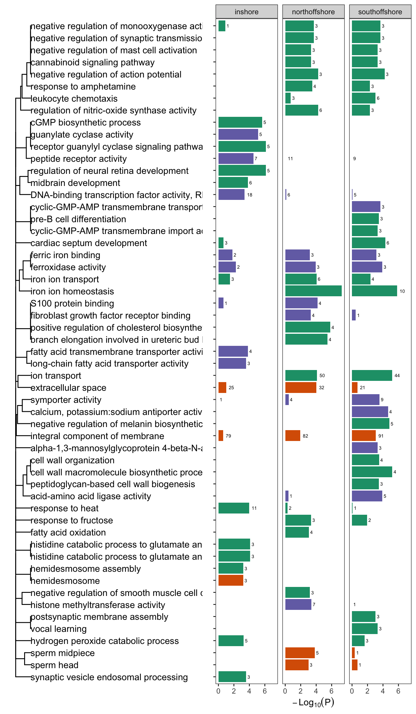

Gene Ontology Enrichment analysis
================

In a previous analysis (see
[10.identify\_selective\_genomic\_windows](10.identify_selective_genomic_windows.md)
we identified a total of 231 candidate selective sweep regions. A
summary of sweep regions and the number of genes covered by them in each
population is shown below;

| pop           | numgenes | nregions |
|:--------------|---------:|---------:|
| inshore       |      441 |       72 |
| northoffshore |      364 |       79 |
| southoffshore |      361 |       80 |

We then used `topGO` to identify GO terms that were enriched in the gene
sets covered by selective sweeps in each population. Enrichment was
initially calculated in a gene centric manner because GO terms are most
properly interpreted as attached to genes not regions, however, since
genomic regions and not genes are the independent units in this analysis
we then recalculated enrichment statistics in a region centric manner
for all GO terms found to be enriched in the initial analysis. The gene
centric analysis considered each gene as an independent entity and
considered the target set as the set of all genes intersecting with
selective sweeps in a given population, and the background set was taken
as the complete set of annotated genes for *A. digitifera*. The region
centric analysis considered the target set as all candidate sweeps for a
population and the background set as the complete set of all 50kb
regions on which EHH statistics were calculated.

We found a total of 6 GO terms enriched (p&lt;0.001) across all three of
the locations. These are dplyr::summarised in Figure 1.

**Figure 1: Enriched GO terms for genes intersecting with candidate loci
under selection**. Length of bars indicates significance (longer is more
significant) and colour indicates the ontology. Numerical labels
indicate the number of genes putatively under selection. Dendrogram
depicts relationships between GO terms based on numbers of shared
annotated genes.
