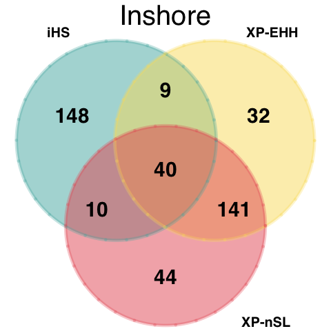
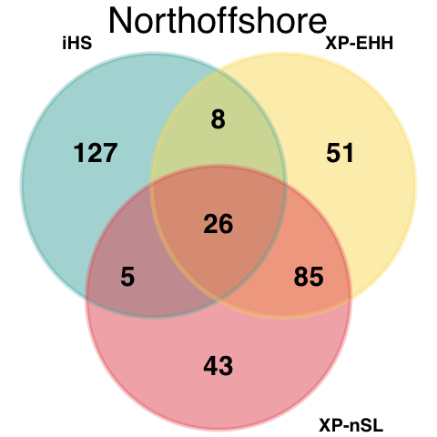
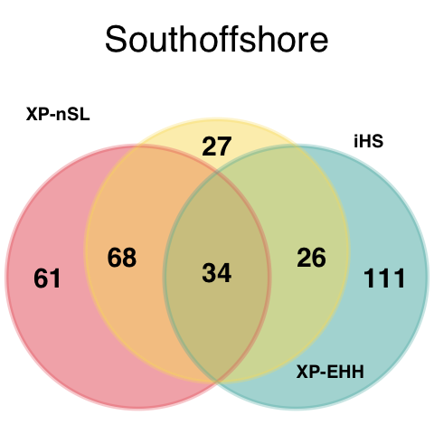
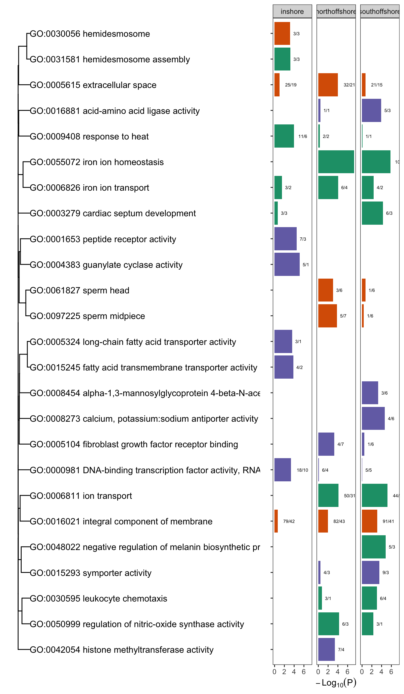

Gene Ontology Enrichment analysis
================

In a previous analysis (see
[10.identify\_selective\_genomic\_windows](10.identify_selective_genomic_windows.md)
we identified a total of 231 candidate selective sweep regions. A
summary of sweep regions and the number of genes covered by them in each
population is shown below;

| pop           | numgenes | nregions |
|:--------------|---------:|---------:|
| inshore       |      441 |       72 |
| northoffshore |      364 |       79 |
| southoffshore |      361 |       80 |

**Figure 1: Three strategies used to identify a list of genes related to
local adaptation in three populations. The iHS (blue) has more unique
selection candidate sets. The XP-EHH (light yellow) and XP-nSL (red)
selection candidate sets shared more gene sets since they both are able
to detect selective sweep that are fixed or nearly fixed.**

We then used `topGO` to identify GO terms that were enriched in the gene
sets covered by selective sweeps in each population. In all cases
enrichment was calculated by considering the target set as the set of
all genes intersecting with selective sweeps in a given population, and
the background set was taken as the complete set of annotated genes for
*A. digitifera*.

We found a total of 55 GO terms enriched (p&lt;0.001) across all three
of the locations. These are summarised in Figure 2.

**Figure 2: Enriched GO terms for genes intersecting with candidate loci
under selection**. Length of bars indicates significance (longer is more
significant) and colour indicates the ontology. Numerical labels
indicate the number of genes putatively under selection. Dendrogram
depicts relationships between GO terms based on numbers of shared
annotated genes.

Interestingly, we found the genes under selection in inshore were
enriched in response to heat `GO:0009408` (Figure 2). This included a
total of 14 genes overlapping with 9 distinct candidate regions. This
included four copies of a HSP-16 homolog within a single region that was
identified as significant in all three EHH statistics.

| region\_id                     | genes            | entryname    | genename                         | protein                                                                                                                                                                                |      frac | stats           |
|:-------------------------------|:-----------------|:-------------|:---------------------------------|:---------------------------------------------------------------------------------------------------------------------------------------------------------------------------------------|----------:|:----------------|
| BLFC01000185\_900000\_1050001  | adig\_s0062.g74  | DAXX\_CANLF  | DAXX                             | Death domain-associated protein 6 (Daxx)                                                                                                                                               | 0.4073883 | xpehh;xpnsl     |
| BLFC01000277\_1200000\_1250001 | adig\_s0082.g83  | TRPA1\_RAT   | Trpa1 Anktm1                     | Transient receptor potential cation channel subfamily A member 1 (Ankyrin-like with transmembrane domains protein 1) (Wasabi receptor)                                                 | 0.1150490 | xpnsl           |
| BLFC01000277\_1200000\_1250001 | adig\_s0082.g84  | TRPA1\_DROME | TrpA1 Anktm1 CG5751              | Transient receptor potential cation channel subfamily A member 1 (dTRPA1) (Ankyrin-like with transmembrane domains protein 1) (dANKTM1)                                                | 0.1150490 | xpnsl           |
| BLFC01000298\_200000\_350001   | adig\_s0120.g14  | HSP12\_CAEEL | hsp-16.2 hsp-16 hsp16-2 Y46H3A.3 | Heat shock protein hsp-16.2                                                                                                                                                            | 0.2556995 | xpehh;xpnsl;ihs |
| BLFC01000298\_200000\_350001   | adig\_s0120.g15  | HSP12\_CAEEL | hsp-16.2 hsp-16 hsp16-2 Y46H3A.3 | Heat shock protein hsp-16.2                                                                                                                                                            | 0.2556995 | xpehh;xpnsl;ihs |
| BLFC01000298\_200000\_350001   | adig\_s0120.g16  | HSP12\_CAEEL | hsp-16.2 hsp-16 hsp16-2 Y46H3A.3 | Heat shock protein hsp-16.2                                                                                                                                                            | 0.2556995 | xpehh;xpnsl;ihs |
| BLFC01000298\_200000\_350001   | adig\_s0120.g17  | HSP12\_CAEEL | hsp-16.2 hsp-16 hsp16-2 Y46H3A.3 | Heat shock protein hsp-16.2                                                                                                                                                            | 0.2556995 | xpehh;xpnsl;ihs |
| BLFC01000326\_1550000\_2150001 | adig\_s0038.g95  | DNJA1\_PONAB | DNAJA1                           | DnaJ homolog subfamily A member 1                                                                                                                                                      | 0.6078876 | ihs;xpehh;xpnsl |
| BLFC01000375\_1150000\_1250001 | adig\_s0052.g74  | ANO1\_HUMAN  | ANO1 DOG1 ORAOV2 TAOS2 TMEM16A   | Anoctamin-1 (Discovered on gastrointestinal stromal tumors protein 1) (Oral cancer overexpressed protein 2) (Transmembrane protein 16A) (Tumor-amplified and overexpressed sequence 2) | 0.2313040 | ihs;xpnsl       |
| BLFC01000375\_1150000\_1250001 | adig\_s0052.g75  | ANO1\_HUMAN  | ANO1 DOG1 ORAOV2 TAOS2 TMEM16A   | Anoctamin-1 (Discovered on gastrointestinal stromal tumors protein 1) (Oral cancer overexpressed protein 2) (Transmembrane protein 16A) (Tumor-amplified and overexpressed sequence 2) | 0.2313040 | ihs;xpnsl       |
| BLFC01000770\_1200000\_1250001 | adig\_s0003.g72  | CBPB2\_MOUSE | Cpb2 Tafi                        | Carboxypeptidase B2 (EC 3.4.17.20) (Carboxypeptidase R) (CPR) (Carboxypeptidase U) (CPU) (Thrombin-activable fibrinolysis inhibitor) (TAFI)                                            | 0.5354713 | ihs;xpehh;xpnsl |
| BLFC01000298\_550000\_600001   | adig\_s0120.g50  | HSP12\_CAEEL | hsp-16.2 hsp-16 hsp16-2 Y46H3A.3 | Heat shock protein hsp-16.2                                                                                                                                                            | 0.2698720 | xpehh           |
| BLFC01000410\_1050000\_1100001 | adig\_s0163.g82  | FGF1\_PIG    | FGF1                             | Fibroblast growth factor 1 (FGF-1) (Acidic fibroblast growth factor) (aFGF) (Endothelial cell growth factor) (ECGF) (Heparin-binding growth factor 1) (HBGF-1) (Fragment)              | 0.3700620 | ihs             |
| BLFC01000123\_1650000\_1750001 | adig\_s0039.g144 | GSH1\_HUMAN  | GCLC GLCL GLCLC                  | Glutamate–cysteine ligase catalytic subunit (EC 6.3.2.2) (GCS heavy chain) (Gamma-ECS) (Gamma-glutamylcysteine synthetase)                                                             | 0.3612090 | ihs             |
