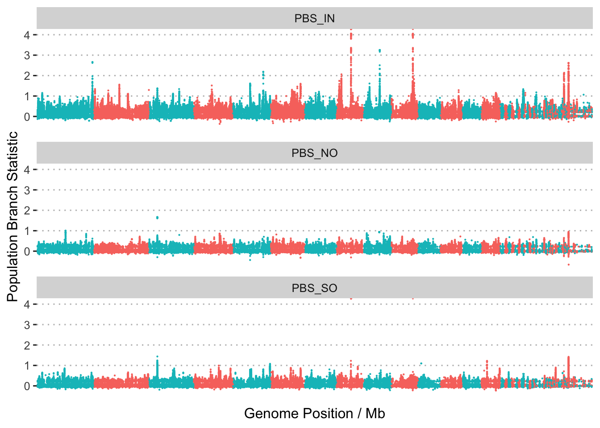

Population Branch Statistics
================

As a complement to the EHH-based scans for signatures of selection we
also searched for signatures based on differences in allele frequency
between populations. For this we used the population branch statistic
(see (Yi et al. 2010)) which is designed to measure the degree to which
allele frequencies at a specific locus in one population have
differentiated from other populations.

Since the PBS is based on Fst we first used plink2 to calculate pairwise
Fst values for all pairs of populations as follows;

``` bash
plink2 --vcf Adigi.v2.filtered.vcf.gz --fst site report-variants --pheno populations.txt --allow-extra-chr --out pbs/plink2
```

Outputs were then converted to pbs values using an [awk
script](data/hpc/selection2/plinkfst2pbs.awk)

``` bash
echo "IN NO SO" > pbs/plink2.pbs
paste pbs/plink2.IN.NO.fst.var pbs/plink2.IN.SO.fst.var pbs/plink2.NO.SO.fst.var | awk -f plinkfst2pbs.awk >> pbs/plink2.pbs
```

To plot these values as a Manhattan plot we first convert coordinates
into chromosomes using RagTag

``` bash
tail -n+2 pbs/plink2.pbs > pbs/plink2_noheader.pbs
python ../../../scripts/translate_coords.py pbs/plink2_noheader.pbs ../ragtag/ragtag_output/ragtag.scaffolds.agp >pbs/plink2.pbs_scaff.tsv
```



**Figure 1:** Manhattan plots showing the distribution of values of the
population branch statistic (PBS) across the genome. Each plot shows PBS
with a different focal population.

<div id="refs" class="references csl-bib-body hanging-indent">

<div id="ref-Yi2010-br" class="csl-entry">

Yi, Xin, Yu Liang, Emilia Huerta-Sanchez, Xin Jin, Zha Xi Ping Cuo, John
E Pool, Xun Xu, et al. 2010. “Sequencing of 50 Human Exomes Reveals
Adaptation to High Altitude.” *Science* 329 (5987): 75–78.

</div>

</div>
