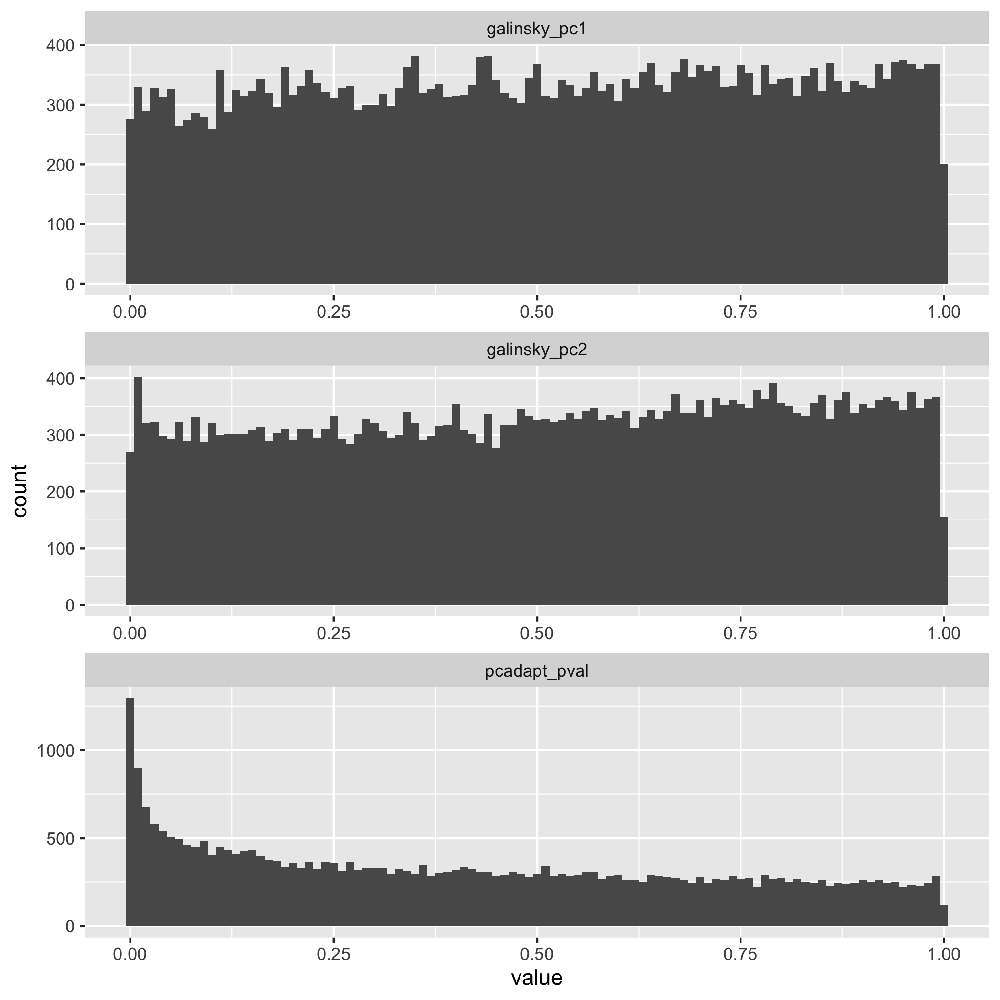
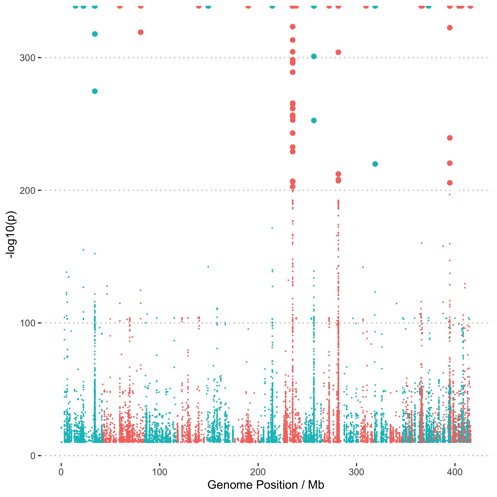

```{r setup, include=FALSE}
knitr::opts_chunk$set(echo = FALSE, warning = FALSE, message = FALSE, fig.retina = 2)
library(tidyverse)
library(ggpubr)
```

As a complement to the EHH-based scans for signatures of selection we also searched for signatures based on differences in allele frequency between populations. For this we used two approaches, (1) PCAngsd (ANGSD adaptation of PCAdapt) which looks at the contribution to population differentiation in a PCA and (2) population branch statistics (see [@Yi2010-br]) which are an Fst-based measure of differentiation in a focal population compared with a pair of background pops. 

### Population Branch Statistics

The population branch statistic is designed to measure [@Yi2010-br] the degree to which allele frequencies at a specific locus in one population have differentiated from other populations.  We used plink2 to calculate pairwise Fst values for all pairs of populations and then used these to calculate population branch statistics. 

Plink2 was run as follows;

```bash
plink2 --vcf Adigi.v2.filtered.vcf.gz --fst site report-variants --pheno populations.txt --allow-extra-chr --out pbs/plink2
```

Outputs were then converted to pbs values using an [awk script](data/hpc/selection2/plinkfst2pbs.awk)

```bash
echo "IN NO SO" > pbs/plink2.pbs
paste pbs/plink2.IN.NO.fst.var pbs/plink2.IN.SO.fst.var pbs/plink2.NO.SO.fst.var | awk -f plinkfst2pbs.awk >> pbs/plink2.pbs
```

To plot these values as a Manhattan plot we first convert coordinates into chromosomes using RagTag

```bash
tail -n+2 pbs/plink2.pbs > pbs/plink2_noheader.pbs
python ../../../scripts/translate_coords.py pbs/plink2_noheader.pbs ../ragtag/ragtag_output/ragtag.scaffolds.agp >pbs/plink2.pbs_scaff.tsv
```

```{r}
if ( !file.exists("data/r_essentials/pbsdata.rds")){
  pbsoriginal_coords <- read_tsv("data/hpc/selection2/pbs/plink2_noheader.pbs",col_names = c("scaff","scaff_pos","PBS_IN_scaff","PBS_NO_scaff","PBS_SO_scaff"))
  pbsragtag <- read_tsv("data/hpc/selection2/pbs/plink2.pbs_scaff.tsv",col_types = cols(),col_names = c("chr","pos","PBS_IN","PBS_NO","PBS_SO")) 

  pbsdata <- cbind(pbsragtag,pbsoriginal_coords) %>% 
    dplyr::select(chr,pos,scaff,scaff_pos,PBS_IN,PBS_NO,PBS_SO) %>% 
    pivot_longer(starts_with("PBS"),names_to = "population",values_to="PBS") 

  # This is a huge dataset but we would only like to keep (a) the very highest PBS values and (b) a random sample of the lowest ones
  pbs_high <- pbsdata %>% 
    filter(PBS>0.2)
  
  pbs_low <- pbsdata %>% 
    filter(PBS<0.5) %>% 
    slice_sample(n=nrow(pbs_high))
  
  pbsdata <- rbind(pbs_high,pbs_low)
  
  lengths <- read_tsv("data/hpc/pcangsd/all.lengths.scaf.txt",col_names = c("scaffold","length"))
  offsets <- lengths %>% arrange(desc(length)) %>% 
  dplyr::mutate(offset=cumsum(length)-length) %>% 
  dplyr::mutate(scaffold_num = row_number())

  manhattan_data <- pbsdata %>% 
  left_join(offsets,by=c("chr"="scaffold")) %>% 
  mutate(abs_pos = pos+offset) 
  
  write_rds(manhattan_data,"data/r_essentials/pbsdata.rds",compress = "gz")
} else {
  manhattan_data <- read_rds("data/r_essentials/pbsdata.rds")
}
```

```{r pbs-manhattan-plot}
manhattan_data %>% 
  ggplot() + 
  scale_x_discrete(labels=c("PBS_IN"="Inshore","PBS_NO"="North Offshore","PBS_SO"="South Offshore")) +
  geom_point(aes(x=abs_pos/1e6,y=PBS,color=as.character(scaffold_num %% 2)),size=0.1) + 
  ylab("Population Branch Statistic") + xlab("Genome Position / Mb") + 
  theme_pubclean() + theme(legend.position = "None") + facet_wrap(~population,ncol = 1)
```

**Figure 1:** Manhattan plots showing the distribution of values of the population branch statistic (PBS) across the genome. Each plot shows PBS with a different focal population.

## PCAngsd

The next approach is based on the idea of [PCAdapt](https://pubmed.ncbi.nlm.nih.gov/27601374/) which used principle components analysis to search for markers that are related to population structure. This is implemented in a new version of PCAngsd ( [@Meisner2021-um] ) which supports selection scans by extending two methods (FastPCA and pcadapt) to work with low coverage data.  Even though our data is not strictly low coverage it is worth exploring this analysis as it is easy and fast, and also provides an indication of what selective sweeps can be detected using a method that completely avoids any issues related to genotyping bias. 

To support PCAngsd we first calculated allele frequencies and other statistics using ANGSD. Detailed shell scripts required to run these analyses can be found in `data/hpc/thetastat`.  The key step is SNP calling and filtering which is done as follows and is designed to mimic the settings for our main SNP calling pipeline with GATK as closely as possible;

```bash
angsd -b wa_bam.txt -out all -GL 2 -nThreads 8 -doGlf 2 -SNP_pval 1e-6 -doMajorMinor 1 -doMaf 2 -doCounts 1 -minMaf 0.05 -minInd 67 -minMapQ 20 -minQ 20 -setMinDepth 750 -setMaxDepth 2500 -setMinDepthInd 3
```

Then we ran PCAngsd (v1.0) as follows;

```bash
python pcangsd/pcangsd.py -beagle wa.beagle.gz	-out wa	-threads 32	-admix	-selection	-pcadapt	-selection_e 2	-snp_weights	-maf_save	-pi_save  	-dosage_save  	-sites_save 	-tree 
```

```{r, eval=FALSE}
# Read sample information and construct a sample table

samples <- read_tsv("data/hpc/pcangsd/samples.txt",col_names = c("sample_id","location","mapping_rate","mean_mapping_depth","genome_cov"))

sample_table_wa <- read_tsv("data/hpc/pcangsd/wa_bam.txt",col_names = "filename") %>% 
  tidyr::extract(filename,into="sample_id",regex=".*/(.*_[A-Z,0-9]+_[0-9]+)_") %>% 
  #  mutate(sample_id = str_replace(filename,"_S[0-9]+$","")) %>% 
  left_join(samples) %>% 
  rownames_to_column("number")


covmat_wa <- read_table2("data/hpc/pcangsd/wa.cov",col_names = FALSE) %>% 
  as.matrix()

pop_eigen_wa <- eigen(covmat_wa)
eigenvalues_wa <- round(pop_eigen_wa$values,1)

pop_pca_wa <- data.frame(e1=pop_eigen_wa$vectors[,1],e2=pop_eigen_wa$vectors[,2]) %>% cbind(sample_table_wa)

pclabel <- function(pcnum,eigenvalues){
  paste("PC",pcnum," (",eigenvalues[pcnum],"%)",sep = "")
}

# pop_pca_wa %>%
#   filter(!sample_id=="BR_5_121") %>%
#   ggplot(aes(x=e1,y=e2)) +
#   geom_point(aes(color=location),size=1) +
#   theme_pubr() + xlab(pclabel(1,eigenvalues_wa)) +
#   ylab(pclabel(2,eigenvalues_wa)) +
#   theme(legend.title = element_blank())
```


```{r, eval=FALSE}
library(RcppCNPy)
library(bigutilsr)

zscores <- npyLoad("data/hpc/pcangsd/wa.pcadapt.zscores.npy")
galinsky <- npyLoad("data/hpc/pcangsd/wa.selection.npy")

sites_binary <- read_tsv("data/hpc/pcangsd/wa.sites",col_names = c("included"))
#d_scores <- dist_ogk(raw_scores)
K <- ncol(zscores)

# For one component only
if (K == 1) {
	d2 <- (zscores - median(zscores))^2
} else {
  # Calculates robus Mahalanobis (squared) distances
	d2 <- dist_ogk(zscores)
}

pvals <- pchisq(d2,df=K,lower.tail = F)
write_rds(pvals,"cache/pcadapt_pvals.rds")
```

For the first statistic (FastPCA / Galinsky statistic) we have one value for each of the PCs, whereas for pcadapt a single statistic based on robust Mahalanobis distance is used to summarise both PCs.  Examination of the distribution of p-values genome-wide in this case suggests that pcadapt is able to detect many significant loci under selection, whereas the Galinsky statistics are not.

```{r pca-score-histo, eval=FALSE}
score_data <- data.frame(galinsky,pcadapt_pval = pvals) %>% 
  mutate(galinsky_pc1 = pchisq(X1,df=1,lower.tail = F)) %>% 
  mutate(galinsky_pc2 = pchisq(X2,df=1,lower.tail = F)) %>% 
  select(-X1,-X2) %>% 
  pivot_longer(everything(),names_to = "name") %>% 
  slice_sample(n=100000)


ggplot(score_data) + geom_histogram(aes(x=value), binwidth = 0.01) + facet_wrap(~name, ncol = 1, scales = "free")
ggsave("data/r_essentials/pcangsd_pvalue_hist.png")
```

```{r}

```

**Figure 2:** Histograms of raw p-values for selection statistics calculated by PCAngsd.

For the pcadapt statistic we create a Manhattan plot to view sites under selection across the genome.  Note that this uses Pseudo-chromosome level coordinates obtained via [RagTag](11.ragtag_scaffolding.md). This command converts coordinates into this pseudo-chromosome system

```bash
./translate_coords.py ../pcangsd/wa.positions.txt ragtag_output/ragtag.scaffolds.agp > ../pcangsd/wa.positions.scaf.txt
```

```{r pcadapt-manhattan-plot, eval=FALSE}

coordinates <- read_tsv("data/hpc/pcangsd/wa.positions.scaf.txt",col_names = c("scaffold","pos"))
coordinates_included <- coordinates[sites_binary$included==1,] %>% mutate(p=row_number())

lengths <- read_tsv("data/hpc/pcangsd/all.lengths.scaf.txt",col_names = c("scaffold","length"))
offsets <- lengths %>% arrange(desc(length)) %>% mutate(offset=cumsum(length)-length) %>% 
  mutate(scaffold_num = row_number())

manhattan_data <- coordinates_included %>% 
  left_join(offsets,by="scaffold") %>% 
  mutate(abs_pos = pos+offset) %>% 
  add_column(pval=-log10(pvals))

manhattan_data %>% 
  filter(pval>10) %>% 
  ggplot() + 
  geom_point(aes(x=abs_pos/1e6,y=pval,color=as.character(scaffold_num %% 2)),size=0.1) + ylab("-log10(p)") + xlab("Genome Position / Mb") + 
  geom_point(data = manhattan_data %>% filter(pval>200),aes(x=abs_pos/1e6,y=pval,color=as.character(scaffold_num %% 2)),size=2) + ylab("-log10(p)") + xlab("Genome Position / Mb") + 
    theme_pubclean() + theme(legend.position = "None")
ggsave("data/r_essentials/pcangsd_manhattan.png")
write_rds(manhattan_data,file="cache/pcadapt.rds")
```

```{r}

```

**Figure 3:** Manhattan plot showing the location of sites highly associated with population structure (-10log(p) > 10) across the genome


### Genome-wide Nucleotide diversity and Tajima\'s D

As a side note we observe that the genome-wide distributions of both pairwise nucleotide diversity and Tajima's D estimated using ANGSD are extremely similar to those estimated from genotypes. 

```{r}
# Read in all the sliding window data.
#
if(!file.exists("data/r_essentials/12_all_thetas.rds")){
  all_thetas <- list.files("data/hpc/thetastat/",pattern = ".pestPG",full.names = TRUE) %>% 
    map_df(function(x){
      pop=basename(x) %>% str_extract("([^\\.]+)")
      read_tsv(x,col_types=cols()) %>% add_column(population=pop)
      }) %>% 
    rbind()
  write_rds(all_thetas,"data/r_essentials/12_all_thetas.rds")
} else {
  all_thetas <- read_rds("data/r_essentials/12_all_thetas.rds")
}
```


```{r td-pi-boxplot, fig.height=3.6}
library(cowplot)

pip <- ggplot(all_thetas,aes(x=population,y=tP/50000)) + 
  geom_boxplot(aes(fill=population)) + 
  xlab("") + ylab(expression(theta[pi]~"per bp")) + guides(fill=FALSE) + 
  scale_x_discrete(labels=c("Inshore","Offshore North","Offshore South")) +
  ggsci::scale_fill_startrek() + theme_classic() 

tdp <- ggplot(all_thetas,aes(x=population,y=Tajima)) + 
  geom_boxplot(aes(fill=population)) + 
  scale_x_discrete(labels=c("Inshore","Offshore North","Offshore South")) +
  xlab("") + ylab("Tajima's D") + guides(fill=FALSE) + ggsci::scale_fill_startrek() + theme_classic() 

plot_grid(pip,tdp,nrow=1, labels = c("A","B"))
```

**Figure 4**: Genome-wide distribution of pairwise nucleotide diversity (A) and Tajima's D (B) by population. 