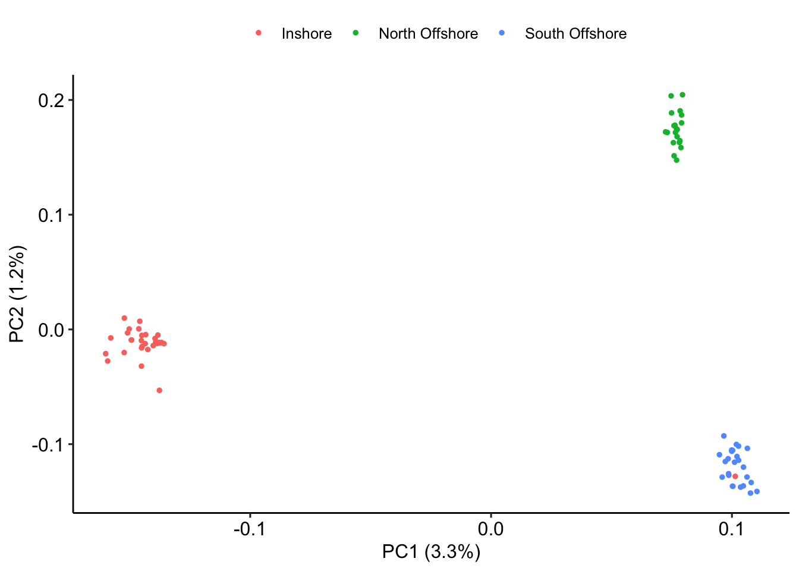

PCAngsd-based Selection Analysis
================

For the Western Australian data we found that PCA analysis with PCAngsd
separates the three populations based on two PC axes. PC1 predominantly
separates inshore from offshore samples whereas PC2 separates the two
offshore locations from each other.



**Figure 1:** PCA showing separation of Western Australian *A.
digitifera* samples along PC1 and PC2.

A new version of PCAngsd ( (Meisner, Albrechtsen, and Hanghøj 2021) )
implements selection scans by extending two methods (FastPCA and
pcadapt) to work with low coverage data. Even though our data is not
strictly low coverage it is worth exploring this analysis as it is easy
and fast, and also provides an indication of what selective sweeps can
be detected using a method that completely avoids any issues related to
genotyping bias.

To do this we first called SNPs and calculated genotype likelihoods as
follows;

``` bash
angsd -b wa_bam.txt -out all -GL 2 -nThreads 8 -doGlf 2 -SNP_pval 1e-6 -doMajorMinor 1 -doMaf 2 -doCounts 1 -minMaf 0.05 -minInd 67 -minMapQ 20 -minQ 20 -setMinDepth 750 -setMaxDepth 2500 -setMinDepthInd 3
```

Then ran PCAngsd (v1.0) as follows;

``` bash
python pcangsd/pcangsd.py -beagle wa.beagle.gz  -out wa -threads 32 -admix  -selection  -pcadapt    -selection_e 2  -snp_weights    -maf_save   -pi_save    -dosage_save    -sites_save     -tree 
```

For the first statistic (FastPCA / Galinsky statistic) we have one value
for each of the PCs, whereas for pcadapt a single statistic based on
robust Mahalanobis distance is used to summarise both PCs. Examination
of the distribution of p-values genome-wide in this case suggests that
pcadapt is able to detect many significant loci under selection, whereas
the Galinsky statistics are not.


**Figure 2:** Histograms of raw p-values for selection statistics
calculated by PCAngsd.

For the pcadapt statistic we create a Manhattan plot to view sites under
selection across the genome. Note that this uses Pseudo-chromosome level
coordinates obtained via [RagTag](11.ragtag_scaffolding.md). This
command converts coordinates into this pseudo-chromosome system

``` bash
./translate_coords.py ../pcangsd/wa.positions.txt ragtag_output/ragtag.scaffolds.agp > ../pcangsd/wa.positions.scaf.txt
```


**Figure 3:** Manhattan plot showing the location of sites highly
associated with population structure (-10log(p) &gt; 10) across the
genome

<div id="refs" class="references csl-bib-body hanging-indent">

<div id="ref-Meisner2021-um" class="csl-entry">

Meisner, Jonas, Anders Albrechtsen, and Kristian Hanghøj. 2021.
“Detecting Selection in Low-Coverage High-Throughput Sequencing Data
Using Principal Component Analysis.” *bioRXiv*.

</div>

</div>
