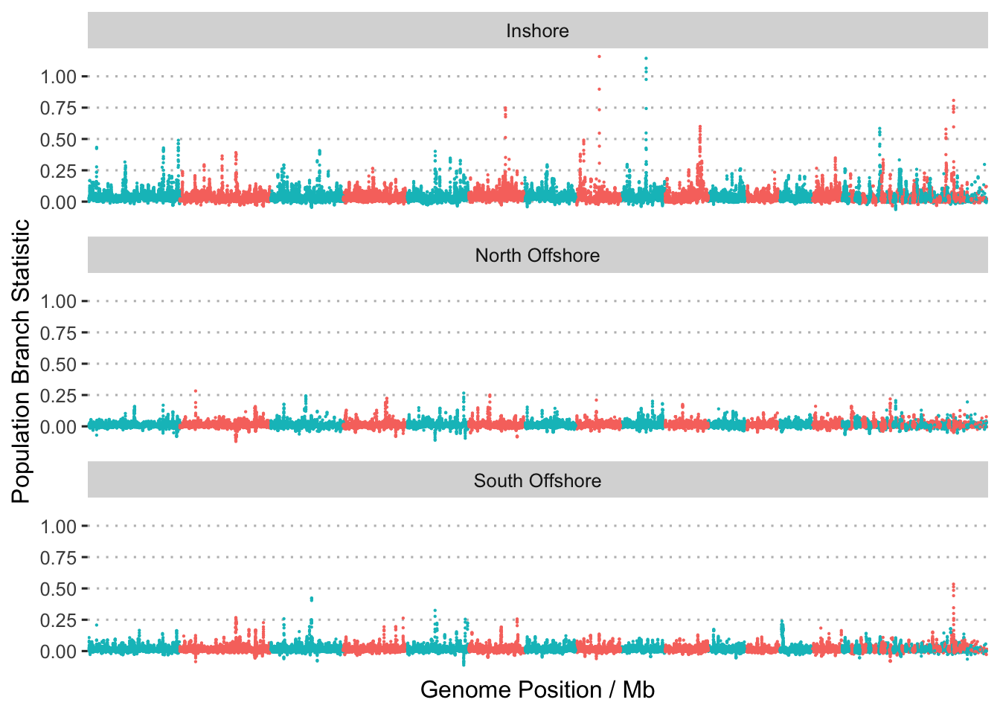
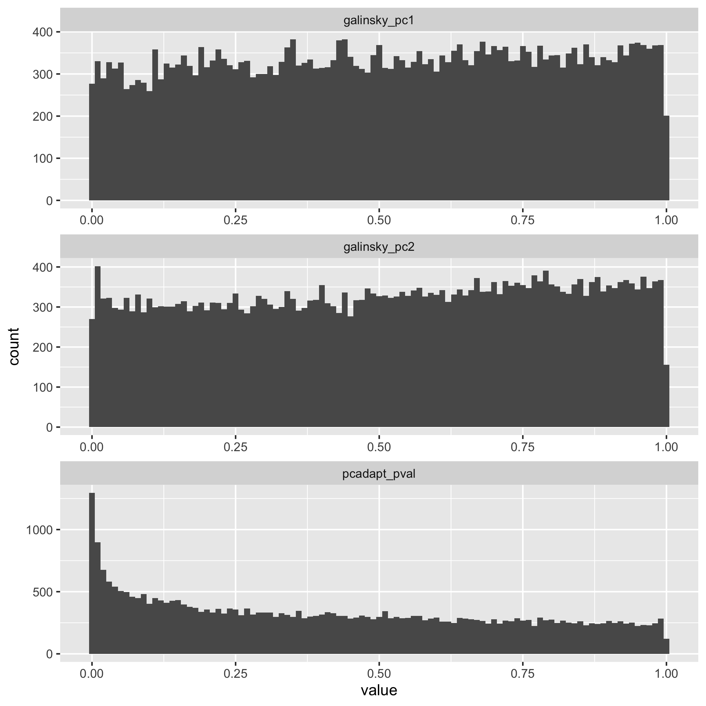
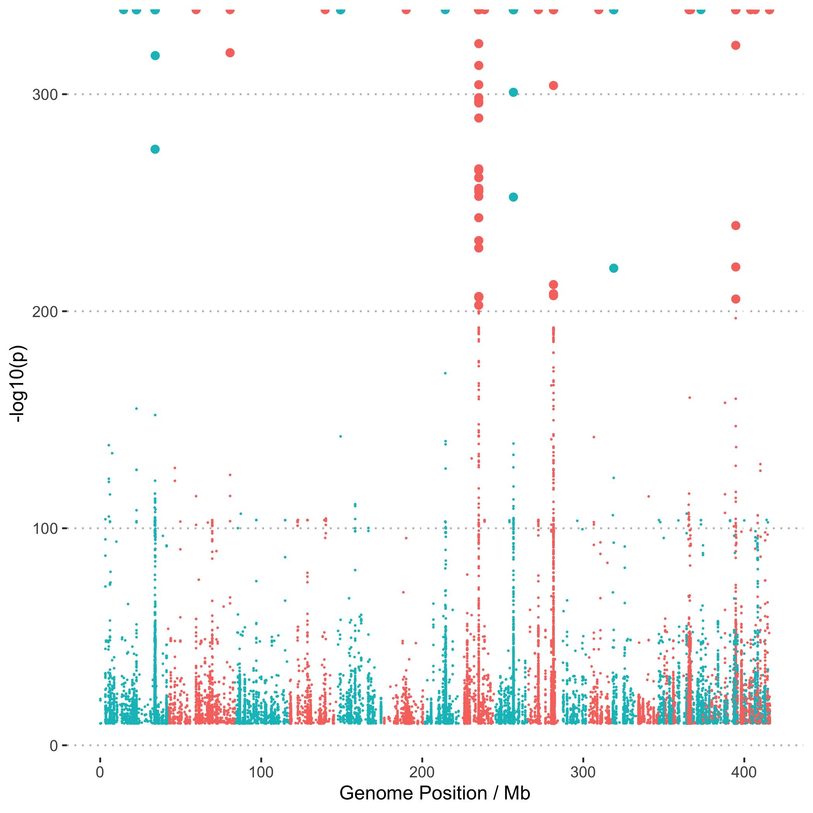
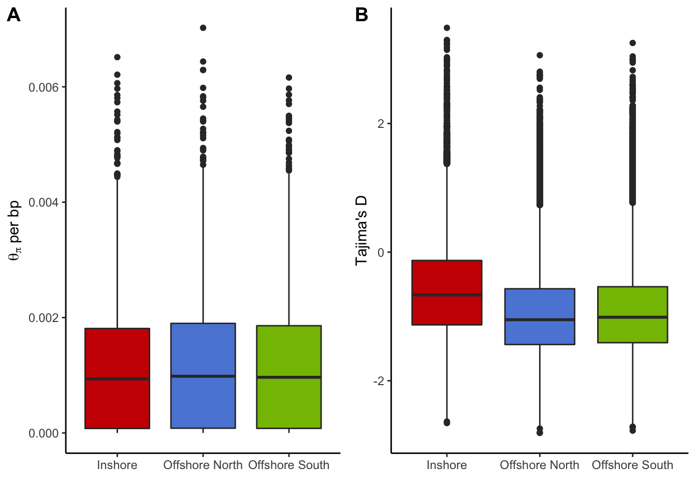

Selection analyses based on allele-frequency
================

As a complement to the EHH-based scans for signatures of selection we
also searched for signatures based on differences in allele frequency
between populations. For this we used two approaches, (1) PCAngsd (ANGSD
adaptation of PCAdapt) which looks at the contribution to population
differentiation in a PCA and (2) population branch statistics (see (Yi
et al. 2010)) which are an Fst-based measure of differentiation in a
focal population compared with a pair of background pops.

### Population Branch Statistics

The population branch statistic is designed to measure (Yi et al. 2010)
the degree to which allele frequencies at a specific locus in one
population have differentiated from other populations. We used plink2 to
calculate pairwise Fst values for all pairs of populations and then used
these to calculate population branch statistics.

Plink2 was run as follows;

``` bash
plink2 --vcf Adigi.v2.filtered.vcf.gz --fst site report-variants --pheno populations.txt --allow-extra-chr --out pbs/plink2
```

Outputs were then converted to pbs values using an [awk
script](data/hpc/selection2/plinkfst2pbs.awk)

``` bash
echo "IN NO SO" > pbs/plink2.pbs
paste pbs/plink2.IN.NO.fst.var pbs/plink2.IN.SO.fst.var pbs/plink2.NO.SO.fst.var | awk -f plinkfst2pbs.awk >> pbs/plink2.pbs
```

To plot these values as a Manhattan plot we first convert coordinates
into chromosomes using RagTag

``` bash
tail -n+2 pbs/plink2.pbs > pbs/plink2_noheader.pbs
python ../../../scripts/translate_coords.py pbs/plink2_noheader.pbs ../ragtag/ragtag_output/ragtag.scaffolds.agp >pbs/plink2.pbs_scaff.tsv
```



**Figure 1:** Manhattan plots showing the distribution of values of the
population branch statistic (PBS) across the genome. Each plot shows PBS
with a different focal population.

## PCAngsd

The next approach is based on the idea of
[PCAdapt](https://pubmed.ncbi.nlm.nih.gov/27601374/) which used
principle components analysis to search for markers that are related to
population structure. This is implemented in a new version of PCAngsd (
(Meisner, Albrechtsen, and Hanghøj 2021) ) which supports selection
scans by extending two methods (FastPCA and pcadapt) to work with low
coverage data. Even though our data is not strictly low coverage it is
worth exploring this analysis as it is easy and fast, and also provides
an indication of what selective sweeps can be detected using a method
that completely avoids any issues related to genotyping bias.

To support PCAngsd we first calculated allele frequencies and other
statistics using ANGSD. Detailed shell scripts required to run these
analyses can be found in `data/hpc/thetastat`. The key step is SNP
calling and filtering which is done as follows and is designed to mimic
the settings for our main SNP calling pipeline with GATK as closely as
possible;

``` bash
angsd -b wa_bam.txt -out all -GL 2 -nThreads 8 -doGlf 2 -SNP_pval 1e-6 -doMajorMinor 1 -doMaf 2 -doCounts 1 -minMaf 0.05 -minInd 67 -minMapQ 20 -minQ 20 -setMinDepth 750 -setMaxDepth 2500 -setMinDepthInd 3
```

Then we ran PCAngsd (v1.0) as follows;

``` bash
python pcangsd/pcangsd.py -beagle wa.beagle.gz  -out wa -threads 32 -admix  -selection  -pcadapt    -selection_e 2  -snp_weights    -maf_save   -pi_save    -dosage_save    -sites_save     -tree 
```

For the first statistic (FastPCA / Galinsky statistic) we have one value
for each of the PCs, whereas for pcadapt a single statistic based on
robust Mahalanobis distance is used to summarise both PCs. Examination
of the distribution of p-values genome-wide in this case suggests that
pcadapt is able to detect many significant loci under selection, whereas
the Galinsky statistics are not.



**Figure 2:** Histograms of raw p-values for selection statistics
calculated by PCAngsd.

For the pcadapt statistic we create a Manhattan plot to view sites under
selection across the genome. Note that this uses Pseudo-chromosome level
coordinates obtained via [RagTag](11.ragtag_scaffolding.md). This
command converts coordinates into this pseudo-chromosome system

``` bash
./translate_coords.py ../pcangsd/wa.positions.txt ragtag_output/ragtag.scaffolds.agp > ../pcangsd/wa.positions.scaf.txt
```



**Figure 3:** Manhattan plot showing the location of sites highly
associated with population structure (-10log(p) &gt; 10) across the
genome

### Genome-wide Nucleotide diversity and Tajima's D

As a side note we observe that the genome-wide distributions of both
pairwise nucleotide diversity and Tajima’s D estimated using ANGSD are
extremely similar to those estimated from genotypes.



**Figure 4**: Genome-wide distribution of pairwise nucleotide diversity
(A) and Tajima’s D (B) by population.

<div id="refs" class="references csl-bib-body hanging-indent">

<div id="ref-Meisner2021-um" class="csl-entry">

Meisner, Jonas, Anders Albrechtsen, and Kristian Hanghøj. 2021.
“Detecting Selection in Low-Coverage High-Throughput Sequencing Data
Using Principal Component Analysis.” *bioRXiv*.

</div>

<div id="ref-Yi2010-br" class="csl-entry">

Yi, Xin, Yu Liang, Emilia Huerta-Sanchez, Xin Jin, Zha Xi Ping Cuo, John
E Pool, Xun Xu, et al. 2010. “Sequencing of 50 Human Exomes Reveals
Adaptation to High Altitude.” *Science* 329 (5987): 75–78.

</div>

</div>
