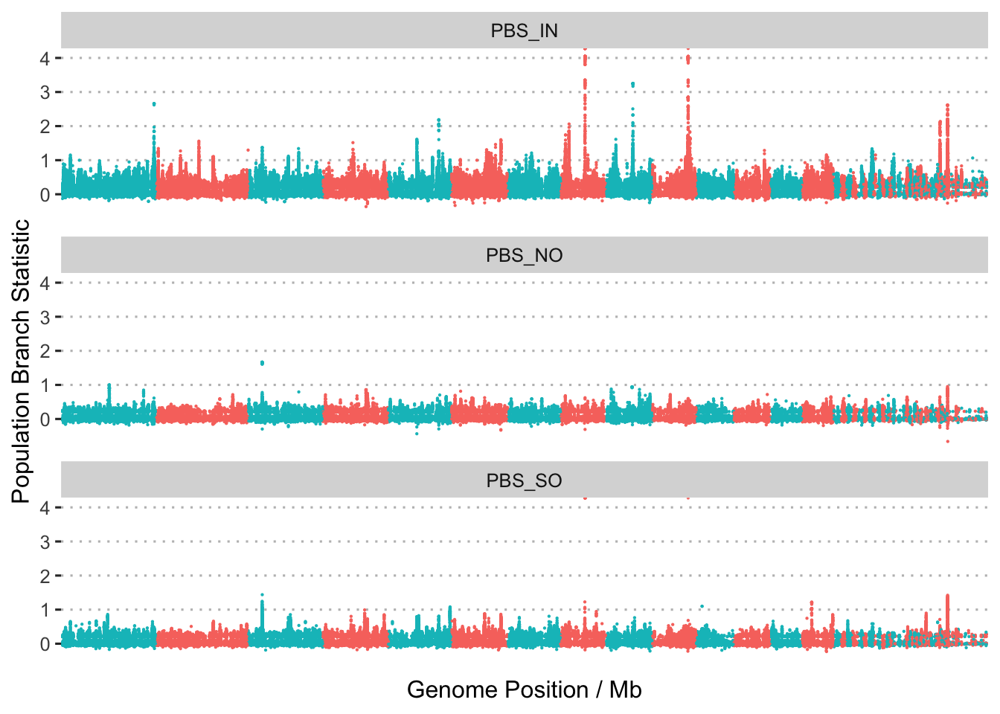

Selection analyses based on allele-frequency
================

As a complement to the EHH-based scans for signatures of selection we
also searched for signatures based on differences in allele frequency
between populations. For this we used two approaches, both of which
share a common core in the ANGSD framework.

## Preliminary analyses with ANGSD

To support both approaches we first calculated allele frequencies and
other statistics using ANGSD. Detailed shell scripts required to run
these analyses can be found in `data/hpc/thetastat`. A summary of the
process is as follows;

1.  Create a `sites.txt` file containing the coordinates of all high
    quality SNPs remaining in the final step of
    [02.quality_control.md](02.quality_control.md)

``` bash
zcat Adigi.v2.filtered.vcf.gz | grep -v '^#' | awk 'BEGIN{OFS="\t"}{print $1,$2}' > sites.txt
angsd sites index sites.txt
```

2.  Calculate the SFS separately for each population (see
    [here](data/hpc/thetastat/02_allele_freqs.sh) and
    [here](data/hpc/thetastat/03_realsfs.sh))
3.  Export thetas (includes nucleotide diversity and Tajima's D) for
    each population in a sliding window
4.  Calculate 2D SFS for each pair of populations
5.  Export pairwise Fst for each pair of populations as well as the
    population branch statistic

### Population Branch Statistics

The population branch statistic is designed to measure (Yi et al. 2010)
the degree to which allele frequencies at a specific locus in one
population have differentiated from other populations. Using ANGSD we
calculate this statistic in 50kb wide sliding windows and report it for
each focal population

To plot these values as a Manhattan plot we first convert coordinates
into chromosomes

``` bash
cd data/hpc/ragtag
./translate_coords.py <(cut -f2,3 ../thetastat/fst.slidingwindow.tsv | grep -v 'midPos') ragtag_output/ragtag.scaffolds.agp > ../thetastat/fst.slidingwindow.scafpos.tsv --keep
```



**Figure 1:** Manhattan plots showing the distribution of values of the
population branch statistic (PBS) across the genome. Each plot shows PBS
with a different focal population.

## PCAngsd

The next approach is based on the idea of
[PCAdapt](https://pubmed.ncbi.nlm.nih.gov/27601374/) which used
principle components analysis to search for markers that are related to
population structure. This is implemented in a new version of PCAngsd (
(Meisner, Albrechtsen, and Hanghøj 2021) ) which supports selection
scans by extending two methods (FastPCA and pcadapt) to work with low
coverage data. Even though our data is not strictly low coverage it is
worth exploring this analysis as it is easy and fast, and also provides
an indication of what selective sweeps can be detected using a method
that completely avoids any issues related to genotyping bias.

To do this we first called SNPs and calculated genotype likelihoods as
follows;

``` bash
angsd -b wa_bam.txt -out all -GL 2 -nThreads 8 -doGlf 2 -SNP_pval 1e-6 -doMajorMinor 1 -doMaf 2 -doCounts 1 -minMaf 0.05 -minInd 67 -minMapQ 20 -minQ 20 -setMinDepth 750 -setMaxDepth 2500 -setMinDepthInd 3
```

Then ran PCAngsd (v1.0) as follows;

``` bash
python pcangsd/pcangsd.py -beagle wa.beagle.gz  -out wa -threads 32 -admix  -selection  -pcadapt    -selection_e 2  -snp_weights    -maf_save   -pi_save    -dosage_save    -sites_save     -tree 
```

For the first statistic (FastPCA / Galinsky statistic) we have one value
for each of the PCs, whereas for pcadapt a single statistic based on
robust Mahalanobis distance is used to summarise both PCs. Examination
of the distribution of p-values genome-wide in this case suggests that
pcadapt is able to detect many significant loci under selection, whereas
the Galinsky statistics are not.


**Figure 2:** Histograms of raw p-values for selection statistics
calculated by PCAngsd.

For the pcadapt statistic we create a Manhattan plot to view sites under
selection across the genome. Note that this uses Pseudo-chromosome level
coordinates obtained via [RagTag](11.ragtag_scaffolding.md). This
command converts coordinates into this pseudo-chromosome system

``` bash
./translate_coords.py ../pcangsd/wa.positions.txt ragtag_output/ragtag.scaffolds.agp > ../pcangsd/wa.positions.scaf.txt
```


**Figure 3:** Manhattan plot showing the location of sites highly
associated with population structure (-10log(p) \> 10) across the genome

### Genome-wide Nucleotide diversity and Tajima's D

As a side note we observe that the genome-wide distributions of both
pairwise nucleotide diversity and Tajima’s D are extremely similar to
those estimated from genotypes.


**Figure 4**: Genome-wide distribution of pairwise nucleotide diversity
(A) and Tajima’s D (B) by population.

<div id="refs" class="references csl-bib-body hanging-indent">

<div id="ref-Meisner2021-um" class="csl-entry">

Meisner, Jonas, Anders Albrechtsen, and Kristian Hanghøj. 2021.
“Detecting Selection in Low-Coverage High-Throughput Sequencing Data
Using Principal Component Analysis.” *bioRXiv*.

</div>

<div id="ref-Yi2010-br" class="csl-entry">

Yi, Xin, Yu Liang, Emilia Huerta-Sanchez, Xin Jin, Zha Xi Ping Cuo, John
E Pool, Xun Xu, et al. 2010. “Sequencing of 50 Human Exomes Reveals
Adaptation to High Altitude.” *Science* 329 (5987): 75–78.

</div>

</div>
