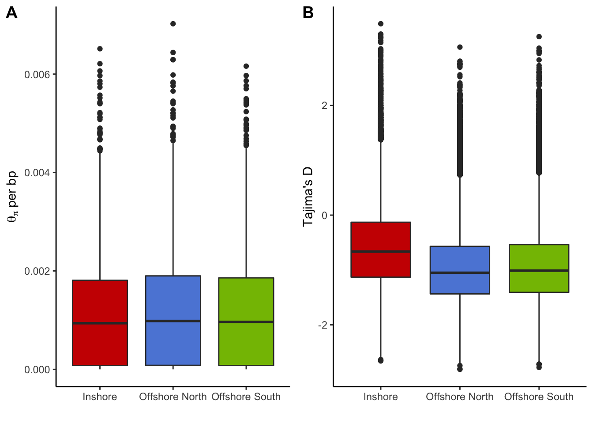

Genomic statistics based on genotype likelihoods (ANGSD)
================

To confirm that population genetic statistics calculated from genotypes
are not affected by genotyping error we estimated Tajima’s D, and
pairwise Fst without calling genotypes. This was done using ANGSD.

Detailed shell scripts required to run these analyses can be found in
`data/hpc/thetastat`. A summary of the process is as follows;

1.  Create a `sites.txt` file containing the coordinates of all high
    quality SNPs remaining in the final step of
    [02.quality\_control.md](02.quality_control.md)

<!-- end list -->

``` bash
zcat Adigi.v2.filtered.vcf.gz | grep -v '^#' | awk 'BEGIN{OFS="\t"}{print $1,$2}' > sites.txt
angsd sites index sites.txt
```

2.  Calculate the SFS separately for each population (see
    [here](data/hpc/thetastat/02_allele_freqs.sh) and
    [here](data/hpc/thetastat/03_realsfs.sh))
3.  Export thetas (includes nucleotide diversity and Tajima's D) for
    each population in a sliding window
4.  Calculate 2D SFS for each pair of populations
5.  Export pairwise Fst for each pair of populations as well as the
    population branch statistic

### Genome-wide Nucleotide diversity and Tajima's D

The genome-wide distributions of both pairwise nucleotide diversity and
Tajima’s D are extremely similar to those estimated from
genotypes.



**Figure 1**: Genome-wide distribution of pairwise nucleotide diversity
(A) and Tajima’s D (B) by population.

### Genome-wide Fst

Using ANGSD resulted in lower mean Fst values than when using genotypes
which most likely reflects a difference in the estimator used and/or
filtering. Importantly though the same trends are observed, with much
higher Fst between inshore vs offshore pairs than between the two
offshore sites.

    ## # A tibble: 3 x 3
    ##   pair   stdev    Fst
    ##   <chr>  <dbl>  <dbl>
    ## 1 Fst01 0.0451 0.0500
    ## 2 Fst02 0.0498 0.0539
    ## 3 Fst12 0.0265 0.0262


**Figure 2**: Genome-wide distribution of Fst for all three pairs of
populations

### Population Branch Statistics

The population branch statistic is designed to measure (Yi et al. 2010)
the degree to which allele frequencies at a specific locus in one
population have differentiated from other populations. Using ANGSD we
calculate this statistic in 50kb wide sliding windows and report it for
each focal population

To plot these values as a Manhattan plot we first convert coordinates
into chromosomes

``` bash
cd data/hpc/ragtag
./translate_coords.py <(cut -f2,3 ../thetastat/fst.slidingwindow.tsv | grep -v 'midPos') ragtag_output/ragtag.scaffolds.agp > ../thetastat/fst.slidingwindow.scafpos.tsv --keep
```


**Figure 3:** Manhattan plots showing values of the population branch
statistic for each focal population

<div id="refs" class="references">

<div id="ref-Yi2010-br">

Yi, Xin, Yu Liang, Emilia Huerta-Sanchez, Xin Jin, Zha Xi Ping Cuo, John
E Pool, Xun Xu, et al. 2010. “Sequencing of 50 Human Exomes Reveals
Adaptation to High Altitude.” *Science* 329 (5987): 75–78.

</div>

</div>
