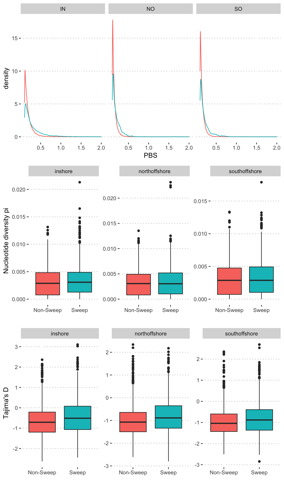

Analysis of genetic statistics (pbs, Tajima’s D, pi) in EHH sweep
regions
================

Regions identified as sweeps via EHH statistics also tended to have more
extreme values of the population branch statistic (PBS) and had elevated
values of Tajima’s D.

**Figure 1:** Comparison of PBS, pi and Tajima’s D in sweep and
non-sweep regions.

**Figure 2:** Manhattan plots showing the coincidence of extreme values
of the population branch statistic (PBS) and regions under selection
identified by EHH based scans. PBS estimates for each population are
shown as points with the other two considered as outgroups. Points are
shown in black and grey to indicate transitions between alternating
pseudo-chromosomes via mapping to the A. millepora assembly from Fuller
et al (Fuller et al. 2020). The purple shaded baseline shows the
location of regions identified as candidates for positive selection
using EHH-based scans. Blue points indicate windows where outlying PBS
values (&gt;0.2) are coincident with EHH scans.
