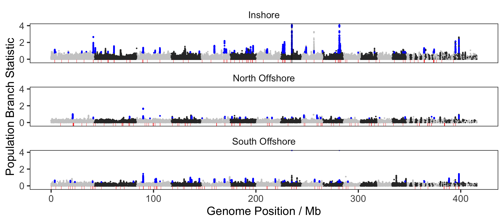

```{r setup, include=FALSE}
knitr::opts_chunk$set(echo = FALSE, warning = FALSE, message = FALSE, fig.retina = 2)
library(tidyverse)
library(ggpubr)
library(bedr)
```

Regions identified as sweeps via EHH statistics also tended to have more extreme values of the population branch statistic (PBS), explained more genetic variation related to population structure (PCAdapt statistic), and had elevated values of Tajima's D.  

```{r}
ehh_sweeps <- read_rds("cache/candidate_regions_genes_ehh.rds") %>% 
    mutate(chr=str_trim(chr)) 

pbsdata <- read_tsv("data/hpc/thetastat/fst.slidingwindow.tsv",col_types = cols()) %>% 
  dplyr::select(chr,midPos,Nsites,starts_with("PBS")) %>% 
  pivot_longer(starts_with("PBS"),names_to = "population",values_to="PBS")


pcadapt_pvals <- read_rds("cache/pcadapt_pvals.rds")
untransformed_coords <- read_tsv("data/hpc/pcangsd/wa.positions.txt",col_names = c("scaffold","pos"))
sites_binary <- read_tsv("data/hpc/pcangsd/wa.sites",col_names = c("included"))
untransformed_coords_included <- untransformed_coords[sites_binary$included==1,] %>% mutate(p=row_number())


read_pi <- function(pop) {
 read_tsv(paste0("data/hpc/popgen/",pop,".filtered_windowed.pi"),col_names = c("chr","start","end","n","pi")) %>% add_column(pop=pop) 
}

pi <- rbind(read_pi("inshore"),read_pi("northoffshore"),read_pi("southoffshore"))


read_td <- function(pop) {
  read_tsv(paste0("data/hpc/popgen/",pop,".filtered_windowed.td"), col_names = c("chr","start","end","td")) %>% 
    add_column(pop=pop)
}


tajimaD <- rbind(read_td("inshore"),read_td("northoffshore"),read_td("southoffshore"))

```


```{r, results='hide'}
if ( !file.exists("cache/inout_stats.rds")){

  pcadapt_bed <- untransformed_coords_included %>% 
    add_column(pval = -log10(pcadapt_pvals)) %>% 
    slice_sample(n=200000) %>% 
    mutate(chr=str_replace(scaffold,".1$","")) %>% 
    dplyr::select(chr,start=pos,end=pos,pval) %>% 
    as.data.frame() %>% 
    bedr.sort.region(check.chr = FALSE)

  pbs_bed <- pbsdata %>% 
    mutate(start=midPos-5000,end=midPos+5000) %>% 
    unite("ID",chr,midPos,sep = ":", remove = FALSE) %>% 
    extract(chr,"chr",regex = "(.*).1") %>% 
    dplyr::select(chr,start,end,PBS,ID) %>% 
      as.data.frame() %>% 
    bedr.sort.region(check.chr = FALSE)

  tajima_bed <- tajimaD %>% 
    mutate(chr=str_replace(chr,".1$","")) %>% 
    dplyr::rename(poptd=pop) %>% 
    as.data.frame() %>% 
    bedr.sort.region(check.chr = FALSE)

  pi_bed <- pi %>% 
    mutate(chr=str_replace(chr,".1$","")) %>% 
    dplyr::rename(poppi=pop) %>% 
    as.data.frame() %>% 
    bedr.sort.region(check.chr = FALSE)

  ehh_bed <- ehh_sweeps %>% 
    dplyr::select(chr,start,end,pop) %>% 
    as.data.frame() %>% 
    bedr.sort.region(check.chr = FALSE)

  pbs_ehh_joinbed <- bedr.join.region(pbs_bed,ehh_bed,check.chr = FALSE)

  pcadapt_ehh_joinbed <- bedr.join.region(pcadapt_bed,ehh_bed,check.chr = FALSE)

  tajima_ehh_joinbed <- bedr.join.region(tajima_bed,ehh_bed,check.chr = FALSE)

  pi_ehh_joinbed <- bedr.join.region(pi_bed,ehh_bed,check.chr = FALSE)


  pbs_inout <- pbs_ehh_joinbed %>% 
    mutate(in_sweep = ifelse(chr.b!=".","Sweep","Non-Sweep")) %>% 
    add_column(stat="pbs") %>% 
    mutate(PBS=as.numeric(PBS)) %>% 
    dplyr::select(in_sweep,pop,stat,value=PBS)


  pcadapt_inout <- pcadapt_ehh_joinbed %>% 
      mutate(in_sweep = ifelse(chr.b!=".","Sweep","Non-Sweep")) %>% 
    add_column(stat="pcadapt") %>% 
    mutate(pval=as.numeric(pval)) %>% 
    dplyr::select(in_sweep,pop,stat,value=pval)

  tajima_inout <- tajima_ehh_joinbed %>%
    mutate(in_sweep = ifelse(chr.b!=".","Sweep","Non-Sweep")) %>% 
    mutate(stat = paste("TajimaD_",poptd,sep="")) %>% 
    mutate(td=as.numeric(td)) %>% 
    dplyr::select(in_sweep,pop,stat,value=td)

  pi_inout <- pi_ehh_joinbed %>%
      mutate(in_sweep = ifelse(chr.b!=".","Sweep","Non-Sweep")) %>% 
    mutate(stat = paste("PI_",poppi,sep="")) %>% 
    mutate(pi=as.numeric(pi)) %>% 
    dplyr::select(in_sweep,pop,stat,value=pi)

  inout <- list(pbs=pbs_inout,pcadapt=pcadapt_inout,tajima=tajima_inout,pi=pi_inout)
  
  write_rds(inout,"cache/inout_stats.rds")
} else {
  inout <- read_rds("cache/inout_stats.rds")
  
  
  
}
```


```{r, fig.height=12}
p_pbs <- inout[['pbs']] %>% 
  ggplot(aes(x=value)) + geom_density(aes(fill=in_sweep),alpha=0.5) + 
  xlim(NA,0.5) + xlab("Population Branch Statistic") + ylab("") +
  theme_pubclean() + theme(legend.position = "none")

p_pc <- inout[['pcadapt']] %>% 
  ggplot(aes(x=value)) + geom_density(aes(fill=in_sweep),alpha=0.5) + xlim(0,10) + xlab("-Log10(p); p = PCAdapt z-score ")+
  theme_pubclean() + theme(legend.position = "none") + ylab("")

 p_pi <-  
   inout[['pi']] %>% 
  separate(stat,into = c("stat","location"),sep="_") %>% 
  group_by(stat,location,in_sweep) %>% 
  slice_sample(n=4000) %>%   
  ggplot(aes(x=in_sweep,y=value)) + geom_boxplot(aes(fill=in_sweep)) + 
 facet_wrap(~location, scales = "free",nrow = 1)+
  theme_pubclean()+ theme(legend.position = "none") +
   ylab("Nucleotide diversity pi") + xlab("")

p_D <-inout[['tajima']] %>% 
    separate(stat,into = c("stat","location"),sep="_") %>% 
  group_by(stat,in_sweep) %>% 
  slice_sample(n=4000) %>%   
  ggplot(aes(x=in_sweep,y=value)) + geom_boxplot(aes(fill=in_sweep)) + 
 facet_wrap(~location, scales = "free")+
  theme_pubclean() + theme(legend.position = "none") +
  ylab("Tajima's D") + xlab("")

library(cowplot)


legend_b <- get_legend(
  p_pbs + 
    guides(color = guide_legend(nrow = 1)) +
    theme(legend.position = "bottom",legend.title = element_blank())
)
top_row <- plot_grid(p_pbs,p_pc,legend_b)

plot_grid(top_row,p_pi,p_D,ncol=1)
```

**Figure 1:** Comparison of PBS, pi and Tajima's D in sweep and non-sweep regions.


```{r, results='hide'}
pbs_bed <- pbsdata %>%
  mutate(start=midPos-5000,end=midPos+5000) %>%
  unite("ID",chr,midPos,sep = ":", remove = FALSE) %>%
  extract(chr,"chr",regex = "(.*).1") %>%
  dplyr::select(chr,start,end,PBS,ID) %>%
    as.data.frame() %>%
  bedr.sort.region(check.chr = FALSE)


ehh_bed <- ehh_sweeps %>%
  unite("locus",chr,start,end,remove = FALSE) %>%
  dplyr::select(chr,start,end,pop,locus) %>%
  as.data.frame() %>%
  bedr.sort.region(check.chr = FALSE)


pbs_extreme_loci <- pbsdata %>%
  filter(PBS>0.2) %>%
  mutate(start=midPos-5000,end=midPos+5000) %>%
  unite("ID",chr,midPos,sep = ":", remove = FALSE) %>%
  extract(chr,"chr",regex = "(.*).1") %>%
  dplyr::select(chr,start,end,PBS,ID) %>%
    as.data.frame() %>%
  bedr.sort.region(check.chr = FALSE)
```


```{r, results='hide'}
#map_ehh_regions_to_scaffolds

# Read the translated equivalent of ehh_bed (translated with command below)
#python ../../../scripts/translate_coords.py ehh_sweeps.tsv  ragtag_output/ragtag.scaffolds.agp > ehh_sweeps_scaff.tsv

sweep_lengths <- ehh_sweeps %>% 
  mutate(length = end-start)

ehh_sweeps_scaff <- read_tsv("data/hpc/ragtag/ehh_sweeps_scaff.tsv", col_names = colnames(ehh_sweeps)) %>% 
  mutate(end = start + sweep_lengths$length)  
  


offsets <- read_tsv("data/hpc/ragtag/all.lengths.scaf.txt", col_names = c("chr","length"),show_col_types = FALSE) %>% 
  arrange(desc(length)) %>%
  mutate(offset=lag(cumsum(length),default=0)) %>% 
  mutate(scaffold_num=row_number())

ehh_sweep_manhattan_data <- ehh_sweeps_scaff %>% 
  left_join(offsets) %>% 
  mutate(abs_start = start + offset, abs_end = end + offset)
```


```{r, results='hide'}
dated_loci <- read_rds("cache/dated_loci.rds")

pop_names <- c("inshore"="Inshore","northoffshore"="North Offshore","southoffshore"="South Offshore")

pbs_manhattan_data <- read_rds("cache/pbs.rds")

pbs_ehh_overlapping <- bedr.join.region(pbs_extreme_loci,ehh_bed,check.chr = FALSE) %>% 
  filter(pop!=".") %>%
  mutate(population=pop_names[pop]) %>% 
  mutate(dated_locus_number = dated_loci[locus]) %>% 
  mutate(PBS=as.numeric(PBS)) %>% 
  left_join(pbs_manhattan_data,by=c("ID"="old_pos","PBS","population")) 


to_label <- pbs_ehh_overlapping %>% 
  group_by(locus,dated_locus_number,population) %>% 
  summarise(PBS=max(PBS),abs_pos=mean(abs_pos,na.rm=TRUE)) %>% 
  filter(!is.na(dated_locus_number)) %>% 
  filter(dated_locus_number %in% c("1","8","28","33")) %>% 
#  filter(PBS>0.3) %>% 
  na.omit()
  


mh_plot <- pbs_manhattan_data %>% 
  filter(PBS>0) %>% 
  ggplot() + 
  geom_point(aes(x=abs_pos/1e6,y=PBS,color=as.character(scaffold_num %% 2)),size=0.01) + 
  geom_point(data = pbs_ehh_overlapping,aes(x=abs_pos/1e6),y=-0.1,color="blue",size=0.1) + 
    geom_linerange(data=ehh_sweep_manhattan_data, aes(xmin=(abs_start/1e6)-0.1,xmax=(abs_end/1e6)+0.1,y=-0.25),size=1.5,color="purple",alpha=1) +
#  geom_point(data = to_label,aes(x=abs_pos/1e6,y=PBS),color="purple",size=0.5) + 
#  geom_label_repel(data = to_label,aes(x=abs_pos/1e6,y=PBS, label=dated_locus_number),size=2,nudge_y=1,nudge_x = -10) + 
  ylab("Population Branch Statistic") + xlab("Genome Position / Mb") + ylim(-0.3,NA) +
  scale_color_grey() +
  theme_bw() +
    theme(panel.grid = element_blank(),
        legend.position = "none",
        legend.text = element_text(),
        axis.text.y = element_text(size=6),
        axis.text.x = element_text(size=6),
        axis.title.x = element_text(size=8),
        axis.title.y = element_text(size=8),
        strip.text = element_text(size=6))  + facet_wrap(~population,ncol = 1)
ggsave(mh_plot,filename = "figures/pbs_ehh_manhattan.png",width = 6.75,height = 3)
```

```{r}

```

**Figure 2:** Manhattan plots showing the coincidence of extreme values of the population branch statistic (PBS) and regions under selection identified by EHH based scans.  PBS estimates for each population are shown as points with the other two considered as outgroups. Points are shown in black and grey to indicate transitions between alternating pseudo-chromosomes via mapping to the A. millepora assembly from Fuller et al (Fuller et al. 2020). The purple shaded baseline shows the location of regions identified as candidates for positive selection using EHH-based scans.  Blue points indicate windows where outlying PBS values (>0.2) are coincident with EHH scans.

