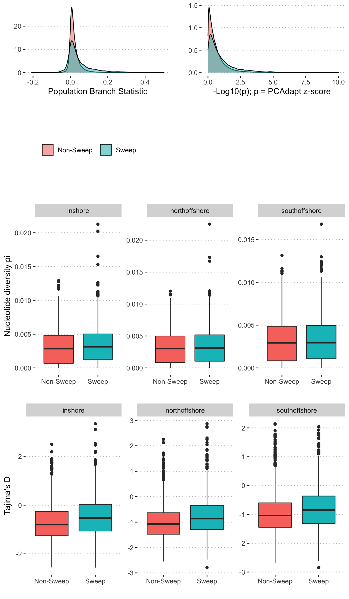

Analysis of genetic statistics (pbs, Tajima’s D, pi) in EHH sweep
regions
================

Regions identified as sweeps via EHH statistics also tended to have more
extreme values of the population branch statistic (PBS), explained more
genetic variation related to population structure (PCAdapt statistic),
and had elevated values of Tajima’s D.

**Figure 1:** Comparison of PBS, pi and Tajima’s D in sweep and
non-sweep regions.

    ## SORTING
    ## VALIDATE REGIONS
    ##  * Checking input type... PASS
    ##    Input is in bed format
    ##  * Check if index is a string... PASS
    ##  * Check index pattern... PASS
    ##  * Check for missing values... PASS
    ##  * Check for larger start position... PASS.
    ##  * Check if zero based... PASS

    ## SORTING
    ## VALIDATE REGIONS
    ##  * Checking input type... PASS
    ##    Input is in bed format
    ##  * Check if index is a string... PASS
    ##  * Check index pattern... PASS
    ##  * Check for missing values... PASS
    ##  * Check for larger start position... PASS.
    ##  * Check if zero based... PASS

    ## SORTING
    ## VALIDATE REGIONS
    ##  * Checking input type... PASS
    ##    Input is in bed format
    ##  * Check if index is a string... PASS
    ##  * Check index pattern... PASS
    ##  * Check for missing values... PASS
    ##  * Check for larger start position... PASS.
    ##  * Check if zero based... PASS

    ## JOINING
    ##  * Processing input (1): a
    ## CONVERT TO BED
    ##  * Checking input type... PASS
    ##    Input is in bed format
    ## VALIDATE REGIONS
    ##  * Check if index is a string... PASS
    ##  * Check index pattern... PASS
    ##  * Check for missing values... PASS
    ##  * Check for larger start position... PASS.
    ##  * Check if zero based... PASS
    ##  * Checking sort order... FAIL
    ##    The input for object is not *lexographically* ordered!
    ##    This can cause unexpected results for some set operations.
    ##    try: x <- bedr.sort.region(x)
    ##  * Checking for overlapping 'contiguous' regions... FAIL
    ##    The input for object has overlapping features!
    ##    This can cause unexpected results for some set operations.
    ##    i.e. x <- bedr.merge.region(x)
    ##  * Processing input (2): b
    ## CONVERT TO BED
    ##  * Checking input type... PASS
    ##    Input is in bed format
    ## VALIDATE REGIONS
    ##  * Check if index is a string... PASS
    ##  * Check index pattern... PASS
    ##  * Check for missing values... PASS
    ##  * Check for larger start position... PASS.
    ##  * Check if zero based... PASS
    ##  * Checking sort order... FAIL
    ##    The input for object is not *lexographically* ordered!
    ##    This can cause unexpected results for some set operations.
    ##    try: x <- bedr.sort.region(x)
    ##  * Checking for overlapping 'contiguous' regions... FAIL
    ##    The input for object has overlapping features!
    ##    This can cause unexpected results for some set operations.
    ##    i.e. x <- bedr.merge.region(x)
    ##    bedtools intersect -a /var/folders/4v/d7pl0lk15dn2n3g7hdff73p00000gn/T//Rtmp2Rsnx3/a_28536c8d3359.bed -b /var/folders/4v/d7pl0lk15dn2n3g7hdff73p00000gn/T//Rtmp2Rsnx3/b_285348d4fd69.bed -loj -sorted
