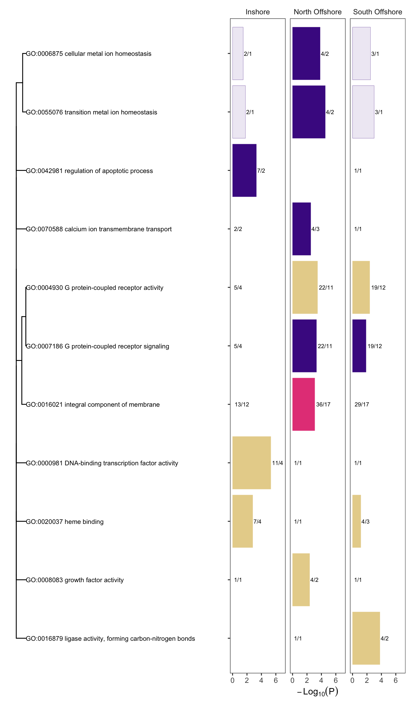

Gene Ontology Enrichment analysis
================

In a previous analysis (see
[10.identify\_selective\_genomic\_windows](10.identify_selective_genomic_windows.md)
we identified a total of 231 candidate selective sweep regions. A
summary of sweep regions and the number of genes covered by them in each
population is shown below;

| pop           | numgenes | nregions |
|:--------------|---------:|---------:|
| inshore       |      359 |       72 |
| northoffshore |      326 |       79 |
| southoffshore |      330 |       80 |

We then used `topGO` to identify GO terms that were enriched in the gene
sets covered by selective sweeps in each population. Enrichment was
initially calculated in a gene centric manner because GO terms are most
properly interpreted as attached to genes not regions, however, since
genomic regions and not genes are the independent units in this analysis
we then recalculated enrichment statistics in a region centric manner
for all GO terms found to be enriched in the initial analysis.

The gene centric analysis considered each gene as an independent entity
with the target set as all genes intersecting with selective sweeps in a
given population, and the background set taken as all annotated genes
for *A. digitifera*.

To perform the region centric analysis we first assigned GO terms to
regions by taking the union of all GO terms assigned to genes within a
region. We then considered the target set as all candidate sweeps for a
population and the background set as the complete set of all 50kb
regions on which EHH statistics were calculated.

Enrichment p-values for both gene-centric and region-centric analyses
were calculated using Fisher’s exact test. For the gene-centric analysis
this was done using TopGO incorporating topGO’s weighting system. For
the region-centric analysis it was performed using the `fisher.test`
function in R.

We found a total of 11 GO terms that were enriched (gene and region
centric p&lt;0.005; at least 2 regions) in at least one of the three of
the locations. These are summarised in Figure 1.

**Figure 1: Enriched GO terms for genes intersecting with candidate loci
under selection**. Length of bars indicates significance of gene-centric
enrichment (longer is more significant) and colour indicates the
ontology. Filled bars are also significant (p&lt;0.005) in a
region-centric test while unfilled bars are not. Numerical labels are
given as ng/nr where ng indicates the number of genes contained within
sweep regions and nr indicates the number of distinct regions where
these genes are found. Dendrogram depicts relationships between GO terms
based on numbers of shared annotated genes.
