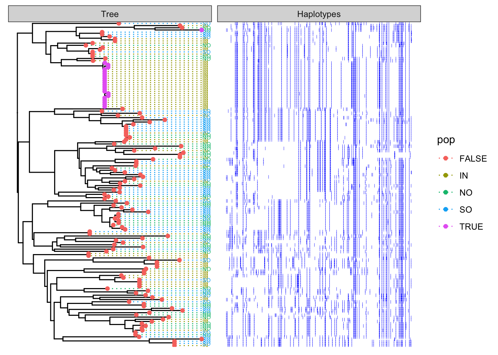
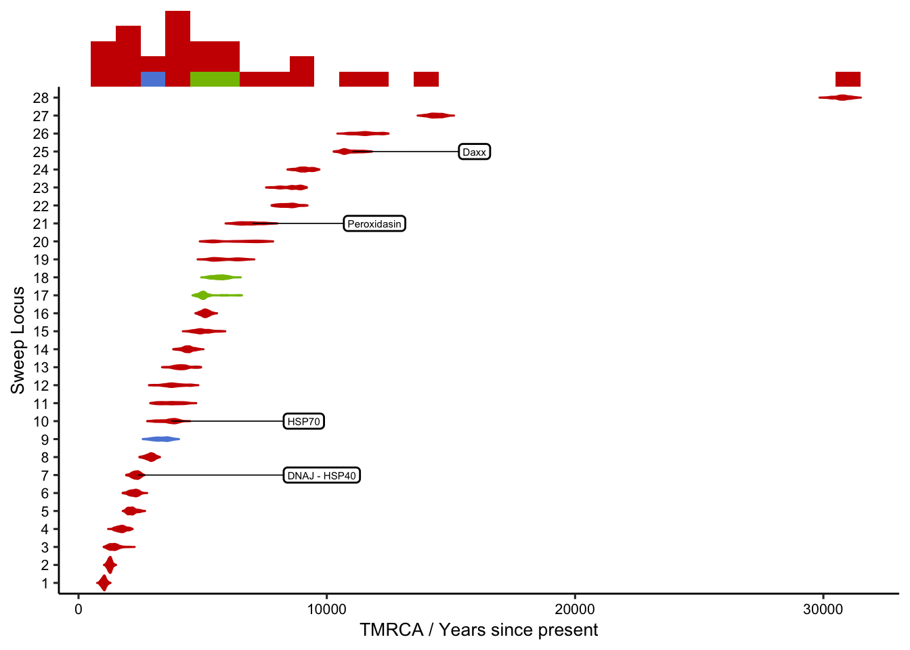

Dating the selection
================

Since hard selective sweeps lead to dominance of a single haplotype at
the swept locus it is possible to estimate the date at which a sweep
occurred. This is because new haplotypes will be introduced via
mutation, and recombination will act to break down the length of the
region of extended haplotype homozygosity.

The software [startmrca](https://github.com/jhavsmith/startmrca)
\[@Smith2018-xt\] is designed to estimate the timing of sweeps based on
patterns of haplotype diversity and length that arise as a result of
mutation and recombination after a sweep has occurred.

`startmrca` relies on the concept of a “focal allele” which in-theory
should represent the allele that is under selection, however,
in-practise it need only represent an allele on the same haplotype as
the selected allele in strong linkage disequilibrium with it.

In order to estimate the timing of selection at a locus we need the
following information; - The position of the focal allele - The identity
of the focal allele at this position (0 or 1 for a biallelic SNP) - A
list of individuals with haplotypes containing the focal allele - A list
of individuals without the focal allele

## Identifying the focal Allele

To identify the focal allele we look for the position with the maximum
z-score from \|iHS\| or XP-EHH within the interval. This information is
encoded in the candidate regions as described in
[10.identify\_selective\_genomic\_windows](10.identify_selective_genomic_windows.md)

Since many sweeps are significant in more than one of the EHH based
statistics we would like to check that the position of which these
statistics reach their maximum is roughly the same between stats. This
at least suggests that they are picking up on the same basic sweep
signal, albeit with slightly different emphasis depending on the
statistic. The QC plot below indicates that for XP type stats the
position of the maximum signal falls within a relatively small window
(\~5kb) whereas for iHS the position often disagrees with other
statistics to a much greater degree.


Since our sweep dating method assumes a hard sweep we exclude regions
where the only significant stat is `XP-nSL`. In addition, since the
XP-EHH stat seems to have the best resolution for locating the focal
allele we prefer this position wherever possible as the focal allele in
our subsequent calculations.

Sweeps are therefore filtered as follows;

1.  Exclude sweeps supported purely by XP-nSL
2.  Exclude any regions that are significant in multiple populations
    (There are four such regions)
3.  Pick the `position` as the max\_xpehh\_pos if xpehh is significant,
    otherwise max\_ihs\_pos

After exporting this initial list of regions we then perform a manual
check based on furcation plots. These plots are generated for each
window using;

``` bash
bash 02_furcation_plots.sh
```

Manual checks are based on the following rationale;

1.  `startmrca` assumes that a sufficiently hard sweep occurred to as to
    generate a star shaped genealogy. This should be visible as a clade
    with many short branches in a tree of haplotype sequences.

2.  The star-like genealogy assumption applies to haplotypes that were
    subject to selection (ie that carried the putative advantageous
    allele). In the original `startmrca` paper it was assumed that the
    actual selected locus was known, in which case the selected
    haplotypes could be readily identified simply on the basis of their
    allele at this locus. In our case we have considerable uncertainty
    in the exact locus under selection, but instead pick a locus with
    significant iHS, XP-EHH score that is likely to be physically
    close-to and strongly linked with the selected locus. We call this
    locus the “proxy” locus and we need to check that segregation at
    this locus combined with knowledge of the focal population is
    sufficient to identify the selected haplotypes.

3.  `startmrca` needs to identify the ancestral haplotype. In cases of
    soft sweeps, or if the proxy locus does not properly identify the
    selected haplotypes then this will be difficult and likely subject
    to error.

Based on this overall rationale we performed checks as follows;

1.  There should be a set of highly homozygous haplotypes that carry the
    same allele at the proxy locus.
2.  There should be just one such set of haplotypes
3.  These haplotypes should be almost exclusively present in one
    population. If there are haplotypes from different populations with
    the same allele at the proxy locus these should have clearly
    distinct haplotypes from the selected haplotypes and there should
    not be many of them. This requirement will unfortunately remove old
    sweeps because recombination would naturally result in such mixed
    clusters, however, we need to guard against alternative
    possibilities such as that the mixed clusters are a result of a soft
    sweep on an allele that had a diverse haplotype background.

#### QC Example 1 (Passing QC)

As an example, consider locus `BLFC01000593_400000_450001` which appears
to have undergone strong selection in the inshore population.

Firstly we plot the haplotypes themselves in a region +/- 200 markers
around the focal locus. We see that the highly homozygous haplotypes at
the bottom all have the derived allele whereas few of those in the top
have this allele. We can also see visually that the one NO haplotype
that has the derived allele is not the same as the selected haplotype.


A furcation plot shows there is one haplotype with very clear EHH. This
is clearly the candidate for selection that was identified using EHH
statistics and the haplotypes under selection seem to segregate
effectively based on the focal allele.


Note that there is one haplotype from NO that has the derived allele.
Despite having the focal allele (not necessarily the exact target of
selection) this haplotype is quite different from the selected
haplotype. This can be seen by visualising the selected haplotypes in
tree form. (Right of the focal allele only shown). The key thing about
this plot is that is shows that by selecting haplotypes based on the
combination of focal allele and focal population we accurately capture
them.


The furcation plot is designed to capture relationships between
haplotypes as a function of distance away from a focal point. Another
way to view the sequences is to consider the relationships between their
core haplotype sequences. This plot serves as a useful complement to the
previous plot. Here we can not only see that the focal allele accurately
identifies the selected haplotype, but also .. that it completely
identifies them (ie there are no selected haplotypes that do not have
the focal allele). We can see this because haplotypes with this allele
form a single monophyletic clade.



#### QC Example 2 (Failing QC)

Now consider a less clear-cut case such as the locus
`BLFC01000298_200000_350001`. In this case the putatively selected
haplotype has allele 0 not 1. Looking at the haplotype plot we see
several clusters of what appear to be a selected haplotype in inshore.


The furcation plot confirms that these haplotypes do indeed have high
EHH that extends over a large (&gt;100kb) region. However we can also
see that there are some inshore haplotypes with allele 0 that furcate
early (ie probably don’t have the selected haplotype).


By examining a tree based on the innermost 400 variants we see that in
the inshore population there does seem to be a highly abundant haplotype
that is likely to represent the haplotype carrying the selected allele.
Things are not completely clear-cut however because there are several
related haplotypes that differ by a small but non-trivial number of
mutations as well as other haplotypes in inshore that show evidence of
recombination with background haplotypes. The model “star-like” pattern
required by `startmrca` therefore seems to be valid for a subset of the
inshore haplotypes with the focal allele, but not all.


### Summary of manual checks

Manual check results are recorded
[here](https://docs.google.com/spreadsheets/d/1HW_6cVteoJjQEhHLmL5XaNKmcBYcX7PG40uz-mWE-ew/edit?usp=sharing)
and are downloaded to the file `sweep_regions.xlsx`. These manual checks
include a check for QC as well as a check on the status of the selected
allele (0/1). We process this to produce an input file for the
`startmrca` analysis, and after writing it to disk we run the MCMC on
the HPC.

``` bash
bash 03_run_tmrca.sh
```

# Results

Preliminary results are show below for all loci passing QC. The dates
shown are based on an assumption that the recombination rate equals the
mutation rate. A range is given by showing the sampling of the posterior
distribution in the last 1000 MCMC steps. A better estimate should be
obtained by running multiple chains to ensure convergence and making
parameter estimates from converged chains only.

One of the main things that can be seen here is that relatively few loci
pass the QC checks for use with startmrca. This limits the analysis a
little but we are able to see dating estimates for several loci involved
in enriched go terms. The broad pattern of timing is also interesting
because it shows a peak in the number of loci dating to around 6kya
which approximately matches the time when sea levels reached similar
heights to what they are today.


