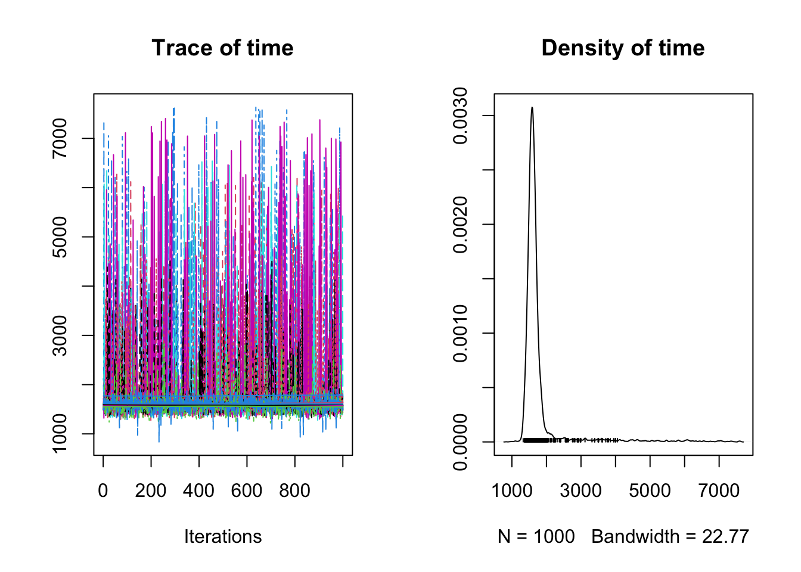

Dating the selection
================

Since hard selective sweeps lead to dominance of a single haplotype at
the swept locus it is possible to estimate the date at which a sweep
occurred. This is because new haplotypes will be introduced via
mutation, and recombination will act to break down the length of the
region of extended haplotype homozygosity.

The software [startmrca](https://github.com/jhavsmith/startmrca)
\[@Smith2018-xt\] is designed to estimate the timing of sweeps based on
patterns of haplotype diversity and length that arise as a result of
mutation and recombination after a sweep has occurred.

`startmrca` relies on the concept of a “focal allele” which in-theory
should represent the allele that is under selection, however,
in-practise it need only represent an allele on the same haplotype as
the selected allele in strong linkage disequilibrium with it.

In order to estimate the timing of selection at a locus we need the
following information; - The position of the focal allele - The identity
of the focal allele at this position (0 or 1 for a biallelic SNP) - A
list of individuals with haplotypes containing the focal allele - A list
of individuals without the focal allele

## Identifying the focal Allele

To identify the focal allele we look for the position with the maximum
z-score from \|iHS\| or XP-EHH within the interval.

After exporting this initial list of regions we then perform a manual
check based on furcation plots. These plots are generated for each
window using;

``` bash
bash 02_furcation_plots.sh
```

For each window we check the furcation plot to identify the focal allele
(0 = ancestral, 1 = derived). This results in the file
`inshore_sweep_regions_checked.txt` where all focal alleles are coded.

Since XP-EHH is a bit complicated we start with the iHS sites

    ## BLFC01000008.1 1150001 1200001 
    ## BLFC01000051.1 600001 650001 
    ## BLFC01000074.1 150001 250001 
    ## BLFC01000082.1 550001 600001 
    ## BLFC01000158.1 700001 750001 
    ## BLFC01000201.1 2450001 2500001 
    ## BLFC01000235.1 3250001 3300001 
    ## BLFC01000289.1 450001 500001 
    ## BLFC01000298.1 300001 350001 
    ## BLFC01000309.1 3050001 3100001 
    ## BLFC01000324.1 1600001 1800001 
    ## BLFC01000348.1 2400001 2450001 
    ## BLFC01000375.1 1150001 1200001 
    ## BLFC01000413.1 150001 200001 
    ## BLFC01000416.1 50001 100001 
    ## BLFC01000416.1 150001 200001 
    ## BLFC01000450.1 750001 800001 
    ## BLFC01000474.1 1650001 1700001 
    ## BLFC01000591.1 150001 200001 
    ## BLFC01000593.1 400001 450001 
    ## BLFC01000610.1 900001 950001 
    ## BLFC01000610.1 1000001 1100001 
    ## BLFC01000639.1 1450001 1550001 
    ## BLFC01000655.1 200001 250001 
    ## BLFC01000690.1 2600001 2700001 
    ## BLFC01000690.1 2800001 2850001 
    ## BLFC01000690.1 3200001 3250001 
    ## BLFC01000718.1 1250001 1400001 
    ## BLFC01000734.1 350001 400001 
    ## BLFC01000745.1 300001 400001 
    ## BLFC01000770.1 850001 900001 
    ## BLFC01000770.1 3100001 3150001 
    ## BLFC01000820.1 1050001 1100001 
    ## BLFC01000834.1 3350001 3400001 
    ## BLFC01000838.1 550001 600001 
    ## BLFC01000857.1 150001 200001

Now that we have written input files to disk, run the MCMC on HPC using

``` bash
bash 03_run_tmrca.sh
```

# Results


