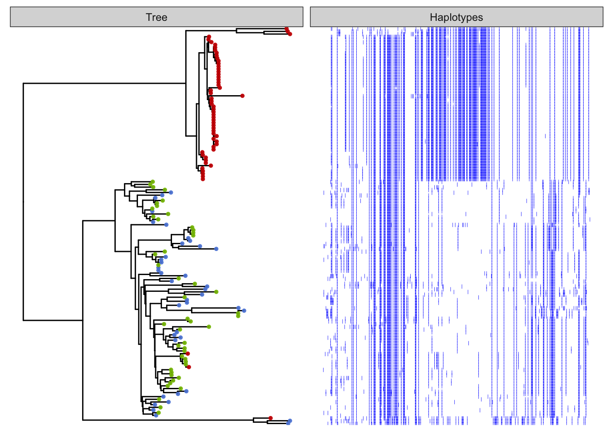

Dating the selection
================

The software [startmrca](https://github.com/jhavsmith/startmrca)
\[@Smith2018-xt\] is designed to estimate the timing of sweeps based on
patterns of haplotype diversity and length that arise as a result of
mutation and recombination after a sweep has occurred.

`startmrca` relies on the concept of a “focal allele” which in-theory
should represent the allele that is under selection, however,
in-practise it need only represent an allele on the same haplotype as
the selected allele in strong linkage disequilibrium with it.

In order to estimate the timing of selection at a locus we need the
following information; - The position of the focal allele - The identity
of the focal allele at this position (0 or 1 for a biallelic SNP) - A
list of individuals with haplotypes containing the focal allele - A list
of individuals without the focal allele

#### Haem Peroxidase Locus BLFC01000154_250000_300001

Our strongest signature of a selective sweep was identified at locus
`BLFC01000154_250000_300001` in the inshore population.

Firstly we plot the haplotypes themselves in a region +/- 200 markers
around the focal locus. We see that the highly homozygous haplotypes at
the bottom all have the derived allele whereas few of those in the top
have this allele.

A furcation plot shows there is one haplotype with very clear EHH. This
is clearly the candidate for selection that was identified using EHH
statistics and the haplotypes under selection seem to segregate
effectively based on the focal allele.

The furcation plot is designed to capture relationships between
haplotypes as a function of distance away from a focal point. Another
way to view the sequences is to consider the relationships between their
core haplotype sequences. This plot serves as a useful complement to the
previous plot. Here we can not only see that the focal allele accurately
identifies the selected haplotype, but also .. that it completely
identifies them (ie there are no selected haplotypes that do not have
the focal allele). We can see this because haplotypes with this allele
form a single monophyletic clade.

    ##                    hap loc_code allele location
    ## 1 BR_5_121_S125_L004_1       BR      0  inshore
    ## 2 BR_5_121_S125_L004_2       BR      0  inshore
    ## 3 BR_5_123_S121_L004_1       BR      0  inshore

## Running STARTMRCA

After completing manual checks on putative sweep loci we ran startmrca
on each of them as follows;

-   We used `vcftools` to extract a phased vcf file specific to the
    region under analysis (1Mb region centered on the focal allele)
-   We then used the script
    [03_run_tmrca.sh](data/hpc/startmrca/03_run_tmrca.sh) which itself
    calls [run_startmrca.R](data/hpc/startmrca/run_startmrca.R).

This process was run for all regions. Notet that the `run_startmrca`
script uses a chain length of 20000,

# Results

Preliminary results are shown below for all loci passing QC. The dates
shown are based on a mutation rate of 1.2e-8 and a recombination rate of
3.2e-8. This mutation rate is the same as used in other analyses (SMC++,
fastSimCoal) and the recombination rate is based on a linkage map for
*Acropora millepora* published by Dixon et al \[@Dixon2015-x\] which had
a length of 1358 centimorgans (cM). Assuming a genome size of 430mb for
*A. millepora* this corresponds to a mean recombination rate of 3.16e-8
per base per generation, which we rounded to 3.2e-8. A range is given by
showing the sampling of the posterior distribution in the last 1000 MCMC
steps.

One of the main things that can be seen here is that relatively few loci
pass the QC checks for use with startmrca. This limits the analysis a
little but we are able to see dating estimates for several loci involved
in enriched go terms. The broad pattern of timing is also interesting
because it shows a peak in the number of loci dating to around 6kya
which approximately matches the time when sea levels reached similar
heights to what they are today.
