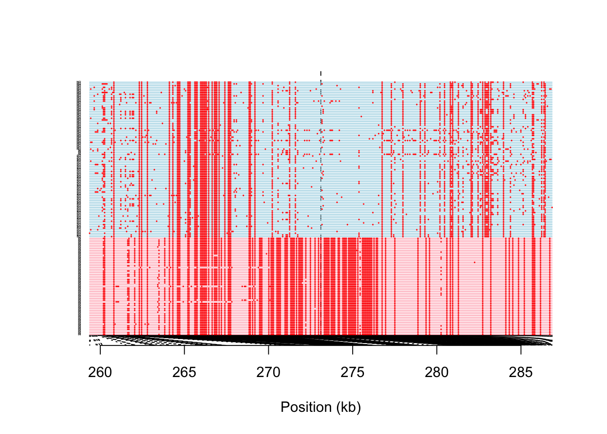

Dating the selection
================

The software [startmrca](https://github.com/jhavsmith/startmrca)
\[@Smith2018-xt\] is designed to estimate the timing of sweeps based on
patterns of haplotype diversity and length that arise as a result of
mutation and recombination after a sweep has occurred.

`startmrca` relies on the concept of a “focal allele” which in-theory
should represent the allele that is under selection, however,
in-practise it need only represent an allele on the same haplotype as
the selected allele in strong linkage disequilibrium with it.

In order to estimate the timing of selection at a locus we need the
following information;

-   The position of the focal allele
-   The identity of the focal allele at this position (0 or 1 for a
    biallelic SNP)
-   A list of individuals with haplotypes containing the focal allele
-   A list of individuals without the focal allele

#### Visualisation of haplotypes at the Haem Peroxidase Locus BLFC01000154\_250000\_300001

Our strongest signature of a selective sweep was identified at locus
`BLFC01000154_250000_300001` in the inshore population.

Firstly we plot the haplotypes themselves in a region +/- 200 markers
around the focal locus. We see that the highly homozygous haplotypes at
the bottom all have the derived allele whereas few of those in the top
have this allele.

A furcation plot shows there is one haplotype with very clear EHH. This
is clearly the candidate for selection that was identified using EHH
statistics and the haplotypes under selection seem to segregate
effectively based on the focal allele.

The furcation plot is designed to capture relationships between
haplotypes as a function of distance away from a focal point. Another
way to view the sequences is to consider the relationships between their
core haplotype sequences. This plot serves as a useful complement to the
previous plot. Here we can not only see that the focal allele accurately
identifies the selected haplotype, but also .. that it completely
identifies them (ie there are no selected haplotypes that do not have
the focal allele). We can see this because haplotypes with this allele
form a single monophyletic clade.

    ##                    hap loc_code allele location
    ## 1 BR_5_121_S125_L004_1       BR      0  inshore
    ## 2 BR_5_121_S125_L004_2       BR      0  inshore
    ## 3 BR_5_123_S121_L004_1       BR      0  inshore

## Running STARTMRCA

Our goal was to estimate the timing of selection on the gene `s0150.g24`
which contained 75 sites whose allele frequencies and make them
potential candidates for the beneficial allele. We chose 3 of these
spanning the width of the gene and then ran startmrca on each as
follows;

-   We used `vcftools` to extract a phased vcf file across a 1Mb region
    centered on `s0150.g24`. This extraction was performed based on the
    vcf file where the ancestral allele has been assigned to the
    reference.
-   We then ran startmrca using the script
    [03\_run\_tmrca.sh](data/hpc/startmrca/03_run_tmrca.sh) which itself
    calls [run\_startmrca.R](data/hpc/startmrca/run_startmrca.R).

For each of our three loci we check convergence using the Gelman
diagnostic. Then report the median estimate for the TMRCA. Dates shown
are based on a mutation rate of 1.2e-8 and a recombination rate of
3.2e-8. This mutation rate is the same as used in other analyses (SMC++,
fastSimCoal) and the recombination rate is based on a linkage map for
*Acropora millepora* published by Dixon et al \[@Dixon2015-x\] which had
a length of 1358 centimorgans (cM). Assuming a genome size of 430mb for
*A. millepora* this corresponds to a mean recombination rate of 3.16e-8
per base per generation, which we rounded to 3.2e-8.

| locus                                | median(time) \* 5 | nchains |
|:-------------------------------------|------------------:|--------:|
| BLFC01000154\_250000\_300001\_278594 |          8036.324 |      10 |
| BLFC01000154\_250000\_300001\_281245 |          8013.623 |      10 |
| BLFC01000154\_250000\_300001\_282923 |          8263.734 |      10 |
