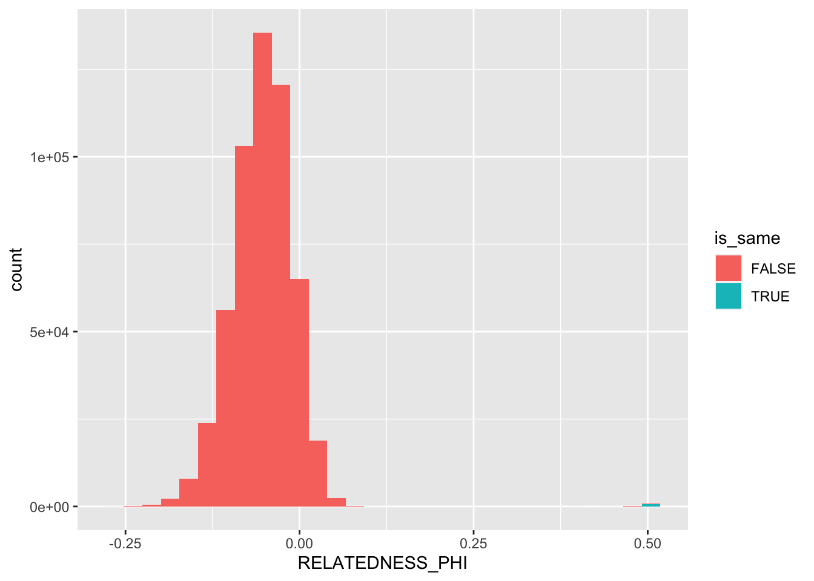

Sample label check using Radseq data
================

Our whole genome sequencing libraries were generated from DNA that was
also used as part of a study that used RAD sequencing (provided by DaRT)
to examine population structure across a broader geographical region in
WA. DNA was extracted by DaRT and returned on 96 well plates to us prior
to sending to QB3 (California Institute for Quantitative Bioscience,
University of California, Berkeley) for whole genome sequencing.

Since this process involved many steps at which a mistake in sample
identity could have been introduced we performed a relatedness check on
our data against all corresponding samples that were also sequenced with
DaRT. All raw reads from DaRT were mapped against the genome and use to
call variants with freebayes. `bcftools` was then used to merge results
from WGS and DaRT sequencing into a single vcf file as follows;

``` bash
bcftools merge  Adigi.v2.filtered.vcf.gz allrad_filt.vcf.gz | 
    bcftools view -i 'F_MISSING<0.1' > allrad_merged.vcf
```

We then used the relatedness2 function in `vcftools` to calculate a
pairwise relatedness statistic between all pairs of samples in the file

``` bash
vcftools --vcf allrad_merged.vcf --relatedness2
```

A histogram of relatedness values shows that the majority of pairs are
unrelated (PHI close to or less than 0). The peak close to 0.5
represents samples with the maximum possible relatedness value for
diploids. We can therefore use PHI to determine the matches between RAD
and WGS samples.



| sample_code1        | sample_code2        | individual_1 | individual_2 | RELATEDNESS_PHI |
|:--------------------|:--------------------|:-------------|:-------------|----------------:|
| BR_5\_124_S124_L004 | 1439309             | BR_5\_124    | BR_5\_121    |        0.472934 |
| 1439312             | 1439309             | BR_5\_124    | BR_5\_121    |        0.492299 |
| 1439309             | BR_5\_124_S124_L004 | BR_5\_121    | BR_5\_124    |        0.472934 |
| 1439309             | 1439312             | BR_5\_121    | BR_5\_124    |        0.492299 |

Our sample labelled `BR_5_121_S125_L004` does not actually match any
other samples. The only match is to itself as shown below.

    ## # A tibble: 1 × 7
    ##   INDV1              INDV2              N_AaAa N_AAaa N1_Aa N2_Aa RELATEDNESS_PHI
    ##   <chr>              <chr>               <dbl>  <dbl> <dbl> <dbl>           <dbl>
    ## 1 BR_5_121_S125_L004 BR_5_121_S125_L004    900      0   900   900             0.5
