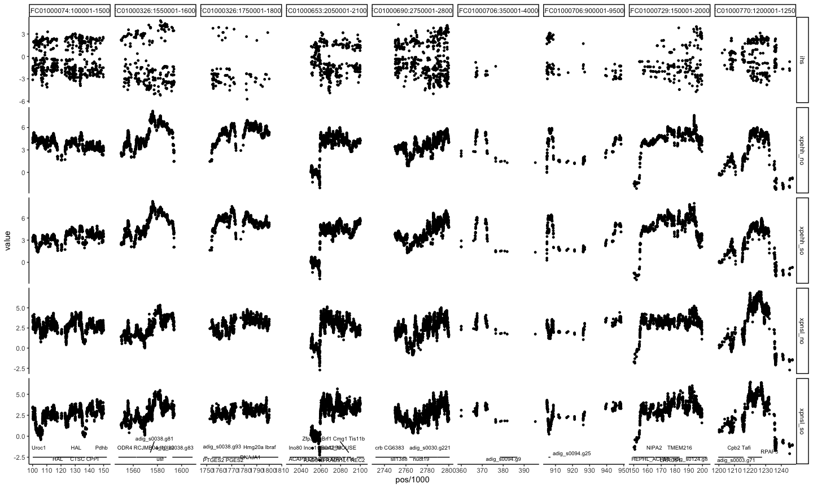
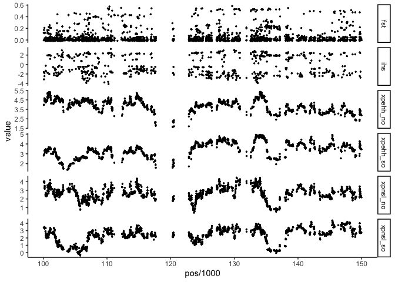
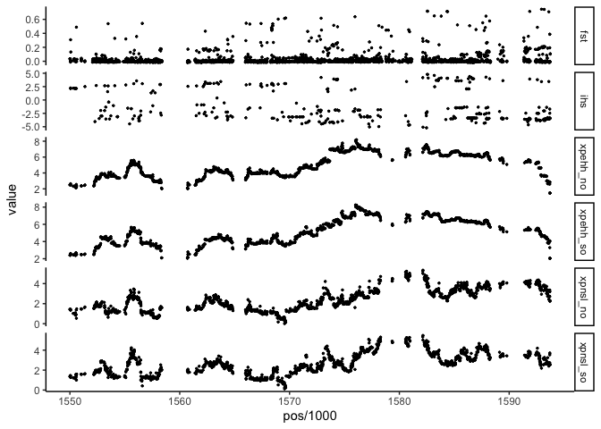
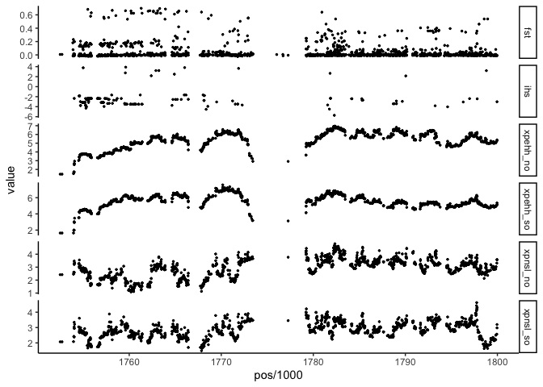
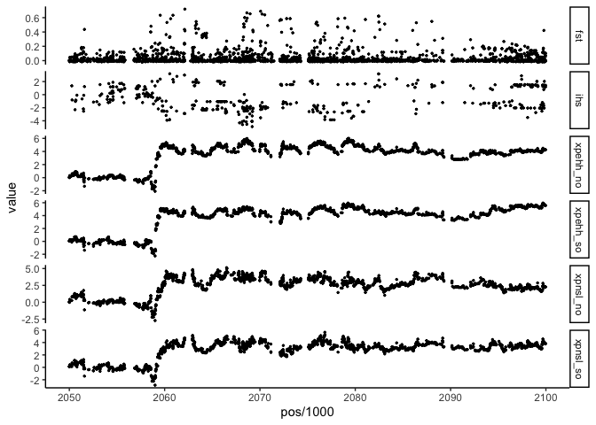

Genes under selection in inshore reefs
================

We extract top 1% outlier in iHS, XP-EHH, and XP-nSL and made a
statistic of all haplotype-based selection scan using
`multiIntersectBed`. In the interected bed file, it displays the all
regions that were identified as significantly under selection in as
least one method and the occurrences of them.

``` bash
multiIntersectBed -i {pop}*.percentile1.bed -header > {pop}.multiIntersect.bed
```

For these windows, we checked several signals such as XP-EHH, XP-nSL,
iHS and delta-iHH, delta-DAF, and Fst.

### Gene candidates in Inshore

Combine all the significant regions in iHS, XP-EHH, and XP-nSL scans.
There are 9 windows (including 33 genes) identified as under selection
in all 5 comparisons in inshore reefs (iHS, XP-EHH and XP-nSL against
north offshore and south offshore reefs).

| Scaffold\_ID |   Start |     End | Significant in \# | Genes in this window                                                                                                                                                                                                   |
|:-------------|--------:|--------:|------------------:|:-----------------------------------------------------------------------------------------------------------------------------------------------------------------------------------------------------------------------|
| BLFC01000074 |  100001 |  150001 |                 5 | Uroc1; CTSC CPPI; HAL; Pdhb                                                                                                                                                                                            |
| BLFC01000326 | 1550001 | 1600001 |                 5 | usf; ODR4 RCJMB04\_10l22; adig\_s0038.g83; adig\_s0038.g81                                                                                                                                                             |
| BLFC01000326 | 1750001 | 1800001 |                 5 | adig\_s0038.g93; PTGES2 PGES2; DNAJA1; Hmg20a Ibraf                                                                                                                                                                    |
| BLFC01000653 | 2050001 | 2100001 |                 5 | CB042\_MOUSE; Zfp36l1 Brf1 Cmg1 Tis11b; Ino80 Inoc1 Kiaa1259; ACAP3 CENTB5 KIAA1716; RAD51B RAD51L1 REC2                                                                                                               |
| BLFC01000690 | 2750001 | 2800001 |                 5 | sll1388; nudt19; Mrps33 Gdap3; adig\_s0030.g221; mcfO DDB\_G0283329; CNTRL CEP1 CEP110; crb CG6383                                                                                                                     |
| BLFC01000706 |  350001 |  400001 |                 5 | adig\_s0094.g9                                                                                                                                                                                                         |
| BLFC01000706 |  900001 |  950001 |                 5 | adig\_s0094.g25                                                                                                                                                                                                        |
| BLFC01000729 |  150001 |  200001 |                 5 | NIPA2; LRRC51; HEPHL\_ACRMI; TMEM216; adig\_s0124.g8                                                                                                                                                                   |
| BLFC01000770 | 1200001 | 1250001 |                 5 | adig\_s0003.g71; RPAP3; Cpb2 Tafi                                                                                                                                                                                      |
| BLFC01000039 |  100001 |  150001 |                 4 | septin8 sept8; Micu3 Efha2; Lrba Bgl Lba                                                                                                                                                                               |
| BLFC01000154 |  250001 |  300001 |                 4 | Pxt CG7660; pxdn pxn; PXDN KIAA0230 MG50 PRG2 VPO VPO1; adig\_s0150.g22                                                                                                                                                |
| BLFC01000185 |  900001 | 1050001 |                 4 | Hbp1; Slc27a1 Fatp Fatp1; Magi3 Kiaa1634; HMA2 Os06g0700700 LOC\_Os06g48720 OsJ\_22530; adig\_s0062.g79; RXR; Sardh; SLC27A4 FATP4 QtsA-13277; DAXX; Wdr47 Kiaa0893; Stx6; Loxhd1; slc25a25 scamc2                     |
| BLFC01000265 |  200001 |  250001 |                 4 | ASRGL1 QtsA-14329; SNTB1 SNT2B1; Col17a1 Bp180 Bpag2; zgc:92818; IMPA1 IMPA; adig\_s0125.g21                                                                                                                           |
| BLFC01000309 | 2950001 | 3000001 |                 4 | Avil Advil; Pak1ip1; GELS\_HOMAM; TM9SF3 SMBP UNQ245/PRO282; Pax2 Pax-2                                                                                                                                                |
| BLFC01000326 | 1800001 | 1850001 |                 4 | adig\_s0038.g97; Npffr2 Gpr74 Npff2; adig\_s0038.g99; CRYZ; Hmg20a Ibraf                                                                                                                                               |
| BLFC01000326 | 1900001 | 1950001 |                 4 | adig\_s0038.g103; adig\_s0038.g104; OIT3 LZP UNQ826/PRO1753                                                                                                                                                            |
| BLFC01000368 |  800001 |  850001 |                 4 | Nicn1; HNK2\_XENLA; Xrn2 Dhm1; adig\_s0025.g56                                                                                                                                                                         |
| BLFC01000375 | 1200001 | 1250001 |                 4 | ANO1 DOG1 ORAOV2 TAOS2 TMEM16A; adig\_s0052.g77; adig\_s0052.g78; Ano4 Tmem16d                                                                                                                                         |
| BLFC01000404 | 1000001 | 1050001 |                 4 | adig\_s0020.g95; TPRG1L FAM79A MOVER; OPN4; adig\_s0020.g97; Nup188 Kiaa0169                                                                                                                                           |
| BLFC01000413 |  150001 |  200001 |                 4 | COL11A2; SUOX; Ptprf Lar; COL17A1 BP180 BPAG2                                                                                                                                                                          |
| BLFC01000600 | 3700001 | 3800001 |                 4 | FRIS\_LYMST; Pex19 Pxf; PCBD2 DCOH2 DCOHM; adig\_s0005.g348; adig\_s0005.g349; Hspg2; adig\_s0005.g347; lrrc58; Gabbr2 Gpr51; Cad96Ca HD-14 CG10244; RET CDHF12 CDHR16 PTC RET51                                       |
| BLFC01000639 | 1300001 | 1350001 |                 4 | Pxdn Kiaa0230; AP4B1; adig\_s0017.g57; RNASEK l(2)NC110 CG40127; BECN1 ATG6                                                                                                                                            |
| BLFC01000653 | 2100001 | 2150001 |                 4 | adig\_s0034.g145; Mtrr; COL17A1 BP180 BPAG2; mtmr2 si:dkey-110k5.3; RAD51B RAD51L1 REC2                                                                                                                                |
| BLFC01000690 | 2800001 | 2850001 |                 4 | adig\_s0030.g221; Gfi1 Gfi-1; SNAPIN BLOC1S7 SNAP25BP SNAPAP; adig\_s0030.g222; ACADM                                                                                                                                  |
| BLFC01000706 |  300001 |  350001 |                 4 | adig\_s0094.g8                                                                                                                                                                                                         |
| BLFC01000706 |  750001 |  800001 |                 4 | no gene in this window                                                                                                                                                                                                 |
| BLFC01000706 |  950001 | 1000001 |                 4 | FCN2 FCNL                                                                                                                                                                                                              |
| BLFC01000770 |  650001 |  700001 |                 4 | adig\_s0003.g29; ZNF862 KIAA0543; adig\_s0003.g30; adig\_s0003.g31                                                                                                                                                     |
| BLFC01000928 |  550001 |  600001 |                 4 | adig\_s0079.g41; adig\_s0079.g42; adig\_s0079.g43; adig\_s0079.g44; Wdr35                                                                                                                                              |
| BLFC01000008 | 2050001 | 2100001 |                 3 | BARHL1 FKSG31; adig\_s0073.g156; lcp1 pls2; CPP1\_ACRMI; dlx4a dlx8; Golga4                                                                                                                                            |
| BLFC01000123 |  850001 |  900001 |                 3 | UBCRBP; Rab38; GDF5 BMP14 CDMP1; adig\_s0039.g83                                                                                                                                                                       |
| BLFC01000277 |  150001 |  200001 |                 3 | adig\_s0082.g15; adig\_s0082.g16; RIT1 RIBB RIT ROC1; Uba6 Ube1l2                                                                                                                                                      |
| BLFC01000277 |  200001 |  250001 |                 3 | RIT1 RIBB RIT ROC1; C3orf38; PC6; SFR1 C10orf78 MEI5 MEIR5; Pcsk6 Pace4; Idh3a l(1)G0156 CG12233                                                                                                                       |
| BLFC01000298 |  250001 |  300001 |                 3 | adig\_s0120.g22; At2g19790 F6F22.18; adig\_s0120.g25; Prss23; adig\_s0120.g24                                                                                                                                          |
| BLFC01000298 |  300001 |  350001 |                 3 | Prss23; KIF16B C20orf23 KIAA1590 SNX23                                                                                                                                                                                 |
| BLFC01000326 | 1850001 | 1900001 |                 3 | CRYZ; adig\_s0038.g102; adig\_s0038.g101; adig\_s0038.g103                                                                                                                                                             |
| BLFC01000407 | 1900001 | 1950001 |                 3 | adig\_s0145.g117; THAP12 DAP4 P52RIPK PRKRIR THAP0; tie1 tie-1                                                                                                                                                         |
| BLFC01000413 |  350001 |  400001 |                 3 | psiD; Pigq Gpi1h Mgpi1; CTH; CTH QccE-22305                                                                                                                                                                            |
| BLFC01000439 | 1750001 | 1800001 |                 3 | R3HDM4; Mat1a; CHST3 NSIST; Rb1cc1 Cc1 Kiaa0203; NALCN VGCNL1                                                                                                                                                          |
| BLFC01000706 |  450001 |  500001 |                 3 | no gene in this window                                                                                                                                                                                                 |
| BLFC01000706 | 1000001 | 1050001 |                 3 | FCN2 FCNL                                                                                                                                                                                                              |
| BLFC01000718 | 1250001 | 1300001 |                 3 | kcnma1 kcnma xslo                                                                                                                                                                                                      |
| BLFC01000770 | 2800001 | 2850001 |                 3 | adig\_s0003.g179; adig\_s0003.g177; adig\_s0003.g178; adig\_s0003.g180; adig\_s0003.g181                                                                                                                               |
| BLFC01000770 | 2850001 | 2900001 |                 3 | adig\_s0003.g182; fd64A FD2 CG1132; adig\_s0003.g181; dalrd3 zgc:153958; AASS                                                                                                                                          |
| BLFC01000773 | 2100001 | 2250001 |                 3 | Npr2; Npr1 Npra; GCY\_STRPU; Gyc76C CG42636                                                                                                                                                                            |
| BLFC01000039 |  150001 |  200001 |                 2 | adig\_s0146.g11; GFPL\_ANEMA; adig\_s0146.g12; Lrba Bgl Lba                                                                                                                                                            |
| BLFC01000074 |  200001 |  250001 |                 2 | adig\_s0057.g17; adig\_s0057.g15; Nagk Gnk                                                                                                                                                                             |
| BLFC01000161 |  700001 |  750001 |                 2 | adig\_s0021.g39                                                                                                                                                                                                        |
| BLFC01000298 |  200001 |  250001 |                 2 | mtnN DP0528; hsp-16.2 hsp-16 hsp16-2 Y46H3A.3; ACBD3 GCP60 GOCAP1 GOLPH1; adig\_s0120.g20; TREA\_APIME; adig\_s0120.g21                                                                                                |
| BLFC01000309 | 2200001 | 2250001 |                 2 | adig\_s0069.g143; adig\_s0069.g144; adig\_s0069.g145                                                                                                                                                                   |
| BLFC01000326 | 1600001 | 1650001 |                 2 | adig\_s0038.g84; adig\_s0038.g86; adig\_s0038.g83; adig\_s0038.g85; adig\_s0038.g87                                                                                                                                    |
| BLFC01000326 | 1950001 | 2000001 |                 2 | OIT3 LZP UNQ826/PRO1753; TLL2 KIAA0932; OIT3                                                                                                                                                                           |
| BLFC01000326 | 2050001 | 2150001 |                 2 | OIT3; Tll2                                                                                                                                                                                                             |
| BLFC01000375 | 1150001 | 1200001 |                 2 | adig\_s0052.g72; skap2 scap2; adig\_s0052.g70; Ano4 Tmem16d; ANO5 GDD1 TMEM16E                                                                                                                                         |
| BLFC01000393 | 1400001 | 1450001 |                 2 | adig\_s0102.g96; adig\_s0102.g99; adig\_s0102.g97; adig\_s0102.g98; BRSK2 C11orf7 PEN11B SADA STK29 HUSSY-12                                                                                                           |
| BLFC01000413 |  100001 |  150001 |                 2 | SDK1; adig\_s0114.g2; Gipc1 Gipc Rgs19ip1; Ptprf Lar                                                                                                                                                                   |
| BLFC01000522 |  350001 |  400001 |                 2 | Oit3 Lzp; adig\_s0035.g28; C17orf98; ACAN AGC1; GLI1 GLI                                                                                                                                                               |
| BLFC01000600 | 2900001 | 2950001 |                 2 | Fam234a Itfg3; ddx6 DDB\_G0291804; SIDT1; FBXO3 FBX3; rxrga nr2b1 nr2b3a rxr rxra rxrg; At5g27410 F21A20\_120                                                                                                          |
| BLFC01000690 | 3200001 | 3250001 |                 2 | Rabgef1 Rabex5; adig\_s0030.g253; adig\_s0030.g254; adig\_s0030.g255; adig\_s0030.g256; adig\_s0030.g257                                                                                                               |
| BLFC01000706 |  250001 |  300001 |                 2 | no gene in this window                                                                                                                                                                                                 |
| BLFC01000732 | 1950001 | 2000001 |                 2 | adig\_s0032.g130; CYP27C1; tmem241; adig\_s0032.g131                                                                                                                                                                   |
| BLFC01000816 |  400001 |  450001 |                 2 | CFAP47 CHDC2 CXorf22 CXorf30 CXorf59; gdap2 v1g195342                                                                                                                                                                  |
| BLFC01000829 |  350001 |  500001 |                 2 | CHTOP C1orf77 FOP HT031 PP7704; adig\_s0242.g32; LSM7; adig\_s0242.g39; adig\_s0242.g40; ENPEP; Lman1 Ergic53; CPEB1; MTFMT FMT FMT1; Pip5k1a; Alg13 Glt28d1; ntaq1 wdyhv1 si:rp71-45k5.3; Bap18; SPPL2B RCJMB04\_29c5 |
| BLFC01000008 | 1150001 | 1200001 |                 1 | adig\_s0073.g90                                                                                                                                                                                                        |
| BLFC01000051 |  600001 |  650001 |                 1 | adig\_s0009.g26; Slc35f5; Enpp5                                                                                                                                                                                        |
| BLFC01000074 |  150001 |  200001 |                 1 | arf4; adig\_s0057.g11; KLKB1; Pdhb; adig\_s0057.g12; Ablim1 Ablim Kiaa0059; adig\_s0057.g15                                                                                                                            |
| BLFC01000082 |  550001 |  600001 |                 1 | adig\_s0168.g24                                                                                                                                                                                                        |
| BLFC01000158 |  700001 |  750001 |                 1 | blm                                                                                                                                                                                                                    |
| BLFC01000172 | 1150001 | 1200001 |                 1 | adig\_s0078.g84; adig\_s0078.g85; adig\_s0078.g86; adig\_s0078.g88; noc4l-b; adig\_s0078.g83; adig\_s0078.g90; adig\_s0078.g87                                                                                         |
| BLFC01000172 | 1250001 | 1300001 |                 1 | Ebna1bp2 Ebp2; tric-1B.1 Y57A10A.10; adig\_s0078.g100; GA18415; adig\_s0078.g104; Ech1; adig\_s0078.g101; adig\_s0078.g103                                                                                             |
| BLFC01000185 | 1050001 | 1100001 |                 1 | usf; adig\_s0062.g84; Tada1 Tada1l; adig\_s0062.g86; Rpl35; slc25a25 scamc2                                                                                                                                            |
| BLFC01000201 | 2450001 | 2500001 |                 1 | adig\_s0044.g131                                                                                                                                                                                                       |
| BLFC01000235 | 3250001 | 3300001 |                 1 | mkrn1; RAD54L RAD54; ALKBH7; CFAP57 WDR65; rhbg-b                                                                                                                                                                      |
| BLFC01000277 | 1200001 | 1250001 |                 1 | nosip zgc:101669; Trpa1 Anktm1; TrpA1 Anktm1 CG5751; adig\_s0082.g85                                                                                                                                                   |
| BLFC01000289 |  250001 |  300001 |                 1 | adig\_s0153.g8; adig\_s0153.g9; adig\_s0153.g10; adig\_s0153.g11; BTBD7 KIAA1525                                                                                                                                       |
| BLFC01000289 |  450001 |  500001 |                 1 | adig\_s0153.g19; adig\_s0153.g20; bbs9 pthb1; Bmper Cv2                                                                                                                                                                |
| BLFC01000309 | 2250001 | 2300001 |                 1 | adig\_s0069.g146; adig\_s0069.g145                                                                                                                                                                                     |
| BLFC01000309 | 2850001 | 2900001 |                 1 | tmem175 si:ch211-168m18.2; TMEM175 RCJMB04\_8l18; MGAT4C; pan3 TEgg127h19.1; PAT23 At2g14255 T1O16.20                                                                                                                  |
| BLFC01000309 | 2900001 | 2950001 |                 1 | SCR3\_ACRMI; Fgf6 Fgf-6 Hstf2; SCR1A\_MONCP; Avil Advil                                                                                                                                                                |
| BLFC01000309 | 3050001 | 3100001 |                 1 | dmbx1b mbx2 zgc:112395; PITX2 ARP1 RGS RIEG RIEG1                                                                                                                                                                      |
| BLFC01000324 | 1600001 | 1800001 |                 1 | BCL2L1 BCL2L BCLX; AAGAB; adig\_s0041.g86; DRB1 Os01g0772000 LOC\_Os01g56520 P0695H10.10; ULK3 RCJMB04\_18b17; HTK7                                                                                                    |
| BLFC01000326 | 1650001 | 1750001 |                 1 | adig\_s0038.g88; adig\_s0038.g89; adig\_s0038.g90; adig\_s0038.g91; adig\_s0038.g92; adig\_s0038.g93; adig\_s0038.g87                                                                                                  |
| BLFC01000348 | 2400001 | 2450001 |                 1 | TAF4 TAF2C TAF2C1 TAF4A TAFII130 TAFII135; SLC9A8 KIAA0939 NHE8; adig\_s0001.g108; adig\_s0001.g109; RSPRY1 QtsA-15931                                                                                                 |
| BLFC01000393 |  100001 |  150001 |                 1 | FAM166C C2orf70; Tbc1d10c; RECQL RECQ1 RECQL1; TJP1 ZO1; adig\_s0102.g10                                                                                                                                               |
| BLFC01000404 |  250001 |  300001 |                 1 | dve-1 ZK1193.5; adig\_s0020.g23; Pik3cb; WDR70                                                                                                                                                                         |
| BLFC01000407 | 1800001 | 1850001 |                 1 | no gene in this window                                                                                                                                                                                                 |
| BLFC01000407 | 2000001 | 2050001 |                 1 | ALMA7 EMIHUDRAFT\_114859; adig\_s0145.g121                                                                                                                                                                             |
| BLFC01000407 | 2050001 | 2100001 |                 1 | adig\_s0145.g124                                                                                                                                                                                                       |
| BLFC01000416 |   50001 |  100001 |                 1 | adig\_s0147.g3; adig\_s0147.g4                                                                                                                                                                                         |
| BLFC01000416 |  150001 |  200001 |                 1 | no gene in this window                                                                                                                                                                                                 |
| BLFC01000439 | 1200001 | 1250001 |                 1 | Mfge8 Ags                                                                                                                                                                                                              |
| BLFC01000450 |  750001 |  800001 |                 1 | adig\_s0015.g55; CACNA1A CACH4 CACN3 CACNL1A4; CAC                                                                                                                                                                     |
| BLFC01000474 | 1650001 | 1700001 |                 1 | FMN2; P4H3 At1g20270 F14O10.12; Cep70                                                                                                                                                                                  |
| BLFC01000522 | 1250001 | 1300001 |                 1 | adig\_s0035.g90; Slc39a14 Fad123 Kiaa0062 Zip14; adig\_s0035.g92                                                                                                                                                       |
| BLFC01000565 |  100001 |  150001 |                 1 | BMPR2 PPH1; ORC4 ORC4L; adig\_s0198.g12; cbh CPE0709; cdk2                                                                                                                                                             |
| BLFC01000573 |  150001 |  200001 |                 1 | Fbxo30; Aph1a; dazap1 prrp; slc39a14 zip14; HEXB HCC7                                                                                                                                                                  |
| BLFC01000591 |  150001 |  200001 |                 1 | adig\_s0275.g7; adig\_s0275.g8; adig\_s0275.g6                                                                                                                                                                         |
| BLFC01000593 |  400001 |  450001 |                 1 | DYDC1 DPY30D1 RSD-9 RSD9; TYR; Dmbt1 Crpd                                                                                                                                                                              |
| BLFC01000600 | 2250001 | 2300001 |                 1 | DDB\_G0272254; ADAMTS6; ULK3 RCJMB04\_18b17                                                                                                                                                                            |
| BLFC01000600 | 3000001 | 3050001 |                 1 | adig\_s0005.g269; adig\_s0005.g270; adig\_s0005.g271; adig\_s0005.g272                                                                                                                                                 |
| BLFC01000600 | 3650001 | 3700001 |                 1 | ASPM; FRIS\_LYMST; adig\_s0005.g338; RET CDHF12 CDHR16 PTC RET51                                                                                                                                                       |
| BLFC01000610 |  900001 |  950001 |                 1 | adig\_s0050.g54; rnaseh2b; adig\_s0050.g52; TLL1                                                                                                                                                                       |
| BLFC01000610 | 1000001 | 1100001 |                 1 | adig\_s0050.g56; sox14 zgc:123197; adig\_s0050.g57; VPS37A HCRP1; Galr2 Galnr2; Dock9 D14Wsu89e Kiaa1058 Ziz1                                                                                                          |
| BLFC01000639 |  400001 |  450001 |                 1 | adig\_s0017.g10; adig\_s0017.g11                                                                                                                                                                                       |
| BLFC01000639 | 1350001 | 1400001 |                 1 | adig\_s0017.g59; adig\_s0017.g62; RNASEK l(2)NC110 CG40127; MED27 AGAP002664; FAM20B KIAA0475                                                                                                                          |
| BLFC01000639 | 1450001 | 1550001 |                 1 | adig\_s0017.g67; hsp-3 CBG14829; Cop1 Rfwd2 RNF200; PI4KB PIK4CB; adig\_s0017.g71                                                                                                                                      |
| BLFC01000653 | 2150001 | 2200001 |                 1 | COL17A1 BP180 BPAG2; adig\_s0034.g149; adig\_s0034.g150                                                                                                                                                                |
| BLFC01000655 |  200001 |  250001 |                 1 | adig\_s0250.g15; Kiaa0319l Aavr                                                                                                                                                                                        |
| BLFC01000690 | 2600001 | 2700001 |                 1 | adig\_s0030.g199; cfap157; Dhps; v1g191789; tbx5a heartstrings hst tbx5 tbx5.1 si:ch211-245e21.2; Lsm2 G7b; csnk2b ck2b; PIN1; fand fas CG6197; adig\_s0030.g212; mical1; psmb1-B; POLE3; EGF1; DNTTIP2 ERBP TDIF2     |
| BLFC01000706 |  200001 |  250001 |                 1 | adig\_s0094.g7; adig\_s0094.g6                                                                                                                                                                                         |
| BLFC01000706 |  850001 |  900001 |                 1 | adig\_s0094.g24; adig\_s0094.g22; adig\_s0094.g23                                                                                                                                                                      |
| BLFC01000706 | 1050001 | 1100001 |                 1 | csnk2b ck2b; Fdx1 Fdxh CG4205; SREK1 SFRS12 SRRP86                                                                                                                                                                     |
| BLFC01000718 | 1300001 | 1400001 |                 1 | adig\_s0112.g35; Lrmda; Fam241b; znf503 nlz2; adig\_s0112.g41; LRMDA C10orf11 CDA017; WAPL FOE KIAA0261 WAPAL                                                                                                          |
| BLFC01000734 |  350001 |  400001 |                 1 | adig\_s0081.g28; LITAF SIMPLE; Tdrd1; LACC1 C13orf31 FAMIN; Epb41l3 Dal1 Epb4.1l3 Kiaa0987; Alk; rps12                                                                                                                 |
| BLFC01000745 |  300001 |  400001 |                 1 | PRUNE1 PRUNE; adig\_s0118.g25; CACYBP; adig\_s0118.g30; ECE1; lhfpl2a zgc:77456; MAN2A2 MANA2X; Ap3s1; Prune2 Bmcc1; USP47; Depdc7                                                                                     |
| BLFC01000770 |  500001 |  550001 |                 1 | CPP2\_ACRMI; adig\_s0003.g26; mde5 meu30 SPAC25H1.09 SPAC4A8.01; Lrguk                                                                                                                                                 |
| BLFC01000770 |  850001 |  900001 |                 1 | MORN5 C9orf113 C9orf18; SLC35A1; slc32a1 viaat; fezf2 fezl; Slc35a1; PFF0285c; cdk20 ccrk si:dkeyp-77f7.1 zgc:101530                                                                                                   |
| BLFC01000770 | 3100001 | 3150001 |                 1 | NAPEPLD C7orf18; Gtf3c4; adig\_s0003.g202; adig\_s0003.g203; adig\_s0003.g204                                                                                                                                          |
| BLFC01000773 |  200001 |  250001 |                 1 | cyp17a1 cyp17; Gon4l Gon4 Kiaa1606; cert1 cert col4a3bp; adig\_s0046.g21                                                                                                                                               |
| BLFC01000820 | 1050001 | 1100001 |                 1 | TRPC4; Setx Als4 Kiaa0625; Cpt1a Cpt-1 Cpt1                                                                                                                                                                            |
| BLFC01000829 |  300001 |  350001 |                 1 | CPP1\_ACRMI; adig\_s0242.g25; adig\_s0242.g26; ropn1l; Tti2; TTC23; Lman1 Ergic53                                                                                                                                      |
| BLFC01000834 |  900001 |  950001 |                 1 | Psat1 Psa Psat; adig\_s0028.g60; adig\_s0028.g63; Chl1 Call                                                                                                                                                            |
| BLFC01000834 | 3350001 | 3400001 |                 1 | ctns DDB\_G0279445; DERA CGI-26; adig\_s0028.g243; AMN1                                                                                                                                                                |
| BLFC01000838 |  550001 |  600001 |                 1 | TRANK1 KIAA0342 LBA1; Traf5                                                                                                                                                                                            |
| BLFC01000846 | 3050001 | 3100001 |                 1 | CENPJ CPAP LAP LIP1; Blmh; Srrm2 Kiaa0324                                                                                                                                                                              |
| BLFC01000846 | 3100001 | 3150001 |                 1 | CHST3; adig\_s0002.g296; Srrm2 Kiaa0324; adig\_s0002.g295; slc12a9 cip1; Acad10                                                                                                                                        |
| BLFC01000846 | 6200001 | 6250001 |                 1 | adig\_s0002.g566; Itsn1 Ese1 Itsn; Itsn2 Ese2 Sh3d1B; LTN1 RNF160; MGAT4C; adig\_s0002.g568                                                                                                                            |
| BLFC01000850 |  250001 |  300001 |                 1 | Col6a6; Hmcn1                                                                                                                                                                                                          |
| BLFC01000857 |  150001 |  200001 |                 1 | adig\_s0070.g9; MED19 AAEL006934; SEPTIN2 SEPT2 RCJMB04\_2a21; POLDIP2 PDIP38 POLD4 HSPC017                                                                                                                            |
| BLFC01000873 |  300001 |  350001 |                 1 | CNGA3 CNCG3; Cit CRIK; B52 E(Dfd) RS55 SR55 CG10851; ANKFY1 ANKHZN KIAA1255                                                                                                                                            |
| BLFC01000927 |  800001 |  850001 |                 1 | no gene in this window                                                                                                                                                                                                 |

We then extracted the norm values
<!-- -->

This plot is very difficult to see. We will plot the combined signals
for each window:
<!-- --><!-- --><!-- --><!-- -->
