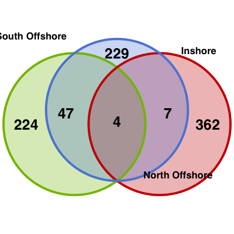

```{r setup, include=FALSE}
knitr::opts_chunk$set(echo = FALSE, warning = FALSE, message = FALSE,fig.retina = 2)
library(tidyverse)
library(topGO)
library(clusterProfiler)
library(GO.db)
library(httr)
library(jsonlite)
library(xml2)
library(VennDiagram)
library(ggsci)
```


We used GO annotation based on uniprot in Functional enrichment analysis. We merged gene candidates from iHS, XP-EHH, and XP-nSL scans and performed GO enrichment analysis. Firstly, we had a look of the shared candidate genes in three populations and visualised it in a simple Venn diagram. Clearly, between two offshore reefs share more sweeps than between offshore and inshore. Thus, inshore reefs have more unique genes under selection. In total, we had 487, 380, and 386 genes as the target in inshore, north offshore, and south offshore. Next, we used all annotated genes as background to do a Fisher's exact test based on weighted gene counts using topGO R package.

```{r def-clusterprofiler}
#go_enrich_cp <- function(targets=targets, 
#                         universe = universe,
#                         term2gene=term2gene, 
#                         term2name=term2name) {
#  x <- enricher(gene = targets, universe = universe,
#            TERM2GENE = term2gene,
#            TERM2NAME = term2name,
#            pvalueCutoff = 0.01,
#            pAdjustMethod = "none",
#            qvalueCutoff = 1)
#  as.data.frame(x) %>% knitr::kable(row.names = F)
#}

```

```{r def-topgo}
gene2go_file <- "data/hpc/annotation/gene-to-go_topgo.tsv"
gene2go <- readMappings(gene2go_file)
go_enrich_topgo <- function(targets,onto) {
    genenames <- names(gene2go)
    genelist <- factor(as.integer(genenames %in% targets))
    names(genelist) <- genenames

    GOdata <- new("topGOdata",
                  allGenes = genelist,
                  annot=annFUN.gene2GO,
                  gene2GO=gene2go,
                  ontology=onto,
                  nodeSize=5)
    
    resultFisher <- runTest(GOdata, 
                        algorithm = "weight01",
                        statistic = "fisher")

    gt <- GenTable(GOdata,classic=resultFisher,
                   WeightFisher=resultFisher,
                   orderBy = "WeightFisher",
                   topNodes=10)
    list(godata= GOdata, result=resultFisher, table=gt)
}

inshore_all <- read_tsv("data/hpc/selection/results/inshore.multiIntersect.genes.bed",
                        col_names = c("scaff","start","end","geneid")) %>% 
  dplyr::select(geneid) %>% unique %>% unlist

northoffshore_all <- read_tsv("data/hpc/selection/results/northoffshore.multiIntersect.genes.bed",
                              col_names = c("scaff","start","end","geneid")) %>% 
  dplyr::select(geneid) %>% unique %>% unlist

southoffshore_all <- read_tsv("data/hpc/selection/results/southoffshore.multiIntersect.genes.bed",
                              col_names = c("scaff","start","end","geneid")) %>% 
  dplyr::select(geneid) %>% unique %>% unlist
```


```{r simple-venn-diagram}
# source("scripts/color_scheme.R")
futile.logger::flog.threshold(futile.logger::ERROR, name = "VennDiagramLogger") # don't write the log file #https://stackoverflow.com/questions/33393962/r-dont-write-log-file-for-venndiagram
 venn.diagram(
     x = list(inshore_all,northoffshore_all,southoffshore_all),
     category.names = c("Inshore","North Offshore","South Offshore"),
     filename = "figures/venndiagram_genes.png",
     output=TRUE,
     imagetype = "png",
     resolution = 300,
     height = 480,
     width = 480,

     lwd = 1.5,
     fill=pal_startrek("uniform",alpha = 0.6)(3),
     col=pal_startrek("uniform")(3),
     
     cex = 0.6,
     fontface= "bold",
     fontfamily = "sans",

     cat.cex = 0.4,
     cat.fontface = "bold",
     cat.default.pos = "outer",
     cat.pos = c(-27,27,135),
     cat.dist = c(0.055,0.055,0.085),
     cat.fontfamily = "sans",
     rotation = 1

 )


```

```{r}
#setting background in clusterprofiler
#term2gene <- uniprot_gene_annot %>% select(geneid,go) %>% na.omit %>% separate_rows(go,sep = "; ") %>% select(go,geneid)

#universe <- all %>% unlist

#my_go2term <- function(goids) {
#  query_str <- goids %>% str_replace(pattern = ":",replacement = "%3A") %>%  paste(collapse = "%2C")
#  requestURL <- paste0("https://www.ebi.ac.uk/QuickGO/services/ontology/go/terms/",query_str)
#  r <- GET(requestURL, accept("application/json"))
#  stop_for_status(r)
#  tbl <- data.frame(term=character(),go=character())
#  for (i in 1:length(goids)){
#    tbl<-rbind(tbl,data.frame(term=content(r)$results[[i]]$name,go=content(r)$results[[i]]$id))
#  }
#  tbl
#}

#term2name1<-Term(GOTERM[GOID(term2gene$go %>% unique) %>% is.na() %>% stack %>% na.omit %>% select(ind) %>% unlist %>% as.vector]) %>% stack %>% rename(term=values,go=ind)  # some GO id couldn't be found in GO.db
#tmp <- term2gene$go %>% unique
#not_in_godb <- tmp[!tmp %in% term2name1$go]

#term2name <- rbind(term2name1,my_go2term(not_in_godb)) %>% select(go,term)


#term2gene %>% group_by(geneid) %>% summarise(go=paste(go,collapse = ",")) %>% write_tsv(gene2go_file)


genes_in_enrichedGO <- function(bp,mf,cc,target) {
  bp_genes <- bp$table %>% mutate(classic=as.numeric(classic),
                              WeightFisher=as.numeric(WeightFisher)) %>%
    filter(WeightFisher<0.01) %>% select(GO.ID) %>% pull %>% 
    map_df(~genesInTerm(object = bp$godata,whichGO = .x)) %>%
    pivot_longer(cols = everything(),names_to = "go",values_to = "geneid") %>% 
    na.omit() %>% filter(geneid %in% target)
  
  mf_genes <- mf$table %>% mutate(classic=as.numeric(classic),
                              WeightFisher=as.numeric(WeightFisher)) %>%
    filter(WeightFisher<0.01) %>% select(GO.ID) %>% pull %>% 
    map_df(~genesInTerm(object = mf$godata,whichGO = .x)) %>%
    pivot_longer(cols = everything(),names_to = "go",values_to = "geneid") %>% 
    na.omit() %>% filter(geneid %in% target)
  
  cc_genes <- cc$table %>% mutate(classic=as.numeric(classic),
                              WeightFisher=as.numeric(WeightFisher)) %>%
    filter(WeightFisher<0.01) %>% select(GO.ID) %>% pull %>% 
    map_df(~genesInTerm(object = cc$godata,whichGO = .x)) %>%
    pivot_longer(cols = everything(),names_to = "go",values_to = "geneid") %>% 
    na.omit() %>% filter(geneid %in% target)

  rbind(bp_genes,mf_genes,cc_genes) %>% left_join(uniprot_gene_annot %>%
                                                select(geneid,uniprot_id)) %>%
    group_by(go) %>% summarise(uniprot_id=paste(uniprot_id,collapse = "; "))
  
}

```


### GO term enriched in gene set identified in inshore
```{r cache=TRUE}
#go_enrich_cp(targets = inshore_all,universe = universe,
#                term2gene =term2gene,term2name = term2name)
inshore_target <- setdiff(inshore_all,union(southoffshore_all,northoffshore_all))
inshore_topgo_mf <- go_enrich_topgo(targets = inshore_target,onto = "MF")
inshore_topgo_bp <- go_enrich_topgo(targets = inshore_target,onto = "BP")
inshore_topgo_cc <- go_enrich_topgo(targets = inshore_target,onto = "CC")

inshore_topgo <- rbind(inshore_topgo_bp$table %>% mutate(classic=as.numeric(classic),WeightFisher=as.numeric(WeightFisher)) %>% add_column(ontology="BP"), 
                           inshore_topgo_mf$table %>% mutate(classic=as.numeric(classic),WeightFisher=as.numeric(WeightFisher)) %>% add_column(ontology="MF"),
                           inshore_topgo_cc$table %>% mutate(classic=as.numeric(classic),WeightFisher=as.numeric(WeightFisher)) %>% add_column(ontology="CC")) %>% 
                     filter(WeightFisher<0.01)

#inshore_topgo %>% knitr::kable()
inshore_topgo %>% left_join(genes_in_enrichedGO(inshore_topgo_bp,inshore_topgo_mf,inshore_topgo_cc,target = inshore_target),by=c("GO.ID"="go"))%>% knitr::kable()
```

### GO enrichment in North offshore
```{r cache=TRUE}
#go_enrich_cp(targets = northoffshore_all,universe = universe,
#                term2gene =term2gene,term2name = term2name)
northoffshore_target <- setdiff(northoffshore_all,union(inshore_all,southoffshore_all))
northoffshore_topgo_mf <- go_enrich_topgo(targets = northoffshore_target,onto = "MF")
northoffshore_topgo_bp <- go_enrich_topgo(targets = northoffshore_target,onto = "BP")
northoffshore_topgo_cc <- go_enrich_topgo(targets = northoffshore_target,onto = "CC")

northoffshore_topgo <- rbind(northoffshore_topgo_bp$table %>% mutate(classic=as.numeric(classic),WeightFisher=as.numeric(WeightFisher)) %>% add_column(ontology="BP"), 
                           northoffshore_topgo_mf$table %>% mutate(classic=as.numeric(classic),WeightFisher=as.numeric(WeightFisher)) %>% add_column(ontology="MF"),
                           northoffshore_topgo_cc$table %>% mutate(classic=as.numeric(classic),WeightFisher=as.numeric(WeightFisher)) %>% add_column(ontology="CC")) %>% 
                     filter(WeightFisher<0.01)

#northoffshore_topgo %>% knitr::kable()
northoffshore_topgo %>% left_join(genes_in_enrichedGO(northoffshore_topgo_bp,northoffshore_topgo_mf,northoffshore_topgo_cc,target = northoffshore_target),by=c("GO.ID"="go"))%>% knitr::kable()
```

### GO enrichemnt in South offshore
```{r cache=TRUE}
southoffshore_target <- setdiff(southoffshore_all,union(inshore_all,northoffshore_all))
southoffshore_topgo_mf <- go_enrich_topgo(targets = southoffshore_target,onto = "MF")
southoffshore_topgo_bp <- go_enrich_topgo(targets = southoffshore_target,onto = "BP")
southoffshore_topgo_cc <- go_enrich_topgo(targets = southoffshore_target,onto = "CC")

southoffshore_topgo <- rbind(southoffshore_topgo_bp$table %>% mutate(classic=as.numeric(classic),WeightFisher=as.numeric(WeightFisher)) %>% add_column(ontology="BP"), 
                           southoffshore_topgo_mf$table %>% mutate(classic=as.numeric(classic),WeightFisher=as.numeric(WeightFisher)) %>% add_column(ontology="MF"),
                           southoffshore_topgo_cc$table %>% mutate(classic=as.numeric(classic),WeightFisher=as.numeric(WeightFisher)) %>% add_column(ontology="CC")) %>% 
                     filter(WeightFisher<0.01)

#southoffshore_topgo %>% knitr::kable()
southoffshore_topgo %>% left_join(genes_in_enrichedGO(southoffshore_topgo_bp,southoffshore_topgo_mf,southoffshore_topgo_cc,target = southoffshore_target),by=c("GO.ID"="go"))%>% knitr::kable()
```

We can see that the genes that are under selection in inshore and offshore and enriched in different functional categories. Interestingly, genes uniquely under selection in inshore population have an enriched GO term: `GO:0009408 response to heat` which including 11 genes (7 unique annotations)：

```{r}
genesInTerm(inshore_topgo_bp$godata,"GO:0009408") %>% 
  as.data.frame %>% filter(GO.0009408%in% inshore_target) %>% 
  rename("geneid"="GO.0009408") %>% 
  left_join(uniprot_gene_annot) %>% select(geneid,entryname,protein) %>% knitr::kable()
  
```


### Visualise the GO enrichement results
```{r go-enrichment-plot-inshore}
inshore_topgo2 <- inshore_topgo %>% filter(GO.ID!="GO:0019557") %>% arrange(WeightFisher)
inshore_topgo2$Term <- factor(inshore_topgo2$Term,levels = rev(inshore_topgo2$Term) )
  
inshore_topgo2 %>% ggplot(aes(x=-log10(WeightFisher),y=Term,fill=ontology)) + 
  geom_col() + scale_fill_brewer(palette="Dark2",labels = c("Biological process", "Cellular component", "Molecular function")) +
  geom_text(aes(label=Significant), hjust=-.5) +
  theme_bw() + labs(x=expression(-Log[10](P)),y="",fill="") +
  theme(panel.grid = element_blank(),
        legend.position = c(0.8,0.15),
        legend.text = element_text())+
  ggtitle("GO enrichment in inshore candidate genes")
```

```{r go-enrichment-plot-offshore}
northoffshore_topgo <- northoffshore_topgo %>% arrange(WeightFisher)
northoffshore_topgo$Term <- factor(northoffshore_topgo$Term,levels = rev(northoffshore_topgo$Term) )
  
northoffshore_topgo %>% ggplot(aes(x=-log10(WeightFisher),y=Term,fill=ontology)) + 
  geom_col() + scale_fill_brewer(palette="Dark2",labels = c("Biological process", "Cellular component", "Molecular function")) +
  geom_text(aes(label=Significant), hjust=-.5) +
  theme_bw() + labs(x=expression(-Log[10](P)),y="",fill="") +
  theme(panel.grid = element_blank(),
        legend.position = c(0.8,0.15),
        legend.text = element_text())+
  ggtitle("GO enrichment in north offshore candidate genes")

southoffshore_topgo <- southoffshore_topgo %>% arrange(WeightFisher)
southoffshore_topgo$Term <- factor(southoffshore_topgo$Term,levels = rev(southoffshore_topgo$Term) )
  
southoffshore_topgo %>% ggplot(aes(x=-log10(WeightFisher),y=Term,fill=ontology)) + 
  geom_col() + scale_fill_brewer(palette="Dark2",labels = c("Biological process", "Cellular component", "Molecular function")) +
  geom_text(aes(label=Significant), hjust=-.5) +
  theme_bw() + labs(x=expression(-Log[10](P)),y="",fill="") +
  theme(panel.grid = element_blank(),
        legend.position = c(0.8,0.15),
        legend.text = element_text())+
  ggtitle("GO enrichment in south offshore candidate genes")
```
