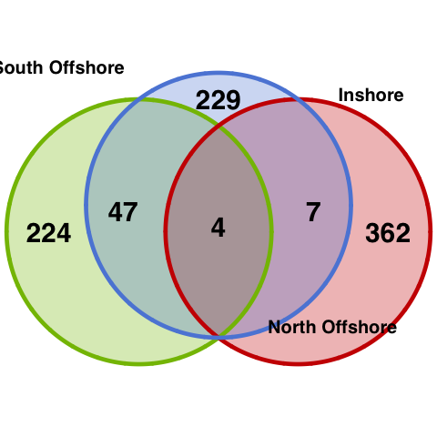
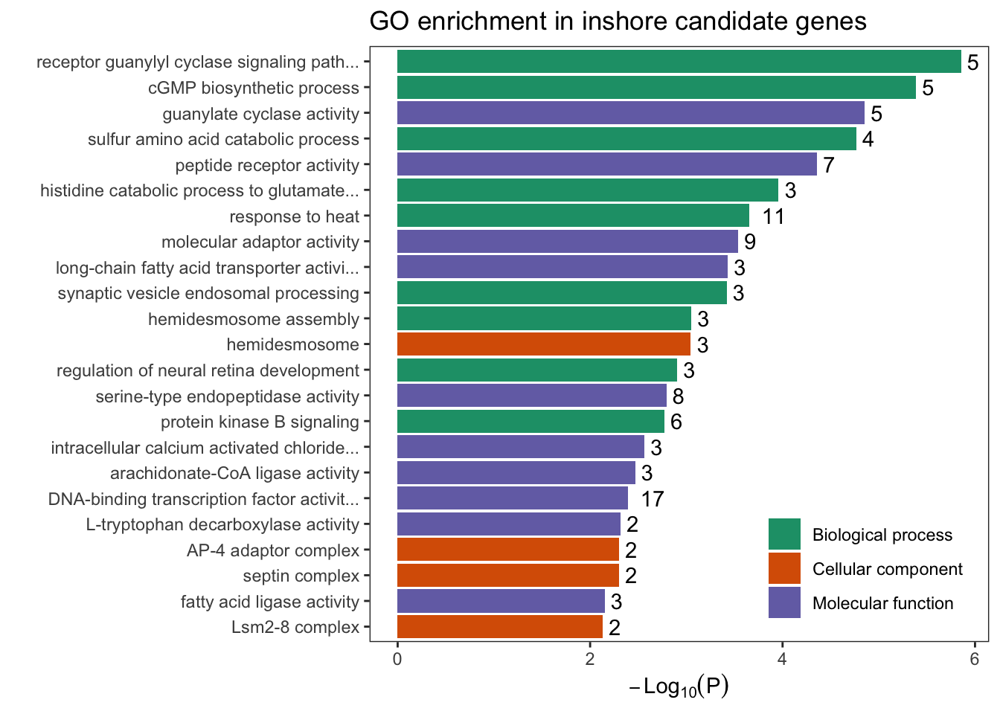
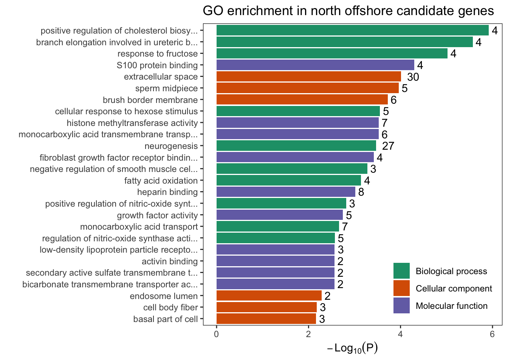
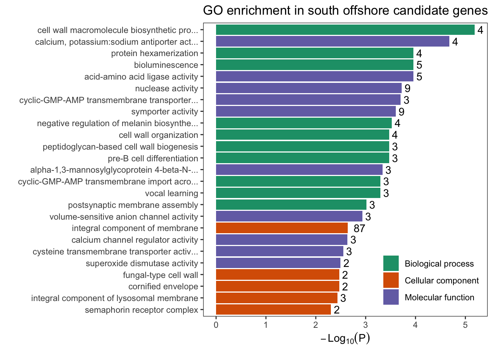

Functional enrichment analysis
================

To perform functional enrichment analysis using the gene models of
version 2 genome, we did functional analysis of all protein-coding genes
using
[InterProScan5](https://www.ebi.ac.uk/seqdb/confluence/display/JDSAT/InterProScan+5+Help+and+Documentation#InterProScan5HelpandDocumentation-RESTAPI)
REST API.

We extracted the longest isoform per gene model with gff file and genome
fasta file

``` bash
cgat gff2gff --filter=longest-gene -I annotation_from_chuya/adig-v2.gff -S annotation_longest_gene.gff

gffread -g reference_entryname.fa -y protein.fa annotation_longest_gene.gff
gffread -g reference_entryname.fa -x CDS.fa annotation_longest_gene.gff
```

``` bash
python iprscan5.py --multifasta protein.fa \
--maxJobs 29 --useSeqId --email email@address.com \
--outformat tsv
```

We extract GO term assignments from Interproscan results.

In the meantime, we also blast all A. digitifera genes against uniprot
database using blastx/p. From the blast results (evalue &lt;1e-5), we
could assign gene models putative gene names, GO id, and Kegg
information from [Uniprot ID
mapping](https://www.uniprot.org/uploadlists/) from UniprotKB AC/ID to
UniprotKB.

| InterProScan | Uniprot(blast) |
|-------------:|---------------:|
|    0.4554257 |      0.6433592 |

The proportion of genes with GO term annotation

We used GO annotation based on uniprot in Functional enrichment
analysis. We merged gene candidates from iHS, XP-EHH, and XP-nSL scans
and performed GO enrichment analysis. Firstly, we had a look of the
shared candidate genes in three populations and visualised it in a
simple Venn diagram. Clearly, between two offshore reefs share more
sweeps than between offshore and inshore. Thus, inshore reefs have more
unique genes under selection. In total, we had 487, 380, and 386 genes
as the target in inshore, north offshore, and south offshore. Next, we
used all annotated genes as background to do a Fisher’s exact test based
on weighted gene counts using topGO R package.

    ## NULL

    ## [1] 1



### GO term enriched in gene set identified in inshore

| GO.ID        | Term                                      | Annotated | Significant | Expected | Rank in WeightFisher |  classic | WeightFisher | ontology | uniprot\_id                                                                                                                            |
|:-------------|:------------------------------------------|----------:|------------:|---------:|---------------------:|---------:|-------------:|:---------|:---------------------------------------------------------------------------------------------------------------------------------------|
| <GO:0007168> | receptor guanylyl cyclase signaling path… |        10 |           5 |     0.23 |                    1 | 1.40e-06 |     1.40e-06 | BP       | P16065; Q6VVW5; P18293; Q7JQ32; P16065                                                                                                 |
| <GO:0006182> | cGMP biosynthetic process                 |        12 |           5 |     0.27 |                    2 | 4.10e-06 |     4.10e-06 | BP       | P16065; Q6VVW5; P18293; Q7JQ32; P16065                                                                                                 |
| <GO:0000098> | sulfur amino acid catabolic process       |         8 |           4 |     0.18 |                    3 | 1.70e-05 |     1.70e-05 | BP       | P70645; Q498R1; Q91X83; P32929                                                                                                         |
| <GO:0019556> | histidine catabolic process to glutamate… |         5 |           3 |     0.11 |                    4 | 1.10e-04 |     1.10e-04 | BP       | Q8VC12; A7YWP4; A7YWP4                                                                                                                 |
| <GO:0019557> | histidine catabolic process to glutamate… |         5 |           3 |     0.11 |                    5 | 1.10e-04 |     1.10e-04 | BP       | Q8VC12; A7YWP4; A7YWP4                                                                                                                 |
| <GO:0009408> | response to heat                          |        99 |          11 |     2.26 |                    6 | 2.20e-04 |     2.20e-04 | BP       | Q9JHH6; Q5NVI9; Q5XXA6; Q5XXA6; Q5TJE1; Q6RI86; Q7Z020; P06582; P06582; P06582; P06582                                                 |
| <GO:0099532> | synaptic vesicle endosomal processing     |         7 |           3 |     0.16 |                    7 | 3.80e-04 |     3.80e-04 | BP       | Q9Z0R4; Q9Z0R6; Q9JKK1                                                                                                                 |
| <GO:0031581> | hemidesmosome assembly                    |         9 |           3 |     0.21 |                    8 | 8.90e-04 |     8.90e-04 | BP       | A6QPB3; A6QPB3; Q07563                                                                                                                 |
| <GO:0061074> | regulation of neural retina development   |        10 |           3 |     0.23 |                    9 | 1.25e-03 |     1.25e-03 | BP       | Q566X8; Q566X8; Q566X8                                                                                                                 |
| <GO:0043491> | protein kinase B signaling                |       101 |           6 |     2.30 |                   10 | 1.68e-03 |     1.68e-03 | BP       | Q9Z0R4; P07949; Q8BTI9; P17431; A2AKX3; P32114                                                                                         |
| <GO:0004383> | guanylate cyclase activity                |        15 |           5 |     0.34 |                    1 | 1.40e-05 |     1.40e-05 | MF       | P16065; Q6VVW5; P18293; Q7JQ32; P16065                                                                                                 |
| <GO:0001653> | peptide receptor activity                 |       199 |           7 |     4.47 |                    2 | 4.40e-05 |     4.40e-05 | MF       | Q924H0; P16065; Q6VVW5; P18293; Q7JQ32; P16065; O08726                                                                                 |
| <GO:0060090> | molecular adaptor activity                |       199 |           9 |     4.47 |                    3 | 2.90e-04 |     2.90e-04 | MF       | Q9Z0R4; Q9Z0R6; Q9ESK9; Q9EQJ9; Q9JKK1; Q5ZMH1; Q9WV92; P13942; B1H120                                                                 |
| <GO:0005324> | long-chain fatty acid transporter activi… |         7 |           3 |     0.16 |                    4 | 3.70e-04 |     3.70e-04 | MF       | Q4R3Y4; Q4R3Y4; Q60714                                                                                                                 |
| <GO:0004252> | serine-type endopeptidase activity        |        98 |           8 |     2.20 |                    5 | 1.61e-03 |     1.61e-03 | MF       | B8VIV4; Q2KJ63; P53634; B8V7S0; Q9NJ15; Q63415; Q9D6X6; B8V7S0                                                                         |
| <GO:0005229> | intracellular calcium activated chloride… |        13 |           3 |     0.29 |                    6 | 2.72e-03 |     2.72e-03 | MF       | Q75V66; Q5XXA6; Q5XXA6                                                                                                                 |
| <GO:0047676> | arachidonate-CoA ligase activity          |        14 |           3 |     0.31 |                    7 | 3.40e-03 |     3.40e-03 | MF       | Q4R3Y4; Q4R3Y4; Q60714                                                                                                                 |
| <GO:0000981> | DNA-binding transcription factor activit… |       414 |          17 |     9.31 |                    8 | 4.02e-03 |     4.02e-03 | MF       | Q02360; Q804Q5; Q90416; Q86MI0; P42587; Q9IAK8; Q07120; P55878; Q32PP9; Q8R316; P32114; Q566X8; Q566X8; Q566X8; Q99697; Q9BZE3; Q98879 |
| <GO:0036469> | L-tryptophan decarboxylase activity       |         5 |           2 |     0.11 |                    9 | 4.81e-03 |     4.81e-03 | MF       | P0DPA6; A0A286LEZ8                                                                                                                     |
| <GO:0015645> | fatty acid ligase activity                |        18 |           3 |     0.40 |                   10 | 7.07e-03 |     7.07e-03 | MF       | Q4R3Y4; Q4R3Y4; Q60714                                                                                                                 |
| <GO:0030056> | hemidesmosome                             |         9 |           3 |     0.21 |                    1 | 9.00e-04 |     9.00e-04 | CC       | A6QPB3; A6QPB3; Q07563                                                                                                                 |
| <GO:0030124> | AP-4 adaptor complex                      |         5 |           2 |     0.11 |                    2 | 5.00e-03 |     5.00e-03 | CC       | Q9Y6B7; O82201                                                                                                                         |
| <GO:0031105> | septin complex                            |         5 |           2 |     0.11 |                    3 | 5.00e-03 |     5.00e-03 | CC       | Q5ZMH1; B1H120                                                                                                                         |
| <GO:0120115> | Lsm2-8 complex                            |         6 |           2 |     0.14 |                    4 | 7.40e-03 |     7.40e-03 | CC       | O35900; Q9UK45                                                                                                                         |

### GO enrichment in North offshore

| GO.ID        | Term                                      | Annotated | Significant | Expected | Rank in WeightFisher |  classic | WeightFisher | ontology | uniprot\_id                                                                                                                                                                                                                                    |
|:-------------|:------------------------------------------|----------:|------------:|---------:|---------------------:|---------:|-------------:|:---------|:-----------------------------------------------------------------------------------------------------------------------------------------------------------------------------------------------------------------------------------------------|
| <GO:0045542> | positive regulation of cholesterol biosy… |         6 |           4 |     0.10 |                    1 | 1.20e-06 |     1.20e-06 | BP       | Q7SIF8; Q6PBT8; Q7SIF8; P20002                                                                                                                                                                                                                 |
| <GO:0060681> | branch elongation involved in ureteric b… |         7 |           4 |     0.12 |                    2 | 2.70e-06 |     2.70e-06 | BP       | Q7SIF8; Q6PBT8; Q7SIF8; P20002                                                                                                                                                                                                                 |
| <GO:0009750> | response to fructose                      |         9 |           4 |     0.15 |                    3 | 9.50e-06 |     9.50e-06 | BP       | Q8CIW6; Q02974; Q8CIW6; Q9R1S4                                                                                                                                                                                                                 |
| <GO:0071331> | cellular response to hexose stimulus      |        81 |           5 |     1.38 |                    4 | 2.80e-04 |     2.80e-04 | BP       | Q8CIW6; P47971; P97819; Q8CIW6; Q9R1S4                                                                                                                                                                                                         |
| <GO:0022008> | neurogenesis                              |      1177 |          27 |    19.99 |                    5 | 3.40e-04 |     3.40e-04 | BP       | Q3UZD5; Q24322; Q9QX29; Q9QX29; P24821; Q0V9W6; Q9NQX0; Q9NQX0; Q8N960; B2RS91; Q6V4S5; P47971; Q9VQ62; P43135; P01026; O75581; O54990; Q12955; A7RU46; Q92752; P98158; G3V9H8; Q9R1S4; P16599; Q8BKG3; Q9BX70; O02326                         |
| <GO:0051151> | negative regulation of smooth muscle cel… |        10 |           3 |     0.17 |                    6 | 5.30e-04 |     5.30e-04 | BP       | Q3UZD5; Q9NQX0; Q9NQX0                                                                                                                                                                                                                         |
| <GO:0019395> | fatty acid oxidation                      |        55 |           4 |     0.93 |                    7 | 7.20e-04 |     7.20e-04 | BP       | O95822; Q6ZWL3; Q9DBW0; Q9DBW0                                                                                                                                                                                                                 |
| <GO:0051000> | positive regulation of nitric-oxide synt… |        14 |           3 |     0.24 |                    8 | 1.53e-03 |     1.53e-03 | BP       | P20693; P20693; P16599                                                                                                                                                                                                                         |
| <GO:0015718> | monocarboxylic acid transport             |       120 |           7 |     2.04 |                    9 | 2.19e-03 |     2.19e-03 | BP       | Q8CIW6; P63031; Q5U4D8; P97819; Q8CIW6; O15439; P16599                                                                                                                                                                                         |
| <GO:0050999> | regulation of nitric-oxide synthase acti… |        19 |           5 |     0.32 |                   10 | 2.70e-03 |     2.70e-03 | BP       | P20693; P20693; P16599; Q9QZN9; P34972                                                                                                                                                                                                         |
| <GO:0044548> | S100 protein binding                      |        13 |           4 |     0.22 |                    1 | 5.00e-05 |     5.00e-05 | MF       | Q7SIF8; Q6PBT8; Q7SIF8; P20002                                                                                                                                                                                                                 |
| <GO:0042054> | histone methyltransferase activity        |        49 |           7 |     0.83 |                    2 | 3.00e-04 |     3.00e-04 | MF       | Q5ZML9; Q3UZD5; A6QPM3; P0C6Y7; Q9NQX0; Q9NQX0; Q071E0                                                                                                                                                                                         |
| <GO:0008028> | monocarboxylic acid transmembrane transp… |        64 |           6 |     1.08 |                    3 | 3.00e-04 |     3.00e-04 | MF       | Q8CIW6; P63031; Q5U4D8; Q3ZMH1; Q8CIW6; O15439                                                                                                                                                                                                 |
| <GO:0005104> | fibroblast growth factor receptor bindin… |        21 |           4 |     0.35 |                    4 | 3.80e-04 |     3.80e-04 | MF       | Q7SIF8; Q6PBT8; Q7SIF8; P20002                                                                                                                                                                                                                 |
| <GO:0008201> | heparin binding                           |       120 |           8 |     2.03 |                    5 | 9.70e-04 |     9.70e-04 | MF       | Q24322; Q62918; P22105; P35444; Q7SIF8; Q6PBT8; Q7SIF8; P20002                                                                                                                                                                                 |
| <GO:0008083> | growth factor activity                    |        52 |           5 |     0.88 |                    6 | 1.79e-03 |     1.79e-03 | MF       | Q7SIF8; P13497; Q6PBT8; Q7SIF8; P20002                                                                                                                                                                                                         |
| <GO:0050750> | low-density lipoprotein particle recepto… |        17 |           3 |     0.29 |                    7 | 2.71e-03 |     2.71e-03 | MF       | Q8K4M5; Q9JLC8; P98158                                                                                                                                                                                                                         |
| <GO:0048185> | activin binding                           |         5 |           2 |     0.08 |                    8 | 2.75e-03 |     2.75e-03 | MF       | Q90670; Q90670                                                                                                                                                                                                                                 |
| <GO:0008271> | secondary active sulfate transmembrane t… |         5 |           2 |     0.08 |                    9 | 2.75e-03 |     2.75e-03 | MF       | Q8CIW6; Q8CIW6                                                                                                                                                                                                                                 |
| <GO:0015106> | bicarbonate transmembrane transporter ac… |         5 |           2 |     0.08 |                   10 | 2.75e-03 |     2.75e-03 | MF       | Q8CIW6; Q8CIW6                                                                                                                                                                                                                                 |
| <GO:0005615> | extracellular space                       |      1050 |          30 |    17.05 |                    1 | 9.80e-05 |     9.80e-05 | CC       | O60293; Q24322; A2AJ76; P24821; A1E295; Q9Z1L4; Q62918; Q3U492; Q9VQ62; Q00685; P01026; O54990; P97819; Q92752; P22105; Q08731; P98158; P28648; P00451; P35444; Q96P44; P07911; P16599; Q7SIF8; Q9NR99; P13497; Q6PBT8; Q7SIF8; P20002; Q9JLB4 |
| <GO:0097225> | sperm midpiece                            |        30 |           5 |     0.49 |                    2 | 1.10e-04 |     1.10e-04 | CC       | Q8CIW6; P79218; Q0EEE2; Q8CIW6; O35594                                                                                                                                                                                                         |
| <GO:0031526> | brush border membrane                     |        52 |           6 |     0.84 |                    3 | 1.90e-04 |     1.90e-04 | CC       | Q8CIW6; Q5U4D8; Q8CIW6; P98158; Q3TTY0; Q9JLB4                                                                                                                                                                                                 |
| <GO:0031904> | endosome lumen                            |         7 |           2 |     0.11 |                    4 | 5.22e-03 |     5.22e-03 | CC       | P98158; P28648                                                                                                                                                                                                                                 |
| <GO:0070852> | cell body fiber                           |        24 |           3 |     0.39 |                    5 | 6.65e-03 |     6.65e-03 | CC       | Q9NZJ4; Q9NZJ4; Q9NZJ4                                                                                                                                                                                                                         |
| <GO:0045178> | basal part of cell                        |        48 |           3 |     0.78 |                    6 | 6.87e-03 |     6.87e-03 | CC       | Q12955; Q90670; Q90670                                                                                                                                                                                                                         |

### GO enrichemnt in South offshore

| GO.ID        | Term                                      | Annotated | Significant | Expected | Rank in WeightFisher |  classic | WeightFisher | ontology | uniprot\_id                                                                                                                                                                                                                                                                                                                                                                                                                                                                                                                                                                                                                                                                                                            |
|:-------------|:------------------------------------------|----------:|------------:|---------:|---------------------:|---------:|-------------:|:---------|:-----------------------------------------------------------------------------------------------------------------------------------------------------------------------------------------------------------------------------------------------------------------------------------------------------------------------------------------------------------------------------------------------------------------------------------------------------------------------------------------------------------------------------------------------------------------------------------------------------------------------------------------------------------------------------------------------------------------------|
| <GO:0044038> | cell wall macromolecule biosynthetic pro… |        12 |           4 |     0.23 |                    1 | 6.50e-06 |     6.50e-06 | BP       | Q9SCN0; B5YFT1; Q2JJV2; Q31I42                                                                                                                                                                                                                                                                                                                                                                                                                                                                                                                                                                                                                                                                                         |
| <GO:0034214> | protein hexamerization                    |        14 |           4 |     0.26 |                    2 | 1.10e-04 |     1.10e-04 | BP       | Q8IWT6; Q4V8I7; Q8IWT6; Q5R5H1                                                                                                                                                                                                                                                                                                                                                                                                                                                                                                                                                                                                                                                                                         |
| <GO:0008218> | bioluminescence                           |        26 |           5 |     0.49 |                    3 | 1.10e-04 |     1.10e-04 | BP       | P83690; P83690; P83690; Q95P04; P83690                                                                                                                                                                                                                                                                                                                                                                                                                                                                                                                                                                                                                                                                                 |
| <GO:0048022> | negative regulation of melanin biosynthe… |        18 |           4 |     0.34 |                    4 | 3.00e-04 |     3.00e-04 | BP       | Q71RS6; Q6NUT3; Q6NUT3; Q3U481                                                                                                                                                                                                                                                                                                                                                                                                                                                                                                                                                                                                                                                                                         |
| <GO:0071555> | cell wall organization                    |        16 |           4 |     0.30 |                    5 | 3.40e-04 |     3.40e-04 | BP       | Q9SCN0; B5YFT1; Q2JJV2; Q31I42                                                                                                                                                                                                                                                                                                                                                                                                                                                                                                                                                                                                                                                                                         |
| <GO:0009273> | peptidoglycan-based cell wall biogenesis  |         8 |           3 |     0.15 |                    6 | 3.40e-04 |     3.40e-04 | BP       | B5YFT1; Q2JJV2; Q31I42                                                                                                                                                                                                                                                                                                                                                                                                                                                                                                                                                                                                                                                                                                 |
| <GO:0002329> | pre-B cell differentiation                |         8 |           3 |     0.15 |                    7 | 3.40e-04 |     3.40e-04 | BP       | Q8IWT6; Q4V8I7; Q8IWT6                                                                                                                                                                                                                                                                                                                                                                                                                                                                                                                                                                                                                                                                                                 |
| <GO:0140361> | cyclic-GMP-AMP transmembrane import acro… |         9 |           3 |     0.17 |                    8 | 5.10e-04 |     5.10e-04 | BP       | Q8IWT6; Q4V8I7; Q8IWT6                                                                                                                                                                                                                                                                                                                                                                                                                                                                                                                                                                                                                                                                                                 |
| <GO:0042297> | vocal learning                            |         9 |           3 |     0.17 |                    9 | 5.10e-04 |     5.10e-04 | BP       | Q9CS84; E9Q7X7; Q9P2S2                                                                                                                                                                                                                                                                                                                                                                                                                                                                                                                                                                                                                                                                                                 |
| <GO:0097104> | postsynaptic membrane assembly            |        11 |           3 |     0.21 |                   10 | 9.70e-04 |     9.70e-04 | BP       | Q9CS84; E9Q7X7; Q9P2S2                                                                                                                                                                                                                                                                                                                                                                                                                                                                                                                                                                                                                                                                                                 |
| <GO:0008273> | calcium, potassium:sodium antiporter act… |        10 |           4 |     0.18 |                    1 | 2.10e-05 |     2.10e-05 | MF       | Q71RS6; Q9HC58; Q49SH1; Q49SH1                                                                                                                                                                                                                                                                                                                                                                                                                                                                                                                                                                                                                                                                                         |
| <GO:0016881> | acid-amino acid ligase activity           |        27 |           5 |     0.49 |                    2 | 1.10e-04 |     1.10e-04 | MF       | P48506; B5YFT1; Q2JJV2; Q31I42; Q9HAB8                                                                                                                                                                                                                                                                                                                                                                                                                                                                                                                                                                                                                                                                                 |
| <GO:0004518> | nuclease activity                         |       355 |           9 |     6.48 |                    3 | 1.90e-04 |     1.90e-04 | MF       | B0BN95; Q2TB18; Q2TB18; Q2TB18; P11369; Q9M2U3; Q6ZQ08; Q9M2U3; Q5QJC4                                                                                                                                                                                                                                                                                                                                                                                                                                                                                                                                                                                                                                                 |
| <GO:0140360> | cyclic-GMP-AMP transmembrane transporter… |         7 |           3 |     0.13 |                    4 | 2.00e-04 |     2.00e-04 | MF       | Q8IWT6; Q4V8I7; Q8IWT6                                                                                                                                                                                                                                                                                                                                                                                                                                                                                                                                                                                                                                                                                                 |
| <GO:0015293> | symporter activity                        |       136 |           9 |     2.48 |                    5 | 2.50e-04 |     2.50e-04 | MF       | Q71RS6; Q9HC58; Q49SH1; Q49SH1; Q9JJ09; Q9JJ09; Q6NUT3; Q6NUT3; Q3U481                                                                                                                                                                                                                                                                                                                                                                                                                                                                                                                                                                                                                                                 |
| <GO:0008454> | alpha-1,3-mannosylglycoprotein 4-beta-N-… |         9 |           3 |     0.16 |                    6 | 4.60e-04 |     4.60e-04 | MF       | Q9UBM8; Q9UBM8; Q9UBM8                                                                                                                                                                                                                                                                                                                                                                                                                                                                                                                                                                                                                                                                                                 |
| <GO:0005225> | volume-sensitive anion channel activity   |        12 |           3 |     0.22 |                    7 | 1.17e-03 |     1.17e-03 | MF       | Q8IWT6; Q4V8I7; Q8IWT6                                                                                                                                                                                                                                                                                                                                                                                                                                                                                                                                                                                                                                                                                                 |
| <GO:0005246> | calcium channel regulator activity        |        15 |           3 |     0.27 |                    8 | 2.32e-03 |     2.32e-03 | MF       | Q9CS84; E9Q7X7; Q9P2S2                                                                                                                                                                                                                                                                                                                                                                                                                                                                                                                                                                                                                                                                                                 |
| <GO:0033229> | cysteine transmembrane transporter activ… |        16 |           3 |     0.29 |                    9 | 2.82e-03 |     2.82e-03 | MF       | Q6NUT3; Q6NUT3; Q3U481                                                                                                                                                                                                                                                                                                                                                                                                                                                                                                                                                                                                                                                                                                 |
| <GO:0004784> | superoxide dismutase activity             |         5 |           2 |     0.09 |                   10 | 3.20e-03 |     3.20e-03 | MF       | A8XCP3; Q5AD07                                                                                                                                                                                                                                                                                                                                                                                                                                                                                                                                                                                                                                                                                                         |
| <GO:0016021> | integral component of membrane            |      3667 |          87 |    69.05 |                    1 | 2.30e-03 |     2.30e-03 | CC       | B8VIW9; Q0VCP9; P35364; Q95209; Q8IWT6; Q4V8I7; Q8IWT6; Q06136; Q14703; Q61184; Q8WPA2; Q95M54; D2IYS2; Q9WTN5; Q5RCB9; O60462; Q9UBM8; Q9UBM8; Q9UBM8; Q4VCS5; P79400; B2RPY5; Q9R0A0; P98161; A2A259; O57422; P79218; Q9I8I2; Q91755; Q9SDQ4; Q3SYV5; Q19319; Q9SCN0; Q8TC41; Q9UBU6; Q9PUU6; F7E235; Q0GBZ5; O54799; Q7TN88; Q71RS6; Q9HC58; Q49SH1; Q49SH1; Q4V7Q8; Q5VVB8; Q9CS84; E9Q7X7; Q9P2S2; G3M4F8; G3M4F8; Q9HAR2; Q8IDX6; G8HTB6; Q54KF7; Q54KF7; Q9Z1G4; Q55E32; Q8IUH5; E9PTT0; Q0V8S9; Q0V8S9; Q0V8S9; Q9JJ09; Q9JJ09; Q5U3V7; P27080; P54145; B9EJ86; A1L1W9; Q28193; Q6NUT3; Q6NUT3; Q3U481; Q3SZN3; B8UU59; P18841; O57579; Q9Y5X5; E7F7V7; Q96P65; C3ZQF9; F1NY98; O43184; Q5ZKJ5; Q6BEA0; Q4KWL2 |
| <GO:0009277> | fungal-type cell wall                     |         5 |           2 |     0.09 |                    2 | 3.40e-03 |     3.40e-03 | CC       | P47033; Q5AD07                                                                                                                                                                                                                                                                                                                                                                                                                                                                                                                                                                                                                                                                                                         |
| <GO:0001533> | cornified envelope                        |         5 |           2 |     0.09 |                    3 | 3.40e-03 |     3.40e-03 | CC       | Q6DK93; Q6DK93                                                                                                                                                                                                                                                                                                                                                                                                                                                                                                                                                                                                                                                                                                         |
| <GO:1905103> | integral component of lysosomal membrane  |        17 |           3 |     0.32 |                    4 | 3.70e-03 |     3.70e-03 | CC       | Q8IWT6; Q4V8I7; Q8IWT6                                                                                                                                                                                                                                                                                                                                                                                                                                                                                                                                                                                                                                                                                                 |
| <GO:0002116> | semaphorin receptor complex               |         6 |           2 |     0.11 |                    5 | 5.00e-03 |     5.00e-03 | CC       | O60462; Q6BEA0                                                                                                                                                                                                                                                                                                                                                                                                                                                                                                                                                                                                                                                                                                         |

We can see that the genes that are under selection in inshore and
offshore and enriched in different functional categories. Interestingly,
genes uniquely under selection in inshore population have an enriched GO
term: `GO:0009408 response to heat` which including 11 genes (7 unique
annotations)：

| geneid          | entryname    | protein                                                                                                                                                                                |
|:----------------|:-------------|:---------------------------------------------------------------------------------------------------------------------------------------------------------------------------------------|
| adig\_s0003.g72 | CBPB2\_MOUSE | Carboxypeptidase B2 (EC 3.4.17.20) (Carboxypeptidase R) (CPR) (Carboxypeptidase U) (CPU) (Thrombin-activable fibrinolysis inhibitor) (TAFI)                                            |
| adig\_s0038.g95 | DNJA1\_PONAB | DnaJ homolog subfamily A member 1                                                                                                                                                      |
| adig\_s0052.g74 | ANO1\_HUMAN  | Anoctamin-1 (Discovered on gastrointestinal stromal tumors protein 1) (Oral cancer overexpressed protein 2) (Transmembrane protein 16A) (Tumor-amplified and overexpressed sequence 2) |
| adig\_s0052.g75 | ANO1\_HUMAN  | Anoctamin-1 (Discovered on gastrointestinal stromal tumors protein 1) (Oral cancer overexpressed protein 2) (Transmembrane protein 16A) (Tumor-amplified and overexpressed sequence 2) |
| adig\_s0062.g74 | DAXX\_CANLF  | Death domain-associated protein 6 (Daxx)                                                                                                                                               |
| adig\_s0082.g83 | TRPA1\_RAT   | Transient receptor potential cation channel subfamily A member 1 (Ankyrin-like with transmembrane domains protein 1) (Wasabi receptor)                                                 |
| adig\_s0082.g84 | TRPA1\_DROME | Transient receptor potential cation channel subfamily A member 1 (dTRPA1) (Ankyrin-like with transmembrane domains protein 1) (dANKTM1)                                                |
| adig\_s0120.g14 | HSP12\_CAEEL | Heat shock protein hsp-16.2                                                                                                                                                            |
| adig\_s0120.g15 | HSP12\_CAEEL | Heat shock protein hsp-16.2                                                                                                                                                            |
| adig\_s0120.g16 | HSP12\_CAEEL | Heat shock protein hsp-16.2                                                                                                                                                            |
| adig\_s0120.g17 | HSP12\_CAEEL | Heat shock protein hsp-16.2                                                                                                                                                            |

### Visualise the GO enrichement results




