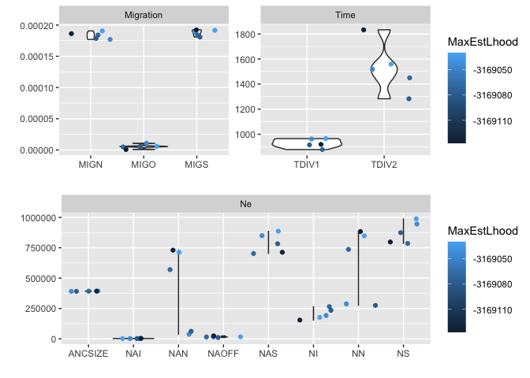
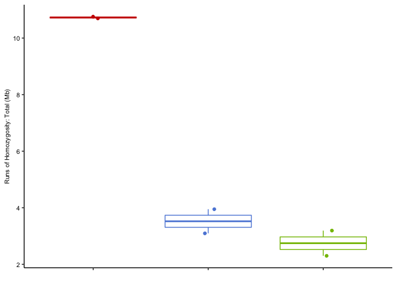
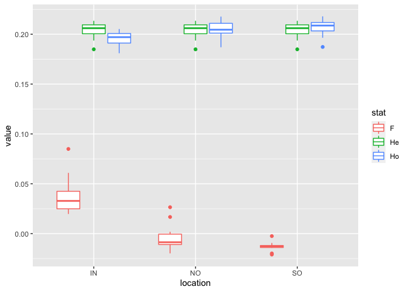
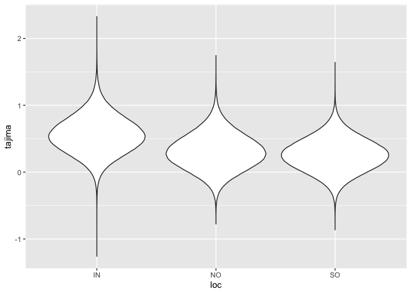

Demography with FSC
================

FastSimCoal can fit a demographic model to SFS data and it can also be
used to simulate data under a demographic model. In our model selection
process with FSC we determined the best model and obtained bootstrap
estimates for its parameters. These were then used as priors to simulate
data under the model. An advantage of this is that it allows us to
calculate many summary statistics other than just the SFS from the data,
and determine whether these match or deviate from our real data.

<!-- -->
Summarise best parameters in a table for ease of translation to a FSC
input file

    ## # A tibble: 17 × 4
    ##    param             av       lb       ub
    ##    <chr>          <dbl>    <dbl>    <dbl>
    ##  1 ANCSIZE      3.92e+5  3.91e+5  3.94e+5
    ##  2 MaxObsLhood -3.15e+6 -3.15e+6 -3.15e+6
    ##  3 MIGN         1.83e-4  1.77e-4  1.91e-4
    ##  4 MIGO         5.59e-6  6.99e-7  1.07e-5
    ##  5 MIGS         1.88e-4  1.81e-4  1.92e-4
    ##  6 NAI          2.92e+3  2.60e+3  3.54e+3
    ##  7 NAN          4.23e+5  3.78e+4  7.30e+5
    ##  8 NAOFF        1.69e+4  1.11e+4  2.48e+4
    ##  9 NAS          7.87e+5  7.02e+5  8.86e+5
    ## 10 NI           2.05e+5  1.55e+5  2.65e+5
    ## 11 NN           6.06e+5  2.75e+5  8.83e+5
    ## 12 NS           8.78e+5  7.85e+5  9.88e+5
    ## 13 RI          -2.83e-3 -3.48e-3 -2.06e-3
    ## 14 RN          -8.83e-4 -2.11e-3 -1.80e-4
    ## 15 RS          -1.19e-4 -1.27e-4 -1.11e-4
    ## 16 TDIV1        9.28e+2  8.78e+2  9.65e+2
    ## 17 TDIV2        1.53e+3  1.28e+3  1.83e+3

Using these parameters as priors we then run FSC to generate data as
follows;

``` bash
../fsc27_linux64/fsc2702 -t 3.out.growth_rate_SC.tpl -n 1 -e 3.out.growth_rate_SC.est  -E 10 -G x -c 0
```

Where the file
[3.out.growth\_rate\_SC.tpl](data/hpc/fastsimcoal/growth_rate_SC/3.out.growth_rate_SC.tpl)
and specifies that the simulation should generate 100 independent
chromosomes of length 2mb using a recombination rate of 3.2e-8 and
mutation rate of 1.2e-8. The outputs can be converted to vcf using the
awk script [gen2vcf](data/hpc/fastsimcoal/gen2vcf.awk).

## Calculations based on simulated data

Long runs of homozygosity were calculated using ibdseq in the same way
as for real data .. ie as in [06.ibd\_hbd](06.ibd_hbd.md)

<!-- -->

PLINK was used to calculate heterozygosity statistics just as in
[04.popgen\_stats](04.popgen_stats.md)

<!-- -->

And `vk tajima` was used to calculate Tajima’s D in sliding windows as
in [04.popgen\_stats](04.popgen_stats.md)

<!-- -->
