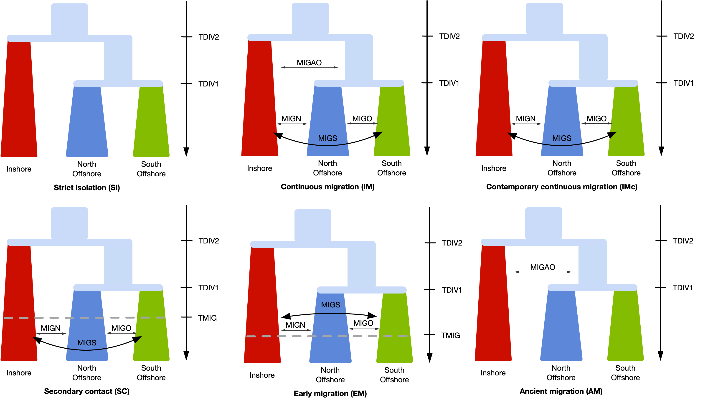

```{r setup, include=FALSE}
knitr::opts_chunk$set(echo = FALSE, warning = FALSE, message = FALSE, fig.retina = 2)
require(tidyverse)
require(ggpubr)
require(cowplot)
library(plyr)
```

We used `fastsimcoal` version 2.7 to estimate demographic parameters based on the site frequency spectrum (SFS). 

## SNP filtering and SFS calculation
We used fastsimcoal 2.7 to infer past demographics by maximising a likelihood function based on the fit of a coalescent model to the genome-wide site frequency spectrum (SFS). We used all samples, except BR_5_121_S125_L004 (see [18.radseq_check](18.radseq_check.md) ) which was likely mislabelled from inshore (29), all from north offshore (20), and all from south offshore (25). To minimise potential bias from linkage and selection, we only used non-genic SNPs, and filtered SNPs with an r2 > 0.3 which left us with 257,314 sites. To utilise the mutation rate in branch length computation, we estimated the monomorphic sites based on the proportional number of mappable sites defined by the SNPable pipeline we used in MSMC analysis. With this set of SNPs, we  then used [easySFS](https://github.com/isaacovercast/easySFS) to generate the folded multidimensional allele frequency spectrum (jAFS) for three populations. 

**Prepare dataset**
```bash
bedtools subtract -a Adigi.filtered.vcf.gz -b CDS.bed | bgzip >Adigi.nongenic.vcf.gz
bcftools +prune -m 0.3 -e'F_MISSING>=0.01' -w 1000 Adigi.nongenic.vcf.gz -o Adigi.nongenic.r03nomiss.vcf.gz
## calculate the number of monomorphic sites
## ([the number of mappability sites (from MSMC)] - [genic sites] )* (257,314/8,714,015) - SNPs
#(250,379,843 - 37,088,136)*(257,314/8,714,015) - 257314
#~ 6040924
## add number to sfs later
```

**Calculate SFS**
```bash
python easysfs.py -i Adigi.nongenic.r03nomiss.vcf.gz -p popfile.txt -a --GQ 20 --dtype int -o sfs --proj=58,40,52
```
## Model Selection

We used a hierarchical approach to model selection, first testing alternative models for the tree topology (divergence), then alternative migration and growth scenarios based on the best topology.

### Divergence
We first tested alternative models of the divergence topology. Among the four alternative models, the model where inshore split first clearly displays the best likelihood values.

```{r}
read_ll <- function(filename) {
  read_tsv(filename) %>% separate(col = File,"/",into = c("model","run"))
}
n_parameter <- read_csv("data/hpc/demography/fastsimcoal/n_parameters.txt", col_names = c("model","n"))
divergence_ll <- list.files("data/hpc/demography/fastsimcoal/divergence",pattern = ".*\\.param",full.names = T) %>% map_df(read_ll)

divergence_ll <- divergence_ll %>% left_join(n_parameter) %>% 
  dplyr::mutate(aic=2*n-2*(MaxEstLhood/log10(exp(1))), delta_ll= MaxObsLhood-MaxEstLhood) 
  
divergence_ll %>% group_by(model) %>% slice_max(MaxEstLhood,n=1) %>% select(model, run, n, MaxEstLhood, aic)

ggplot(divergence_ll, aes(x=model,y=MaxEstLhood)) + geom_boxplot() +
  labs(x="Topology",y="AIC") + scale_x_discrete(labels=c("split_IN"="(IN,(NO,SO))","split_NO"="(NO,(IN,SO))","split_poly"="(IN,NO,SO)","split_SO"="(SO,(NO,IN))"))

```

**Figure 1: The likelihood distribution of four divergence models**

### Models with growth rate and migration.
Next, we add growth rate in every population after splitting and test six scenarios regarding the timing of migration. Parameters such as divergence time of offshore, inshore and the growth rate combined with the current and ancestral population size will be estimated during each test. For each model, we also performed 100 tims of independent runs.
The plot below displays six models we tested. 


```{r}

```

**Figure 2: Graphic illustration of six alternative models**
 
**Model comparison**

When we checking model parameters of `growth_rate_SC2` and `growth_rate_AM2 (early migration)` in runs, we found that these two models are converged toward `growth_rate_SC`  or we should call it `growth_rate_contemperary_IM (IMc)`. As, the `TMIG` had been pushing to the lower bound of the parameter in simulation (100 generation) in `grwoth_rate_SC2` whle `TMIG` ended up extremely close to `TDIV1` (the divergence time of two offshore populations).

```{r}
gr_ll <- list.files("data/hpc/demography/fastsimcoal/final",pattern = ".*fixed\\.param",full.names = T) %>% map_df(read_ll) %>% left_join(n_parameter) %>% 
  dplyr::mutate(aic=2*n-2*(MaxEstLhood/log10(exp(1))), delta_ll= MaxObsLhood-MaxEstLhood,Tdiff=TDIV1-TMIG)
model.labs <- c("SI","IM","IMc","SC","EM","AM")
names(model.labs) <- gr_ll$model %>% unique

gr_ll %>% pivot_longer(-c(MaxEstLhood,model,run),names_to = "param",values_to = "value") %>% 
  filter(param %in% c("TDIV1","TMIG","Tdiff") & model %in% c("4.growth_rate_SC2","6.growth_rate_AM2")) %>% 
  ggplot(aes(x=param,y=value)) +
  geom_violin()+
  geom_jitter(size=1) + facet_wrap(~model,scales = "free", labeller = labeller(model=model.labs)) +
  labs(x="",y="Time in generations") + scale_x_discrete(limits=c("TDIV1","TMIG","Tdiff"),labels=c("Tdiff"="TDIV1-TMIG"))
```

**Figure 3: The parameters esimtated in SC and EM**

Thus, we decided to keep only `growth_rate_SI`,`growth_rate_IM`,`growth_rate_contemparary_IM`, and `growth_rate_AM` four alternative models to compare.

```{r}
gr_ll %>% filter(grepl(model,pattern = "^[0,1,3,7]")) %>%  
  ggplot(aes(x=model,y=MaxEstLhood)) + geom_violin(trim = FALSE,fill="gray") + 
 stat_summary(fun.data=mean_sdl, mult=1, 
                 geom="pointrange", color="darkred",size=.6,fatten=2) +
  theme_test(base_size = 14) + labs(y="log10(Lhood)",x="") +
  scale_x_discrete(labels=c("SI","IM","IMc","AM"))
  

gr_ll %>% filter(grepl(model,pattern = "^[0,1,3,7]")) %>% group_by(model) %>% slice_max(MaxEstLhood,n=1) %>% ungroup %>% mutate(min_aic=min(aic),delta_aic=aic-min(aic), exps=exp(-delta_aic/2), waic=exps/sum(exps))
```
Apparently, models with contemporary migration are better than model `SI` and `AM`. However, we couldn't decide a clear win between `IM` and `IMc`. We thus used the weighted AIC to decided `IMc` as the best model and used `IMc` to estimate confidence interval using parametric bootstrapping.


We simulated 100 datasets for bootstrap, by modifying the FREQ to DNA in parameter estimate file (`3.growth_rate_SC_maxL.par`) which maximise the likelihood. simulate 257,314 DNA fragments with size of 24bp.

```bash
fsc27 -i 3.growth_rate_SC_boot.par -n100 -j -m -s0 -x -I --foldedSFS -q -c12 -B12
```
Then we perform 20 independent runs for each of the bootstrap data using the same parameters for real data

```bash
fsc27 -t 3.growth_rate_SC_boot.tpl -e 3.growth_rate_SC_boot.est -n200000 -m -M -L50 -C2 -c16 -B16 -q
```
### The distribution of the values of parameters estimated.

```{r}
bs_df <- read_tsv("data/hpc/demography/fastsimcoal/bootstrap_param.txt") %>%
  dplyr::mutate(bs_id=row_number()) %>% 
  pivot_longer(-c(bs_id,MaxEstLhood,MaxObsLhood), names_to = "param", values_to = "value")
```

**Divergence time range**

```{r}
## To remove outlier
#outliers <- boxplot(bs_df$MaxEstLhood, plot=FALSE)$out
#bs_df[which(! bs_df$MaxEstLhood %in% outliers),]

bs_df %>% filter(param %in% c("TDIV1","TDIV2")) %>% 
  ggplot(aes(x=param, y= value*5)) + geom_boxplot()

```

**Estimated population sizes**

```{r}
bs_df %>% filter(grepl(param, pattern = "^NA")) %>% 
  ggplot(aes(x=param, y= value)) + geom_boxplot()
```

**Migration rate**

```{r}
bs_df %>% filter(grepl(param,pattern = "MIG")) %>% 
  ggplot(aes(x=param, y= value)) + geom_boxplot()
```

