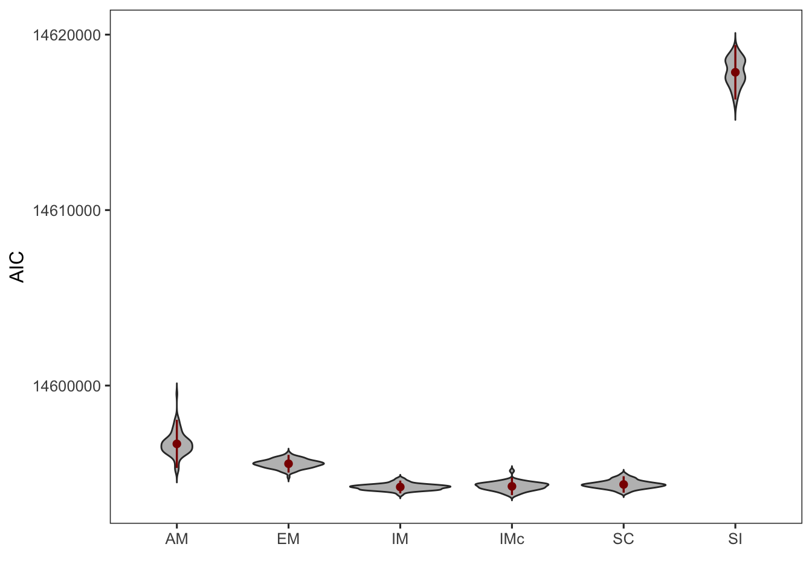

Demographic model fitting with fastsimcoal
================

We used `fastsimcoal` version 2.7 to estimate demographic parameters
based on the site frequency spectrum (SFS).

## SNP filtering and SFS calculation

We used fastsimcoal 2.7 to infer past demographics by maximising a
likelihood function based on the fit of a coalescent model to the
genome-wide site frequency spectrum (SFS). We used all samples, except
BR_5\_121_S125_L004 (see [18.radseq_check](18.radseq_check.md) ) which
was likely mislabelled from inshore (29), all from north offshore (20),
and all from south offshore (25). To minimise potential bias from
linkage and selection, we only used non-genic SNPs, and filtered SNPs
with an r2 \> 0.3 which left us with 257,314 sites. To utilise the
mutation rate in branch length computation, we estimated the monomorphic
sites based on the proportional number of mappable sites defined by the
SNPable pipeline we used in MSMC analysis. With this set of SNPs, we
then used [easySFS](https://github.com/isaacovercast/easySFS) to
generate the folded multidimensional allele frequency spectrum (jAFS)
for three populations.

**Prepare dataset**

``` bash
bedtools subtract -a Adigi.filtered.vcf.gz -b CDS.bed | bgzip >Adigi.nongenic.vcf.gz
bcftools +prune -m 0.3 -e'F_MISSING>=0.01' -w 1000 Adigi.nongenic.vcf.gz -o Adigi.nongenic.r03nomiss.vcf.gz
## calculate the number of monomorphic sites
## ([the number of mappability sites (from MSMC)] - [genic sites] )* (257,314/8,714,015) - SNPs
#(250,379,843 - 37,088,136)*(257,314/8,714,015) - 257314
#~ 6040924
## add number to sfs later
```

**Calculate SFS**

``` bash
python easysfs.py -i Adigi.nongenic.r03nomiss.vcf.gz -p popfile.txt -a --GQ 20 --dtype int -o sfs --proj=58,40,52
```

## Model Selection

We used a hierarchical approach to model selection, first testing
alternative models for the tree topology (divergence), then alternative
migration and growth scenarios based on the best topology.

### Divergence

We first tested alternative models of the divergence topology. Among the
four alternative models, the model where inshore split first clearly
displays the best likelihood values.

    ## # A tibble: 4 × 5
    ## # Groups:   model [4]
    ##   model      run       n MaxEstLhood       aic
    ##   <chr>      <chr> <dbl>       <dbl>     <dbl>
    ## 1 split_IN   run56     7   -3173851. 14616139.
    ## 2 split_NO   run58     7   -3177387. 14632422.
    ## 3 split_poly run71     5   -3176949. 14630399.
    ## 4 split_SO   run63     7   -3177414. 14632545.


**Figure 1: The likelihood distribution of four divergence models**

### Models with growth rate and migration.

Next, we add growth rate in every population after splitting and test
six scenarios regarding the timing of migration. Parameters such as
divergence time of offshore, inshore and the growth rate combined with
the current and ancestral population size will be estimated during each
test. For each model, we also performed 100 tims of independent runs.
The plot below displays six models we tested.

<!-- -->

**Figure 2: Graphic illustration of six alternative models**

**Model comparison**

When we checking model parameters of `growth_rate_SC2` and
`growth_rate_AM2 (early migration)` in runs, we found that these two
models are converged toward `growth_rate_SC` or we should call it
`growth_rate_contemperary_IM (IMc)`. As, the `TMIG` had been pushing to
the lower bound of the parameter in simulation (100 generation) in
`grwoth_rate_SC2` whle `TMIG` ended up extremely close to `TDIV1` (the
divergence time of two offshore populations).


**Figure 3: The parameters esimtated in SC and EM**

Thus, we decided to keep only
`growth_rate_SI`,`growth_rate_IM`,`growth_rate_contemparary_IM`, and
`growth_rate_AM` four alternative models to compare.


    ## # A tibble: 4 × 30
    ##   model   run   ANCSIZE NAOFF   NAI   NAN   NAS     NI     NN     NS TDIV1 TDIV2
    ##   <chr>   <chr>   <dbl> <dbl> <dbl> <dbl> <dbl>  <dbl>  <dbl>  <dbl> <dbl> <dbl>
    ## 1 0.grow… run21  366443 23560  2891  1009   705 169848 548446 768718   105   498
    ## 2 1.grow… run78  388367 20670  2456  8888  8945 237600 955128 271488   903  1494
    ## 3 3.grow… run62  396826  9327  2166  9334  7162 288007 869314 300646   922  1189
    ## 4 7.grow… run93  404524 28032  1206   975   728 272495 226191 758066   105  1123
    ## # … with 18 more variables: RI <dbl>, RN <dbl>, RS <dbl>, MaxEstLhood <dbl>,
    ## #   MaxObsLhood <dbl>, MIGN <dbl>, MIGS <dbl>, MIGO <dbl>, MIGAO <dbl>,
    ## #   TMIG <dbl>, n <dbl>, aic <dbl>, delta_ll <dbl>, Tdiff <dbl>, min_aic <dbl>,
    ## #   delta_aic <dbl>, exps <dbl>, waic <dbl>

Apparently, models with contemporary migration are better than model
`SI` and `AM`. However, we couldn’t decide a clear win between `IM` and
`IMc`. We thus used the weighted AIC to decided `IMc` as the best model
and used `IMc` to estimate confidence interval using parametric
bootstrapping.

We simulated 100 datasets for bootstrap, by modifying the FREQ to DNA in
parameter estimate file (`3.growth_rate_SC_maxL.par`) which maximise the
likelihood. simulate 257,314 DNA fragments with size of 24bp.

``` bash
fsc27 -i 3.growth_rate_SC_boot.par -n100 -j -m -s0 -x -I --foldedSFS -q -c12 -B12
```

Then we perform 20 independent runs for each of the bootstrap data using
the same parameters for real data

``` bash
fsc27 -t 3.growth_rate_SC_boot.tpl -e 3.growth_rate_SC_boot.est -n200000 -m -M -L50 -C2 -c16 -B16 -q
```

### The distribution of the values of parameters estimated.

**Divergence time range**



**Estimated population sizes**


**Migration rate**


