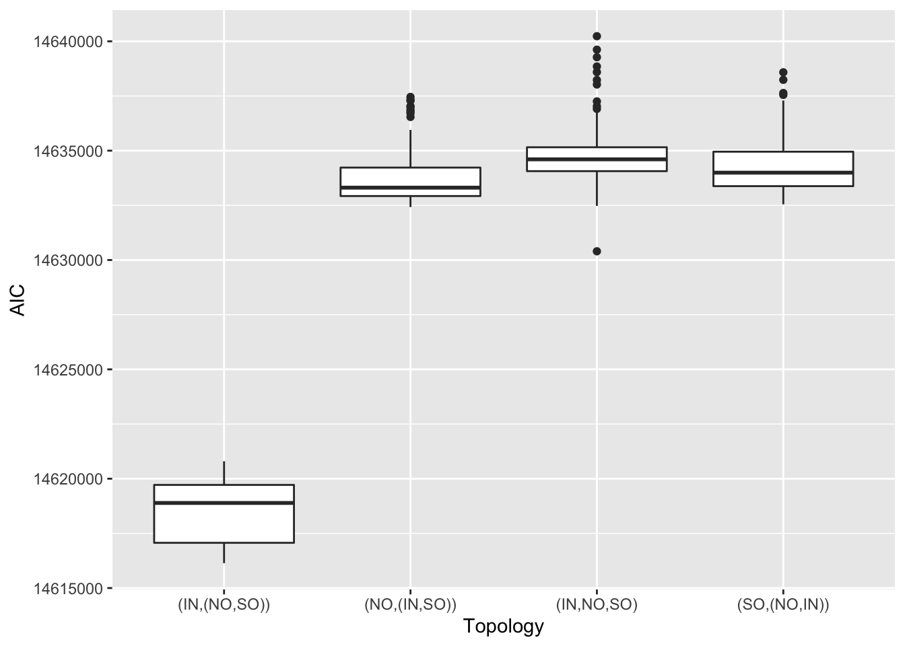

Demographic model fitting with fastsimcoal
================

We used `fastsimcoal` version 2.7 to estimate demographic parameters
based on the site frequency spectrum (SFS).

## SNP filtering and SFS calculation

We used fastsimcoal 2.7 to infer past demographics by maximising a
likelihood function based on the fit of a coalescent model to the
genome-wide site frequency spectrum (SFS). We used all samples, except
BR_5\_121_S125_L004 (see [18.radseq_check](18.radseq_check.md) ) which
was likely mislabelled from inshore (29), all from north offshore (20),
and all from south offshore (25). To minimise potential bias from
linkage and selection, we only used non-genic SNPs, and filtered SNPs
with an r2 \> 0.3 which left us with 257,314 sites. To utilise the
mutation rate in branch length computation, we estimated the monomorphic
sites based on the proportional number of mappable sites defined by the
SNPable pipeline we used in MSMC analysis. With this set of SNPs, we
then used [easySFS](https://github.com/isaacovercast/easySFS) to
generate the folded multidimensional allele frequency spectrum (jAFS)
for three populations.

**Prepare dataset**

``` bash
bedtools subtract -a Adigi.filtered.vcf.gz -b CDS.bed | bgzip >Adigi.nongenic.vcf.gz
bcftools +prune -m 0.3 -e'F_MISSING>=0.01' -w 1000 Adigi.nongenic.vcf.gz -o Adigi.nongenic.r03nomiss.vcf.gz
## calculate the number of monomorphic sites
## ([the number of mappability sites (from MSMC)] - [genic sites] )* (257,314/8,714,015) - SNPs
#(250,379,843 - 37,088,136)*(257,314/8,714,015) - 257314
#~ 6040924
## add number to sfs later
```

**Calculate SFS**

``` bash
python easysfs.py -i Adigi.nongenic.r03nomiss.vcf.gz -p popfile.txt -a --GQ 20 --dtype int -o sfs --proj=58,40,52
```

## Model Selection

We used a hierarchical approach to model selection, first testing
alternative models for the tree topology (divergence), then alternative
migration and growth scenarios based on the best topology.

### Divergence

We first tested alternative models of the divergence topology. Among the
four alternative models, the model where inshore split first clearly
displays the best likelihood and AIC values.


**Figure 1:** The AIC distribution of four divergence models. Plot shows
the best AIC value from each of 100 independent runs for each model.

### Models with growth rate and migration.

Since our population genetic statistics and SMC++ analyses all point
toward a bottleneck and recent population growth we added a growth phase
to all populations after splitting. We then generated 6 alternative
models based on the relative timing of migration as shown in the diagram
below.

<!-- -->

**Figure 2: Graphic illustration of six alternative models. Each model
is given a long name and a short code in brackets. **

**Model comparison**

For each of the six models, we performed 100 independent runs and
examined the distribution of parameter values and AIC values from the
maximum likelihood estimate of each run.

In two of our models we allowed the migration phase to start
independently of population splits (TMIG) (though constrained to be
after TDIV1), however we found that these two models converged toward a
simpler model, “Contemporary continuous migration IMc” (coded as
`growth_rate_SC` internally). This can be seen in the parameter plot
below where we see that the parameter `TMIG` converges to TMIG=TDIV1 for
the model “Secondary contact SC” and converges to 0 for the model “Early
migration EM”. Both scenarios reduce to the model “IMc” in this
situation.



**Figure 3: Estimated population split times and migration time (TMIG)
in two models where the migration time (TMIG) represents migration onset
(SC) or termination (EM)**

Model selection analysis based on AIC for all six models clearly showed
that the strict isolation model and ancient migration models were not
supported (highest AIC). Other models, EM, IM, IMc and SC all had a
similar distribution of AIC values however since SC and EM effectively
reduce to IMc this left only the IM and IMc models as potential
candidates for the best model. We decided to proceed with `IMc` as the
best model on the basis that it is simpler (one less parameter) than
`IM` and had a better overall weighted AIC value.


To obtain confidence intervals for the parameters in `IMc` we used a
parametric bootstrapping approach. For this, we simulated 100 datasets
by modifying the FREQ to DNA in parameter estimate file
(`3.growth_rate_SC_maxL.par`) which maximise the likelihood. simulate
257,314 DNA fragments with size of 24bp.

``` bash
fsc27 -i 3.growth_rate_SC_boot.par -n100 -j -m -s0 -x -I --foldedSFS -q -c12 -B12
```

Then we perform 20 independent runs for each of the bootstrap data using
the same parameters for real data

``` bash
fsc27 -t 3.growth_rate_SC_boot.tpl -e 3.growth_rate_SC_boot.est -n200000 -m -M -L50 -C2 -c16 -B16 -q
```

### The distribution of the values of parameters estimated.

**Divergence time range**


**Estimated population sizes**


**Migration rate**


