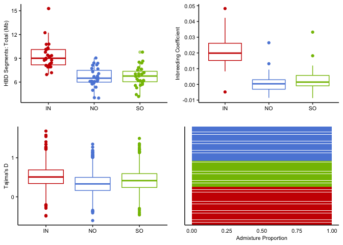

Simulated data under the best fitting demographic model
================

FastSimCoal can fit a demographic model to SFS data and it can also be
used to simulate data under a demographic model. In our model selection
process with FSC we determined the best model and obtained bootstrap
estimates for its parameters (see
[22a.fastsimcoal\_fitting](22a.fastsimcoal_fitting.md)). These were then
used as priors to simulate data under the model. An advantage of this is
that it allows us to calculate many summary statistics other than just
the SFS from the data, and determine whether these match or deviate from
our real data.

**Table 1:** Parameter estimates for the best fitting model estimated by
FastSimCoal. Lower and Upper bounds enclose 90% of the distribution of
bootstrap values.

| param   |            lb |            ub |
|:--------|--------------:|--------------:|
| ANCSIZE |  3.864498e+05 |  3.977536e+05 |
| MIGN    |  1.772000e-04 |  1.918000e-04 |
| MIGO    |  4.000000e-07 |  1.826000e-04 |
| MIGS    |  1.757000e-04 |  1.917000e-04 |
| NAI     |  1.696950e+03 |  3.569150e+03 |
| NAN     |  9.286900e+03 |  1.769935e+04 |
| NAOFF   |  5.230400e+03 |  1.993205e+04 |
| NAS     |  7.449350e+03 |  1.343225e+04 |
| NI      |  1.507624e+05 |  6.490378e+05 |
| NN      |  4.345196e+05 |  1.032739e+06 |
| NS      |  2.738852e+05 |  9.715855e+05 |
| RI      | -5.435200e-03 | -2.407000e-03 |
| RN      | -5.310300e-03 | -3.648200e-03 |
| RS      | -5.569300e-03 | -3.281200e-03 |
| TDIV1   |  8.010000e+02 |  9.970500e+02 |
| TDIV2   |  1.014850e+03 |  1.624050e+03 |

#### Simulations

Using these parameters as priors we then run FSC to generate data as
follows;

``` bash
../fsc27_linux64/fsc2702 -t 3.out.growth_rate_SC.tpl -n 1 -e 3.out.growth_rate_SC.est  -E 50 -G x -c 0
```

Where the file `3.out.growth_rate_SC.tpl` specifies that the simulation
should generate 20 independent chromosomes of length 2mb using a
recombination rate of 3.2e-8 and mutation rate of 1.2e-8. The outputs
can be converted to vcf using the awk script
[gen2vcf](data/hpc/fastsimcoal/gen2vcf.awk).

## Calculations based on simulated data

Simulated data was converted to a vcf file and then used to estimate
long runs of homozygosity, inbreeding coefficients, Tajima’s D and
admixture. All calculations followed the proceedures for real data as
closely as possible. Specifically;

-   Long runs of homozygosity were calculated using ibdseq in the same
    way as for real data (ie as in [06.ibd\_hbd](06.ibd_hbd.md))
-   PLINK was used to calculate heterozygosity statistics just as in
    [04.popgen\_stats](04.popgen_stats.md)
-   `vk tajima` was used to calculate Tajima’s D in sliding windows as
    in [04.popgen\_stats](04.popgen_stats.md)
-   Admixture under the simulated model was assessed using `ADMIXTURE`
    in the same manner as for real data (as in
    [05.population\_structure](05.population_structure.md)). Results are
    shown visualised for a single simulation run

<!-- -->

**Figure 1:** Population genetic statistics and structure calculated
using simulated data under the best fitting model. Colour scheme matches
the one used for real data in all plots.

In general the properties of simulated data reproduced key features of
the real data. For long runs of Homozygosity and inbreeding coefficients
the trend that inshore samples had much higher values was reproduced but
the magnitude of values overall was lower than for real data. For
Tajima’s D all samples had positive values whereas in real data the
values were all negative, however in both cases the inshore population
had a higher value. Both positive and negative values of Tajima’s D are
indicators of a recent bottleneck, however the sign is very sensitive to
the timing and strength of this bottleneck.

The admixture plot shows almost complete assignment of each individual
to its location-based population cluster. This result (same as for real
data) shows that the migration coefficients inferred under the
demographic model are sufficiently low as to be consistent with the
strong structure and limited admixture observed in real data.

# PBS on Simulated Data

Since the demographic histories of populations in this study included
strong bottlenecks it is important to determine whether these
demographic effects could account for extreme values in signatures of
selection. To tackle this issue we used simulations under the
best-fitting FSC model to calculate an empirical distribution of test
statistics under neutrality. We then determined an empirical false
positive rate under a range of thresholds of the test statistic as
follows;

1.  Subsample the neutral dataset (test statistic calculated under
    neutrality) so that it has an equal number of values to the real
    data.
2.  Take a random sample of 100k values from this combined dataset. Both
    the real and simulated data include sites in linkage disequilibrium.
    This subsampling should thin sites to make calculations tractable
    while retaining data points that are now approximately independent.
3.  Sort the combined data by test statistic value
4.  Code the each site 
    with a value 
    with is 0 if the site is in the real dataset and 1 if not (a false
    positive).
5.  The empirical false positive rate (FPR) for the site at row
     is then given by;

    
6.  And this FPR value will also be the value of the FPR when a
    threshold test statistic value equal to the value at site k is used.

For the EHH-based statistics it was not possible to perform this
empirical FPR calculation because those statistics rely on a
normalisation procedure such that the normalised values are z-scores. We
therefore performed this calculation using the population branch
statistic.

We calculated PBS by first calculating pairwise Fst values between all
pairs of populations and at each site using plink2.

``` bash
plink2 --vcf $f --fst site report-variants --pheno phenotypes.txt --allow-extra-chr
```

PBS was then calculated for each focal population using the formula
provided in (Yi et al. 2010).

<!-- -->

<div id="refs" class="references csl-bib-body hanging-indent">

<div id="ref-Yi2010-br" class="csl-entry">

Yi, Xin, Yu Liang, Emilia Huerta-Sanchez, Xin Jin, Zha Xi Ping Cuo, John
E Pool, Xun Xu, et al. 2010. “Sequencing of 50 Human Exomes Reveals
Adaptation to High Altitude.” *Science* 329 (5987): 75–78.

</div>

</div>
