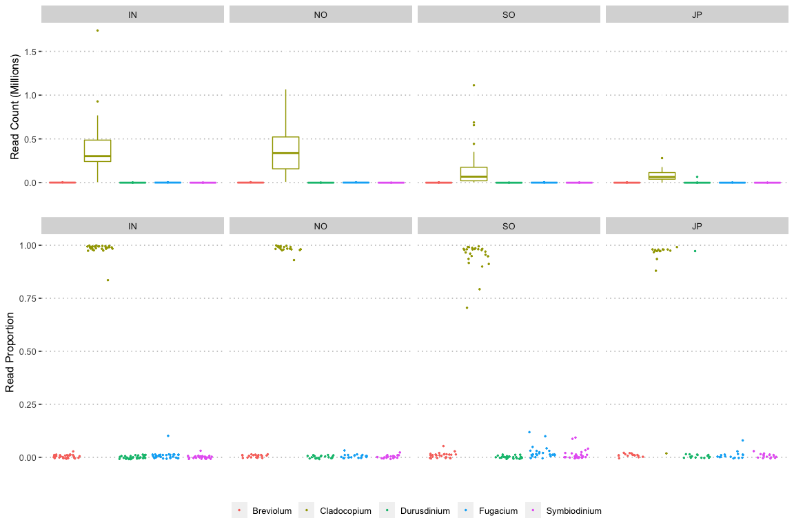

Symbiont Profiles
================

## 1. Kraken

The relative abundance of major clades (genera) of Symbiodiniaceae was
profiled using [kraken](https://ccb.jhu.edu/software/kraken/) version
1.1.1 (**Wood2014-qp?**) to classify raw reads from each sample. To
ensure that this made full use of available reads and also that it was
not affected by biased database composition we restricted our analysis
to taxa for which a complete reference genome was available. This
included the following data;

-   Clade A: *Symbiodinium microadriadicum* [from
    genbank](https://www.ncbi.nlm.nih.gov/assembly/GCA_001939145.1)
-   Clade B: *Breviolum sp.* [from
    OIST](https://marinegenomics.oist.jp/symb/download/symbB.v1.0.genome.fa.gz)
-   Clade C: (C1) *Cladocopium sp.* [from
    reefgenomics](http://symbs.reefgenomics.org/download/SymbC1.Genome.Scaffolds.fasta.gz)
-   Clade D: *Durusdinium sp.* [from
    OIST](https://marinegenomics.oist.jp/symbd/viewer/download?project_id=102)
-   Clade F: *Fugacium sp.* [from
    reefgenomics](http://symbs.reefgenomics.org/download/SymbF.Genome.Scaffolds.fasta.gz)

These genomes were combined with the host *A. digitifera* genome as well
the standard kraken bacterial sequences to build a kraken database (see
[07\_build\_kraken.sh](data/hpc/symbiodinium_profiles/07_build_kraken.sh))
using default values for kmer length (31) and minimiser length (15).

kraken was then used to classify all non host read pairs (paired reads
not aligning to the host genome) for all samples and the raw outputs
processed with `kraken-mpa-report`. This produces a report in a format
similar to MetaPhlAn’s output (see
[09\_run\_kraken\_genome.sh](data/hpc/symbiodinium_profiles/09_run_kraken_genome.sh)).

Irrespective of whether absolute read counts or proportion of reads is
used the dominant symbiont clade for all locations and all but one
sample was *Cladocopium*. A single sample from Japan was dominated by
*Durusdinium*.

<!-- -->

## 2. Symbiont mitogenome haplotype

While we observed a high level of symbiont specificity in *Acropora
digitifera* (all samples are dominated by *Cladocopium*), the genetic
diversity within clade C are evaluated here.

Firstly, reads were extracted from duplicates marked bam files and
mapped to *Cladocopium* (C1) genome. The symbiont mitogenome sequence
was downloaded from
[reefgenomics](http://symbs.reefgenomics.org/download/).

``` bash
samtools fastq -F 1024 {sample}_dpmarked.bam | bam mem -t 12 <mitogenome> - | \
samtools view -b -F 4 > {sample}_mito.bam
```

While the mapping coverage in symbiont mitochondrial genome was much
lower and much more uneven. We thus filtered samples with less than 20X
average mapping depth which left 41 samples for following analysis of
symbiont haplotype network.

We then used bcftools to make genotype call, we filtered snps near 3 bp
around indels and exclude snp with less than 10 quality score, a depth
of twice bigger than the average depth or less than three.

``` bash
mean_cov=$(sample depth {sample}_mito.bam | awk '{sum += $3}END{print sum/NR}')
mean_cov=$(print "%.0f" $mean_cov)
let max_dp=mean_cov*2

bcftools mpileup -Ou -f <mitogenome> {sample}_mito.bam | \
bcftools call -c --ploidy 1 - | \
bcftools norm -Ob -f <mitogenome> - | \
bcftools filter -Oz --SnpGap 3 --IndelGap 5 \
-e " %QUAL<10 || DP > $max_dp || DP<3" - > {sample}_mito.vcf.gz
```

Next, a consensus sequence was generated for each sample with uncalled
loci set to be “-” in order to avoid bias in reference assembly.

``` bash
cat <mitogenome> | bcftools consensus -a - -e 'type="indel"' {sample}_mito.vcf.gz |\
bioawk -c fastx -v samp={sample} '{printf(">%s\n%s\n", samp, $seq)}' > {sample}_consensus.fa
```

Finally, all consensus sequences were concatenated into on “alignment”
file and trimAl was used to remove position with gaps and output in
NEXUS format.

``` bash
cat *_consensus.fa > alignment.fasta
trimal -in alignment.fasta -nomaps -nexus -out alignment.trimal.nex
```

The alignments in Nexus-format were loaded in
[popart](http://popart.otago.ac.nz/index.shtml) to generate haplotype
networks using minimum spanning method.

<!-- -->

**Figure: The haplotype network of symbiont Cladocopium C1 mitochondiral
in 41 coral samples**

## 3. ITS2 assignment for symbiont reads

We firstly extracted reads that are not mapped to host genome and mapped
them to the ITS2 sequences from [symportal](symportal.org) - published
named sequences.

``` bash
samtools view -b -f4 {sample}_dpmarked.bam | bedtools bamtofastq -i - -fq fastq/{sample}_1.fq -fq2 fastq/{sample}_2.fq

bwa mem -t 10 published_div.fasta {sample}_1.fq {sample}_2.fq |samtools view -F 4 > {sample}.sam
```

We then count the number of reads that are mapped to each ITS2 sequences
and calculated the proportion by dividing the number of reads to the
total number of reads.

<!-- -->

## 4. Distance based on D2S statistics of kmer

To further make use of symbiont reads in our data, we applied
[jackknifing pipeline](https://github.com/chanlab-genomics/jackknifing)
to raw reads which extracts reads mapped to C1 genome and count kmers
from sequences using jellyfish and calculated the D2 statistics based on
kmers. We decided the optimum kmer size to be 21 and used D2S
statistics, eventually, we got a matrix of kmer distances for each pair
of samples.

``` bash
## minus host
bwa mem -t 12 {ad.reference} {sample}_1.fastq {sample}_2.fastq |\ samtools view -f12 -F256 |\
bamToFastq -i - -fq {sample}_nonhost_1.fq -fq2 {sample}_nonhost_2.fq

## mapping to C1 + symportal ITS2 from Cladocopium strains
bwa mem -t 12 {SymC1.all.fasta} {sample}_nonhost_1.fq {sample}_nonhost_2.fq | \
samtools view -F 4 -b |samtools sort > {sample}_symC.bam
gatk MarkDuplicates -I {sample}_symC.bam -O {sample}_symC_sorted.bam -M {sample}.metrics.txt --REMOVE_DUPLICATES true
samtools fasta {sample}_symC_sorted.bam -o {sample}_symC.fasta

## jackknifing
jellyfish count -m 21 -t 12 -s 1G -o {sample}.21.jf {sample}_symC.fasta
jellyfish dump -ct {sample}.21.jf |sort -k1,1 | python2 jackknifing/jf_scripts/Kmers_2_NumbericRepresentation.py -o {sample}.21.nkc.gz
python2 jackknifing/jf_scripts/Composition_of_InputSeqs.py --fasta {sample}_symC.fasta --freq {sample}.CharFreq

## calculated d2s for each pair
python2 jackknifing/calc_d2s/Calculate_D2S.py \
--kmerset1 {sample1}.21.nkc.gz --kmerset1_freq {sample1}.CharFreq \
--kmerset2 {sample2}.21.nkc.gz --kmerset2_freq {sample2}.CharFreq \
--D2S_out {sample1}-{sample2}.txt

## generate matrix...
```

Based on this matrix, we made MDS plot below.

<!-- -->
